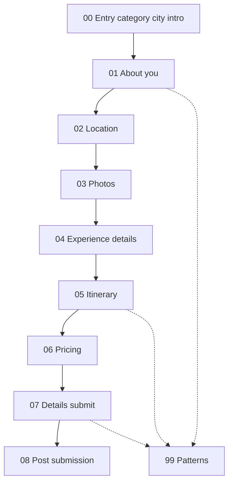
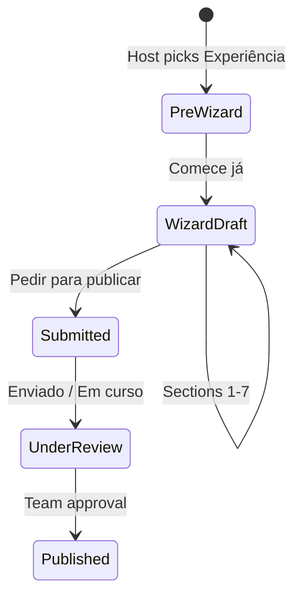

# Airbnb — Create experience listing onboarding

Reference documentation for the **host flow to create a new Experiência (experience) listing** on Airbnb, captured from a live walkthrough on **2026-05-22** (Portuguese UI).

Use this when designing multi-step onboarding for Eleva: category drill-down, sidebar-section wizards, credential building, itinerary nested flows, team-review publish, and post-submit dashboards.

---

## How to read

| Mode | Path | Best for |
|------|------|----------|
| **Markdown (SSOT)** | This file → [`docs/`](docs/) chapters | Engineers, agents, diffs, specs |
| **HTML (visual)** | [`index.html`](index.html) | Design / PM review in a browser |
| **Quick lookup** | [Screenshot index](#screenshot-index) below | Jump to step by timestamp |

**Example experience in walkthrough:** **Experimente a Paella Valenciana** — Prova gastronómica · Comida e bebida · Parede, Portugal · €16/person (host earnings €13).

**Related:** [Accommodation listing flow](../listing-property/readme.md) (shared entry modal — **Experiência** branch).

---

## Flow overview

### Wizard sections (7-module sidebar)

| # | Sidebar (PT) | Chapter | Steps | Screenshots |
|---|--------------|---------|-------|-------------|
| — | Pre-wizard | [00-entry-category-and-city](docs/00-entry-category-and-city.md) | 5 | 1–5 |
| 1 | Sobre si | [01-about-you](docs/01-about-you.md) | 14 | 6–19 |
| 2 | Local | [02-location](docs/02-location.md) | 4 | 20–23 |
| 3 | Fotografias | [03-photos](docs/03-photos.md) | 5 | 24–28 |
| 4 | Experiência | [04-experience-details](docs/04-experience-details.md) | 4 | 29–32 |
| 5 | Itinerário | [05-itinerary](docs/05-itinerary.md) | 11 | 33–43 |
| 6 | Preços | [06-pricing](docs/06-pricing.md) | 16 | 44–59 |
| 7 | Detalhes | [07-details-and-submit](docs/07-details-and-submit.md) | 4 | 60–63 |
| Post | — | [08-post-submission](docs/08-post-submission.md) | 7 | 64–70 |
| Ref | — | [99-patterns-and-data-model](docs/99-patterns-and-data-model.md) | — | Cross-cutting |

**Total interactive steps documented:** 70 screenshots (chronological).

### Persistent chrome (wizard steps)

- **Top left:** Airbnb logo
- **Top center:** Section name + `Passo N de 7` (when in sidebar wizard)
- **Top right:** `Gravar e sair` (Save and exit)
- **Left:** Dark sidebar with 7 section icons (profile, location, photos, food, book, pricing, details)
- **Bottom:** `Anterior` / `Próximo` or section-specific CTAs (`Pedir para publicar`, `Concordo`)
- **Publish model:** Team review — not instant live (status **Enviado** / **Em curso**)

### Sidebar icon legend

| Icon | Section (PT) | Purpose |
|------|--------------|---------|
| Profile | Sobre si | Host credentials and address |
| Pin | Local | Meeting point on map |
| Gallery | Fotografias | Experience photos (min 5) |
| Fork/knife | Experiência | Title and description |
| Book | Itinerário | Activity timeline (≤10) |
| Tag/price | Preços | Per-person and discounts |
| Details | Detalhes | Compliance + submit |

---

## Chapters

1. **[Entry, category, and city](docs/00-entry-category-and-city.md)** — Category grid, food sub-type, city, intro
2. **[About you](docs/01-about-you.md)** — Years in field, credentials, online profiles, residential address
3. **[Location](docs/02-location.md)** — Meeting address and map pin
4. **[Photos](docs/03-photos.md)** — Minimum 5 photos, upload modal
5. **[Experience details](docs/04-experience-details.md)** — Title (50 chars), description (200 chars)
6. **[Itinerary](docs/05-itinerary.md)** — Activities with nested title/description/duration/photo modals
7. **[Pricing](docs/06-pricing.md)** — Per person, private minimum, discounts, review
8. **[Details and submit](docs/07-details-and-submit.md)** — Compliance Q&A, terms, **Pedir para publicar**
9. **[Post-submission](docs/08-post-submission.md)** — Dashboard **Enviado**, review checklist, preferences
10. **[Patterns and data model](docs/99-patterns-and-data-model.md)** — Reusable UX patterns and implied fields

**Visual walkthrough:** open [`index.html`](index.html) in a browser.

---

## Screenshot index

| # | Time | File | Chapter | Step title |
|---|------|------|---------|------------|
| 1 | 09:52:08 | `Screenshot 2026-05-22 at 09.52.08.png` | [00](docs/00-entry-category-and-city.md#step-step-1-select-experience-category) | Select experience category |
| 2 | 09:52:15 | `Screenshot 2026-05-22 at 09.52.15.png` | [00](docs/00-entry-category-and-city.md#step-step-2-select-experience-subtype) | Select experience subtype |
| 3 | 09:52:32 | `Screenshot 2026-05-22 at 09.52.32.png` | [00](docs/00-entry-category-and-city.md#step-step-3-enter-experience-city) | Enter experience city |
| 4 | 09:52:44 | `Screenshot 2026-05-22 at 09.52.44.png` | [00](docs/00-entry-category-and-city.md#step-step-4-city-search-suggestions) | City search suggestions |
| 5 | 09:52:55 | `Screenshot 2026-05-22 at 09.52.55.png` | [00](docs/00-entry-category-and-city.md#step-step-5-create-listing-intro) | Create listing intro |
| 6 | 09:53:06 | `Screenshot 2026-05-22 at 09.53.06.png` | [01](docs/01-about-you.md#step-step-6-gastronomy-experience-years) | Gastronomy experience years |
| 7 | 09:53:17 | `Screenshot 2026-05-22 at 09.53.17.png` | [01](docs/01-about-you.md#step-step-7-expertise-overview) | Expertise overview |
| 8 | 09:53:28 | `Screenshot 2026-05-22 at 09.53.28.png` | [01](docs/01-about-you.md#step-step-8-add-professional-title-modal) | Add professional title modal |
| 9 | 09:54:22 | `Screenshot 2026-05-22 at 09.54.22.png` | [01](docs/01-about-you.md#step-step-9-professional-title-filled) | Professional title filled |
| 10 | 09:54:29 | `Screenshot 2026-05-22 at 09.54.29.png` | [01](docs/01-about-you.md#step-step-10-title-tips-modal) | Title tips modal |
| 11 | 09:54:40 | `Screenshot 2026-05-22 at 09.54.40.png` | [01](docs/01-about-you.md#step-step-11-expertise-with-title-saved) | Expertise with title saved |
| 12 | 09:55:11 | `Screenshot 2026-05-22 at 09.55.11.png` | [01](docs/01-about-you.md#step-step-12-add-credentials-modal) | Add credentials modal |
| 13 | 09:56:14 | `Screenshot 2026-05-22 at 09.56.14.png` | [01](docs/01-about-you.md#step-step-13-add-professional-milestone-modal) | Add professional milestone modal |
| 14 | 09:56:32 | `Screenshot 2026-05-22 at 09.56.32.png` | [01](docs/01-about-you.md#step-step-14-add-online-profiles) | Add online profiles |
| 15 | 09:56:47 | `Screenshot 2026-05-22 at 09.56.47.png` | [01](docs/01-about-you.md#step-step-15-add-link-modal-empty) | Add link modal empty |
| 16 | 09:57:00 | `Screenshot 2026-05-22 at 09.57.00.png` | [01](docs/01-about-you.md#step-step-16-add-linkedin-link) | Add LinkedIn link |
| 17 | 09:57:09 | `Screenshot 2026-05-22 at 09.57.09.png` | [01](docs/01-about-you.md#step-step-17-online-profiles-saved) | Online profiles saved |
| 18 | 09:57:19 | `Screenshot 2026-05-22 at 09.57.19.png` | [01](docs/01-about-you.md#step-step-18-personal-address-form) | Personal address form |
| 19 | 09:57:48 | `Screenshot 2026-05-22 at 09.57.48.png` | [01](docs/01-about-you.md#step-step-19-personal-address-confirmed) | Personal address confirmed |
| 20 | 09:58:00 | `Screenshot 2026-05-22 at 09.58.00.png` | [02](docs/02-location.md#step-step-20-meeting-location-search) | Meeting location search |
| 21 | 09:58:13 | `Screenshot 2026-05-22 at 09.58.13.png` | [02](docs/02-location.md#step-step-21-confirm-location-address) | Confirm location address |
| 22 | 09:58:22 | `Screenshot 2026-05-22 at 09.58.22.png` | [02](docs/02-location.md#step-step-22-address-autocomplete-suggestions) | Address autocomplete suggestions |
| 23 | 09:58:37 | `Screenshot 2026-05-22 at 09.58.37.png` | [02](docs/02-location.md#step-step-23-confirm-map-marker) | Confirm map marker |
| 24 | 09:58:50 | `Screenshot 2026-05-22 at 09.58.50.png` | [03](docs/03-photos.md#step-step-24-add-photos-empty-state) | Add photos empty state |
| 25 | 09:58:58 | `Screenshot 2026-05-22 at 09.58.58.png` | [03](docs/03-photos.md#step-step-25-photo-tips-modal) | Photo tips modal |
| 26 | 09:59:19 | `Screenshot 2026-05-22 at 09.59.19.png` | [03](docs/03-photos.md#step-step-26-upload-photos-modal) | Upload photos modal |
| 27 | 09:59:31 | `Screenshot 2026-05-22 at 09.59.31.png` | [03](docs/03-photos.md#step-step-27-photos-grid-partial-3) | Photos grid partial (3) |
| 28 | 09:59:48 | `Screenshot 2026-05-22 at 09.59.48.png` | [03](docs/03-photos.md#step-step-28-photos-grid-with-5) | Photos grid with 5+ |
| 29 | 09:59:59 | `Screenshot 2026-05-22 at 09.59.59.png` | [04](docs/04-experience-details.md#step-step-29-experience-title-empty) | Experience title empty |
| 30 | 10:00:12 | `Screenshot 2026-05-22 at 10.00.12.png` | [04](docs/04-experience-details.md#step-step-30-experience-title-filled) | Experience title filled |
| 31 | 10:00:19 | `Screenshot 2026-05-22 at 10.00.19.png` | [04](docs/04-experience-details.md#step-step-31-experience-description-empty) | Experience description empty |
| 32 | 10:00:40 | `Screenshot 2026-05-22 at 10.00.40.png` | [04](docs/04-experience-details.md#step-step-32-experience-description-filled) | Experience description filled |
| 33 | 10:00:51 | `Screenshot 2026-05-22 at 10.00.51.png` | [05](docs/05-itinerary.md#step-step-33-itinerary-intro) | Itinerary intro |
| 34 | 10:01:01 | `Screenshot 2026-05-22 at 10.01.01.png` | [05](docs/05-itinerary.md#step-step-34-create-itinerary-empty) | Create itinerary empty |
| 35 | 10:01:09 | `Screenshot 2026-05-22 at 10.01.09.png` | [05](docs/05-itinerary.md#step-step-35-first-activity-title-modal) | First activity title modal |
| 36 | 10:01:26 | `Screenshot 2026-05-22 at 10.01.26.png` | [05](docs/05-itinerary.md#step-step-36-activity-description-modal) | Activity description modal |
| 37 | 10:01:53 | `Screenshot 2026-05-22 at 10.01.53.png` | [05](docs/05-itinerary.md#step-step-37-activity-description-filled) | Activity description filled |
| 38 | 10:02:00 | `Screenshot 2026-05-22 at 10.02.00.png` | [05](docs/05-itinerary.md#step-step-38-set-activity-duration) | Set activity duration |
| 39 | 10:02:07 | `Screenshot 2026-05-22 at 10.02.07.png` | [05](docs/05-itinerary.md#step-step-39-choose-activity-photo) | Choose activity photo |
| 40 | 10:02:14 | `Screenshot 2026-05-22 at 10.02.14.png` | [05](docs/05-itinerary.md#step-step-40-activity-photo-selected) | Activity photo selected |
| 41 | 10:02:26 | `Screenshot 2026-05-22 at 10.02.26.png` | [05](docs/05-itinerary.md#step-step-41-itinerary-list-incomplete) | Itinerary list incomplete |
| 42 | 10:02:37 | `Screenshot 2026-05-22 at 10.02.37.png` | [05](docs/05-itinerary.md#step-step-42-edit-activity-modal) | Edit activity modal |
| 43 | 10:02:52 | `Screenshot 2026-05-22 at 10.02.52.png` | [05](docs/05-itinerary.md#step-step-43-second-activity-title-modal) | Second activity title modal |
| 44 | 10:03:07 | `Screenshot 2026-05-22 at 10.03.07.png` | [06](docs/06-pricing.md#step-step-44-maximum-group-size) | Maximum group size |
| 45 | 10:03:16 | `Screenshot 2026-05-22 at 10.03.16.png` | [06](docs/06-pricing.md#step-step-45-maximum-group-size-adjusted) | Maximum group size adjusted |
| 46 | 10:03:28 | `Screenshot 2026-05-22 at 10.03.28.png` | [06](docs/06-pricing.md#step-step-46-price-per-person-empty) | Price per person empty |
| 47 | 10:03:34 | `Screenshot 2026-05-22 at 10.03.34.png` | [06](docs/06-pricing.md#step-step-47-pricing-tips-modal) | Pricing tips modal |
| 48 | 10:03:53 | `Screenshot 2026-05-22 at 10.03.53.png` | [06](docs/06-pricing.md#step-step-48-price-per-person-entered) | Price per person entered |
| 49 | 10:04:01 | `Screenshot 2026-05-22 at 10.04.01.png` | [06](docs/06-pricing.md#step-step-49-price-breakdown-expanded) | Price breakdown expanded |
| 50 | 10:04:13 | `Screenshot 2026-05-22 at 10.04.13.png` | [06](docs/06-pricing.md#step-step-50-more-pricing-info-modal) | More pricing info modal |
| 51 | 10:04:27 | `Screenshot 2026-05-22 at 10.04.27.png` | [06](docs/06-pricing.md#step-step-51-minimum-private-group-price-empty) | Minimum private group price empty |
| 52 | 10:04:36 | `Screenshot 2026-05-22 at 10.04.36.png` | [06](docs/06-pricing.md#step-step-52-minimum-private-group-price-entered) | Minimum private group price entered |
| 53 | 10:04:43 | `Screenshot 2026-05-22 at 10.04.43.png` | [06](docs/06-pricing.md#step-step-53-minimum-private-group-breakdown) | Minimum private group breakdown |
| 54 | 10:04:52 | `Screenshot 2026-05-22 at 10.04.52.png` | [06](docs/06-pricing.md#step-step-54-review-prices-summary) | Review prices summary |
| 55 | 10:05:00 | `Screenshot 2026-05-22 at 10.05.00.png` | [06](docs/06-pricing.md#step-step-55-add-discounts) | Add discounts |
| 56 | 10:05:09 | `Screenshot 2026-05-22 at 10.05.09.png` | [06](docs/06-pricing.md#step-step-56-limited-time-discount-modal) | Limited time discount modal |
| 57 | 10:05:22 | `Screenshot 2026-05-22 at 10.05.22.png` | [06](docs/06-pricing.md#step-step-57-early-bird-discount-modal) | Early bird discount modal |
| 58 | 10:05:39 | `Screenshot 2026-05-22 at 10.05.39.png` | [06](docs/06-pricing.md#step-step-58-large-group-discount-modal-empty) | Large group discount modal empty |
| 59 | 10:05:48 | `Screenshot 2026-05-22 at 10.05.48.png` | [06](docs/06-pricing.md#step-step-59-large-group-discount-filled) | Large group discount filled |
| 60 | 10:05:59 | `Screenshot 2026-05-22 at 10.05.59.png` | [07](docs/07-details-and-submit.md#step-step-60-offer-details-questionnaire) | Offer details questionnaire |
| 61 | 10:06:23 | `Screenshot 2026-05-22 at 10.06.23.png` | [07](docs/07-details-and-submit.md#step-step-61-offer-details-answered) | Offer details answered |
| 62 | 10:06:30 | `Screenshot 2026-05-22 at 10.06.30.png` | [07](docs/07-details-and-submit.md#step-step-62-requirements-and-terms) | Requirements and terms |
| 63 | 10:06:39 | `Screenshot 2026-05-22 at 10.06.39.png` | [07](docs/07-details-and-submit.md#step-step-63-publish-listing-review) | Publish listing review |
| 64 | 10:06:55 | `Screenshot 2026-05-22 at 10.06.55.png` | [08](docs/08-post-submission.md#step-step-64-submission-confirmation) | Submission confirmation |
| 65 | 10:07:11 | `Screenshot 2026-05-22 at 10.07.11.png` | [08](docs/08-post-submission.md#step-step-65-listings-dashboard) | Listings dashboard |
| 66 | 10:07:39 | `Screenshot 2026-05-22 at 10.07.39.png` | [08](docs/08-post-submission.md#step-step-66-listing-editor-photos) | Listing editor photos |
| 67 | 10:07:50 | `Screenshot 2026-05-22 at 10.07.50.png` | [08](docs/08-post-submission.md#step-step-67-edit-preferences-documents) | Edit preferences documents |
| 68 | 10:08:03 | `Screenshot 2026-05-22 at 10.08.03.png` | [08](docs/08-post-submission.md#step-step-68-edit-preferences-taxes) | Edit preferences taxes |
| 69 | 10:13:51 | `Screenshot 2026-05-22 at 10.13.51.png` | [08](docs/08-post-submission.md#step-step-69-publish-steps-sidebar) | Publish steps sidebar |
| 70 | 10:14:09 | `Screenshot 2026-05-22 at 10.14.09.png` | [08](docs/08-post-submission.md#step-step-70-listings-table-view) | Listings table view |

---

## Listing lifecycle (summary)

Unlike accommodation **Criar anúncio**, experiences use **team review** before going live.
