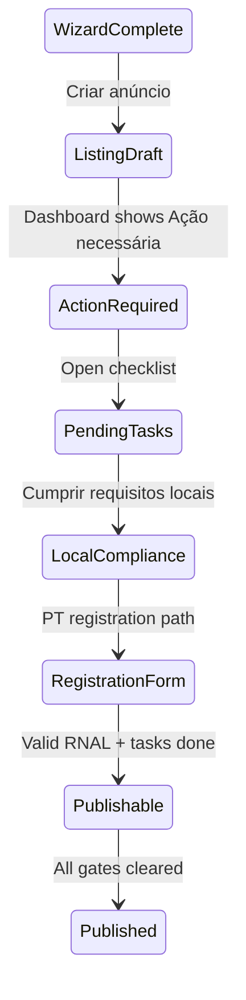

# 04 — Post-creation compliance

After **Criar anúncio**, the listing exists but may not be fully **publishable**. Airbnb surfaces async gates on the host dashboard and jurisdiction-specific registration (Portugal in this walkthrough).

[← 03 Finish and publish](03-phase-finish-and-publish.md) · [Hub](../readme.md) · [Patterns](99-patterns-and-data-model.md)

---

## Step 31 — Listings dashboard + confirm modal

| Field | Value |
|-------|-------|
| Screenshot | `Screenshot 2026-05-22 at 09.38.02.png` |
| Timestamp | 09:38:02 |
| Screen type | dashboard + modal |
| Primary CTA | Encontre coanfitriões (Find co-hosts) |

**Goal:** Block perceived "done" state — host must complete post-wizard steps.

**UI elements:**

- Nav: Hoje · Calendário · **Anúncios** (active) · Mensagens
- Page: **Os seus anúncios** *(Your listings)*
- Banner: Herdade da Camélia — confirm important data — required to publish
- Listing cards:
  - **Herdade da Camélia** — badge **Ação necessária** *(Action required)* — Nossa Senhora do Pranto
  - **Casa con piscina…** — badge **Publicado** *(Published)* — Parede
- Modal:
  - **Necessário para publicar o anúncio**
  - Icon: house + checkmark in pink circle
  - **Confirme alguns dados importantes**
  - CTA: **Encontre coanfitriões**
  - Footer thumbnail: Herdade da Camélia

**UX notes:**

- **Draft ≠ published** — status badge communicates blocker
- Co-host step may be recommended or required depending on region/listing type

---

### Step 32 — Pending tasks

| Field | Value |
|-------|-------|
| Screenshot | `Screenshot 2026-05-22 at 09.38.20.png` |
| Timestamp | 09:38:20 |
| Screen type | checklist page |
| Primary CTA | Per-task navigation (arrow on mandatory item) |

**Goal:** Enumerate remaining requirements with priority.

**UI elements:**

- Title: **Tarefas pendentes** *(Pending tasks)*
- Task 1: **Cumprir os requisitos locais** *(Comply with local requirements)*
  - Government requires tasks before hosting
  - Badge: **Obrigatório** *(Mandatory)* · chevron →
- Task 2: **Confirme o seu número de telefone** — **Concluir** ✓ (completed)
- Sidebar card: listing preview (photo, Herdade da Camélia, address snippet)

**UX notes:**

- Checklist pattern separates **wizard complete** from **legally host-ready**
- Phone verification can complete during or after wizard

---

### Step 33 — Portugal registration hub

| Field | Value |
|-------|-------|
| Screenshot | `Screenshot 2026-05-22 at 09.38.33.png` |
| Timestamp | 09:38:33 |
| Screen type | compliance hub (full page) |
| Primary CTAs | Three paths (see below) |

**Goal:** Route host through Portuguese **Alojamento Local** registration requirements.

**UI elements:**

- Title: **Registe o seu espaço em Portugal** *(Register your space in Portugal)*
- Intro: if Alojamento Local / Estabelecimento Turístico / Aldeia Turística — add valid registration number
- Link: Saiba mais sobre hospedagem em Portugal
- **Path A — Still need to register?**
  - Apply on Portal do Cidadão · immediate number · add to Airbnb
  - Button: **Registe o seu espaço**
- **Path B — Already have registration number?**
  - Button: **Adicione o número de registo**
- **Path C — Exempt?**
  - Bullets: not AL (boat/tent); long-term only; proof via tax-registered lease
  - Link: Portuguese regulation · Button: **Confirme que o seu espaço está isento**
- Illustration: handshake over cityscape

**UX notes:**

- **Jurisdiction gate** as separate hub, not crammed into wizard
- Three mutually exclusive paths reduce wrong-form submissions

---

### Step 34 — Add registration number

| Field | Value |
|-------|-------|
| Screenshot | `Screenshot 2026-05-22 at 09.38.51.png` |
| Timestamp | 09:38:51 |
| Screen type | compliance form |
| Primary CTA | Submit (implied — not fully visible) |

**Goal:** Collect registration number and host identity for Turismo de Portugal alignment.

**UI elements:**

- Title: **Adicione o número de registo**
- Warning: incorrect info or contact details in field → listing removal
- Fields:
  - **Número de registo** (text)
  - Role radio: **Pessoa que registou este anúncio** | **Gestor da propriedade**
  - **Número de identificação fiscal** (tax ID)
  - **O seu nome** — prefilled: Nome Exemplo
  - **O seu e-mail** — prefilled: email@example.com
- Read-only blocks:
  - **Endereço do espaço:** Largo Prof. José Bernardo Cotrim 35, Nossa Senhora do Pranto, Santarém 2240, PT
  - **Anúncio:** room URL
  - **Publicado** status label

**Data model:**

- Links wizard address to government registry
- Distinguishes registrant vs property manager
- Tax ID + contact for legal display

---

## Chapter summary

| Gate | Type | Blocks publish |
|------|------|----------------|
| Co-host / important details | Modal on dashboard | Yes (in capture) |
| Phone verification | Task | No (done) |
| Local government requirements | Task — Obrigatório | Yes |
| Portugal registration number | Form | Yes (for AL listings) |

**Reference:** [99 — Patterns and data model](99-patterns-and-data-model.md)
