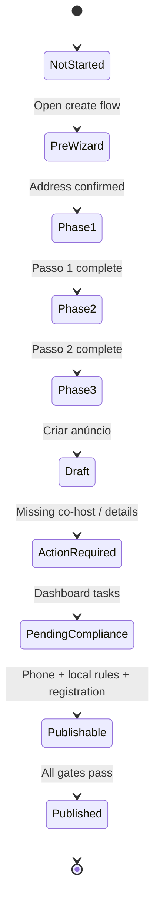

# 99 — Patterns and data model

Cross-cutting UX patterns and implied data fields from the Airbnb accommodation listing onboarding flow. Use when designing Eleva onboarding or similar multi-step publish flows.

[Hub](../readme.md)

---

## Patterns to borrow

| Pattern | Airbnb example | Design intent | Eleva application ideas |
|---------|----------------|-------------|-------------------------|
| **Listing type fork** | Alojamento / Experiência / Serviço modal | Route fundamentally different flows early | Expert vs Team vs Academy vs Space setup |
| **Address-first landing** | Search → confirm modal → wizard | Anchor geography before details; enable comps & compliance | Clinic address before service catalog |
| **Outcome preview** | Mock listing card on address landing | Motivation before effort | Preview member-facing profile |
| **Phase interstitials** | Passo 1 / 2 / 3 full-screen intros | Chunk long wizard; set expectations | “Tell us about your practice” chapter breaks |
| **3-segment progress** | One bar, three macro phases | Progress without 30-step anxiety | 3 chapters: Profile · Offerings · Go live |
| **Save and exit** | Gravar e sair on every step | Async completion; reduce abandonment fear | Draft save on all onboarding steps |
| **Single-focus steps** | One question per screen | Mobile-friendly; clear back/next | One decision per route |
| **Card single-select grids** | Property type, space type | Scannable taxonomy | Specialty / org type pickers |
| **Stepper counters** | Guests, beds, baths | Fast numeric input | Capacity, session length, staff count |
| **Deferred detail** | “Bed types later”, “more amenities after publish” | Ship MVP listing faster | Advanced settings post-launch |
| **Grouped multi-select** | Guest favorites vs standout amenities | Prioritize high-conversion attributes | Core vs premium feature flags |
| **Hard minimum + quality gate** | 5 photos, ≤25 MB | Prevent broken public pages | Min gallery images, doc size limits |
| **Partial upload feedback** | “4 of 5 uploaded” + size hint | Actionable recovery | Batch upload with per-file errors |
| **Cover + reorder** | Foto de capa, drag sort, organize CTA | Control merchandising order | Hero image + ordered gallery |
| **AI-assisted copy** | Highlights → prefilled description | Lower writing friction | Tone chips → bio draft |
| **Char limits surfaced** | 50 title, 500 description | No surprise truncation | Inline counters on all public text |
| **Pricing with comps** | Suggested € + map overlay | Data-driven confidence | Market rate hints for services |
| **Host vs guest price** | €140 host / €160 guest | Fee transparency | Member price vs platform fee display |
| **Weekend modifier** | % slider Fri/Sat | Simple dynamic pricing | Peak hours / weekend surcharge |
| **Opt-out discounts** | Pre-checked launch promos | Faster first conversions | Optional launch offers default on |
| **Conditional sub-flow** | Camera checkbox → detail modal | Compliance without clutter | License upload only if regulated |
| **Terminal CTA rename** | Criar anúncio vs Seguinte | Signals create/commit moment | “Publish profile” vs “Continue” |
| **Post-submit checklist** | Tarefas pendentes | Draft created ≠ publishable | Onboarding checklist after profile draft |
| **Jurisdiction gate** | Portugal registration hub | Legal async blocker | PT/EU regulatory steps by country |
| **Dashboard status badges** | Ação necessária vs Publicado | At-a-glance completion | “Incomplete” vs “Live” on org cards |
| **Help modals** | Discounts explainer | Educate without leaving flow | Contextual ? on complex policy fields |
| **Map privacy split** | Pin accuracy vs guest-visible precision | Safety + search relevance | Approximate clinic location until booking |

---

## Implied data model

### Listing (root)

| Field | Type | Collected at | Notes |
|-------|------|--------------|-------|
| `listing_category` | enum | Step 1 | accommodation \| experience \| service |
| `status` | enum | Post-create | draft \| action_required \| published |
| `title` | string(50) | Step 19 | Public headline |
| `description` | string(500) | Step 21 | May be AI-seeded |
| `highlight_tags` | string[] (max 2) | Step 20 | calm, unique, family, etc. |

### Location

| Field | Type | Collected at | Notes |
|-------|------|--------------|-------|
| `country_code` | string | Step 4 | e.g. PT |
| `street` | string | Step 4 | |
| `unit` | string? | Step 4 | Optional |
| `postal_code` | string | Step 4 | |
| `city` | string | Step 4 | |
| `latitude` | number | Step 8 | Map pin |
| `longitude` | number | Step 8 | |
| `show_exact_location` | boolean | Step 9 | Pre-booking map display |

### Property structure

| Field | Type | Collected at | Notes |
|-------|------|--------------|-------|
| `property_type` | enum | Step 6 | ~27 values (house, apartment, …) |
| `space_type` | enum | Step 7 | entire \| private_room \| hostel_shared |
| `max_guests` | int | Step 10 | |
| `bedrooms` | int | Step 10 | |
| `beds` | int | Step 10 | |
| `bathrooms` | int | Step 10 | |

### Merchandising

| Field | Type | Collected at | Notes |
|-------|------|--------------|-------|
| `amenity_ids` | string[] | Steps 12–13 | Two tiers; extensible post-publish |
| `photos` | Media[] | Steps 14–18 | min 5; max 25MB; ordered; cover_index |
| `photo.url` | string | Upload | |
| `photo.size_bytes` | int | Upload | Validated ≤ 25MB |

### Pricing

| Field | Type | Collected at | Notes |
|-------|------|--------------|-------|
| `weekday_price_host` | money | Step 23 | Base nightly |
| `weekday_price_guest` | money | Step 23 | After platform fees |
| `weekend_supplement_percent` | 0–99 | Step 25 | Fri/Sat |
| `weekend_price_host` | money | Step 25 | Derived |
| `discount_new_listing` | boolean + % | Step 26 | 20% first 3 bookings |
| `discount_last_minute` | boolean + % | Step 26 | 10%, ≤14 days |
| `discount_weekly` | boolean + % | Step 26 | 10%, 7+ nights |
| `discount_monthly` | boolean + % | Step 26 | 20%, 28+ nights |

### Safety & compliance

| Field | Type | Collected at | Notes |
|-------|------|--------------|-------|
| `has_outdoor_camera` | boolean | Step 28–30 | |
| `camera_areas_description` | string(300)? | Step 29 | Required if camera |
| `has_noise_monitor` | boolean | Step 28 | |
| `has_weapons` | boolean | Step 28 | |
| `phone_verified` | boolean | Post task 32 | |
| `local_requirements_complete` | boolean | Post task 32 | Jurisdiction-specific |
| `pt_registration_number` | string? | Step 34 | RNAL / Turismo de Portugal |
| `host_role` | enum | Step 34 | registrant \| property_manager |
| `host_tax_id` | string | Step 34 | NIF |
| `host_name` | string | Step 34 | Prefilled from account |
| `host_email` | string | Step 34 | Prefilled |

---

## Wizard gating rules (summary)

| Step / area | Next disabled until |
|-------------|---------------------|
| Listing type modal | Category selected |
| Property type | One type selected |
| Photos | ≥ 5 successfully uploaded |
| Title | length > 0 |
| Camera safety | If checked, area description non-empty |
| Upload modal | Oversized files removed or replaced |

Optional steps (amenities) do not block **Seguinte** in observed flow.

---

## Listing lifecycle states

---

## Anti-patterns observed (avoid)

| Anti-pattern | Why Airbnb avoids it |
|--------------|----------------------|
| Single 40-field form | Wizard + interstitials reduce overwhelm |
| Publishing before compliance | Post-create checklist + badges |
| Hiding fees until checkout | Guest price shown at pricing step |
| Indoor camera allowed | Explicit ban in safety copy |
| Silent upload failures | Per-file size errors + partial success count |

---

## Related chapters

- [00 — Entry and address](00-entry-and-address.md)
- [01 — About your space](01-phase-about-your-space.md)
- [02 — Stand out](02-phase-stand-out.md)
- [03 — Finish and publish](03-phase-finish-and-publish.md)
- [04 — Post-creation compliance](04-post-creation-compliance.md)
