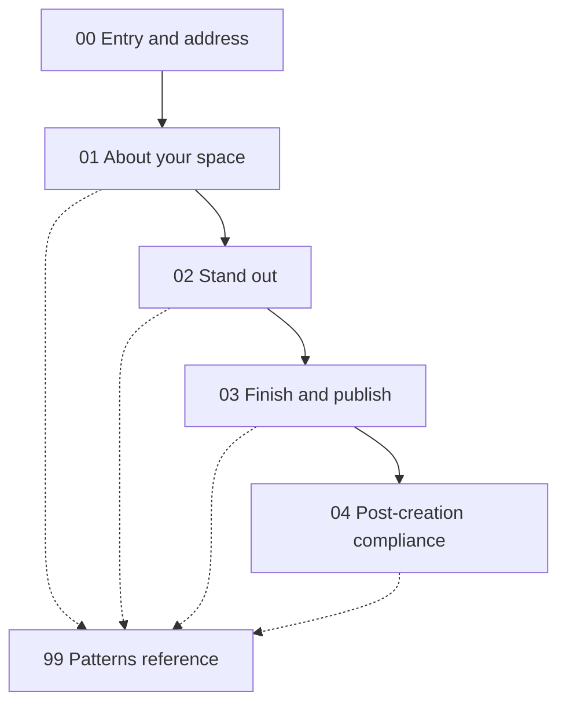
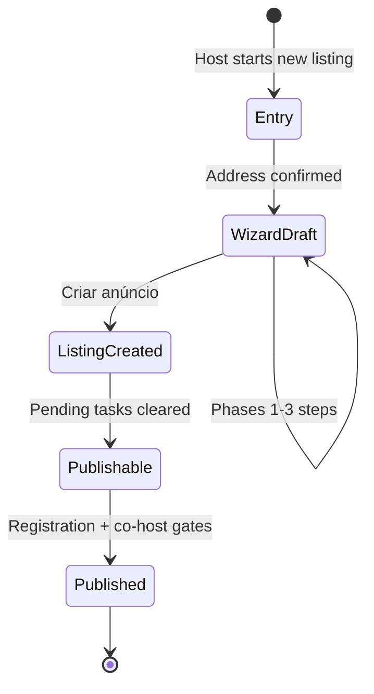

# Airbnb — New accommodation listing onboarding

Reference documentation for the **host flow to create a new Alojamento (accommodation) listing** on Airbnb, captured from a live walkthrough on **2026-05-22** (Portuguese UI).

Use this when designing multi-step onboarding for Eleva or other products: wizards, phase interstitials, gating rules, post-submit compliance, and merchandising flows.

---

## How to read

| Mode | Path | Best for |
|------|------|----------|
| **Markdown (SSOT)** | This file → [`docs/`](docs/) chapters | Engineers, agents, diffs, specs |
| **HTML (visual)** | [`index.html`](index.html) | Design / PM review in a browser |
| **Quick lookup** | [Screenshot index](#screenshot-index) below | Jump to step by timestamp |

**Example property in walkthrough:** Herdade da Camélia — Largo Prof. José Bernardo Cotrim 35, 2240, Nossa Senhora do Pranto, Portugal.

---

## Flow overview

### Macro-phases (3-segment progress bar)

| Phase | PT label | Chapter | Steps | Screenshots |
|-------|----------|---------|-------|-------------|
| Pre | — | [00-entry-and-address](docs/00-entry-and-address.md) | 4 | 1–4 |
| 1 | Passo 1 — Fale-nos sobre o seu espaço | [01-phase-about-your-space](docs/01-phase-about-your-space.md) | 6 | 5–10 |
| 2 | Passo 2 — Faça o seu espaço destacar-se | [02-phase-stand-out](docs/02-phase-stand-out.md) | 11 | 11–21 |
| 3 | Passo 3 — Conclua e publique | [03-phase-finish-and-publish](docs/03-phase-finish-and-publish.md) | 9 | 22–30 |
| Post | — | [04-post-creation-compliance](docs/04-post-creation-compliance.md) | 4 | 31–34 |
| Ref | — | [99-patterns-and-data-model](docs/99-patterns-and-data-model.md) | — | Cross-cutting |

**Total interactive steps documented:** 34 screenshots (chronological).

### Persistent chrome (most wizard steps)

- **Top left:** Airbnb logo
- **Top right:** `Tem dúvidas?` (Have questions?) + `Gravar e sair` (Save and exit) — phase intro screens often show only Save and exit
- **Bottom:** 3-part progress bar + `Anterior` (Previous) + `Seguinte` (Next)
- **Terminal step:** Safety screen uses `Criar anúncio` (Create listing) instead of Next; header may show `Sair` (Exit) only

---

## Chapters

1. **[Entry and address](docs/00-entry-and-address.md)** — Listing type fork, address search, address confirmation modal
2. **[Phase 1 — About your space](docs/01-phase-about-your-space.md)** — Property type, space type, map pin, location privacy, capacity
3. **[Phase 2 — Stand out](docs/02-phase-stand-out.md)** — Amenities, photos (min 5), title, highlights, description
4. **[Phase 3 — Finish and publish](docs/03-phase-finish-and-publish.md)** — Pricing, discounts, safety, create listing
5. **[Post-creation compliance](docs/04-post-creation-compliance.md)** — Dashboard gates, pending tasks, Portugal registration
6. **[Patterns and data model](docs/99-patterns-and-data-model.md)** — Reusable UX patterns and implied fields for other products

**Visual walkthrough:** open [`index.html`](index.html) in a browser.

---

## Screenshot index

| # | Time | File | Chapter | Step title |
|---|------|------|---------|------------|
| 1 | 09:28:32 | `Screenshot 2026-05-22 at 09.28.32.png` | [00](docs/00-entry-and-address.md#step-1--listing-type-modal) | Listing type modal |
| 2 | 09:28:48 | `Screenshot 2026-05-22 at 09.28.48.png` | [00](docs/00-entry-and-address.md#step-2--create-listing-landing) | Create listing landing |
| 3 | 09:29:00 | `Screenshot 2026-05-22 at 09.29.00.png` | [00](docs/00-entry-and-address.md#step-3--landing-with-preview-card) | Landing with preview card |
| 4 | 09:29:36 | `Screenshot 2026-05-22 at 09.29.36.png` | [00](docs/00-entry-and-address.md#step-4--confirm-address-modal) | Confirm address modal |
| 5 | 09:29:58 | `Screenshot 2026-05-22 at 09.29.58.png` | [01](docs/01-phase-about-your-space.md#step-5--passo-1-interstitial) | Passo 1 interstitial |
| 6 | 09:30:09 | `Screenshot 2026-05-22 at 09.30.09.png` | [01](docs/01-phase-about-your-space.md#step-6--property-type-grid) | Property type grid |
| 7 | 09:30:42 | `Screenshot 2026-05-22 at 09.30.42.png` | [01](docs/01-phase-about-your-space.md#step-7--space-type-selection) | Space type selection |
| 8 | 09:30:54 | `Screenshot 2026-05-22 at 09.30.54.png` | [01](docs/01-phase-about-your-space.md#step-8--map-pin-confirmation) | Map pin confirmation |
| 9 | 09:31:07 | `Screenshot 2026-05-22 at 09.31.07.png` | [01](docs/01-phase-about-your-space.md#step-9--location-privacy-on-map) | Location privacy on map |
| 10 | 09:31:42 | `Screenshot 2026-05-22 at 09.31.42.png` | [01](docs/01-phase-about-your-space.md#step-10--capacity-steppers) | Capacity steppers |
| 11 | 09:31:52 | `Screenshot 2026-05-22 at 09.31.52.png` | [02](docs/02-phase-stand-out.md#step-11--passo-2-interstitial) | Passo 2 interstitial |
| 12 | 09:32:02 | `Screenshot 2026-05-22 at 09.32.02.png` | [02](docs/02-phase-stand-out.md#step-12--amenities-unselected) | Amenities (unselected) |
| 13 | 09:32:56 | `Screenshot 2026-05-22 at 09.32.56.png` | [02](docs/02-phase-stand-out.md#step-13--amenities-selected) | Amenities (selected) |
| 14 | 09:33:05 | `Screenshot 2026-05-22 at 09.33.05.png` | [02](docs/02-phase-stand-out.md#step-14--photos-empty-state) | Photos empty state |
| 15 | 09:33:25 | `Screenshot 2026-05-22 at 09.33.25.png` | [02](docs/02-phase-stand-out.md#step-15--upload-modal-2-photos) | Upload modal (2 photos) |
| 16 | 09:34:03 | `Screenshot 2026-05-22 at 09.34.03.png` | [02](docs/02-phase-stand-out.md#step-16--upload-modal-5-photos--size-error) | Upload modal (5 photos, size error) |
| 17 | 09:34:18 | `Screenshot 2026-05-22 at 09.34.18.png` | [02](docs/02-phase-stand-out.md#step-17--partial-upload-feedback) | Partial upload feedback |
| 18 | 09:34:33 | `Screenshot 2026-05-22 at 09.34.33.png` | [02](docs/02-phase-stand-out.md#step-18--photo-review-and-organize) | Photo review and organize |
| 19 | 09:34:42 | `Screenshot 2026-05-22 at 09.34.42.png` | [02](docs/02-phase-stand-out.md#step-19--listing-title) | Listing title |
| 20 | 09:35:25 | `Screenshot 2026-05-22 at 09.35.25.png` | [02](docs/02-phase-stand-out.md#step-20--description-highlights) | Description highlights |
| 21 | 09:35:55 | `Screenshot 2026-05-22 at 09.35.55.png` | [02](docs/02-phase-stand-out.md#step-21--listing-description) | Listing description |
| 22 | 09:36:03 | `Screenshot 2026-05-22 at 09.36.03.png` | [03](docs/03-phase-finish-and-publish.md#step-22--passo-3-interstitial) | Passo 3 interstitial |
| 23 | 09:36:12 | `Screenshot 2026-05-22 at 09.36.12.png` | [03](docs/03-phase-finish-and-publish.md#step-23--weekday-base-price) | Weekday base price |
| 24 | 09:36:31 | `Screenshot 2026-05-22 at 09.36.31.png` | [03](docs/03-phase-finish-and-publish.md#step-24--similar-listings-map) | Similar listings map |
| 25 | 09:36:43 | `Screenshot 2026-05-22 at 09.36.43.png` | [03](docs/03-phase-finish-and-publish.md#step-25--weekend-price-supplement) | Weekend price supplement |
| 26 | 09:36:56 | `Screenshot 2026-05-22 at 09.36.56.png` | [03](docs/03-phase-finish-and-publish.md#step-26--discounts) | Discounts |
| 27 | 09:37:05 | `Screenshot 2026-05-22 at 09.37.05.png` | [03](docs/03-phase-finish-and-publish.md#step-27--discounts-help-modal) | Discounts help modal |
| 28 | 09:37:15 | `Screenshot 2026-05-22 at 09.37.15.png` | [03](docs/03-phase-finish-and-publish.md#step-28--safety-disclosures) | Safety disclosures |
| 29 | 09:37:31 | `Screenshot 2026-05-22 at 09.37.31.png` | [03](docs/03-phase-finish-and-publish.md#step-29--outdoor-camera-detail-modal) | Outdoor camera detail modal |
| 30 | 09:37:49 | `Screenshot 2026-05-22 at 09.37.49.png` | [03](docs/03-phase-finish-and-publish.md#step-30--safety-completed) | Safety completed |
| 31 | 09:38:02 | `Screenshot 2026-05-22 at 09.38.02.png` | [04](docs/04-post-creation-compliance.md#step-31--listings-dashboard--confirm-modal) | Listings dashboard + confirm modal |
| 32 | 09:38:20 | `Screenshot 2026-05-22 at 09.38.20.png` | [04](docs/04-post-creation-compliance.md#step-32--pending-tasks) | Pending tasks |
| 33 | 09:38:33 | `Screenshot 2026-05-22 at 09.38.33.png` | [04](docs/04-post-creation-compliance.md#step-33--portugal-registration-hub) | Portugal registration hub |
| 34 | 09:38:51 | `Screenshot 2026-05-22 at 09.38.51.png` | [04](docs/04-post-creation-compliance.md#step-34--add-registration-number) | Add registration number |

---

## Listing lifecycle (summary)

See [99-patterns-and-data-model](docs/99-patterns-and-data-model.md) for field-level detail and UX patterns to reuse elsewhere.

---

## Maintenance

- **Markdown is SSOT.** Edit `docs/*.md` first; sync `index.html` sections when content changes.
- Screenshots remain in this folder root; chapter images use `../Screenshot …` paths.
- Other Airbnb flows (Experiência, Serviço) should get sibling folders under `airbnb.com/`, not extensions to this accommodation doc set.
