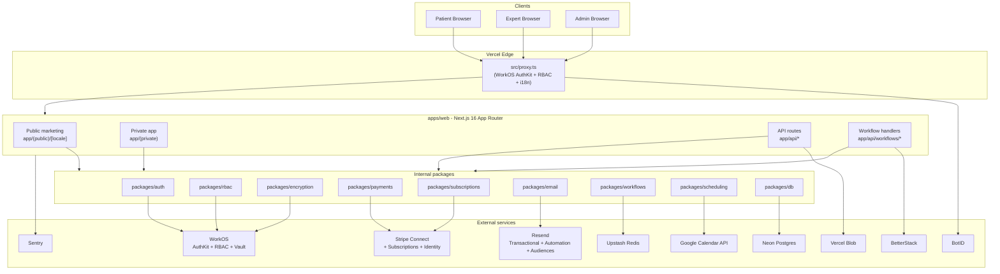

# Eleva.care v2 Blueprint

> A self-contained knowledge base detailed enough to recreate the core of Eleva.care in a fresh monorepo, while encoding every locked v2 stack decision and harvesting validated patterns from the in-flight `clerk-workos` migration branch.

## Elevator pitch (60 seconds)

**Eleva.care** is a **digital health platform** — explicitly **not** a clinical provider per the Portuguese health regulator (ERS) — that connects women with vetted, credentialed health professionals (physiotherapists, psychologists, nutritionists, midwives, OB/GYNs) for paid telehealth consultations and structured care programs across six women's-health verticals: Pelvic Health, Pregnancy & Postpartum, Mental Health, Sexual Health, Hormonal Health & Menopause, and Nutrition.

Experts publish a public profile, define service offerings (events) and multi-session bundles (packs), set weekly availability, accept bookings, and meet clients via Google Meet links auto-attached to a calendar invite. Clients discover an expert, pick a service, choose a slot in their own timezone, pay (Credit Card or Portuguese Multibanco voucher), receive an instant calendar invite, and after the session optionally see encrypted notes the expert recorded. Eleva takes a **15% platform fee** on every booking via Stripe Connect Express and (in v2) layers an **expert subscription** on top with two tiers (Community 20%/12% commission monthly/annual, Top 18%/8%).

The MVP is a single Next.js 16 app on Vercel with Clerk auth, Drizzle on Neon Postgres, Novu + React Email for transactional notifications, and Upstash QStash for cron orchestration. **The v2 rebuild swaps that to**: WorkOS AuthKit (with org-per-user multi-tenancy + 89-permission RBAC + Vault for PHI encryption), Resend + Resend Automation + Resend Audiences (transactional + lifecycle + lite CRM, fully replacing Novu), Vercel Workflows SDK (durable workflows replacing QStash crons), and a Turborepo monorepo under `src/`. PostHog, Dub, and several other in-tree dependencies are dropped.

## Reading order

This blueprint is designed to be read top-to-bottom. A new engineer who reads `00` through `19` in order should be able to stand up the v2 monorepo without spelunking either `main` or the `clerk-workos` branch.

| #    | File                                                                                                  | Purpose                                                                                                |
| ---- | ----------------------------------------------------------------------------------------------------- | ------------------------------------------------------------------------------------------------------ |
| 00   | [00-README.md](00-README.md)                                                                           | This file. Index, glossary, high-level architecture mermaid, file map.                                 |
| 01   | [01-product-vision-and-intent.md](01-product-vision-and-intent.md)                                     | What Eleva.care is, who it serves, day-to-day journeys, business model, non-goals.                     |
| 02   | [02-architecture-as-built.md](02-architecture-as-built.md)                                             | Snapshot of the current single-app Next 16 deployment.                                                 |
| 03   | [03-data-model.md](03-data-model.md)                                                                   | Full Drizzle schema, audit DB, multi-tenancy shift, money fields, Neon RLS sketch.                     |
| 04   | [04-routing-and-app-structure.md](04-routing-and-app-structure.md)                                     | Route map (private/public/api/cron/webhooks), `proxy.ts`, locale strategy.                             |
| 05   | [05-identity-auth-rbac.md](05-identity-auth-rbac.md)                                                   | Clerk as-built → WorkOS AuthKit + org-per-user + non-blocking sync.                                    |
| 06   | [06-payments-stripe-connect.md](06-payments-stripe-connect.md)                                         | Stripe Connect, 15% fee, Multibanco, payout pipeline, unified webhook v2.                              |
| 07   | [07-scheduling-booking-calendar.md](07-scheduling-booking-calendar.md)                                 | Booking funnel, slot reservation, Google Calendar/Meet, race-condition fixes.                          |
| 08   | [08-notifications-email-resend-crm.md](08-notifications-email-resend-crm.md)                           | Novu → Resend transactional + Resend Automation + Resend Audiences (lite CRM).                          |
| 09   | [09-workflows-and-async-jobs.md](09-workflows-and-async-jobs.md)                                       | QStash crons → Vercel Workflows SDK; full workflow inventory.                                          |
| 10   | [10-infrastructure-and-observability.md](10-infrastructure-and-observability.md)                       | Neon, Redis, Blob, Sentry, BetterStack, BotID. Removes PostHog/Dub/Novu.                                |
| 11   | [11-admin-audit-ops.md](11-admin-audit-ops.md)                                                         | Admin pages, audit DB, scripts, role gates.                                                            |
| 12   | [12-internationalization.md](12-internationalization.md)                                               | next-intl, `pt-BR` → `br.json`, `ELEVA_LOCALE` cookie, email i18n.                                     |
| 13   | [13-lessons-learned.md](13-lessons-learned.md)                                                         | Candid catalog: symptom → file → root cause → v2 mitigation.                                           |
| 14   | [14-v2-target-monorepo.md](14-v2-target-monorepo.md)                                                   | Turborepo + pnpm workspaces layout, package graph, env taxonomy reset.                                 |
| 15   | [15-clerk-workos-branch-learnings.md](15-clerk-workos-branch-learnings.md)                             | Adopt-as-is / adopt-with-mod / override matrix from the in-flight migration branch.                    |
| 16   | [16-subscriptions-and-three-party-revenue.md](16-subscriptions-and-three-party-revenue.md)             | Expert subscriptions via Stripe lookup keys; clinic three-party revenue model.                         |
| 17   | [17-encryption-and-vault.md](17-encryption-and-vault.md)                                               | Current AES-256-GCM → WorkOS Vault envelope encryption (PHI + Google tokens).                          |
| 18   | [18-rbac-and-permissions.md](18-rbac-and-permissions.md)                                               | ~132 permissions × 5 roles (2 WorkOS defaults + 3 custom), four enforcement layers, generated artifacts. |
| 19   | [19-rebuild-roadmap.md](19-rebuild-roadmap.md)                                                          | 20 ordered milestones with explicit "lift from `clerk-workos` branch" callouts.                        |

## High-level v2 architecture

## Glossary

Use these terms consistently across code, docs, and conversations.

| Term                  | Definition                                                                                                                            |
| --------------------- | ------------------------------------------------------------------------------------------------------------------------------------- |
| **Expert**            | Credentialed women's-health professional who publishes services and accepts bookings. In v2, owns one organization (`org_type: expert`). |
| **Customer / Patient** | End user who books and pays for sessions. In v2, owns one organization (`org_type: patient`). "Customer" is the legacy term; v2 prefers "Patient" for the Patient Portal. The WorkOS role slug for this persona is the default `member` — there is no custom `patient` or `user` role. |
| **Admin**             | Eleva staff. WorkOS-default role. Most admins moderate and approve; a small **operator subset** holds the elevated permissions (`users:impersonate`, `organizations:delete`, `payments:retry_failed`, `audit:export`, `settings:manage_features`) via a WorkOS group. There is **no** separate `superadmin` role. |
| **Clinic (role)**     | Phase 2 custom role: clinic owner who owns a `clinic` org and invites experts as `member`s of that clinic. Replaces the previously-proposed `partner_admin`. Seniority *within* the clinic org is expressed by WorkOS's built-in `admin` vs `member` membership distinction, not by another custom role. |
| **Org / Organization** | WorkOS Organization. In v2, every user owns one org. Org carries `org_type`, billing, encryption key scope, and RLS boundary.        |
| **Org type**          | Enum on the org: `expert` / `patient` / `clinic` (future).                                                                            |
| **Membership**        | Many-to-many between users and orgs with a role. Solo users (patient or expert) are the WorkOS-default `admin` of their own org (its owner). Inside a clinic org in Phase 2, the clinic owner is `admin` and invited experts are `member`. The Eleva-custom application roles (`expert_top`, `expert_community`, `clinic`) sit alongside these built-in membership roles. |
| **Event**             | A single bookable service offering owned by an expert (e.g., "30-min Pelvic Health Consultation"). Has duration, price, currency.     |
| **Pack**              | A bundle of multiple sessions sold as one purchase (e.g., "4-session Postpartum Recovery Pack"). Patient redeems sessions over time. |
| **Meeting**           | A confirmed booking instance: who, when, which event, payment state, calendar event ID, optional encrypted record.                    |
| **Record**            | Encrypted post-session notes the expert wrote about the meeting. v2 stores via WorkOS Vault.                                          |
| **Slot reservation**  | Short-lived hold on a time slot during checkout to prevent double-booking. Backed by Redis with `SET NX` lock in v2.                  |
| **Payout**            | Stripe Connect transfer of expert earnings minus the 15% platform fee, after the regulatory hold window and admin approval.           |
| **Payout window**     | Hold period between session completion and payout eligibility. Currently 7 days; configurable.                                        |
| **Multibanco**        | Portuguese voucher-based payment method. 8-day expiry; reminders fire D3 and D6 before expiry.                                        |
| **NIF**               | Portuguese tax identifier. Required for Portuguese clients but billing address is NOT required (Stripe Tax must be configured this way).|
| **Lookup key**        | Stable string identifier on Stripe prices (e.g., `expert_top_annual`). v2 references these instead of hardcoded `price_xxx` IDs.      |
| **Setup state**       | Per-expert flags tracking onboarding completion (profile, Stripe Connect, Identity, Calendar, first event). Currently in Clerk metadata; v2 in org metadata. |
| **Sync (WorkOS)**     | The non-blocking process that mirrors WorkOS users/orgs/memberships into the local DB. Failure must NEVER block authentication.        |
| **Vault**             | WorkOS Vault: envelope encryption (DEK + KEK) with org-scoped keys. v2 home for PHI records and Google OAuth refresh tokens.          |
| **Workflow**          | A typed Vercel Workflows SDK definition with steps, sleep, retries, and idempotency keys. Replaces QStash crons in v2.                |
| **Idempotency key**   | A string that uniquely identifies a side-effecting operation. Stored in the `stripe_processed_events` table (kept under that name in v2). |
| **ERS**               | Entidade Reguladora da Saúde — the Portuguese health regulator. Eleva's official posture is "platform, not provider" (see `_docs/ERS_portugal/` on the `clerk-workos` branch). |
| **Femme Focus**       | Eleva's monthly newsletter. v2 hosts it as a Resend Audience.                                                                         |

## Source repositories used by this blueprint

1. **`main` branch** — current production MVP. Located at the repo root. Single Next.js 16 app. **No** `src/` directory. Clerk + Novu + QStash + PostHog.
2. **`clerk-workos` branch** — in-flight migration. Fetched via `git fetch origin clerk-workos`. Significant restructure: `src/` layout, WorkOS AuthKit + RBAC + Vault, Bun/Node hybrid, Vitest, Playwright, Fumadocs, expert subscriptions, ~100 docs under `_docs/`. Cited extensively as `branch _docs/...` throughout this blueprint.

When a v2 prescription matches the branch, [15-clerk-workos-branch-learnings.md](15-clerk-workos-branch-learnings.md) flags it as **adopt-as-is** (with the branch path). When v2 differs from the branch (Novu→Resend, QStash→Vercel Workflows, drop PostHog), the same file flags it as **override** with a reason.

## File template

Every numbered chapter (01 through 19) follows the same structure so the blueprint reads predictably:

1. **What we built** — concrete description of the as-built reality on `main`, with file paths.
2. **Why** — the design intent and constraints at the time.
3. **What worked** — patterns to keep.
4. **What didn't** — candid pitfalls, with file paths and reproducer notes.
5. **v2 prescription** — the locked decision, citing whether it is adopted from the `clerk-workos` branch (with branch path), modified, or overridden.
6. **Concrete checklist** — copy-paste actionable items for the new repo.

## How to use this blueprint when bootstrapping the new monorepo

1. Read `00` and `01` to internalize what Eleva.care is and who it serves.
2. Read `13` (Lessons Learned) early — it is the single best inoculation against repeating the MVP's mistakes.
3. Read `14` (v2 Target Monorepo) to understand the package graph and folder layout.
4. Read `15` (Branch Learnings) to know exactly which artifacts you can `git checkout` from `origin/clerk-workos` and which to leave.
5. Follow `19` (Rebuild Roadmap) milestone by milestone. Each milestone is a PR-sized chunk with explicit dependencies.
6. Reference `02`–`12` and `16`–`18` per domain as you implement.
