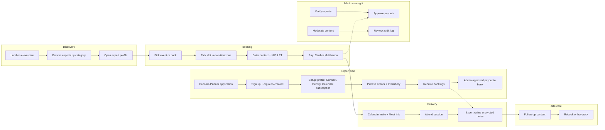
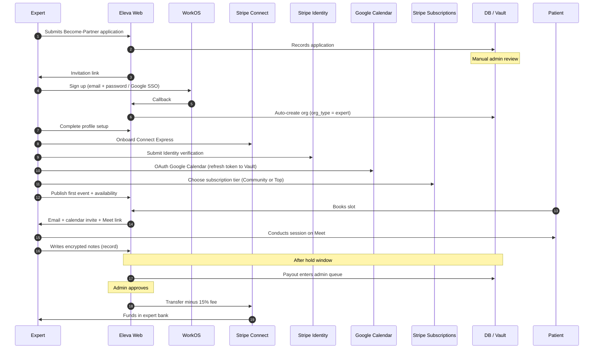
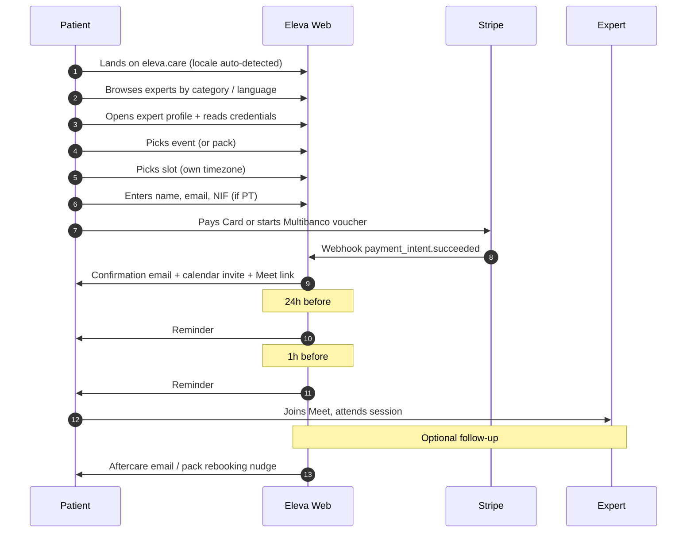

# 01 — Product Vision & Intent

> If you only read one chapter of this blueprint, read this one. It answers: **what is Eleva.care, who is it for, and how does it actually work day-to-day?**

## One-page summary

## Mission

> **Empowering women's healthcare.**

Eleva.care is a **digital health platform** that connects women with vetted, credentialed health professionals for paid telehealth consultations and structured care programs. The brand promise is **evidence-based, credentialed, women-first** — not influencer wellness, not a generic Calendly clone.

A critical legal-and-positioning distinction (formalized on the `clerk-workos` branch in `_docs/ERS_portugal/ers-memo.md`): **Eleva.care is NOT a clinical provider.** Per the Portuguese health regulator (ERS), Eleva is a **platform that enables** independent licensed professionals to deliver telehealth services. Eleva does not practise medicine, does not employ clinicians, and does not own the clinical relationship. The blueprint must keep this posture intact in copy, terms of service, and product surfaces.

## What the MVP actually does today

Four pillars, plus an admin back office:

### 1. Marketplace

- Verified experts publish a public profile at `eleva.care/[username]` with bio, photo, languages, specialties, and credentials.
- Each expert defines one or more **events** (single bookable services, e.g. "30-min Pelvic Health Consultation") with description, duration, price, currency.
- Experts also publish **packs** (multi-session bundles, e.g. "4-session Postpartum Recovery Pack") that patients buy once and redeem over time.
- Patients browse experts by **category** (the six women's-health verticals — see below) and by language.

### 2. Scheduling

- Experts publish weekly availability and override-blocked dates (vacation, holidays).
- The slot algorithm lives in `getValidTimesFromSchedule.ts` (see `tests/api/getValidTimesFromSchedule.test.ts`) — it computes available slots by intersecting weekly schedule, blocked dates, existing meetings, and Google Calendar busy times.
- Patients see slots in **their own timezone**, automatically detected and convertible.
- Slot selection takes a short Redis-backed reservation during checkout to prevent double-booking.

### 3. Money end-to-end

- Stripe Connect Express onboarding for every expert.
- Two payment methods: **Credit Card** (worldwide) and **Multibanco** (Portuguese voucher with 8-day expiry).
- Eleva collects a **15% platform fee** as `application_fee_amount` on every Connect transfer (see [config/stripe.ts](../../config/stripe.ts)).
- Portuguese tax: collect **NIF only**, do NOT require billing address (a documented gotcha in `AGENTS.md` — Stripe Tax must be configured to honor this).
- Payouts go through a **regulatory hold window** then enter an **admin approval queue** before the Stripe transfer hits the expert's bank.
- Refunds, disputes, chargebacks, and Multibanco voucher expiries are all handled in [app/api/webhooks/stripe/handlers/](../../app/api/webhooks/stripe/handlers/).

### 4. Lifecycle & communications

- Booking confirmation emails (patient + expert) on payment success.
- Calendar invites with auto-generated Google Meet links sent on confirmation.
- 24-hour and 1-hour appointment reminders.
- Multibanco payment-pending reminders at D3 and D6 before voucher expiry — these matter because Multibanco completion rate is a key business metric.
- No-show handling, refund notifications, expert onboarding nudges.
- All templates live in [emails/](../../emails/) (React Email) with localization via `emails/utils/i18n.ts`.

### 5. Admin / Superadmin back office

- User management: search, view, role assignment.
- Expert verification: review credentials, trigger Stripe Identity, approve onboarding.
- Payout approval queue with manual gate before any Stripe transfer.
- Refund and dispute handling.
- Category management (CRUD on the women's-health taxonomy).
- Audit log review (separate Postgres DB; see [audit.config.ts](../../audit.config.ts)).

## Service taxonomy

The platform is opinionated about its vertical. Six women's-health categories anchor discovery, copy, and content:

| Category                          | Typical credentialed specialties                         |
| --------------------------------- | -------------------------------------------------------- |
| **Pelvic Health**                 | Pelvic-floor physiotherapy, urogynecology                |
| **Pregnancy & Postpartum Care**   | Midwifery, OB/GYN, lactation, perinatal physiotherapy    |
| **Mental Health & Wellbeing**     | Psychology, perinatal mental health                      |
| **Sexual Health**                 | Sexology, gynecology, couples therapy                    |
| **Hormonal Health & Menopause**   | Endocrinology, gynecology, menopause-specialist nutrition |
| **Nutrition**                     | Dietetics, sports nutrition, fertility nutrition         |

These categories are stable and should be preserved verbatim in v2 copy. New categories are added via the admin panel, not at code level.

## Founding team & clinical authority

Per [README.md](../../README.md) and the public team page, Eleva is anchored in a real clinical/research network — not influencer marketing:

- **Patricia Mota** — co-founder, perinatal physiotherapy.
- **Cristine Homsi Jorge** — pelvic-floor specialist, research lead.
- **Alexandre Delgado** — clinical advisor.
- (Plus rotating contributors for the podcast and Femme Focus newsletter.)

This is **a product moat, not decoration**. v2 must keep the team page, expert credentials, and "evidence-based care" content as **first-class CMS surfaces**, not afterthoughts. The branch's `_docs/EVIDENCE-BASED-CARE-IMPROVEMENTS.md` redesigned the evidence page with footnote-style references and DOI links — adopt that pattern in v2 (Fumadocs renders it natively).

## Content surfaces beyond bookings

Top-of-funnel content is unmonetized but central to acquisition and brand:

- **Femme Focus newsletter** — monthly opt-in email with health insights, expert features, and platform updates. v2 routes signups to a **Resend Audience** tagged `lifecycleStage:newsletter`.
- **Podcast & insights** — expert-led episodes; v2 keeps these as MDX-rendered content under Fumadocs at `/insights/*`.
- **Evidence-Based Care page** — research-citation surface with academic footnote references (`[1]`, `[2]`, `[3]`) linking to DOIs. The brand promise: "we don't sell wellness, we cite papers."
- **Blog** (existing under `app/[locale]/(public)/blog/`) — long-form articles authored by experts.

## Personas (with day-to-day journeys)

### 1. Expert (the supplier)

A credentialed women's-health professional. Acquisition is **high-touch, vetted** — not open self-signup.

### 2. Customer / Patient (the demand side)

> **Persona ↔ role mapping**: in product copy and UI, this user is always called a *Patient*. Their **WorkOS role slug**, however, is the default `member` — there is no custom `patient` or `user` role in v2. (See [18-rbac-and-permissions.md](18-rbac-and-permissions.md) for the full taxonomy.)

In v2 a **Patient Portal** at `/patient/*` exposes: booking history, upcoming visits, document uploads, downloadable invoices, and (eventually) records the expert chose to share. This is specified on the branch in `_docs/_rethink folder and menu structure/PATIENT-PORTAL-SPECIFICATION.md`.

### 3. Admin (Eleva staff)

Single WorkOS-default `admin` role. Routes live under `/admin/*`. RBAC enforced at route, server-action, and RLS layers. There is no separate `superadmin` role in v2 — destructive permissions are granted to a small operator subset of admins via WorkOS group membership (see [18-rbac-and-permissions.md](18-rbac-and-permissions.md)).

| Task                          | Surface                                              | Available to |
| ----------------------------- | ---------------------------------------------------- | ------------ |
| Review become-partner apps    | `/admin/become-partner`                              | All admins   |
| Verify expert credentials     | `/admin/users/[id]/verification`                     | All admins   |
| Trigger Stripe Identity       | `/admin/users/[id]/identity`                         | All admins   |
| Approve payouts               | `/admin/payment-transfers`                           | All admins   |
| Refund / dispute escalations  | `/admin/payments/[id]`                               | All admins   |
| Manage categories             | `/admin/categories`                                  | All admins   |
| Manage subscriptions (v2)     | `/admin/subscriptions`                               | All admins   |
| Audit log (view)              | `/admin/audit`                                       | All admins   |
| Impersonate user (support)    | `/admin/users/[id]/impersonate`                      | Operator subset only (`users:impersonate`) |
| Force-revoke sessions         | `/admin/users/[id]/sessions`                         | Operator subset only |
| Audit log export              | `/admin/audit/export`                                | Operator subset only (`audit:export`) |
| RBAC drift report             | `/admin/rbac/drift`                                  | Operator subset only |
| Hard-delete org / user        | `/admin/orgs/[id]`                                   | Operator subset only (`organizations:delete`) |
| Retry failed payments         | `/admin/payments/retry`                              | Operator subset only (`payments:retry_failed`) |

### 4. Clinic owner (future — Phase 2)

For clinics that own multiple experts under one umbrella org. Holds the custom `clinic` role (replaces the previously-proposed `partner_admin` — the `_admin` suffix was redundant because every custom role implicitly admins its own scope; seniority *within* a clinic org is expressed by the WorkOS-default `admin` vs `member` distinction on the membership itself).

- Owns a `clinic` org and is the WorkOS-default `admin` of it.
- Invites experts as `member`s of the clinic org (experts then have two memberships: their own solo `expert` org + this clinic).
- Sees clinic-level revenue dashboard.
- Manages clinic-wide schedule visibility.
- Handles **three-party revenue split**: clinic gets a configured cut of expert revenue, platform takes its 15% on top (see [16-subscriptions-and-three-party-revenue.md](16-subscriptions-and-three-party-revenue.md)).

## The booking funnel in one paragraph

Public expert page (`/[username]`) → event page (`/[username]/[event]`) → `MeetingForm` collects guest details + chosen slot → server action calls `/api/create-payment-intent` (with idempotency-keyed slot reservation in Redis) → Stripe Checkout for card or Multibanco voucher generation → Stripe webhook fires `payment_intent.succeeded` → meeting persisted in DB → Google Calendar event created with auto-generated Meet link (idempotent on `calendar_event_id`) → confirmation email sent → reminder workflows scheduled (24h, 1h) → on session date, both parties join Meet → expert optionally writes encrypted record → after hold window, payout enters admin queue → admin approves → Stripe Connect transfer hits expert's bank minus 15%.

## Business model

### Primary revenue

**15% platform fee** on every paid booking. Implemented as `application_fee_amount` on each Stripe Connect transfer. This is the load-bearing revenue line.

### Secondary revenue (v2)

**Expert subscriptions** via Stripe **lookup keys** (no hardcoded `price_xxx` IDs anywhere in code):

| Tier                  | Monthly commission | Annual commission | Lookup keys                              | Unlocks                                              |
| --------------------- | ------------------ | ----------------- | ---------------------------------------- | ---------------------------------------------------- |
| **Community**         | 20%                | 12%               | `expert_community_monthly` / `_annual`   | Baseline marketplace                                 |
| **Top**               | 18%                | 8%                | `expert_top_monthly` / `_annual`         | Analytics, custom branding, priority placement       |

Annual plans always carry a lower commission to incentivize commitment. Subscriptions live entirely in Stripe; the local DB stores a denormalized projection for fast reads. See [16-subscriptions-and-three-party-revenue.md](16-subscriptions-and-three-party-revenue.md).

### Future revenue (Phase 2 / 3)

- **Clinic plans** — multi-expert orgs with three-party revenue split.
- **White-label LMS** — educational content for experts to sell to their clients (Phase 3 in the branch's RBAC docs).

### Not monetized

Newsletter, podcast, evidence-based-care content, blog. These are top-of-funnel demand generation. Do not paywall them.

## Geographic & regulatory positioning

| Dimension              | Posture                                                                                                                                  |
| ---------------------- | ---------------------------------------------------------------------------------------------------------------------------------------- |
| **Primary market**     | Portugal & EU. Domain `eleva.care`. Multibanco as first-class payment method. Portuguese tax (NIF) handling baked into Stripe Tax.        |
| **Secondary markets**  | Brazilian Portuguese (`pt-BR` → `br.json`), English, Spanish for broader Lusophone/Latin reach.                                          |
| **Regulator**          | ERS Portugal. Memorandum on file (branch `_docs/ERS_portugal/ers-memo.md`) framing Eleva as enabler-not-provider.                         |
| **Privacy regulation** | GDPR. Data minimization. Right to erasure implemented as "delete org = delete all data" thanks to v2's org-per-user multi-tenancy.        |
| **HIPAA-readiness**    | Achieved in v2 via WorkOS Vault org-scoped envelope encryption (preparation for US expansion; not currently a US-launched product).        |

## Languages supported

Current `messages/`:

- `en` — English
- `pt` — Portuguese (Portugal, pt-PT)
- `pt-BR` → mapped to `br.json` (a known asymmetry; see [12-internationalization.md](12-internationalization.md))
- `es` — Spanish

Email templates also localized via `emails/utils/i18n.ts`. Per `AGENTS.md`: always preserve locale labels (e.g., `locale === 'pt' ? 'Data' : 'Date'`) and conditionally render rows when fields are empty.

## Success metrics the platform implicitly optimizes for

| Metric                              | Why it matters                                                                                  |
| ----------------------------------- | ----------------------------------------------------------------------------------------------- |
| **Activation**                      | % of signed-up experts who complete `expert_setup` and publish at least one event.              |
| **GMV**                             | Total booking volume. Platform fee = 15% × GMV — the load-bearing revenue line.                  |
| **Booking conversion**              | Visits to public expert page → completed payment.                                               |
| **Multibanco conversion**           | % of started Multibanco vouchers that complete before expiry. This is why D3/D6 reminders matter so much. |
| **Repeat booking rate**             | % of patients who book a second session within 90 days. Drives pack purchases.                   |
| **Expert payout latency**           | Time from session completion to bank credit. Affects expert NPS and retention.                   |
| **Post-session NPS / review rate**  | Quality signal; future routing weight.                                                           |
| **Subscription MRR (v2)**           | Secondary revenue line.                                                                         |
| **Free → paid expert conversion (v2)** | % of Community-tier experts who upgrade to Top.                                              |
| **Subscription churn (v2)**         | Expert retention.                                                                               |

## Explicit non-goals

What Eleva.care is **not** — to prevent scope creep in the rebuild:

1. **Not an EHR/EMR.** Records are encrypted private notes for the expert, not a clinical record system. No HL7 / FHIR ambition.
2. **Not a clinical provider.** Per ERS memo, Eleva does not practise medicine. Experts are independent professionals, not employees.
3. **Not a generic Calendly/Cal.com clone.** The product is opinionated about the women's-health vertical: categories, content, evidence-based positioning, credentialed-expert moat are core, not optional.
4. **Not a marketplace for unvetted providers.** Every expert goes through manual review (credentials) and Stripe Identity verification.
5. **Not a US-first product.** EU and Portugal are primary; US comes after HIPAA and Stripe Tax US are properly built out.
6. **Not a free product for end users.** Bookings cost money. Free surfaces are content (newsletter, podcast, blog, evidence pages).
7. **Not synchronous-only.** Async deliverables (programs, packs, recorded content) are first-class — packs already exist in the schema.
8. **Not analytics-driven for now.** v2 explicitly drops PostHog. Revisit when product-market fit and scale justify the cost and the GDPR overhead.
9. **Not influencer marketing.** No paid creator partnerships; trust is earned through credentials and citations.
10. **Not a content platform first.** Content is acquisition for the marketplace; the marketplace is the product.

## Checklist for the new repo

- [ ] Mission statement preserved verbatim in marketing copy and `apps/web/messages/en.json` / `pt.json` / `br.json` / `es.json`.
- [ ] ERS posture preserved in Terms of Service and the about page.
- [ ] Six service categories seeded in `packages/db` migration.
- [ ] Founding team page exists at `/about/team` with credentialed bios.
- [ ] Femme Focus newsletter signup wired to a Resend Audience tagged `lifecycleStage:newsletter`.
- [ ] Evidence-Based Care page renders with academic footnote references (Fumadocs).
- [ ] Patient Portal scaffolded at `/patient/*` (per branch spec).
- [ ] Become-Partner application flow exists at `/become-partner` (per branch spec).
- [ ] Admin RBAC matrix matches [18-rbac-and-permissions.md](18-rbac-and-permissions.md).
- [ ] All four locales (`en`, `pt`, `pt-BR` → `br.json`, `es`) shipping at launch.
- [ ] No PostHog, no Dub, no Novu in v2 dependencies.
- [ ] `application_fee_amount` correctly set to 15% on every Connect transfer (with subscription tier overriding for Community/Top experts).
- [ ] NIF collected for Portuguese clients without requiring billing address.
- [ ] Multibanco D3/D6 reminder workflow active and observably firing.
