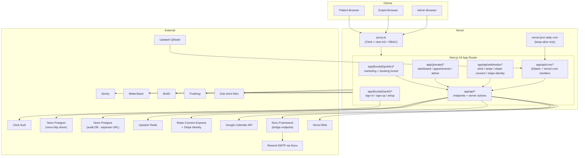

# 02 — Architecture As Built (current MVP)

> Snapshot of how the production single-app deployment is wired today. This chapter is descriptive (no v2 prescriptions yet) so the rebuild team can map old → new without re-reading code.

## What we built

A **single Next.js 16 App Router app**, deployed on Vercel, talking to a small set of external services. There is no monorepo, no `src/` directory on `main`, and no service split — the API routes, Server Actions, public pages, private dashboards, webhooks, and cron handlers all live inside one Next.js project.

## Why

The MVP optimized for **shipping fast on a single Vercel app**:

- One Next.js project = one deploy target, one env, one CI pipeline.
- Clerk for "auth done" without writing it.
- Drizzle on Neon for "Postgres without ops".
- Upstash QStash to avoid running a worker.
- Novu to avoid writing a notification engine.
- Vercel Blob to avoid configuring S3.

This let one developer ship the booking funnel + payments + emails + admin in weeks, not months. The compounding cost of those choices shows up in [13-lessons-learned.md](13-lessons-learned.md).

## Layered model

The codebase informally follows a four-layer pattern, even though it is not enforced by package boundaries.

### Layer 1 — Client UI

`app/**/*.tsx` files marked `"use client"`. Mostly under [components/](../../components/). Two organizational tiers:

- [components/ui/](../../components/ui/) — shadcn primitives (Button, Card, Dialog, Form, etc.).
- [components/features/](../../components/features/) — domain components grouped by feature (`admin/`, `appointments/`, `booking/`, `forms/`, `earnings/`, `expert-setup/`, `profile/`).

The canonical booking form is [components/features/forms/MeetingForm.tsx](../../components/features/forms/MeetingForm.tsx). A historical stale duplicate under `src/components/features/forms/MeetingForm.tsx` exists in some checkouts and **must not be edited** — `AGENTS.md` records this trap explicitly.

### Layer 2 — App Router (server & client)

[app/](../../app/) is split into three top-level segments:

| Segment                              | Purpose                                                        |
| ------------------------------------ | -------------------------------------------------------------- |
| `app/(private)/*`                    | Authenticated dashboard, appointments, account, admin.         |
| `app/[locale]/(public)/*`            | Public localized marketing, expert profiles, booking funnel.   |
| `app/[locale]/(auth)/*`              | Sign-in, sign-up, onboarding.                                  |
| `app/api/*`                          | HTTP handlers and webhook endpoints.                           |

See [04-routing-and-app-structure.md](04-routing-and-app-structure.md) for the full route map.

### Layer 3 — Server logic

Three sub-layers, no enforced separation:

- **Server Actions** under [server/actions/](../../server/actions/) — invoked from forms via `"use server"`.
- **API routes** under [app/api/](../../app/api/) — including webhook handlers and cron endpoints.
- **Domain services** under [server/](../../server/) — Google Calendar client ([server/googleCalendar.ts](../../server/googleCalendar.ts)), token utilities ([server/utils/tokenUtils.ts](../../server/utils/tokenUtils.ts)).

### Layer 4 — Integrations & data

- **Database**: Drizzle ORM on Neon Postgres via [drizzle/db.ts](../../drizzle/db.ts) (using the `neon-http` driver — see [13-lessons-learned.md](13-lessons-learned.md) for why this is a problem).
- **Cache / locks / monitoring**: Upstash Redis via [lib/redis/manager.ts](../../lib/redis/manager.ts) (CustomerCache, FormCache, RateLimitCache, webhook event monitor).
- **Notifications**: Novu Framework — bridge at [app/api/novu/route.ts](../../app/api/novu/route.ts), workflow definitions in [config/novu-workflows.ts](../../config/novu-workflows.ts), runtime in [lib/integrations/novu/](../../lib/integrations/novu/).
- **Email rendering**: React Email templates under [emails/](../../emails/) with shared helpers in [emails/utils/](../../emails/utils/).
- **Payments**: Stripe SDK directly + Connect helpers, fees in [config/stripe.ts](../../config/stripe.ts).
- **Calendar**: Google Calendar / Meet via [server/googleCalendar.ts](../../server/googleCalendar.ts).
- **Files**: Vercel Blob via [app/api/upload/route.ts](../../app/api/upload/route.ts).
- **Cron orchestration**: Upstash QStash schedules in [config/qstash.ts](../../config/qstash.ts), QStash ingress at [app/api/qstash/route.ts](../../app/api/qstash/route.ts), handlers under [app/api/cron/](../../app/api/cron/).
- **Vercel cron**: a single daily heartbeat in [vercel.json](../../vercel.json) hitting `/api/cron/keep-alive`.
- **Observability**: Sentry (`sentry.{client,server,edge}.config.ts`), BetterStack heartbeats, BotID security.
- **Analytics** (slated for v2 removal): PostHog (`app/PostHogPageView.tsx`, [components/analytics/](../../components/analytics/)), Dub short links ([lib/integrations/dub/](../../lib/integrations/dub/)).

## The proxy / middleware

Next.js 16 renames `middleware.ts` to `proxy.ts` (one of the bigger surface changes from 14 → 16). Eleva's [proxy.ts](../../proxy.ts) is **740+ lines** and combines:

1. **Clerk authentication** via `clerkMiddleware()`.
2. **next-intl routing** for the public marketing routes.
3. **Custom locale detection** (Portuguese visitors from Portugal get `pt`, not `pt-BR`) — bypassing next-intl's automatic detection.
4. **`ELEVA_LOCALE` cookie** for persistent locale preference (1-year max-age).
5. **Public route allowlist** in `PUBLIC_ROUTES`.
6. **Webhook bypass list** in `SPECIAL_AUTH_ROUTES` (Stripe, Clerk, Novu webhooks signed by their providers, not Clerk).
7. **Cron auth** via `CRON_SECRET` for QStash and Vercel cron endpoints.
8. **Role-based gates** via `ADMIN_ROUTES` + `EXPERT_ROUTES` checked against Clerk `public_metadata.role`.
9. **Expert setup redirect** — incomplete `expert_setup` flag forces `/setup`.
10. **Static-file bypass** for assets.

This file has become a known pain point — one file owning ten concerns — and v2 splits it into composable handlers (see [05-identity-auth-rbac.md](05-identity-auth-rbac.md)).

## Hosting & runtime

| Surface              | Detail                                                                                              |
| -------------------- | --------------------------------------------------------------------------------------------------- |
| **Hosting**          | Vercel (single project).                                                                            |
| **Runtime**          | Node.js (Vercel managed), Next.js 16 with React 19 and React Compiler enabled in [next.config.ts](../../next.config.ts). |
| **Edge surfaces**    | `proxy.ts` runs on Vercel Edge by default (Clerk middleware is edge-compatible).                    |
| **Bundler**          | Turbopack via Next.js 16. `next.config.ts` notes that MDX plugins must be strings (not imported functions) for Turbopack. |
| **Package manager**  | `pnpm` only (per `AGENTS.md`). Never npm or yarn.                                                   |
| **Domain**           | `eleva.care` (production).                                                                          |
| **CDN/Image**        | Next.js `Image` with `remotePatterns` for Stripe avatars, Google profile pics, Vercel Blob CDN.     |
| **Cache strategy**   | Cache Components disabled in `next.config.ts` because next-intl does not yet support `cacheComponents`. Per-page `revalidate` instead. |
| **Cron**             | One Vercel cron (daily `/api/cron/keep-alive`). All other cron via Upstash QStash hitting `/api/qstash`. |

## Environment taxonomy

From [.env.example](../../.env.example) (sanitized). Variables grouped by integration:

| Group              | Variables                                                                                                        |
| ------------------ | ---------------------------------------------------------------------------------------------------------------- |
| **Database**       | `DATABASE_URL`, `DATABASE_URL_UNPOOLED`, `AUDITLOG_DATABASE_URL`                                                 |
| **Encryption**     | `ENCRYPTION_KEY` (single AES-256-GCM key for records and Google tokens — see [17-encryption-and-vault.md](17-encryption-and-vault.md)) |
| **Clerk**          | `CLERK_SECRET_KEY`, `NEXT_PUBLIC_CLERK_PUBLISHABLE_KEY`, `NEXT_PUBLIC_CLERK_SIGN_IN_URL`, `..._SIGN_UP_URL`, `..._AFTER_SIGN_IN_URL`, `..._UNAUTHORIZED_URL`, `..._SIGN_IN_FALLBACK_REDIRECT_URL`, `..._SIGN_UP_FALLBACK_REDIRECT_URL` |
| **Google OAuth**   | `GOOGLE_OAUTH_CLIENT_ID`, `GOOGLE_OAUTH_CLIENT_SECRET`, `GOOGLE_OAUTH_REDIRECT_URL`                              |
| **Vercel**         | `BLOB_READ_WRITE_TOKEN`, `CRON_SECRET`                                                                           |
| **Stripe**         | `STRIPE_SECRET_KEY`, `NEXT_PUBLIC_STRIPE_PUBLISHABLE_KEY`, `STRIPE_WEBHOOK_SECRET` (plus separate Connect/Identity webhook secrets) |
| **App**            | `NEXT_PUBLIC_APP_URL`                                                                                            |
| **Novu**           | `NOVU_API_KEY`, `NEXT_PUBLIC_NOVU_APPLICATION_IDENTIFIER`, `NOVU_SECRET_KEY`, `NOVU_BRIDGE_URL`, `NOVU_BASE_URL` |
| **Upstash Redis**  | `UPSTASH_REDIS_REST_URL`, `UPSTASH_REDIS_REST_TOKEN`                                                             |
| **Upstash QStash** | `QSTASH_TOKEN`, `QSTASH_CURRENT_SIGNING_KEY`, `QSTASH_NEXT_SIGNING_KEY`, `QSTASH_URL`                            |
| **Sentry**         | `SENTRY_AUTH_TOKEN`, `NEXT_PUBLIC_SENTRY_DSN`                                                                    |
| **BetterStack**    | `BETTERSTACK_HEARTBEAT_*` (one per cron)                                                                         |
| **BotID**          | `BOTID_*`                                                                                                        |
| **PostHog** (drop) | `NEXT_PUBLIC_POSTHOG_KEY`, `NEXT_PUBLIC_POSTHOG_HOST`                                                            |
| **Dub** (drop)     | `DUB_API_KEY`, `DUB_WORKSPACE_ID`                                                                                |

## What worked

- **Single-deploy simplicity** — one PR, one preview, one prod URL. For a small team this beat any architectural elegance.
- **Clerk authentication** — sign-in, sign-up, OAuth, sessions, MFA without writing a line.
- **Drizzle ORM** — type-safe, code-first migrations, fast iteration.
- **React Email + Novu Framework** — emails authored once, rendered consistently across triggers.
- **Stripe Connect Express** — onboarding UX is excellent; payouts mostly "just work".
- **Vercel Blob** — file uploads without S3 configuration.
- **next-intl** — server-rendered translations work cleanly with App Router.

## What didn't (preview — full catalog in [13-lessons-learned.md](13-lessons-learned.md))

- **`neon-http` driver** chosen for "edge-compatibility" but silently lacks transaction support. Anywhere code does multi-statement work, partial-write bugs are possible.
- **`proxy.ts` is a god-file** — 740+ lines mixing Clerk, i18n, RBAC, public allowlist, expert-setup redirect, cron auth, locale detection.
- **Three Stripe webhook routes** with overlapping handler logic.
- **Cron handlers have no test coverage** and silent QStash failures (showing 0 firing) have happened in production.
- **PaymentIntent enrichment ran after an early return** — disputes and refunds dropped Novu notifications.
- **README documentation drift** — claimed Next.js 14 while the repo is Next.js 16 + React 19.
- **`_docs/` was empty stubs** while `docs/` had real content; the new blueprint folder consolidates this.

## Concrete checklist for the new repo (preview)

- [ ] No `proxy.ts` god-file. Compose handlers in `src/proxy.ts` (the v2 lives under `src/`).
- [ ] Single Stripe webhook endpoint `/api/stripe/webhook` fans events into typed Vercel Workflows.
- [ ] Drop `neon-http` for `@neondatabase/serverless` pooled (see [10-infrastructure-and-observability.md](10-infrastructure-and-observability.md)).
- [ ] Replace QStash schedules with Vercel Workflows SDK (see [09-workflows-and-async-jobs.md](09-workflows-and-async-jobs.md)).
- [ ] Replace Novu with Resend transactional + Resend Automation + Resend Audiences (see [08-notifications-email-resend-crm.md](08-notifications-email-resend-crm.md)).
- [ ] Drop PostHog and Dub from `package.json` and env.
- [ ] All cron handlers have at least one Vitest test (see [09-workflows-and-async-jobs.md](09-workflows-and-async-jobs.md)).
