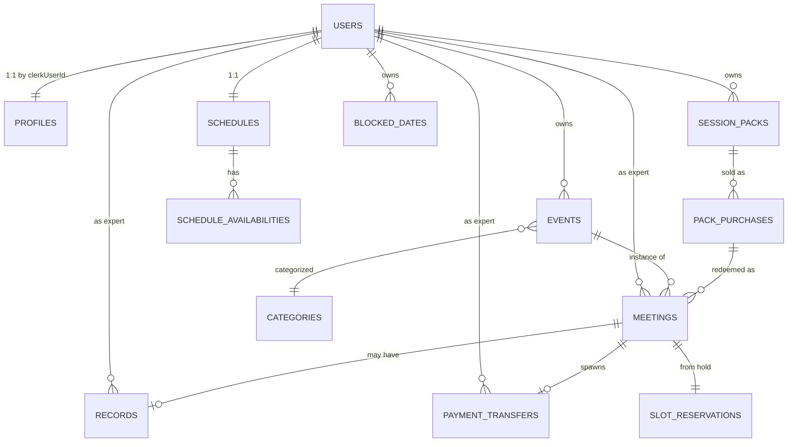

# 03 — Data Model

> Full Drizzle schema as it exists today, plus the v2 multi-tenant shift to **org-per-user** with row-level security (RLS).

## What we built

Two Postgres databases on Neon:

1. **Application database** (`DATABASE_URL`) — schema in [drizzle/schema.ts](../../drizzle/schema.ts).
2. **Audit log database** (`AUDITLOG_DATABASE_URL`) — schema in [drizzle/auditSchema.ts](../../drizzle/auditSchema.ts).

Connected via [drizzle/db.ts](../../drizzle/db.ts) using the **`neon-http` driver**, which supports single statements but **does not support transactions** — a critical limitation discussed below and in [13-lessons-learned.md](13-lessons-learned.md).

## Tables (current)

| Table                       | Purpose                                                                                                | Tenancy column           |
| --------------------------- | ------------------------------------------------------------------------------------------------------ | ------------------------ |
| `events`                    | Bookable services owned by an expert.                                                                  | `clerkUserId` (text)     |
| `schedules`                 | Per-expert timezone (one per user).                                                                    | `clerkUserId` (text)     |
| `scheduleAvailabilities`    | Recurring weekly availability slots tied to a schedule.                                                | via `schedules`          |
| `meetings`                  | Confirmed bookings: who, when, payment state, calendar link.                                           | `clerkUserId` (text)     |
| `categories`                | Six women's-health verticals.                                                                          | none (global)            |
| `profiles`                  | Public expert profile (bio, photo, social, languages).                                                 | `clerkUserId` (text)     |
| `users`                     | Local mirror of Clerk users + role + setup flags + Stripe Connect IDs + Identity status.               | `clerkUserId` (text, PK) |
| `records`                   | Encrypted per-meeting clinical notes (AES-256-GCM today).                                              | `expertClerkUserId`      |
| `payment_transfers`         | Payout queue rows pending admin approval before Stripe transfer.                                       | `expertClerkUserId`      |
| `blocked_dates`             | One-off vacation/holiday overrides on availability.                                                    | `clerkUserId`            |
| `slot_reservations`         | Short-lived holds during checkout; complement to Redis `SET NX` lock.                                  | `clerkUserId`            |
| `session_packs`             | Bundle definitions (e.g., "4-session Postpartum Pack").                                                | `clerkUserId`            |
| `pack_purchases`            | Purchased pack instances + remaining session count.                                                    | `clerkUserId` + guest    |
| `stripe_processed_events`   | Webhook idempotency log (event ID → processed flag).                                                   | none                     |

In a separate database:

| Table        | Purpose                                                                |
| ------------ | ---------------------------------------------------------------------- |
| `audit_logs` | Immutable system-action log: who, what, old/new JSON, IP, user agent.  |

## Why `users` mirrors Clerk

Clerk owns identity but the local DB needs to:
- Foreign-key payouts and earnings against a stable user.
- Cache role + setup flags for cheap server-side checks.
- Store Stripe Connect account IDs, Stripe Identity verification IDs, and onboarding step state.
- Drive admin search and filtering without round-tripping Clerk's API.

Mirror is updated by Clerk webhooks (user.created / updated / deleted) at [app/api/webhooks/clerk/](../../app/api/webhooks/clerk/).

## Relationships (textual ER)



## Money fields

All amounts are stored as `integer` cents (Stripe convention) with a sibling `currency text not null default 'eur'`. Examples:

- `events.price` — in cents
- `meetings.amount`, `meetings.applicationFee`, `meetings.stripeFee`, `meetings.netAmount`
- `payment_transfers.amount`, `applicationFee`, `transferAmount`

Never use `numeric`/`decimal` for money. Cents-as-int matches Stripe and avoids float arithmetic.

## Encryption fields

`records.content` is **AES-256-GCM ciphertext** with a sibling `iv` (initialization vector) field. The encryption key is `ENCRYPTION_KEY` — a single env-var secret.

Google OAuth tokens stored on `users.googleAccessToken` / `googleRefreshToken` are **also** AES-256-GCM encrypted with the same key.

This is one rotating key, one secret, and **leaks of the key compromise every record and every Google token across all users**. v2 fixes this with WorkOS Vault and per-org keys (see [17-encryption-and-vault.md](17-encryption-and-vault.md)).

## Idempotency

`stripe_processed_events` is the canonical idempotency table. Every Stripe webhook handler must:

1. Open transaction (or single-statement insert).
2. `INSERT ... ON CONFLICT DO NOTHING` on the event ID.
3. If conflict → return 200 silently (already processed).
4. Otherwise → process the event, then mark complete.

The MVP does this inconsistently across [app/api/webhooks/stripe/handlers/](../../app/api/webhooks/stripe/handlers/). v2 enforces it via a single typed wrapper (see [06-payments-stripe-connect.md](06-payments-stripe-connect.md)).

## What worked

- **Drizzle ORM** for schema-as-code, generated migrations, type inference, and `relations()` for query-builder joins.
- **Cents-as-int** money columns prevent floating-point drift.
- **Separate audit DB** keeps the hot OLTP DB lean and lets ops set different retention.
- **`stripe_processed_events`** as a clean idempotency choke point — when used.

## What didn't

| Issue                                | Detail                                                                                                                                     |
| ------------------------------------ | ------------------------------------------------------------------------------------------------------------------------------------------ |
| **`neon-http` has no transactions**  | Multi-statement workflows (e.g., create meeting + insert record + insert payment_transfer) cannot be atomic. Partial-write bugs are possible. |
| **Tenancy via `clerkUserId` text**   | Coupling to Clerk leaks a vendor identifier into every table. Migrating off Clerk requires rewriting every join.                            |
| **No row-level security**            | Authorization happens entirely in app code. A bug in a server action can leak another user's data.                                          |
| **`profiles` flattens too much**     | Mixes social-media JSON, languages array, public flags, SEO slug — should split into normalized tables.                                     |
| **Single-key encryption**            | One env-var key for all PHI and all Google tokens. Rotation is dangerous; a leak is catastrophic.                                           |
| **No `subscriptions` table**         | Expert subscription product (validated on the `clerk-workos` branch) has no MVP home — needs a fresh table mapping Stripe subs to local rows. |
| **No `vault_keys` table**            | Single shared encryption key precludes per-org rotation.                                                                                    |
| **Inconsistent `created_at` casing** | Some tables use `createdAt`, others `created_at`. Prefer snake_case in DB columns and camelCase in TS via Drizzle's column aliases.         |

## v2 prescription

### 1. Switch driver

Drop `neon-http`. Use **`@neondatabase/serverless`** with the pooled connection string. Adopt-as-is from `clerk-workos` branch (see [15-clerk-workos-branch-learnings.md](15-clerk-workos-branch-learnings.md)). Transactions work; performance is identical for OLTP workloads.

### 2. Move tenancy to `org_id`

Replace every `clerkUserId text` with `org_id uuid` referencing a new `organizations` table mirrored from WorkOS. Solo experts and patients each own one org. Clinic orgs own many memberships.

```text
organizations
├── id uuid pk
├── workos_org_id text unique not null
├── slug text unique not null
├── org_type text check (org_type in ('expert','patient','clinic'))
├── name text not null
├── created_at, updated_at
└── metadata jsonb
```

### 3. New tables

- **`memberships`** — many-to-many users ↔ orgs with `role`, mirrored from WorkOS.
- **`subscriptions`** — local projection of Stripe subscriptions for fast reads (tier, status, current_period_end, lookup_key).
- **`stripe_lookup_keys`** — registry of supported lookup keys with copy/translation hooks (no hardcoded `price_xxx` IDs anywhere; see [16-subscriptions-and-three-party-revenue.md](16-subscriptions-and-three-party-revenue.md)).
- **`vault_keys`** — references to WorkOS Vault key IDs per org for envelope encryption (see [17-encryption-and-vault.md](17-encryption-and-vault.md)).

### 4. Neon RLS policies

Enable Postgres RLS on every tenant-scoped table. Pattern:

```sql
ALTER TABLE meetings ENABLE ROW LEVEL SECURITY;

CREATE POLICY meetings_org_isolation ON meetings
USING (org_id = current_setting('app.current_org_id', true)::uuid);

CREATE POLICY meetings_admin_bypass ON meetings
USING (current_setting('app.role', true) = 'admin');
```

The app sets `app.current_org_id` and `app.role` at the start of each Drizzle transaction via `SET LOCAL`. The `packages/db` helper exposes a typed `withOrgContext(orgId, role, fn)` wrapper.

### 5. Encryption shift

Move `records.content` and `users.google*Token` to **WorkOS Vault**. Store only the Vault item reference in the DB (`records.vault_item_id`). Decrypt on-demand inside `packages/encryption`. See [17-encryption-and-vault.md](17-encryption-and-vault.md).

### 6. Audit log

Keep the separate `auditLogs` DB. Replace `clerkUserId` with `actor_user_id` (WorkOS user ID) and add `actor_org_id`, `target_org_id`. Add a `correlation_id` for tracing across services and workflows.

### 7. Soft delete + GDPR

Add `deleted_at timestamp` to user-data tables to support soft delete. GDPR right-to-erasure becomes "delete the org" — RLS makes the rest invisible, then a scheduled hard-delete job runs after a 30-day grace.

### 8. Money / currency

Keep cents-as-int. Add an explicit `currency` column to every money table (some currently default `eur` only). Add `app_fee_amount`, `app_fee_bps` columns to `meetings` so the platform fee is recorded literally on the row, not derived from a config constant that may have changed.

## Concrete checklist for the new repo

- [ ] `packages/db` exports a `db` client built on `@neondatabase/serverless` (pooled).
- [ ] `withOrgContext(orgId, role, fn)` helper exists and is the only way to read/write tenant data.
- [ ] Every tenant table has `org_id uuid not null` + RLS enabled.
- [ ] `organizations`, `memberships`, `subscriptions`, `stripe_lookup_keys`, `vault_keys` tables exist.
- [ ] `users.google_access_token` / `_refresh_token` columns dropped; replaced by `vault_item_id` references.
- [ ] `records.content` dropped; replaced by `vault_item_id`.
- [ ] `stripe_processed_events` is the only path through which Stripe webhooks hit the DB (enforced by a wrapper).
- [ ] Audit DB schema renames `clerkUserId` → `actor_user_id`; adds `correlation_id`, `actor_org_id`, `target_org_id`.
- [ ] All money columns store cents-as-int with explicit `currency`.
- [ ] `deleted_at` soft-delete column on every user-data table.
- [ ] First migration includes seed for the six women's-health categories (idempotent on slug).
