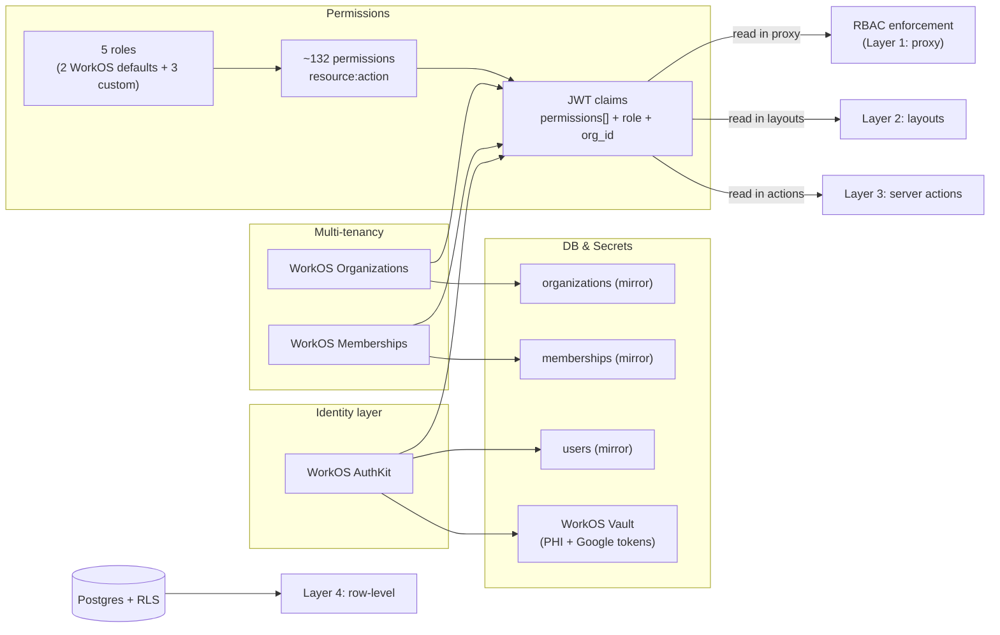

# 05 — Identity, Auth, RBAC

> Replacing Clerk with WorkOS AuthKit + Organizations + JWT-claim RBAC + Vault-stored Google OAuth tokens. Most of the heavy lifting is already validated on the `clerk-workos` branch — this chapter codifies what to lift and what to refine.

## What we built (Clerk era)

- **Identity provider**: Clerk for sign-up, sign-in, email/password, Google OAuth, MFA, sessions.
- **User mirror**: Clerk webhooks update [drizzle/schema.ts](../../drizzle/schema.ts) `users` table on `user.created`, `user.updated`, `user.deleted`.
- **Tenancy column**: every tenant table has `clerkUserId text not null` — the Clerk user ID is the foreign-key surface for all data.
- **Roles**: stored on Clerk `public_metadata.role` as a single string. Effective values used in code: `superadmin`, `admin`, `top_expert`, `community_expert`, `lecturer`, `user`. (v2 collapses these — see below.)
- **Server-side role checks**: [lib/auth/roles.server.ts](../../lib/auth/roles.server.ts) `checkRoles()` reads from Clerk session.
- **Proxy gate**: [proxy.ts](../../proxy.ts) consults `ADMIN_ROUTES`, `EXPERT_ROUTES`, `PUBLIC_ROUTES` from [lib/constants/roles.ts](../../lib/constants/roles.ts).
- **Setup state**: a `expert_setup` flag in Clerk metadata gates expert dashboards until five sub-steps complete (profile, Connect, Identity, Calendar, first event).
- **OAuth secondary credentials**: Google access + refresh tokens encrypted with `ENCRYPTION_KEY` (AES-256-GCM) and stored on `users.googleAccessToken`/`googleRefreshToken`.

## Why Clerk

- Drop-in auth shipped in days.
- Hosted UI eliminated sign-up form bugs.
- Webhook → DB mirror was straightforward.

## What worked

- **Drop-in UX** — `<SignIn />`, `<SignUp />`, `<UserButton />` got us to first booking fast.
- **Hosted MFA** — TOTP without writing it.
- **Active session helpers** — `auth()` server-side, `<SignedIn />`/`<SignedOut />` components.

## What didn't

| Issue                                  | Detail                                                                                                                                  |
| -------------------------------------- | --------------------------------------------------------------------------------------------------------------------------------------- |
| **Vendor lock via `clerkUserId` text** | Every table is FK'd to a Clerk-issued opaque string. Migrating off Clerk means rewriting every join.                                    |
| **No first-class organizations**       | Clerk has Orgs but we never adopted them; multi-tenancy was DIY via `clerkUserId`. Cannot model clinics or shared workspaces cleanly.    |
| **RBAC is single-string metadata**     | One role per user, mutable strings, no permissions surface, no inheritance, no scoped checks. Every role check is "string equals".       |
| **DB sync is fragile**                 | Clerk webhook misfires (out-of-order events, dropped retries) caused stale local rows. Sync was never built to be eventually-consistent. |
| **Setup state in Clerk metadata**      | `expert_setup` flags are vendor-locked. Hard to migrate. Hard to query. Hard to back-fill.                                               |
| **Google OAuth tokens in app DB**      | Encrypted with one app-wide key. Per-user / per-org rotation impossible. Leak surface = all users' calendars.                            |
| **No four-layer authorization**        | The proxy gates routes; layouts/pages also check; server actions check ad-hoc; DB has zero RLS. Drift between layers caused bugs.        |

## v2 prescription

### High-level shift



### 1. Identity: WorkOS AuthKit

Adopt-as-is from `clerk-workos` branch:

- AuthKit handles email/password, Google SSO, MFA, sessions.
- Session validation in `src/proxy.ts` via the WorkOS Node SDK helper.
- New env: `WORKOS_API_KEY`, `WORKOS_CLIENT_ID`, `WORKOS_COOKIE_PASSWORD`, `WORKOS_REDIRECT_URI`, `WORKOS_WEBHOOK_SECRET`.

Branch reference: `_docs/04-development/PROXY-MIDDLEWARE.md`.

### 2. Multi-tenancy: org-per-user

Adopt-as-is from `clerk-workos` branch (`_docs/04-development/org-per-user-model.md`):

- **Every user** owns a WorkOS Organization on signup.
- `org_type`: `expert` (the expert's solo workspace), `patient` (the patient's solo workspace), `clinic` (Phase 2: multi-expert org).
- Tenancy column is now `org_id uuid` referencing the local mirror of WorkOS orgs.
- Solo experts and patients are the WorkOS-default `admin` of their own org (the org owner).
- Clinics in Phase 2 invite experts as WorkOS-default `member` of the clinic org; the clinic owner is `admin` of the clinic org. Experts then have **two** org memberships (their solo org as `admin` + the clinic as `member`).
- The Eleva-custom application roles (`expert_top`, `expert_community`, `clinic`) live alongside these built-in `admin`/`member` membership roles; they govern feature access, not org-internal seniority.

Why org-per-user beats user-per-user:

- Every row has a stable tenant boundary, even for solo users.
- GDPR right-to-erasure becomes "delete the org, RLS hides everything".
- Vault encryption is org-scoped → solo users still get per-org keys.
- Clinics work without schema changes — just an extra membership.
- Subscriptions are billed at the org, not the user (matches Stripe Customer mental model).

### 3. RBAC: 5 roles × ~132 permissions

Adapted from `clerk-workos` branch (`_docs/_WorkOS RABAC implemenation/`). Two WorkOS defaults + three custom roles; the branch's generated config still references the older six-role set (`superadmin`, `partner_admin`, `user`) and is renamed during v2 generation:

- **5 roles**:
  - `member` *(WorkOS default)* — patient persona.
  - `expert_community` — standard expert.
  - `expert_top` — premium expert.
  - `clinic` — clinic owner (Phase 2).
  - `admin` *(WorkOS default)* — Eleva staff.
- **~132 granular permissions** in `resource:action` format (e.g., `meetings:read`, `payouts:approve`, `records:write`, `subscriptions:manage`). The branch's generated CSV/MD reports the current canonical count (the original blueprint plan referenced "89"; the catalog has grown).
- **No role inheritance at the WorkOS level**: the matrix is explicit per role. The DSL that generates `infra/workos/rbac-config.json` supports an `extends` shortcut for source readability, flattened at build time. Lecturer is **not** a separate role — it's an add-on subscription that injects extra permissions into the holder's JWT.
- **No `superadmin`**: the destructive permissions previously gated by it (`users:impersonate`, `organizations:delete`, `payments:retry_failed`, `audit:export`, `settings:manage_features`) are granted to a small operator subset of `admin` users via WorkOS group membership.
- Permissions baked into **JWT claims** at session issuance — no DB lookup on every request.

Generated artifacts (lift from branch):
- `packages/rbac/permissions.ts` — full enum.
- `packages/rbac/roles.ts` — role-to-permissions mapping.
- `packages/rbac/check.ts` — `hasPermission(claims, 'meetings:read', { orgId })`.
- `packages/rbac/decorators.ts` — `withPermission()` wrapper for server actions.
- `packages/rbac/types.ts` — typed `Permission` and `Role` unions.

Detail: [18-rbac-and-permissions.md](18-rbac-and-permissions.md).

### 4. Four-layer enforcement

| Layer                      | Where                                | Reads                       |
| -------------------------- | ------------------------------------ | --------------------------- |
| **L1 — Proxy**             | `src/proxy.ts` route gate            | JWT claims, route table     |
| **L2 — Layout**            | Server-component layout `await auth()` | JWT claims                |
| **L3 — Server action / API** | `withPermission()` decorator        | JWT claims, request context |
| **L4 — Database (RLS)**    | Postgres policies                    | `app.current_org_id`, `app.role` set per transaction |

Drift between layers caused most authorization bugs. v2 makes L4 mandatory and L1–L3 cheap (no DB hit) by reading JWT.

### 5. Sync architecture (non-blocking, never blocks auth)

Branch reference: `_docs/02-core-systems/workos-sync-architecture.md`. Adopt-as-is.

**Principles**:

1. **WorkOS is the single source of truth.** Local DB is a denormalized cache.
2. **Sync MUST never block authentication.** If the local mirror is stale or sync fails, the user can still sign in.
3. **Two strategies**:
   - **Immediate sync** on auth callback (best-effort) for critical fields.
   - **Real-time sync** via WorkOS webhook events for everything else.
4. **Both strategies are idempotent** keyed on the WorkOS user/org/membership ID.

Helper functions to lift from branch:

- `syncUserFromWorkos(workosUserId)` — fetch + upsert user in local DB.
- `syncOrgFromWorkos(workosOrgId)` — fetch + upsert org in local DB.
- `syncMembershipFromWorkos(workosMembershipId)` — fetch + upsert membership.
- `ensureUserOrg(workosUserId, orgType)` — idempotent org-per-user create.

Webhook handlers at `/api/workos/webhook` for: `user.created`, `user.updated`, `user.deleted`, `organization.created`, `organization.updated`, `organization.deleted`, `organization_membership.created`, `organization_membership.updated`, `organization_membership.deleted`.

### 6. Server helpers

Replace [lib/auth/](../../lib/auth/) with `packages/auth`:

```ts
// packages/auth/server.ts
import { workos } from './client';

export async function auth() {
  // Returns { user, orgs, currentOrgId, role, permissions[], session } or null
}

export async function requireAuth() {
  // Throws / redirects if no session
}

export async function requirePermission(permission: Permission) {
  // Throws if missing; uses JWT claims, no DB hit
}

export async function withOrgContext<T>(orgId: string, fn: () => Promise<T>): Promise<T> {
  // Sets app.current_org_id and app.role for the duration of fn()
  // Used inside server actions before any DB query
}
```

### 7. Migration mapping (Clerk → WorkOS)

| Clerk concept                      | WorkOS equivalent                                                                                |
| ---------------------------------- | ------------------------------------------------------------------------------------------------ |
| `clerkUserId` (text PK)            | `workos_user_id` (text unique) → local `users.id` (uuid)                                         |
| `public_metadata.role` (string)    | WorkOS role on the membership + JWT claim `role`                                                 |
| `public_metadata.expert_setup`     | `organizations.metadata.expert_setup` jsonb on the expert's org                                  |
| Clerk webhook `user.created`       | WorkOS webhook `user.created` + `ensureUserOrg()` callback                                       |
| `clerkMiddleware()`                | `workosAuth()` proxy handler (composable, JWT-only check, no SDK call per request)              |
| `<SignIn />` UI                    | WorkOS-hosted AuthKit redirect                                                                   |
| `auth().userId`                    | `(await auth()).user.id`                                                                         |
| `auth().has({ permission })`       | `hasPermission(claims, 'meetings:read')`                                                         |

### 8. Google OAuth tokens

**Critical lesson from branch** (`_docs/_WorkOS Vault implemenation/WORKOS-SSO-VS-CALENDAR-OAUTH.md`):

> WorkOS SSO (signing in with Google) does NOT capture Calendar API scopes / tokens.

Therefore Calendar OAuth must be a **separate flow**: after sign-in, the expert connects Google Calendar via a dedicated OAuth dance that requests `https://www.googleapis.com/auth/calendar` scope and stores the **refresh token in WorkOS Vault** (org-scoped) — not in the app DB.

Flow:

1. Expert hits `/api/auth/google-calendar/connect`.
2. App redirects to Google OAuth with calendar scope.
3. Callback receives refresh token.
4. App calls `vault.createItem({ orgId, label: 'google_calendar_refresh', value: refreshToken })`.
5. App stores the returned `vault_item_id` on the org (or a `google_calendar_connections` table).
6. To make a Calendar API call: read `vault_item_id`, decrypt via Vault, exchange refresh → access token, make request.

See [17-encryption-and-vault.md](17-encryption-and-vault.md) for the full Vault model.

### 9. Calendar selection (Cal.com pattern)

Branch reference: `_docs/_WorkOS Vault implemenation/CAL-COM-CALENDAR-SELECTION.md`. After connecting Google Calendar, the expert chooses **which calendar** to write events to (most have multiple). Store the selected calendar ID on the org metadata; default to "primary".

## Concrete checklist for the new repo

- [ ] `packages/auth` exposes `auth()`, `requireAuth()`, `requirePermission()`, `withOrgContext()`.
- [ ] `packages/rbac` lifted from branch and renamed to the v2 taxonomy (~132 permissions, 5 roles — 2 WorkOS defaults + 3 custom; decorator + check helpers).
- [ ] WorkOS env vars set: `WORKOS_API_KEY`, `WORKOS_CLIENT_ID`, `WORKOS_COOKIE_PASSWORD`, `WORKOS_REDIRECT_URI`, `WORKOS_WEBHOOK_SECRET`.
- [ ] `src/proxy.ts` uses JWT-claim RBAC, **never** queries the DB on a per-request basis.
- [ ] WorkOS webhook handler at `/api/workos/webhook` covers user/org/membership events.
- [ ] `ensureUserOrg(userId, orgType)` runs on every auth callback — idempotent.
- [ ] Sync NEVER blocks auth — failures log to Sentry but the request proceeds.
- [ ] Google Calendar OAuth is a **separate** flow from sign-in OAuth.
- [ ] Calendar refresh tokens stored in **WorkOS Vault**, not app DB.
- [ ] Postgres RLS policies enabled on every tenant table; `withOrgContext` is the only way to read/write tenant data.
- [ ] `users.googleAccessToken` / `googleRefreshToken` columns removed.
- [ ] Setup state moved from auth-provider metadata to `organizations.metadata.expert_setup`.
- [ ] Migration script translates `clerkUserId` → `org_id` for every existing row (needed when production migrates).
