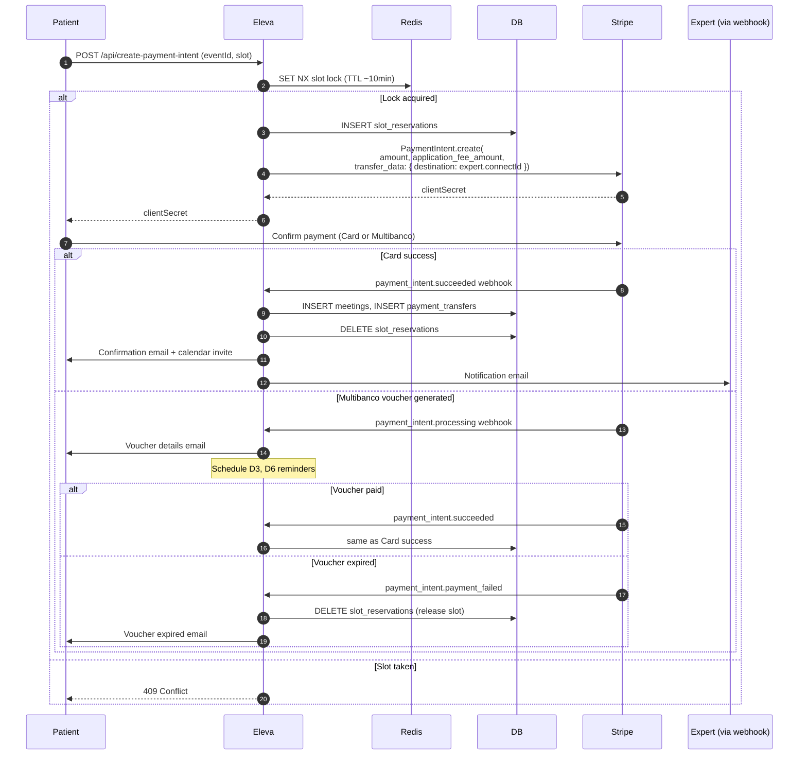
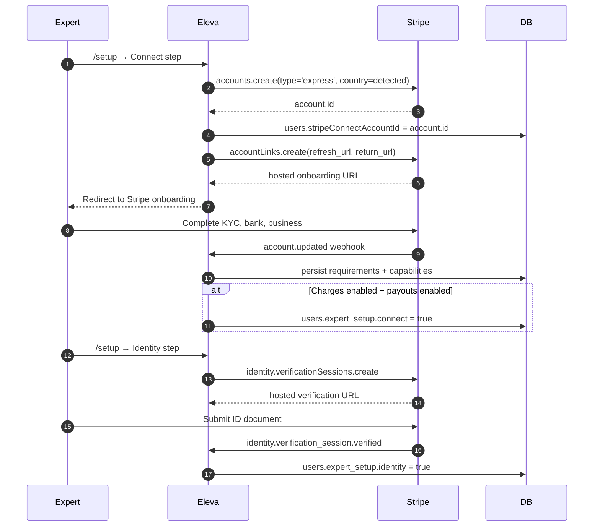

# 06 — Payments: Stripe Connect

> Eleva.care monetizes via Stripe Connect Express. The 15% platform fee is the load-bearing revenue line, with subscriptions adding a tier-conditional override (see [16-subscriptions-and-three-party-revenue.md](16-subscriptions-and-three-party-revenue.md)). This chapter covers the as-built Connect flow, Multibanco, payouts, and the v2 unification.

## What we built

- **Stripe Connect Express** for every expert. Onboarding handled at [app/api/expert/](../../app/api/expert/) endpoints + [app/(private)/setup/](../../app/(private)/setup/).
- **Stripe Identity** for credential verification. Webhook events in [app/api/webhooks/stripe-identity/](../../app/api/webhooks/stripe-identity/).
- **Stripe Tax** turned on for EU compliance. NIF collected for Portugal (no billing address required — gotcha noted in `AGENTS.md`).
- **Two payment methods**: Credit Card and Multibanco (PT voucher; 8-day expiry).
- **Platform fee**: 15%, configurable via `STRIPE_PLATFORM_FEE_PERCENTAGE`. See [config/stripe.ts](../../config/stripe.ts).
- **Three webhook endpoints**: `/api/webhooks/stripe`, `/api/webhooks/stripe-connect`, `/api/webhooks/stripe-identity` — overlapping responsibilities.
- **Handlers**: split across [app/api/webhooks/stripe/handlers/](../../app/api/webhooks/stripe/handlers/) — `account.ts`, `external-account.ts`, `identity.ts`, `payment.ts`, `payout.ts`.
- **Payout queue**: `payment_transfers` table holds rows pending admin approval before Stripe transfer.
- **Idempotency**: `stripe_processed_events` table marks event IDs as handled — but **inconsistently used** across handlers.

## Why Connect

The marketplace economics require:

- One Stripe Customer per patient.
- One Stripe Connect Express account per expert.
- Eleva collects payment, transfers expert share to expert's bank, retains 15%.
- Tax handled per jurisdiction by Stripe Tax (especially Portugal-specific NIF logic).
- Identity verification before payouts unlock.

Stripe Connect Express delivers all of this with a hosted onboarding UX that scales to 30+ countries (see `STRIPE_CONFIG.CONNECT.SUPPORTED_COUNTRIES` in [config/stripe.ts](../../config/stripe.ts)).

## Pricing & fee math

```text
Listing amount (cents, EUR)        = events.price
Application fee (Eleva keeps)      = floor(listing × 0.15)
Expert credit                      = listing - application_fee
Stripe processing fee              = subtracted by Stripe from the application fee
Net to expert at payout            = transfer_amount - currency_fees
```

`config/stripe.ts` documents `FEE_BASIS = 'listing_amount_pre_tax_pre_discount'` — the 15% is calculated on the listing price **before** tax and **before** discount codes. This is critical because `ALLOW_PROMOTION_CODES = true` and naïve fee math would let a 100% promo erase Eleva's revenue.

## Booking checkout flow



## Multibanco specifics

- Voucher TTL: **8 days**.
- Reminders: **D3** and **D6** before expiry.
- The `payment_intent.processing` event fires immediately, before money arrives.
- Two terminal events: `payment_intent.succeeded` (paid) or `payment_intent.payment_failed` (expired).
- Slot reservation must hold for the full voucher TTL — Redis TTL is bumped on voucher creation.
- Multibanco completion rate is a **key business metric**; reminder reliability is the lever.

## Connect onboarding flow



## Payout pipeline

Stripe payouts are NOT direct — Eleva inserts an admin gate.

1. Meeting completes (in the past + Google Calendar `eventId` exists).
2. Daily cron `process-pending-payouts` finds eligible meetings (older than `PAYOUT_DELAY_DAYS` for the country, default 7).
3. Inserts row into `payment_transfers` with status `pending_admin_approval`.
4. Admin reviews queue at `/admin/payment-transfers`, approves or holds.
5. On approval, cron `process-expert-transfers` calls `stripe.transfers.create` with `application_fee_amount = 0` (the fee was already taken at PaymentIntent time via `transfer_data`).
6. Webhook `transfer.created` / `transfer.paid` updates row to `completed`.

The admin approval gate exists for compliance and dispute hold-back. Without it, payouts would auto-flow and refunds/disputes would have to claw back from the expert's bank.

## Refund / dispute flow

- Admin triggers refund via `/admin/payments/[id]`.
- Refund handler in [app/api/webhooks/stripe/handlers/payment.ts](../../app/api/webhooks/stripe/handlers/payment.ts) processes `charge.refunded`.
- If the matching `payment_transfer` is still `pending_admin_approval`, it is cancelled.
- If it has already paid out, Stripe attempts a `transfers.createReversal` against the Connect account (subject to the expert's available balance).
- Patient receives a refund email; expert receives a notification.

**Bug** (documented in `AGENTS.md`): PaymentIntent enrichment ran AFTER an early return that skipped Novu notifications for dispute/refund events. v2 fixes this by always enriching first.

## What worked

- **Stripe Connect Express** — onboarding UX is best-in-class.
- **`application_fee_amount`** at PaymentIntent time — fee is captured atomically, no second transaction needed.
- **`stripe_processed_events`** as idempotency log — when handlers actually use it.
- **Stripe Identity** — KYC without writing it.
- **Per-country payout delays** — handled cleanly by `getMinimumPayoutDelay()`.

## What didn't

| Issue                                                | Detail                                                                                                                                                |
| ---------------------------------------------------- | ----------------------------------------------------------------------------------------------------------------------------------------------------- |
| **Three webhook endpoints**                          | `/stripe`, `/stripe-connect`, `/stripe-identity` overlap. Some events processed twice; some dropped because routing was guessed wrong.                |
| **PaymentIntent enrichment after early return**      | Refund/dispute events bypassed enrichment → Novu subscriber payload missing → no notification fired. Documented in `AGENTS.md`.                       |
| **Idempotency inconsistent**                         | Some handlers insert into `stripe_processed_events`, some don't. A retried webhook can double-process.                                                |
| **Promo codes break fee math when uncareful**        | Listing price is the basis, but ad-hoc handlers sometimes used the discounted amount. Result: Eleva's fee silently lower than 15%.                    |
| **`neon-http` no transactions**                      | Webhook handlers can't atomically `INSERT meetings + INSERT payment_transfers + DELETE slot_reservations + INSERT stripe_processed_events`. Retries cause partial state. |
| **No subscription tier in fee math**                 | The 15% is hardcoded — but v2 introduces tiered subscriptions where Top experts pay 18% / 8% and Community pay 20% / 12%. MVP cannot model this.      |
| **No clinic three-party split**                      | Single `transfer_data.destination` only supports two-party. Phase 2 needs a clinic cut alongside platform fee + expert.                                |
| **NIF + billing address bug history**                | Stripe Tax used to require billing address, blocking Portuguese checkouts. Fixed by configuring Stripe Tax to honor NIF without address. Documented in `AGENTS.md`. |
| **Multibanco reminder reliability**                  | When QStash schedules go quiet (0 firing), D3/D6 reminders silently stop. Multibanco completion rate drops with no alert.                            |

## v2 prescription

### 1. Single Stripe webhook endpoint

```text
POST /api/stripe/webhook
```

The single endpoint:

1. Verifies signature against `STRIPE_WEBHOOK_SECRET`.
2. Inserts into `stripe_processed_events` with `INSERT ... ON CONFLICT DO NOTHING`.
3. If conflict, returns 200 immediately (already processed).
4. Otherwise, enriches the event (PaymentIntent retrieve with expansions) **BEFORE** any branching.
5. Dispatches to a typed handler in `packages/payments` based on `event.type`.

```ts
// packages/payments/webhook.ts (sketch)
export async function handleStripeEvent(rawBody: string, signature: string) {
  const event = stripe.webhooks.constructEvent(rawBody, signature, env.STRIPE_WEBHOOK_SECRET);

  const inserted = await db.stripeProcessedEvents.insertIfAbsent({ id: event.id, type: event.type });
  if (!inserted) return; // duplicate, already handled

  const enriched = await enrichEvent(event); // ALWAYS runs before any branch
  await dispatch(enriched);
}
```

### 2. Subscription-aware fee calculation

```ts
// packages/payments/fees.ts
export function calculateApplicationFee(args: {
  listingAmount: number;          // pre-tax, pre-discount
  expertOrgId: string;
  subscriptionTier: 'community' | 'top' | null;
  subscriptionPeriod: 'monthly' | 'annual' | null;
  clinicCut?: { orgId: string; bps: number };  // Phase 2
}): {
  applicationFeeBps: number;
  applicationFeeAmount: number;
  clinicTransferAmount: number;
  expertNetAmount: number;
} { /* ... */ }
```

Tier table (lookup keys, not hardcoded prices):

| Tier            | Period   | Application fee bps | Lookup key                     |
| --------------- | -------- | ------------------- | ------------------------------ |
| (none)          | n/a      | 1500 (15%)          | n/a                            |
| `community`     | monthly  | 2000 (20%)          | `expert_community_monthly`     |
| `community`     | annual   | 1200 (12%)          | `expert_community_annual`      |
| `top`           | monthly  | 1800 (18%)          | `expert_top_monthly`           |
| `top`           | annual   | 800 (8%)            | `expert_top_annual`            |

Fee bps and the chosen lookup key are **persisted on the meeting row** so historical reporting is faithful even after rate changes.

### 3. Three-party split (Phase 2)

When the expert is a member of a clinic org, the booking transfers fan out:

1. Eleva keeps `application_fee_amount` (15% by default, lookup-key adjusted).
2. Clinic gets a `clinic_share` = floor(remainder × clinic_bps).
3. Expert gets the rest.

Implementation: at PaymentIntent time, set `transfer_data.destination = expert.connectId` (the expert remains the merchant of record). After payout-eligibility, two separate transfers go from expert's Connect balance: one to the clinic's Connect account, the rest stays with the expert. Audit log captures the chain. See [16-subscriptions-and-three-party-revenue.md](16-subscriptions-and-three-party-revenue.md).

### 4. Idempotency enforcement

`packages/payments` exposes a single `processStripeEvent(event)` wrapper. Direct DB writes from webhook handlers are forbidden. The wrapper handles `stripe_processed_events` insertion and Sentry-tagged error capture.

### 5. Multibanco reminder workflow

Replace the QStash-cron model with a **Vercel Workflow** triggered on `payment_intent.processing`:

```ts
// packages/workflows/multibancoReminders.ts
export const multibancoReminders = workflow('multibanco-reminders', async ({ step, sleep }) => {
  const intent = await step.run('load-intent', () => getPaymentIntent(input.id));
  await sleep('until-d3', addDays(intent.created, 5));         // 8d - 3d = 5d after creation
  await step.run('send-d3', () => sendMultibancoReminder({ intent, days: 3 }));
  await sleep('until-d6', addDays(intent.created, 8 - 1));     // 7d after creation = 1d before expiry
  await step.run('send-d6', () => sendMultibancoReminder({ intent, days: 1 }));
});
```

Workflow is cancellable on `payment_intent.succeeded` / `payment_intent.payment_failed`. See [09-workflows-and-async-jobs.md](09-workflows-and-async-jobs.md).

### 6. Payout pipeline as a workflow

Replace the cron-driven payout pipeline:

- `payoutEligibility` workflow scheduled on meeting completion. Sleeps until `now + payoutDelay`. Then inserts the `payment_transfers` row.
- `payoutApprovalReminder` workflow nudges admin daily until approved or rejected.
- `payoutTransfer` workflow triggered on admin approval. Calls `stripe.transfers.create` with retries.

### 7. NIF without billing address

Codified in `packages/payments/checkout.ts`:

- Detect `customer_country = 'PT'` (or browser country fallback).
- Pass `billing_address_collection: 'never'` and `tax_id_collection: { enabled: true }`.
- Stripe Tax must be configured in the dashboard to accept NIF without address.
- For non-PT countries, default to `billing_address_collection: 'auto'`.

### 8. Refund and dispute notifications

- Always enrich PaymentIntent before checking event type.
- Resend Automation triggers on Resend webhook for `meeting_refunded` and `meeting_disputed`.
- Audit log captures admin who initiated refund.

### 9. Connect-account update events

Keep handling `account.updated` to track requirements/capabilities. New: emit a Resend Automation event `expert_connect_changed` so the expert gets a clear "you need to provide X" email when Stripe flags new requirements.

## Concrete checklist for the new repo

- [ ] Single endpoint `/api/stripe/webhook` handles all Stripe events.
- [ ] All event handlers go through `processStripeEvent()` in `packages/payments`.
- [ ] PaymentIntent enrichment ALWAYS runs before any branching / early return.
- [ ] `stripe_processed_events` insert happens BEFORE handler logic; duplicates short-circuit cleanly.
- [ ] `application_fee_amount` derived from `calculateApplicationFee()` that respects subscription tier and lookup key.
- [ ] Lookup keys (`expert_community_*`, `expert_top_*`) seeded in Stripe via setup script.
- [ ] No hardcoded `price_xxx` IDs anywhere in code.
- [ ] Multibanco reminders are a Vercel Workflow, not QStash crons.
- [ ] Workflow cancels itself on `payment_intent.succeeded` or `_payment_failed`.
- [ ] Payout pipeline (`payoutEligibility`, `payoutApprovalReminder`, `payoutTransfer`) is a set of Vercel Workflows.
- [ ] Stripe Tax configured to NOT require billing address for PT customers with NIF.
- [ ] Connect onboarding tested end-to-end for all `SUPPORTED_COUNTRIES` (smoke test against Stripe test mode).
- [ ] Three-party clinic split implemented behind a feature flag, ready for Phase 2.
- [ ] Refund / dispute Resend Automation triggered with full enriched payload.
