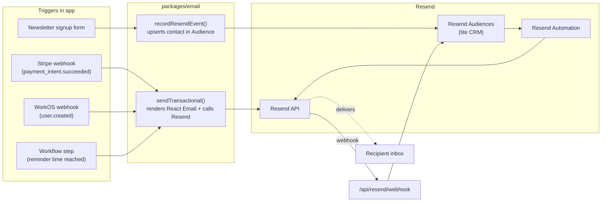

# 08 — Notifications, Email & Resend as Lite CRM

> Replacing Novu Framework with **Resend** as the single email provider, **Resend Automation** for lifecycle/triggered campaigns, and **Resend Audiences** as a lite CRM. PostHog goes away. Novu goes away. The result is fewer moving parts, the same React Email templates, and lifecycle automations the marketing/ops team can edit without engineering.

## What we built (Novu era)

- **Novu Framework** with workflow definitions in [config/novu.ts](../../config/novu.ts) and [config/novu-workflows.ts](../../config/novu-workflows.ts).
- **Bridge endpoint**: [app/api/novu/route.ts](../../app/api/novu/route.ts) — Novu's HTTP-pull model where Novu Cloud calls our endpoint to render workflows.
- **Email provider behind Novu**: Resend (we always paid Resend; Novu was just the orchestrator).
- **React Email templates** under [emails/](../../emails/) grouped by domain (`appointments/`, `experts/`, `notifications/`, `packs/`, `payments/`, `system/`, `users/`).
- **Email helpers**: [lib/integrations/novu/email-service.ts](../../lib/integrations/novu/email-service.ts), [email.ts](../../lib/integrations/novu/email.ts).
- **Subscriber payload built by `buildNovuSubscriberFromStripe`** to bridge Stripe events → Novu subscribers.
- **Active workflow IDs** (per `config/novu-workflows.ts`):
  - `user-lifecycle` (welcome, idempotent via `users.welcomeEmailSentAt`)
  - `security-auth`
  - `payment-universal`
  - `expert-payout-notification`
  - `appointment-universal`
  - `appointment-confirmation`
  - `multibanco-booking-pending`
  - `multibanco-payment-reminder`
  - `pack-purchase-confirmation`
  - `reservation-expired`
  - `expert-management`
  - `marketplace-universal`
  - `system-health`

## Why Novu

- "Don't reinvent triggered notifications" was the pitch.
- Multi-channel (email, in-app, SMS, push) without writing channel adapters.
- Hosted UI for non-engineers to manage templates (we never used this in practice).

## What worked

- React Email templates render consistently.
- Subscriber-payload model meant emails got user context via a single object.
- The bridge endpoint kept email logic in our repo (we own the templates).

## What didn't

| Issue                                        | Detail                                                                                                                                          |
| -------------------------------------------- | ----------------------------------------------------------------------------------------------------------------------------------------------- |
| **Two systems doing one job**                | Novu orchestrates, Resend sends. Two SDKs, two dashboards, two sets of webhooks, two billing lines.                                              |
| **Workflow-ID drift**                        | `WORKFLOW_IDS` had entries pointing to deleted workflows (silent no-ops at runtime). The 2026-04 audit removed several. Bus factor concentrates here.|
| **Deprecated `USER_WELCOME` aliasing `USER_LIFECYCLE`** | Comment-only deprecation; new code keeps using both. Confuses search and refactor.                                                  |
| **No first-class CRM**                       | Newsletter ("Femme Focus"), nurture campaigns, post-session follow-ups had no clean home. Marketing improvised with manual Mailchimp exports.    |
| **In-app channel never shipped**             | We pay for Novu's multi-channel feature but only use email. Pure overhead.                                                                       |
| **Cold-start cost**                          | First trigger after idle takes 1–3s as Novu warms the bridge. Bad for high-priority transactional sends.                                         |
| **Build-time workflow registration friction** | Adding a workflow requires Novu sync; CI gate is non-obvious.                                                                                  |
| **Bridge HTTP-pull model**                   | Novu Cloud has to be able to reach our endpoint. Preview deployments need explicit allowlists. Bumpy DX.                                         |

## v2 prescription

### High-level shift



### 1. Replace Novu with `packages/email` calling Resend directly

```ts
// packages/email/sendTransactional.ts
import { Resend } from 'resend';
import { renderEmail } from './render';

export async function sendTransactional(args: {
  template: TemplateId;
  to: string;
  locale: 'en' | 'pt' | 'br' | 'es';
  data: Record<string, unknown>;
  idempotencyKey?: string;
}) {
  const { html, text, subject } = await renderEmail(args.template, args.locale, args.data);
  return resend.emails.send({
    from: env.RESEND_FROM,
    to: args.to,
    subject,
    html,
    text,
    headers: args.idempotencyKey ? { 'X-Entity-Ref-ID': args.idempotencyKey } : undefined,
    tags: [{ name: 'template', value: args.template }, { name: 'locale', value: args.locale }],
  });
}
```

Idempotency: the caller passes a stable key (e.g., `payment_intent.id + '-confirmation'`). The Resend `X-Entity-Ref-ID` header acts as deduplication when the same transactional fires twice (per Resend docs).

### 2. Templates: keep React Email, drop Novu wrappers

Move [emails/](../../emails/) to `packages/email/templates/`. Adopt-as-is structure: domain folders (`appointments/`, `experts/`, `payments/`, `users/`, `system/`, `packs/`, `marketplace/`).

Preserve locale labels via `packages/email/i18n.ts` (e.g., `locale === 'pt' ? 'Data' : 'Date'`). Conditionally render rows when fields are empty strings — the current `emails/utils/i18n.ts` pattern is correct, just move it.

### 3. Lifecycle / triggered campaigns via Resend Automation

Resend Automation lets non-engineers build sequences (welcome, abandoned-checkout, post-session, win-back) keyed off events sent from the app or off Audience-tag changes.

Pattern:

```ts
// packages/email/recordEvent.ts
import { resend } from './client';

export async function recordResendEvent(args: {
  contactEmail: string;
  audienceId: string;
  event: string;          // e.g., 'booking.confirmed'
  metadata: Record<string, unknown>;
  tags?: string[];        // 'tier:top', 'lifecycleStage:patient', etc.
}) {
  await resend.contacts.createOrUpdate({
    email: args.contactEmail,
    audienceId: args.audienceId,
    unsubscribed: false,
    firstName: args.metadata.firstName as string | undefined,
    lastName: args.metadata.lastName as string | undefined,
    // tags: args.tags,  // when Resend exposes this on contacts API
  });
  // Trigger automation
  // (Resend's automation triggers may use audience tags or webhook-driven events depending on UI configuration)
}
```

### 4. Resend Audiences = lite CRM

Two production audiences:

| Audience            | Purpose                                                                                          |
| ------------------- | ------------------------------------------------------------------------------------------------ |
| `patients`          | Anyone who has booked a session. Tags: `lifecycleStage:patient`, `category:pelvic-health`, etc.  |
| `experts`           | Onboarded experts. Tags: `tier:community|top`, `country:PT`, `setupComplete:true|false`.         |
| `newsletter`        | Femme Focus signups (non-customers). Tags: `lifecycleStage:newsletter`.                          |

Tags drive segmentation for future Audience-based broadcasts (e.g., "Email all Top experts in Portugal about a new feature").

### 5. Workflow → Resend mapping

| Old Novu workflow                  | New v2 trigger                                                | New v2 send                                                                  |
| ---------------------------------- | ------------------------------------------------------------- | ---------------------------------------------------------------------------- |
| `user-lifecycle` (welcome)         | WorkOS webhook `user.created` → idempotent on org metadata    | `sendTransactional('welcome', ...)` + add to `patients` or `experts` audience|
| `security-auth`                    | WorkOS hook on suspicious login                               | `sendTransactional('security-alert', ...)`                                   |
| `payment-universal`                | Stripe `payment_intent.succeeded`                              | `sendTransactional('booking-confirmation', ...)` (patient + expert)          |
| `expert-payout-notification`       | Workflow step inside payout pipeline                          | `sendTransactional('payout-notification', ...)`                              |
| `appointment-universal`            | Workflow step inside booking workflow                         | Branch by event type to the right template                                   |
| `appointment-confirmation`         | Stripe `payment_intent.succeeded`                              | `sendTransactional('appointment-confirmation', ...)`                         |
| `multibanco-booking-pending`       | Stripe `payment_intent.processing` (Multibanco voucher created) | `sendTransactional('multibanco-voucher', ...)`                            |
| `multibanco-payment-reminder`      | Workflow step (D3, D6 — see [09-workflows-and-async-jobs.md](09-workflows-and-async-jobs.md)) | `sendTransactional('multibanco-reminder', { daysLeft })` |
| `pack-purchase-confirmation`       | Stripe `checkout.session.completed` for pack                  | `sendTransactional('pack-purchase', ...)`                                    |
| `reservation-expired`              | Workflow step on reservation TTL                              | `sendTransactional('reservation-expired', ...)`                              |
| `expert-management`                | Admin action (verification, suspension)                       | `sendTransactional('expert-status-change', ...)`                             |
| `marketplace-universal`            | Various marketplace nudges                                    | Branch in caller; one template per nudge                                     |
| `system-health`                    | BetterStack alert webhook (kept)                               | `sendTransactional('system-health-alert', ...)`                              |

### 6. Webhook → app sync

Resend webhooks fire for delivery events: `email.sent`, `email.delivered`, `email.opened`, `email.clicked`, `email.bounced`, `email.complained`, `email.unsubscribed`. Endpoint at `/api/resend/webhook` records them in a small `email_events` table and updates the contact record.

Use `email.bounced` to suppress (set Resend contact `unsubscribed = true` on hard bounce). Use `email.complained` to suppress permanently and audit-log.

### 7. Localization stays in templates, not in workflows

`renderEmail(template, locale, data)` resolves the right component per locale. Keep `emails/utils/i18n.ts` philosophy: per-row translation, conditional rendering of empty fields. Adopt-as-is.

### 8. Idempotency

Every transactional caller passes a stable idempotency key derived from the triggering event ID. The Resend `X-Entity-Ref-ID` header handles dedup. For workflows, idempotency is also enforced at the workflow-step level (Vercel Workflows SDK provides this natively — see [09-workflows-and-async-jobs.md](09-workflows-and-async-jobs.md)).

### 9. Femme Focus newsletter

Public form on the marketing site posts to `/api/newsletter/subscribe`:

1. Create/update contact in the `newsletter` audience with `lifecycleStage:newsletter`.
2. Trigger `welcome-newsletter` Resend Automation.
3. Marketing team manages monthly broadcast directly in Resend.

### 10. Operational dashboard

Resend's dashboard becomes the operational source for delivery analytics, bounce rates, and broadcast performance. No PostHog needed for email metrics.

## Why drop Novu entirely

1. **One system instead of two** — Resend already covered email; Novu was orchestration we don't need now that we have Vercel Workflows for time-based scheduling.
2. **Resend Automation covers lifecycle** — without writing workflow code.
3. **Resend Audiences covers lite CRM** — without bolting on a second tool.
4. **Lower latency** — direct API call instead of bridge HTTP-pull.
5. **Cleaner failure modes** — Resend retries are explicit; no Novu opaqueness.
6. **No multi-channel debt** — email is the only channel we use; in-app notifications can come from a future small in-app library if needed.

## Concrete checklist for the new repo

- [ ] `packages/email` exposes `sendTransactional()`, `recordResendEvent()`, `renderEmail()`.
- [ ] All React Email templates moved to `packages/email/templates/` with the same domain folders.
- [ ] `packages/email/i18n.ts` preserves locale labels and empty-row conditional rendering.
- [ ] No Novu in `package.json` or `.env*`.
- [ ] Three Resend audiences seeded: `patients`, `experts`, `newsletter`.
- [ ] `/api/resend/webhook` records `email_events` and suppresses on bounce/complaint.
- [ ] Every transactional send passes an idempotency key.
- [ ] `welcome-newsletter` Resend Automation set up; `/api/newsletter/subscribe` adds contact and triggers.
- [ ] Multibanco D3/D6 reminders sent via `sendTransactional('multibanco-reminder', { daysLeft })` from inside a Vercel Workflow.
- [ ] Operational dashboard: Resend (delivery + automations); Sentry (template render errors); BetterStack (webhook health).
- [ ] No `WORKFLOW_IDS` enum referencing deleted workflows. Templates referenced by string literal `TemplateId` typed union.
