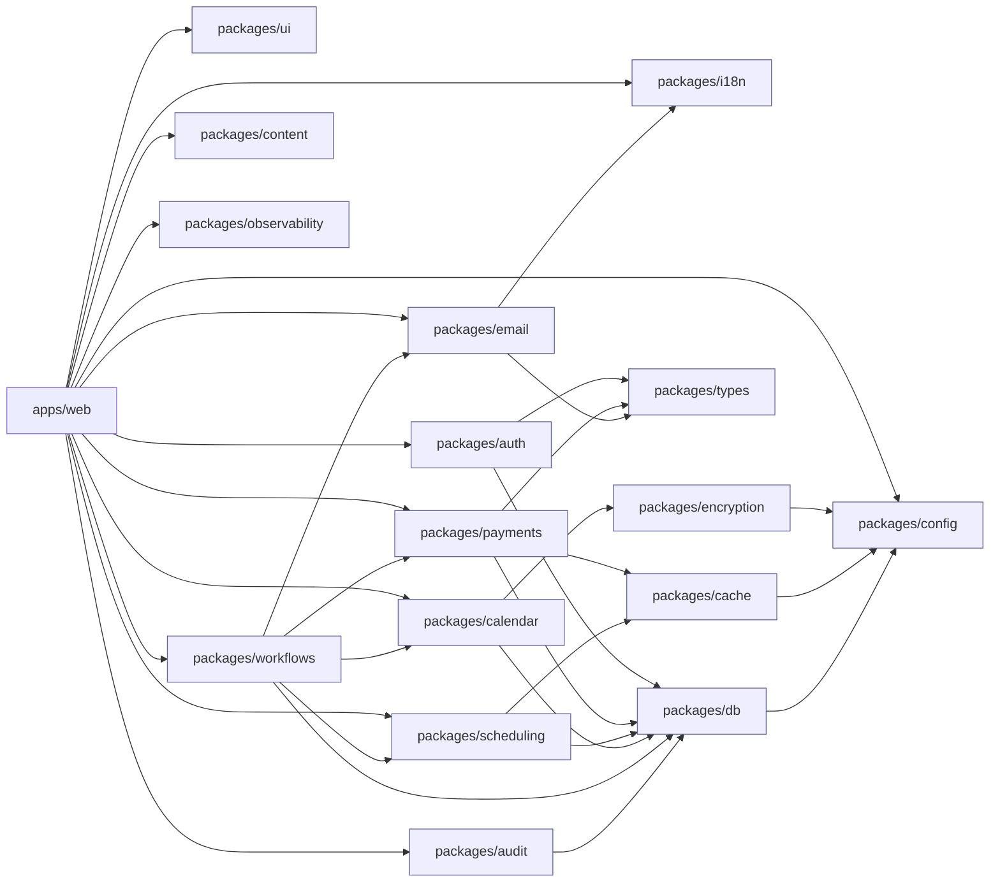

# 14 — v2 Target Monorepo

> The physical shape of the new repo. Turborepo + pnpm workspaces, hybrid Bun (dev) / Node 24 (Vercel) runtime, with package boundaries chosen so vendor swaps in v3 are localized.

## North star

Three properties to maintain at all costs:

1. **One source of truth per concern.** Auth lives in `packages/auth`, payments in `packages/payments`, etc. Apps never import vendor SDKs directly.
2. **Vendor swaps don't bleed.** Replacing WorkOS, Resend, or Stripe means changing one package, not 80 call sites.
3. **CI is the design tool.** Lint rules and import-restriction rules enforce the boundaries automatically.

## Top-level layout

```
eleva-care/
├── apps/
│   ├── web/               # Next.js 16 — main marketplace + private app
│   ├── docs/              # Fumadocs — public documentation site
│   └── studio/            # (optional, Phase 2) Sanity Studio for marketing CMS
│
├── packages/
│   ├── auth/              # WorkOS AuthKit + Organizations + Memberships
│   ├── db/                # Drizzle schema, migrations, db client (pooled)
│   ├── payments/          # Stripe SDK wrapper, lookup keys, fee calc
│   ├── scheduling/        # Slot reservation, availability algorithm
│   ├── calendar/          # Google Calendar adapter + Vault token storage
│   ├── email/             # Resend client + transactional helpers + Audiences/CRM
│   ├── workflows/         # Vercel Workflows SDK definitions + step helpers
│   ├── encryption/        # WorkOS Vault wrapper + envelope encryption
│   ├── i18n/              # next-intl loader, country detection, ELEVA_LOCALE cookie
│   ├── audit/             # withAudit decorator, audit log writer
│   ├── cache/             # Upstash Redis wrapper, withLock, FormCache
│   ├── observability/     # Sentry, BetterStack, BotID, correlation IDs
│   ├── ui/                # Shared shadcn/ui components, themes
│   ├── content/           # Categories, expert taxonomy, MDX helpers
│   ├── config/            # Env loader (Zod), feature flags
│   └── types/             # Shared TS types (API contracts, domain models)
│
├── tooling/
│   ├── eslint-config/     # Base + restricted-imports rules
│   ├── tsconfig/          # tsconfig.base.json + per-target presets
│   └── scripts/           # CI helpers (i18n linter, schema diff, RBAC drift)
│
├── infra/
│   ├── workos/            # Roles/permissions config, vault key bootstrap
│   ├── vercel/            # vercel.ts (cron, env metadata)
│   └── stripe/            # Lookup keys seeder, tax config docs
│
├── _docs/blueprint/       # This document set
├── AGENTS.md
├── package.json           # pnpm workspaces + turbo
├── pnpm-workspace.yaml
├── turbo.json
├── biome.json             # or eslint + prettier; pick one and pin
└── tsconfig.base.json
```

## Why a monorepo (vs. the current single-app)

Current MVP is a single Next.js app with `lib/`, `server/`, `components/`, `config/`, `drizzle/` at the root. That worked at MVP scale but produces:

- Circular imports between `lib/integrations/*` and `server/*`.
- No way to enforce "UI doesn't import Stripe SDK".
- Tests bleed across concerns.
- Adding `apps/docs` (Fumadocs) or a future `apps/admin` requires duplication.

A monorepo with explicit package boundaries solves all four. Turborepo gives us remote caching on Vercel, parallel task execution, and dependency-aware builds.

## Package responsibilities & boundaries

### `packages/auth`

- Wraps `@workos-inc/authkit-nextjs` and `@workos-inc/node`.
- Public API: `withAuth()`, `getCurrentUser()`, `getCurrentOrg()`, `requirePermission()`, `signOut()`.
- Owns the `users` and `organizations` mirror tables (writes via `packages/db`).
- Owns RBAC: roles, permissions, JWT-claim shape (see [18-rbac-and-permissions.md](18-rbac-and-permissions.md)).
- **Forbidden imports**: anything from `apps/*`, anything from another concern (Stripe, Resend, etc.).
- **Allowed imports**: `packages/db`, `packages/types`, `packages/observability`.

### `packages/db`

- Drizzle schema, migrations, pooled `@neondatabase/serverless` client.
- Exposes `db`, schema tables, and helper queries — never raw `sql` to apps.
- Owns RLS migration scripts and `withOrgContext()`.
- **Forbidden**: vendor SDKs, framework imports.

### `packages/payments`

- Wraps `stripe` SDK (pinned API version in code, not env).
- Public API: `createCheckoutSession()`, `processStripeEvent()`, `calculateApplicationFee()`, `createConnectAccount()`, lookup-key registry.
- Owns the unified webhook dispatcher (one route in `apps/web`, all logic here).
- **Forbidden**: UI imports.

### `packages/scheduling`

- Pure functions: `getValidTimesFromSchedule()`, `reserveSlot()`, `releaseSlot()`.
- Uses `packages/cache` for Redis locks, `packages/db` for persistence.
- DST-correct via `date-fns-tz`.

### `packages/calendar`

- Google Calendar adapter; tokens read from `packages/encryption` (Vault).
- Idempotent `createEvent()` (client-supplied ID + 409 fallback).
- Self-healing token refresh; emits domain events on disconnect.

### `packages/email`

- Resend client + Audiences/Contacts (lite CRM) helpers.
- React Email templates colocated under `packages/email/templates/`.
- `sendTransactional()` wrapper with idempotency keys + locale.
- Resend Automation triggers exposed as typed event functions.

### `packages/workflows`

- Vercel Workflows SDK definitions.
- Each workflow file exports a typed input + step graph.
- Step helpers re-used across workflows (e.g., `sendNotificationStep`, `releaseSlotStep`).

### `packages/encryption`

- `@workos-inc/node` Vault wrapper.
- `vault.put(orgId, value)` → `{ id, version }`; `vault.get(orgId, id, version)` → plaintext.
- Org-scoped key references; rotation = metadata-only.

### `packages/i18n`

- next-intl loader, namespace splitter (per [12-internationalization.md](12-internationalization.md)).
- Country detection, ELEVA_LOCALE cookie.
- Email locale resolver shared with `packages/email`.

### `packages/audit`

- `withAudit({ entity, action })(serverActionFn)` decorator.
- Writes to the **separate** audit DB connection.
- Carries correlation IDs from request → action → audit row.

### `packages/cache`

- Upstash Redis wrapper.
- `withLock(key, ttl, fn)` (atomic SET NX) — only sanctioned write path for "in-flight" patterns.
- FormCache, slot reservation cache, idempotency cache.

### `packages/observability`

- Sentry init + tag helpers.
- BetterStack heartbeat helper.
- BotID enforcement helper.
- Correlation ID generator + AsyncLocalStorage propagation.

### `packages/ui`

- Shadcn/ui components, theme provider.
- Domain-agnostic; takes data via props.
- **Forbidden**: server actions, vendor SDKs, env access.

### `packages/content`

- Category enums, expert taxonomy, MDX components, blog post types.

### `packages/config`

- `loadEnv()` parses & validates env via Zod.
- Single env schema; missing vars fail at boot, not runtime.
- Feature flag registry.

### `packages/types`

- Shared types (Stripe → domain, WorkOS → domain, API request/response).
- No runtime code.

## Dependency graph (allowed direction)



Rules enforced by ESLint `import/no-restricted-paths`:

- `packages/ui` cannot import any other `packages/*` (pure presentation).
- `packages/db` cannot import any vendor SDK.
- No `packages/*` imports `apps/*`.
- No `apps/*/components` imports `apps/*/server`.
- No direct vendor SDK imports outside their owning package (e.g., `import Stripe from 'stripe'` is forbidden anywhere except `packages/payments`).

## `apps/web` internal layout

```
apps/web/
├── src/
│   ├── app/                       # Next.js 16 App Router
│   │   ├── (private)/             # Authenticated app
│   │   ├── (public)/[locale]/     # Marketing + booking funnel
│   │   ├── (auth)/[locale]/       # Sign-in, Sign-up, callbacks
│   │   ├── api/
│   │   │   ├── stripe/webhook/    # Single Stripe endpoint
│   │   │   ├── workos/webhook/    # WorkOS events
│   │   │   ├── google/webhook/    # Google push notifications
│   │   │   ├── workflows/         # Vercel Workflows endpoints
│   │   │   └── health/            # BetterStack heartbeat
│   │   └── layout.tsx
│   ├── lib/
│   │   ├── proxy/                 # Composable proxy handlers
│   │   └── server-actions/        # Action implementations (use packages/*)
│   └── proxy.ts                   # Orchestrator <50 LOC
├── public/
├── messages/                      # next-intl JSON (loaded via packages/i18n)
├── next.config.ts
├── vercel.ts                      # cron, regions, headers
└── package.json
```

The `src/` layout removes the duplicate-component trap noted in [13-lessons-learned.md](13-lessons-learned.md) row 13.

## Runtime: Bun for dev, Node 24 for prod

- **Local dev**: Bun for speed (faster install, faster `next dev`).
  - `bun install`, `bun dev`, `bun test:packages` for vitest in pure-TS packages.
- **Vercel**: Node.js 24 LTS (Vercel's current default). Fluid Compute on by default.
- **Compatibility caveat**: a small number of packages (Drizzle CLI, certain Stripe webhooks) need Node behavior; use `pnpm` (via `bun run pnpm ...`) when Bun and Node disagree. Documented in `apps/web/README.md`.

This hybrid is documented in branch's `_docs/04-development/dual-runtime-bun-node.md` and lifted as-is.

## Build pipeline

`turbo.json`:

```jsonc
{
  "$schema": "https://turborepo.org/schema.json",
  "pipeline": {
    "build": {
      "dependsOn": ["^build"],
      "outputs": [".next/**", "dist/**", "!.next/cache/**"],
      "env": ["NODE_ENV"]
    },
    "lint": {},
    "test": { "dependsOn": ["^build"] },
    "test:e2e": { "dependsOn": ["^build"] },
    "typecheck": { "dependsOn": ["^build"] },
    "db:migrate": { "cache": false },
    "db:generate": { "cache": false }
  }
}
```

- Vercel remote cache enabled by default.
- CI runs `turbo run lint typecheck test build` in parallel where safe.
- Affected-only mode in CI (`turbo run ... --filter=...[origin/main]`) keeps PR feedback fast.

## Tooling

- **TypeScript**: strict mode, `verbatimModuleSyntax`, `moduleResolution: "bundler"`. Per-package `tsconfig.json` extends `tooling/tsconfig/base.json`.
- **Lint/format**: pick **Biome** (single binary, fast) OR ESLint + Prettier; commit to one. Either way, pin import-path rules.
- **Tests**:
  - **Vitest** for packages and unit tests.
  - **Playwright** for `apps/web` E2E (booking funnel, RBAC).
  - **Stripe local** (`stripe listen`) wired into `apps/web` dev script for webhook tests.
- **Husky + lint-staged** for pre-commit; user can `--no-verify` (per `AGENTS.md`).

## Env taxonomy reset

The MVP `.env.example` is sprawling. v2 enforces grouping and a Zod schema in `packages/config`. All envs flow through `loadEnv()`; missing or malformed values fail at boot.

```
# Core
NODE_ENV
NEXT_PUBLIC_APP_URL
LOG_LEVEL

# Database
DATABASE_URL              # pooled @neondatabase/serverless
DATABASE_URL_UNPOOLED     # for migrations / one-shot ops
AUDIT_DATABASE_URL

# Auth (WorkOS)
WORKOS_API_KEY
WORKOS_CLIENT_ID
WORKOS_COOKIE_PASSWORD
NEXT_PUBLIC_WORKOS_REDIRECT_URI

# Encryption (WorkOS Vault)
WORKOS_VAULT_KMS_KEY_ARN  # if BYOK
# (No more raw ENCRYPTION_KEY)

# Payments (Stripe)
STRIPE_SECRET_KEY
STRIPE_WEBHOOK_SECRET
NEXT_PUBLIC_STRIPE_PUBLISHABLE_KEY
# Stripe API version pinned in code, not env.

# Calendar (Google)
GOOGLE_OAUTH_CLIENT_ID
GOOGLE_OAUTH_CLIENT_SECRET
GOOGLE_OAUTH_REDIRECT_URI
GOOGLE_PUBSUB_TOPIC

# Email (Resend)
RESEND_API_KEY
RESEND_AUDIENCE_ID_PATIENTS
RESEND_AUDIENCE_ID_EXPERTS
RESEND_FROM_EMAIL

# Cache (Upstash)
UPSTASH_REDIS_REST_URL
UPSTASH_REDIS_REST_TOKEN

# Workflows (Vercel)
# Provided automatically by the platform.

# Storage (Vercel Blob)
BLOB_READ_WRITE_TOKEN

# Observability
SENTRY_DSN
SENTRY_AUTH_TOKEN
BETTERSTACK_HEARTBEAT_BOOKING
BETTERSTACK_HEARTBEAT_PAYOUTS
BETTERSTACK_HEARTBEAT_REMINDERS
BOTID_API_KEY

# Feature flags
FF_THREE_PARTY_REVENUE       # default off; clinic split (Phase 2)
FF_PATIENT_PORTAL            # default off until launch
FF_BECOME_PARTNER            # default on
```

Removed from MVP env: `CLERK_*`, `NOVU_*`, `QSTASH_*`, `ENCRYPTION_KEY`, `POSTHOG_*`, `DUB_*`, `STRIPE_API_VERSION`.

## CI per-PR checklist (enforced)

- [ ] `turbo run lint typecheck test build --filter=...[origin/main]` green.
- [ ] `pnpm i18n:check` (translation parity) green.
- [ ] `pnpm db:diff` (no unintended schema drift) green.
- [ ] `pnpm rbac:drift-check` (WorkOS roles vs declared roles) green.
- [ ] `pnpm scripts:idempotent-check` (every script imports `--dry-run`) green.
- [ ] Coverage threshold for changed `packages/*/src/**`.
- [ ] No new `import 'stripe'` outside `packages/payments` (lint rule).
- [ ] No new `proxy.ts` line crossing 50 LOC.

## Local dev quickstart (target)

```bash
# Clone & install
git clone … && cd eleva-care
bun install

# Pull env from Vercel (per `vercel/bootstrap` skill)
vercel link
vercel env pull apps/web/.env.local

# DB
pnpm db:generate
pnpm db:migrate

# Stripe webhooks (local)
stripe listen --forward-to localhost:3000/api/stripe/webhook

# Run everything
bun dev
```

## Files explicitly NOT recreated in v2

- `app/PostHogPageView.tsx`
- `lib/integrations/dub/`
- `lib/integrations/novu/`
- `config/qstash.ts`
- `config/novu-workflows.ts`
- `app/api/cron/*` (replaced by workflows + `vercel.ts` cron config)
- `src/components/features/forms/MeetingForm.tsx` (the stale duplicate)
- Three separate Stripe webhook routes — one only.

## What this layout buys us

| Concern | MVP cost | v2 cost |
|---|---|---|
| Replace auth provider | Touch ~120 files (Clerk leakage) | Replace `packages/auth` |
| Replace email provider | Touch every cron + Novu workflow | Replace `packages/email` |
| Replace cron orchestrator | Rewrite `config/qstash.ts` + every cron route | Replace `packages/workflows` |
| Add an admin app | Copy-paste from `app/(private)/admin` | Add `apps/admin` |
| Spin up docs | Mixed `_docs/` + `docs/` | `apps/docs` (Fumadocs) |
| Onboard a new dev | Wade through god-files | Read this blueprint + `apps/web/README.md` |
