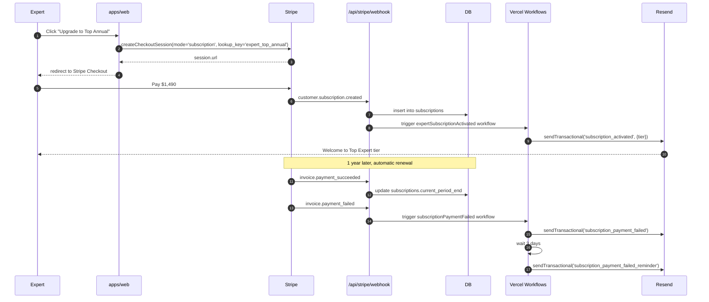

# 16 — Subscriptions & Three-Party Revenue

> Two intertwined economic models: **expert subscriptions** (in MVP-plus, validated on `clerk-workos`) and **three-party clinic revenue** (Phase 2). Both rely on Stripe **lookup keys** to avoid the hardcoded-price-ID pain documented in [13-lessons-learned.md](13-lessons-learned.md) row 24.

## Why this chapter exists

Eleva's MVP charges a flat 15% platform fee. The branch evolved that into a **tiered model**:

- **Community Expert** — pays 12% on bookings if subscribed annually (vs 20% commission-only).
- **Top Expert** — pays 8% on bookings if subscribed annually (vs 15% commission-only).
- **Lecturer Module** — annual add-on (3% commission on course sales vs 5% commission-only).

And it specified a **three-party model** for clinics, where an org can sit between expert and patient and take a marketing fee. The fee math for both must be **explicit, auditable, and override-able per booking**.

This chapter freezes the v2 contract.

## Pricing tiers (as ratified on `clerk-workos`)

Source: branch's `_docs/02-core-systems/STRIPE-SUBSCRIPTION-SETUP.md` and `PRICING-MODEL-CORRECTED.md`.

| Tier | Plan type | Annual price (USD) | Booking commission | Lookup key |
|---|---|---|---|---|
| Community Expert | Commission-only | $0 | 20% | `expert_community_commission_only` |
| Community Expert | Annual subscription | $490/yr | 12% | `expert_community_annual` |
| Top Expert | Commission-only | $0 | 15% | `expert_top_commission_only` |
| Top Expert | Annual subscription | $1,490/yr | 8% | `expert_top_annual` |
| Lecturer (add-on) | Commission-only | $0 | 5% on course sales | `lecturer_commission_only` |
| Lecturer (add-on) | Annual add-on | $490/yr | 3% on course sales | `lecturer_annual_addon` |

**Commercial rules**:

1. Lecturer is an **add-on**, requires an active expert subscription (Community or Top).
2. Subscriptions are annual only in v2 — no monthly to keep churn math simple.
3. Tier (`community` / `top`) is set by Eleva ops, not the expert; recorded on `organizations.metadata.tier`.
4. The applicable commission is read from the **active subscription's lookup key** at the moment of `checkout.session.completed`. No retroactive recomputation on tier upgrades for past bookings.

## Lookup keys, not price IDs

The MVP has scripts referencing `price_xxx` directly. Stripe price IDs change (when prices are deactivated or replaced), and code shouldn't ship Stripe internals. **All v2 references go through lookup keys.**

```ts
// packages/payments/src/lookup-keys.ts
export const LOOKUP_KEYS = {
  EXPERT_COMMUNITY_COMMISSION_ONLY: 'expert_community_commission_only',
  EXPERT_COMMUNITY_ANNUAL: 'expert_community_annual',
  EXPERT_TOP_COMMISSION_ONLY: 'expert_top_commission_only',
  EXPERT_TOP_ANNUAL: 'expert_top_annual',
  LECTURER_COMMISSION_ONLY: 'lecturer_commission_only',
  LECTURER_ANNUAL_ADDON: 'lecturer_annual_addon',
} as const;

export type LookupKey = (typeof LOOKUP_KEYS)[keyof typeof LOOKUP_KEYS];

export const COMMISSION_BPS_BY_LOOKUP_KEY: Record<LookupKey, number> = {
  expert_community_commission_only: 2000, // 20.00%
  expert_community_annual: 1200,          // 12.00%
  expert_top_commission_only: 1500,       // 15.00%
  expert_top_annual: 800,                 // 8.00%
  lecturer_commission_only: 500,          // 5.00%
  lecturer_annual_addon: 300,             // 3.00%
};
```

Resolution at runtime uses Stripe's API to fetch prices by lookup key:

```ts
const prices = await stripe.prices.list({
  lookup_keys: [LOOKUP_KEYS.EXPERT_TOP_ANNUAL],
  active: true,
  limit: 1,
});
```

A seeder script at `infra/stripe/scripts/seed-lookup-keys.ts` ensures every key exists in every Stripe environment (dev / staging / prod). CI runs it against the dev/staging accounts on every release.

Detailed reference: branch's `_docs/STRIPE-LOOKUP-KEYS-DATABASE-ARCHITECTURE.md` — lifted into `apps/docs/specs/stripe-lookup-keys.md`.

## Subscription lifecycle



### Subscriptions table

```ts
// packages/db/src/schema/subscriptions.ts
export const subscriptions = pgTable('subscriptions', {
  id: uuid('id').primaryKey().defaultRandom(),
  orgId: uuid('org_id').notNull().references(() => organizations.id, { onDelete: 'cascade' }),
  stripeSubscriptionId: text('stripe_subscription_id').notNull().unique(),
  stripeCustomerId: text('stripe_customer_id').notNull(),
  lookupKey: text('lookup_key').notNull(),
  status: text('status').notNull(), // active, past_due, canceled, trialing, …
  currentPeriodStart: timestamp('current_period_start', { withTimezone: true }).notNull(),
  currentPeriodEnd: timestamp('current_period_end', { withTimezone: true }).notNull(),
  cancelAtPeriodEnd: boolean('cancel_at_period_end').notNull().default(false),
  metadata: jsonb('metadata').$type<{ tier?: 'community' | 'top'; addons?: string[] }>(),
  createdAt: timestamp('created_at', { withTimezone: true }).notNull().defaultNow(),
  updatedAt: timestamp('updated_at', { withTimezone: true }).notNull().defaultNow(),
});

// One row per org per active product. Multiple rows per org allowed for add-ons.
```

RLS policy: an org can read its own subscription rows; admins can read any.

## Booking-time fee resolution (two-party)

Pseudocode for `packages/payments/src/calculate-application-fee.ts`:

```ts
type FeeInput = {
  expertOrgId: string;
  listingAmountCents: number; // pre-tax, pre-discount, the catalog price
  hasPromoCode: boolean;
};

type FeeResult = {
  applicationFeeBps: number;       // basis points used
  applicationFeeCents: number;     // applied to PaymentIntent
  feeBasisCents: number;           // listing amount; never the discounted amount
  lookupKey: LookupKey;            // for audit
};

export async function calculateApplicationFee({
  expertOrgId,
  listingAmountCents,
}: FeeInput): Promise<FeeResult> {
  const sub = await getActiveExpertSubscription(expertOrgId);

  // No active subscription => commission-only based on tier
  const tier = await getOrgTier(expertOrgId); // 'community' | 'top'
  const lookupKey = sub?.lookupKey ?? (tier === 'top'
    ? LOOKUP_KEYS.EXPERT_TOP_COMMISSION_ONLY
    : LOOKUP_KEYS.EXPERT_COMMUNITY_COMMISSION_ONLY);

  const bps = COMMISSION_BPS_BY_LOOKUP_KEY[lookupKey];
  const applicationFeeCents = Math.floor((listingAmountCents * bps) / 10_000);

  return {
    applicationFeeBps: bps,
    applicationFeeCents,
    feeBasisCents: listingAmountCents,
    lookupKey,
  };
}
```

Critical invariants:

1. **Fee basis is the catalog listing amount**, not the discounted amount. Promo codes never erase platform fee. Lessons learned row 11.
2. The full result is persisted onto `meetings`:
   - `app_fee_bps`
   - `app_fee_amount_cents`
   - `fee_basis_cents`
   - `fee_lookup_key`
3. `processStripeEvent('checkout.session.completed')` recomputes the fee from the snapshotted `feeBasisCents` and asserts equality with `payment_intent.application_fee_amount`. Any mismatch → Sentry + dispute reconciliation queue.

## Three-party clinic revenue (Phase 2)

Behind feature flag `FF_THREE_PARTY_REVENUE`. Only enabled when at least one **clinic organization** exists with one or more **expert memberships**.

Source: branch's `_docs/02-core-systems/THREE-PARTY-CLINIC-REVENUE-MODEL.md` — lifted into `apps/docs/specs/three-party-revenue.md`.

### Model

```
Patient pays $100
  ├─ Eleva platform fee  (8–20%, expert's tier/subscription)
  ├─ Clinic marketing fee (10–25%, configured per clinic)
  └─ Expert net          (≥ 60% guaranteed)
```

**Constraints**:

- Sum of fees ≤ 40% of listing amount. Validation rejects clinic marketing fee that would breach this floor.
- Expert can be in **at most one clinic at a time**. The expert opts in by accepting an invite (creates a `clinic_memberships` row).
- Solo experts (no clinic) get the two-party model.
- Patient sees one number ($100); the split is invisible to them.

### Schema additions (org-per-user already gives us `organizations`)

```ts
export const clinicMemberships = pgTable('clinic_memberships', {
  id: uuid('id').primaryKey().defaultRandom(),
  expertOrgId: uuid('expert_org_id').notNull().references(() => organizations.id),
  clinicOrgId: uuid('clinic_org_id').notNull().references(() => organizations.id),
  marketingFeeBps: integer('marketing_fee_bps').notNull(), // e.g., 1500 = 15%
  status: text('status').notNull(), // pending, active, suspended, ended
  startsAt: timestamp('starts_at', { withTimezone: true }).notNull(),
  endsAt: timestamp('ends_at', { withTimezone: true }),
  createdAt: timestamp('created_at', { withTimezone: true }).notNull().defaultNow(),
});

// Constraint: an expert org can have at most one ACTIVE clinic membership at any time.
```

### Fee calculation (three-party)

```ts
export async function calculateThreePartyFee({
  expertOrgId,
  listingAmountCents,
}: FeeInput): Promise<FeeResultWithClinic> {
  const platform = await calculateApplicationFee({ expertOrgId, listingAmountCents });

  const clinic = await getActiveClinicMembership(expertOrgId);
  if (!clinic) return { ...platform, clinicFeeBps: 0, clinicFeeCents: 0, clinicConnectAccountId: null };

  const clinicFeeCents = Math.floor((listingAmountCents * clinic.marketingFeeBps) / 10_000);

  // Floor enforcement: total fees can't exceed 40% of listing
  const totalFeeBps = platform.applicationFeeBps + clinic.marketingFeeBps;
  if (totalFeeBps > 4000) {
    throw new InvalidThreePartyConfigError({ expertOrgId, totalFeeBps });
  }

  return {
    ...platform,
    clinicFeeBps: clinic.marketingFeeBps,
    clinicFeeCents,
    clinicConnectAccountId: await getStripeConnectAccountId(clinic.clinicOrgId),
  };
}
```

### Stripe transfer mechanics

Stripe doesn't natively support a single PaymentIntent paying out to two Connect accounts. Two viable patterns; v2 adopts **Pattern B** (Separate Charges and Transfers):

- **Pattern A — Direct charge to expert + manual transfer to clinic.** Simpler, but the clinic transfer is detached from the original PaymentIntent and harder to reconcile.
- **Pattern B — Charge to platform Connect-on-behalf, then two `Transfer` objects.**
  1. PaymentIntent created with `application_fee_amount = (platform_fee + clinic_fee)`, `transfer_data.destination = expert_connect_account`.
  2. After capture, a separate `Transfer` from the platform balance to the clinic's Connect account, with `transfer_group = meeting_id` for reconciliation.

The transfer to the clinic is performed by the **`payoutEligibility`** workflow (see [09-workflows-and-async-jobs.md](09-workflows-and-async-jobs.md)) at the same eligibility moment as the expert payout. Each transfer has an idempotency key of `clinic-transfer:${meeting_id}`.

### Audit / per-meeting record

```ts
// extension to meetings table (additive, additive, additive)
export const meetings = pgTable('meetings', {
  // … existing columns …
  feeBasisCents: integer('fee_basis_cents').notNull(),
  appFeeBps: integer('app_fee_bps').notNull(),
  appFeeAmountCents: integer('app_fee_amount_cents').notNull(),
  feeLookupKey: text('fee_lookup_key').notNull(),
  clinicOrgId: uuid('clinic_org_id').references(() => organizations.id),
  clinicFeeBps: integer('clinic_fee_bps').notNull().default(0),
  clinicFeeAmountCents: integer('clinic_fee_amount_cents').notNull().default(0),
  expertNetCents: integer('expert_net_cents').notNull(), // computed at booking
});
```

`expertNetCents = listing - taxes - appFee - clinicFee` is calculated at booking and stored. Any later mismatch (e.g., refund) triggers a reconciliation row in `payment_transfers`.

## Admin UI

The admin surfaces from [11-admin-audit-ops.md](11-admin-audit-ops.md) include:

- `/admin/subscriptions` — list active subscriptions, force-cancel, refund.
- `/admin/orgs/[orgId]/subscription` — drill into one org's subscription history.
- `/admin/orgs/[orgId]/clinic-membership` — manage three-party config (Phase 2).
- `/admin/payments?clinicOrgId=…` — filter all bookings by clinic.

All gated by permissions (`subscriptions:write`, `clinics:write`); see [18-rbac-and-permissions.md](18-rbac-and-permissions.md).

## Migration from MVP flat-15% to tiered

For experts already on the MVP at the time of v2 launch:

1. **Default** every existing expert org to `tier = 'community'`, no subscription.
2. Email all experts via Resend Automation `tier_assigned` campaign with their tier, the new commission, and the option to subscribe annually for a discount.
3. Run the calculation against the **booking-time** subscription state, never retroactively. Past bookings keep their flat 15% recorded on `meetings.app_fee_bps = 1500`.
4. Operations runs `scripts/admin/promote-tier.ts --org=… --tier=top` for invited Top Experts.

## Edge cases & explicit decisions

| Case | Decision |
|---|---|
| Expert subscribes mid-period | New commission applies from the **next booking** onward; prior bookings unchanged. |
| Subscription `past_due` | Treat as commission-only at booking time; subscription auto-cancels after Stripe's grace period; expert is notified via Resend. |
| Refund of a tier-discounted booking | Refund honors the recorded `app_fee_amount_cents`; nothing is recomputed. |
| Promo code on a booking | Customer pays discounted; **fee basis remains the listing amount**. Eleva absorbs the discount on customer's behalf only when the promo is platform-funded. |
| Clinic raises marketing fee | Applies prospectively; existing future bookings already created keep their snapshot. |
| Expert leaves clinic | `clinic_memberships.status = 'ended'`, `endsAt = now()`. Future bookings revert to two-party. |
| Lecturer add-on without expert sub | Forbidden; checkout rejects. |
| Two simultaneous active expert subs | Forbidden; checkout rejects with explicit error code. |

## What `clerk-workos` provides directly

- `_docs/02-core-systems/STRIPE-SUBSCRIPTION-SETUP.md` — Stripe products, prices, lookup keys, env vars.
- `_docs/STRIPE-LOOKUP-KEYS-DATABASE-ARCHITECTURE.md` — full DB design.
- `_docs/PRICING-MODEL-CORRECTED.md` — corrects an earlier incorrect calculation.
- `_docs/PRICING-TABLE-OPTIMIZATION.md` — UX of the pricing page.
- `_docs/COMMIT-PRICING-TABLES.md`, `COMMIT-LOOKUP-KEYS.md`, `COMMIT-ADMIN-SUBSCRIPTIONS.md` — change history.
- `_docs/02-core-systems/THREE-PARTY-CLINIC-REVENUE-MODEL.md` — Phase 2 spec, lifted into `apps/docs/specs/three-party-revenue.md`.
- `_docs/_WorkOS-Stripe/WORKOS-STRIPE-INTEGRATION-GUIDE.md`, `WORKOS-STRIPE-QUICK-ANSWER.md` — how WorkOS user IDs map to Stripe Customers and Connect accounts.

## Tests (mandatory before merging Phase 2)

- Vitest unit:
  - `calculateApplicationFee` for every tier × subscription combination.
  - Promo code never erodes fee basis.
  - `calculateThreePartyFee` enforces 40% floor.
- Stripe local + Vitest integration:
  - `customer.subscription.created/updated/deleted` updates DB row.
  - `invoice.payment_failed` triggers workflow → email sent.
- Playwright E2E:
  - Expert subscribes Top → next booking checkout uses 8% fee.
  - Expert in clinic with 15% marketing → patient charged $100, transfers go 8 + 15 + 77.
- Stripe MCP audit (per `AGENTS.md`): cross-check live products/prices against `LOOKUP_KEYS` constant on every release.
