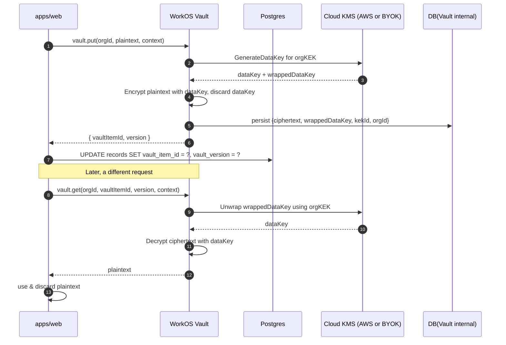
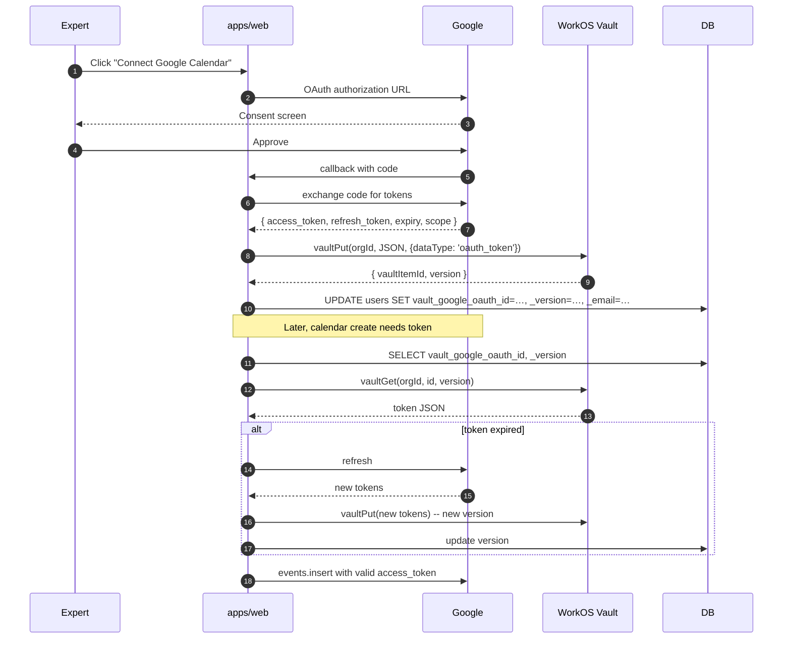

# 17 — Encryption & Vault

> The MVP encrypts everything sensitive (PHI medical records, Google OAuth tokens) with **a single AES-256-GCM key** stored in `ENCRYPTION_KEY`. v2 replaces this with **WorkOS Vault envelope encryption** scoped per organization. This chapter is the architectural and operational handover.

## Why this matters

Three real risks in the MVP scheme:

1. **Single key, single blast radius.** Compromise of `ENCRYPTION_KEY` exposes every encrypted row across every tenant.
2. **No rotation path.** Rotating the key requires re-encrypting every record in-place — practically a multi-day operation with downtime risk.
3. **No tenant isolation.** Even with org-per-user multi-tenancy in v2, ciphertext stays under one key, so RLS provides defense-in-depth on reads but not on the encryption layer itself.

WorkOS Vault solves all three: envelope encryption with **org-scoped data encryption keys**, transparent rotation, and per-row references that don't require re-encryption when keys rotate.

## Threat model

| Threat | MVP exposure | v2 mitigation |
|---|---|---|
| Database dump leaks | Decryptable with one env var | Per-org keys; attacker also needs WorkOS API key + correct org context |
| Compromised app server reads `ENCRYPTION_KEY` | All ciphertext readable | Vault performs decryption; app gets plaintext only for the row it asked for |
| Disgruntled engineer with prod access | Can decrypt offline | Decryption requires online Vault calls; auditable |
| Backup tape stolen | Decryptable | Same as above |
| Key rotation needed (compliance, suspected compromise) | Multi-day re-encrypt-everything | Vault rotates KEKs transparently; rows store key references, not ciphertext-bound key IDs |
| Cross-tenant ciphertext mixing | Possible in code bugs | Vault rejects decrypt calls for an org_id mismatch |

## What we encrypt

| Data | Source | Sensitivity | MVP storage | v2 storage |
|---|---|---|---|---|
| Medical records (`records` table) | Patient ↔ Expert encounters | PHI / GDPR special category | `records.encryptedContent` (AES-256-GCM ciphertext) | `records.vault_item_id` + `records.vault_version` |
| Google OAuth refresh tokens | Calendar OAuth grant | High (account takeover) | `users.googleRefreshToken` (encrypted column) | `vault_items` reference; column is `users.vault_google_oauth_id` |
| Google OAuth access tokens | Calendar API auth | Medium (short-lived) | Same column | Same as refresh; rewritten on every refresh |
| Stripe Identity verification documents | Expert KYC | High | Stored in Stripe (not our DB) | Unchanged — Stripe is the system of record |
| Patient session notes (free text) | Future feature | PHI | n/a | `session_notes.vault_item_id` |
| Expert messaging (Phase 2) | Direct messages | High | n/a | Per-message Vault items |

PII that is **not** encrypted at rest (only in transit + Postgres at-rest by Neon):

- Names, emails, phone numbers — needed for joins, search, sorting; protected by RLS + audit log.
- Booking metadata — the existence of a booking, time, expert is operational data; protected by RLS.
- Stripe customer IDs — non-secret references.

This split mirrors HIPAA's "minimum necessary" principle: encrypt the contents of the visit, not the index that lets staff find it.

## Envelope encryption with WorkOS Vault



The data keys never touch the application. The KEKs (key-encryption-keys) never leave KMS. The application sees only `vault_item_id` references.

## Code shape (`packages/encryption`)

```ts
// packages/encryption/src/vault.ts
import { WorkOS } from '@workos-inc/node';

const workos = new WorkOS(process.env.WORKOS_API_KEY!);

type Context = { actorUserId: string; dataType: 'medical_record' | 'oauth_token' | 'session_note' };

export async function vaultPut(orgId: string, plaintext: string, ctx: Context) {
  const result = await workos.vault.createObject({
    keyContext: { orgId, dataType: ctx.dataType },
    value: plaintext,
    name: `${ctx.dataType}-${ctx.actorUserId}-${Date.now()}`,
  });
  return { vaultItemId: result.id, version: result.version };
}

export async function vaultGet(
  orgId: string,
  vaultItemId: string,
  version: number,
  ctx: Context,
): Promise<string> {
  const result = await workos.vault.readObject({
    id: vaultItemId,
    version,
    keyContext: { orgId, dataType: ctx.dataType },
  });
  return result.value;
}

export async function vaultDelete(orgId: string, vaultItemId: string) {
  await workos.vault.deleteObject({ id: vaultItemId, keyContext: { orgId } });
}
```

Wrap callers (medical records, OAuth tokens) in domain-specific helpers so the rest of the codebase never imports the WorkOS SDK directly:

```ts
// packages/encryption/src/medical-records.ts
import { vaultPut, vaultGet } from './vault.js';

export const encryptRecord = (orgId: string, content: string, actorUserId: string) =>
  vaultPut(orgId, content, { actorUserId, dataType: 'medical_record' });

export const decryptRecord = (orgId: string, vaultItemId: string, version: number, actorUserId: string) =>
  vaultGet(orgId, vaultItemId, version, { actorUserId, dataType: 'medical_record' });
```

## Schema impact

Replace per-table `encryptedX` columns with `vault_*` references.

```ts
// packages/db/src/schema/records.ts
export const records = pgTable('records', {
  id: uuid('id').primaryKey().defaultRandom(),
  orgId: uuid('org_id').notNull().references(() => organizations.id, { onDelete: 'cascade' }),
  patientUserId: uuid('patient_user_id').notNull().references(() => users.id),
  authoredByUserId: uuid('authored_by_user_id').notNull().references(() => users.id),
  vaultItemId: text('vault_item_id').notNull(),
  vaultVersion: integer('vault_version').notNull(),
  contentHash: text('content_hash').notNull(), // SHA-256 of plaintext for tamper detection
  metadata: jsonb('metadata').$type<{ category?: string; tags?: string[] }>(),
  createdAt: timestamp('created_at', { withTimezone: true }).notNull().defaultNow(),
  updatedAt: timestamp('updated_at', { withTimezone: true }).notNull().defaultNow(),
});

// RLS: SELECT/UPDATE/DELETE allowed only when current_setting('app.org_id') = org_id.
```

For Google OAuth tokens:

```ts
// packages/db/src/schema/users.ts (additive)
export const users = pgTable('users', {
  // … existing columns …
  vaultGoogleOauthId: text('vault_google_oauth_id'),    // null until OAuth completes
  vaultGoogleOauthVersion: integer('vault_google_oauth_version'),
  googleAccountEmail: text('google_account_email'),     // for UI display
  googleSelectedCalendarId: text('google_selected_calendar_id'), // user's chosen calendar
  googleScopesGrantedAt: timestamp('google_scopes_granted_at', { withTimezone: true }),
});
```

Vault stores **the entire token bundle** (`{ access_token, refresh_token, scope, expiry_date }`) as one JSON blob per user. Refreshing the token rewrites the Vault item (new version, old retained for audit window).

## OAuth token flow (lifted from `clerk-workos`)



When `refresh_token` exchange fails with `invalid_grant` (Expert revoked access, Google forced re-consent), the calendar package emits a domain event:

```ts
emitEvent('expert.calendar.disconnected', { orgId, expertUserId, reason: 'invalid_grant' });
```

The `expertCalendarDisconnected` workflow in `packages/workflows`:
- Marks `users.vault_google_oauth_id = null` (don't store dead pointers).
- Triggers the `expert_calendar_disconnected` Resend Automation event.
- Surfaces the broken connection on `/admin/orgs/[orgId]` and on the expert dashboard.
- Future bookings continue to work without calendar creation; the expert reconnects to backfill.

## Operational rules

1. **Plaintext never persists.** Decrypted values stay on the request stack; never logged, never cached, never serialized to client unless directly returned in a JSON response (after permission check).
2. **Caching policy**: Decrypted medical records may be cached in Redis with `EX 60` (1 minute) **only** when there's a measured load problem. Default is no cache.
3. **Audit every decrypt.** Every Vault `get` writes an audit row: `{ actor_user_id, target_org_id, vault_item_id, action: 'decrypt', correlation_id }`. RLS prevents cross-org reads but audit confirms intent.
4. **Vault is a hard dependency.** If WorkOS Vault is degraded, encrypted-write paths fail closed with explicit error. We don't fall back to a local key.
5. **No "encryption_method" flag.** Branch's simplified summary noted that for a fresh staging DB they removed dual-write/legacy fallbacks. v2 ships fresh; same simplification — no legacy AES path lurks in code.

## Migration from MVP to v2 (one-shot)

Because v2 ships in a new repo with a new database, there is **no in-place migration**. The MVP DB is decommissioned after the v2 cutover. Process:

1. **Pre-cutover (MVP still live)**:
   - Inventory all rows with PHI: `SELECT count(*) FROM records;`
   - Export plaintext from MVP using a one-shot script `scripts/migrate/export-records-plaintext.ts` that:
     - Runs only against MVP read-replica.
     - Decrypts using the existing `ENCRYPTION_KEY`.
     - Writes encrypted-at-rest tarballs to a private S3 bucket (KMS-encrypted).
     - Logs counts and SHA-256 hashes for verification.
2. **Cutover**:
   - v2 imports from the tarballs into Vault row-by-row using a one-shot `scripts/migrate/import-records-vault.ts`:
     - Resolves `legacy_user_id → org_id` via the org-per-user mirror.
     - `vaultPut` per record, persisting `vault_item_id` + `vault_version` + `content_hash`.
     - Verifies SHA-256 round-trip immediately.
   - For Google OAuth tokens: don't migrate. Force every expert to re-authorize on first v2 login (audit notes invalidation date). Less risk than carrying tokens across encryption schemes.
3. **Post-cutover**:
   - Burn the tarballs (verifiable destruction).
   - Verify counts match MVP.
   - DR test: restore from a Vault-only backup and decrypt a sample row.
4. **Decommission MVP DB** after 30-day verification window.

This sequence intentionally avoids any "dual-write" intermediate state. The branch's `_docs/_WorkOS Vault implemenation/SIMPLIFIED-SUMMARY.md` argues the same point: with no legacy data in the new system, complexity buys nothing.

## Compliance posture

- **GDPR Art. 32** — appropriate technical measures: per-tenant keys + audit + KMS-backed KEKs satisfy "state of the art" for PHI.
- **GDPR Art. 17 (right to erasure)**: deleting an org's data also deletes its KEK; even if a backup exists, ciphertext is unrecoverable. This is **crypto-shredding**.
- **ERS Portugal** (per branch's `_docs/ERS_portugal/`): logs of all decrypt events demonstrate "controlled access".
- **Audit retention**: audit log retains decrypt events for 6 years (Portuguese health record retention requirement); see [11-admin-audit-ops.md](11-admin-audit-ops.md).

## Failure modes & runbooks

| Failure | Symptom | Response |
|---|---|---|
| Vault API timeout | Encrypted writes 5xx | Surface in Sentry; user retries; do **not** silently downgrade |
| Vault API returns 4xx for an item | Decrypt fails for one record | Log to audit (failed decrypt); show "data temporarily unavailable" UI; no fallback |
| Suspected key compromise | Internal incident | WorkOS dashboard rotates KEK; existing vault items continue to decrypt; new writes use new KEK; no app changes needed |
| KMS region degraded | Vault calls slow | Vault has multi-region; degradation is short; if ≥5 min, status-page incident |
| Engineer accidentally logs plaintext | grep audit logs for `dataType:` patterns | Rotate, re-run sanitizer, bring incident to compliance |

## What `clerk-workos` provides directly

- `_docs/_WorkOS Vault implemenation/SIMPLIFIED-SUMMARY.md` — the rationale for the simpler v2 design.
- `_docs/_WorkOS Vault implemenation/IMPLEMENTATION-COMPLETE.md` — the original implementation steps.
- `_docs/_WorkOS Vault implemenation/MIGRATION-COMPLETE.md` — original migration plan (preserved for reference; v2 uses the cutover instead).
- `_docs/_WorkOS Vault implemenation/CAL-COM-CALENDAR-SELECTION.md` — calendar-selection UX that pairs with Vault token storage.
- `_docs/_WorkOS Vault implemenation/WORKOS-SSO-VS-CALENDAR-OAUTH.md` — explicitly distinguishes WorkOS SSO from Google Calendar OAuth (different scopes, different flows).
- `_docs/_WorkOS Vault implemenation/GOOGLE-OAUTH-SCOPES.md` — the minimum scopes (`calendar.events`, `calendar.readonly`).
- `_docs/_WorkOS Vault implemenation/QUICK-START.md` — operator quick start.
- `_docs/03-infrastructure/ENCRYPTION-ARCHITECTURE.md` — the original AES design, preserved as historical context.

All adopted into `apps/docs/operations/encryption/` per the matrix in [15-clerk-workos-branch-learnings.md](15-clerk-workos-branch-learnings.md).

## Tests (must exist before shipping)

- Vitest unit:
  - `vaultPut` → `vaultGet` round-trip equals input.
  - SHA-256 hash invariant (`contentHash`) holds across versions.
  - Cross-org `vaultGet(otherOrgId, …)` rejects.
- Vitest integration:
  - OAuth refresh updates Vault version; old version remains decryptable for audit window.
  - `invalid_grant` triggers `expert.calendar.disconnected` event.
- Playwright E2E:
  - Patient encounter writes a record; expert (with permission) decrypts in UI; admin (without permission) cannot.
- Compliance audit:
  - Annually, `pnpm scripts:vault-audit --month=…` produces decrypt-event report grouped by org.

## Boundary rules (lint-enforced)

- `import { WorkOS }` is allowed **only** in `packages/encryption/src/vault.ts`.
- `process.env.ENCRYPTION_KEY` is **forbidden** anywhere in `apps/`, `packages/` (CI grep gate; fails the build).
- `crypto.createCipheriv('aes-256-gcm', …)` is **forbidden** outside an explicit allowlist (no shadow encryption).
- Any new column starting with `encrypted_` requires `vault_*` instead (lint rule on schema files).
