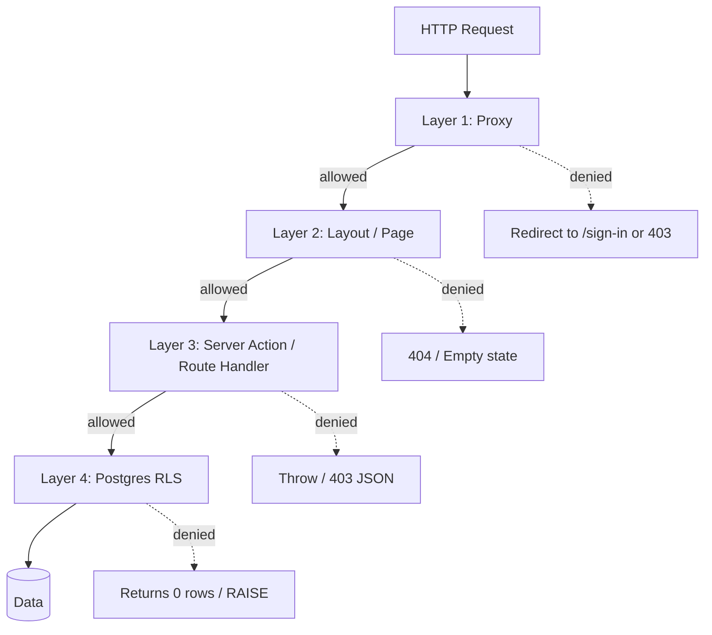

# 18 — RBAC & Permissions

> Eleva.care v2 has **5 roles** (2 WorkOS defaults + 3 custom) and **~132 granular permissions** (the original blueprint plan referenced "89"; the in-flight `clerk-workos` branch's generated config matrix has expanded to 132 as features were added). Authorization is enforced at **four independent layers**. WorkOS is the single source of truth.

> The latest generated source of truth is `_docs/_WorkOS RABAC implemenation/generated/workos-rbac-config.{md,json,csv}` on the `clerk-workos` branch — lifted into `infra/workos/rbac-config.json` for v2 and re-exported as a typed constants file. **Note**: the branch's generated config still references the legacy six-role matrix (`superadmin`, `partner_admin`, `user`); the v2 generation step renames these in-flight to the five-role taxonomy described below.

## Why five roles, not three (or six)

The MVP has effectively three roles (`patient`, `expert`, `admin`) stuffed into Clerk's `public_metadata.role`. That collapse hides important distinctions:

- A **community expert** has fewer features than a **top expert**; pricing tier and feature gating are coupled.
- A **clinic owner** — the human at a clinic who manages experts within their clinic org — needs a separate role family for Phase 2, even if no clinic exists at MVP launch.

A previous draft of this chapter proposed **six** roles by separating `superadmin` from `admin` and naming the clinic role `partner_admin`. We've since collapsed back to **five** for two reasons:

1. **WorkOS already ships `admin` and `member` as default org roles.** Reusing them avoids custom-role drift and lets WorkOS Organizations behave conventionally (e.g., the org owner is automatically `admin`).
2. **`superadmin` was a permission concern, not a role concern.** The destructive actions previously gated behind `superadmin` (`users:impersonate`, `organizations:delete`, `payments:retry_failed`, `audit:export`, `settings:manage_features`) are now plain permissions. A small operator subset of `admin` users gets them via a WorkOS group; everyone else with `admin` does not. This keeps the role count low and makes "who can do this destructive thing?" answerable by reading a single permission grant rather than checking a role hierarchy.

v2 therefore standardizes on:

| Role slug | Provenance | Display name | Purpose |
|---|---|---|---|
| `admin` | **WorkOS default** | Administrator | Eleva staff. Manage users, experts, content, payments. Destructive actions gated by individual permissions on a small operator subset. |
| `clinic` | Custom | Clinic | Clinic owner (Phase 2). Manages experts within their clinic org only. Inside a clinic org, WorkOS's built-in `admin` / `member` distinction handles seniority among clinic staff. |
| `expert_top` | Custom | Top Expert | Premium expert tier. Advanced analytics, branding, group sessions, direct messaging. |
| `expert_community` | Custom | Community Expert | Standard expert tier. Core scheduling + earnings. |
| `member` | **WorkOS default** | Member | Patient (or any default org member). Book, view own records. |

Naming notes:

- `member` (not `patient`) is the role slug. The **persona** in product copy is still "patient" — they're patients in the Eleva product even though their WorkOS role is the generic `member`.
- `clinic` (not `partner_admin`) drops the redundant `_admin` suffix. Every custom role is implicitly an admin of its own scope (`expert_top` admins their expert profile, `clinic` admins its clinic). Seniority *within* a clinic org is expressed by WorkOS's built-in `admin` vs `member` membership distinction, not by another role slug.
- There is **no** `expert_lecturer` separate role; lecturer is an **add-on subscription** (see [16-subscriptions-and-three-party-revenue.md](16-subscriptions-and-three-party-revenue.md)) that grants additional permissions on top of an expert role.
- There is **no** `superadmin`; see rationale above.

## Permission catalog (categories)

Permissions are namespaced `category:action` and grouped:

| Category | Count (approx) | Examples |
|---|---|---|
| `appointments` | 9 | `appointments:view_own`, `appointments:create`, `appointments:complete` |
| `sessions` | 2 | `sessions:view_own`, `sessions:view_history` |
| `patients` | 6 | `patients:view_own`, `patients:manage_records`, `patients:view_insights` |
| `events` | 5 | `events:create`, `events:edit_own`, `events:toggle_active` |
| `availability` | 5 | `availability:create`, `availability:set_limits` |
| `calendars` | 4 | `calendars:connect`, `calendars:disconnect` |
| `reviews` | 6 | `reviews:create`, `reviews:respond` |
| `profile` | 6 | `profile:edit_own`, `profile:edit_expert` |
| `experts` | 7 | `experts:approve`, `experts:reject`, `experts:verify` |
| `analytics` | 10 | `analytics:revenue`, `analytics:platform_growth` |
| `branding` | 3 | `branding:customize` |
| `billing` | 8 | `billing:view_earnings`, `billing:manage_subscription` |
| `settings` | 7 | `settings:security`, `settings:manage_features` |
| `dashboard` | 2 | `dashboard:view_expert`, `dashboard:view_patient` |
| `users` | 6 | `users:create`, `users:impersonate` |
| `organizations` | 5 | `organizations:create`, `organizations:manage_settings` |
| `payments` | 5 | `payments:view_all`, `payments:process_refunds` |
| `categories` | 4 | (manage marketplace categories) |
| `audit` | (e.g. 3) | `audit:view`, `audit:export` |
| `support` | (e.g. 3) | `support:open_ticket`, `support:resolve` |
| `messaging` | (e.g. 3) | `messaging:direct`, `messaging:moderate` |

Total: ~132 permissions. Source-of-truth file `infra/workos/rbac-config.json` is generated from a small DSL and held under version control.

The generated TypeScript file `packages/auth/src/permissions.generated.ts` exports:

```ts
export const PERMISSIONS = {
  APPOINTMENTS_VIEW_OWN: 'appointments:view_own',
  APPOINTMENTS_CREATE: 'appointments:create',
  // …
} as const;

export type Permission = (typeof PERMISSIONS)[keyof typeof PERMISSIONS];

export const ROLES = {
  ADMIN: 'admin',                       // WorkOS default
  CLINIC: 'clinic',
  EXPERT_TOP: 'expert_top',
  EXPERT_COMMUNITY: 'expert_community',
  MEMBER: 'member',                     // WorkOS default
} as const;
export type Role = (typeof ROLES)[keyof typeof ROLES];
```

Apps import only from `packages/auth`; raw permission strings never appear in `apps/*`.

## Role-permission matrix (illustrative slices)

The full matrix lives in `infra/workos/rbac-config.json`. Headlines:

- **`member` (patient)**: appointments:view_own/create/cancel_own/reschedule_own; sessions:view_own; profile:view_own/edit_own; reviews:create/edit_own; calendars (none); analytics (none); billing:view_own; dashboard:view_patient.
- **`expert_community`**: everything `member` has + appointments:view_incoming/confirm/complete + events:create/view_own/edit_own/delete_own + availability (all) + calendars (all) + patients:view_own/view_history/send_notes + reviews:respond + analytics:view + billing:view_earnings/view_payouts + dashboard:view_expert + profile:edit_expert/preview/manage_link.
- **`expert_top`** (inherits `expert_community`): + analytics:revenue/patients/performance/export + branding:* + patients:view_insights + messaging:direct + (when `lecturer_annual_addon` active) group_sessions:create.
- **`clinic`** (Phase 2): users:view_all (within clinic) + experts:view_applications + billing:view_clinic_billing/manage_clinic_sub + patients:view_all (within clinic) + analytics (clinic-scoped) + organizations:manage_settings (own org).
- **`admin`** (Eleva staff): everything in `expert_top` (read-only equivalents) + users:* + experts:* + categories:* + analytics:platform_* + payments:view_all/manage_disputes/process_refunds + audit:view + settings:edit_platform + organizations:* (delete restricted to operator subset). The destructive permissions previously gated by `superadmin` (`users:impersonate`, `organizations:delete`, `settings:manage_features`, `audit:export`, `payments:retry_failed`) are granted to a small **operator subset** of admins via WorkOS group membership; ordinary admins do not hold them.

The generated CSV `workos-permissions.csv` and matrix `workos-role-permission-matrix.csv` are the authoritative cross-references.

## Inheritance

Roles do not inherit at the WorkOS level; the matrix is **explicit**, not implicit. This makes the JWT claim deterministic and lets admins see exactly what each role grants without unfolding inheritance trees.

The `expert_top` matrix duplicates everything in `expert_community` plus its extras. The DSL that generates the matrix supports `extends` to keep the source readable:

```jsonc
{
  "roles": {
    "expert_community": { "permissions": [ ... ] },
    "expert_top": {
      "extends": ["expert_community"],
      "permissions": ["analytics:revenue", "branding:customize", "messaging:direct"]
    }
  }
}
```

Generation flattens `extends` into a concrete permission list per role at build time.

## Four enforcement layers

Defense in depth. Each layer must independently uphold the permission rule. **Skipping any layer is a CI-blocking offense.**



### Layer 1 — Proxy (`src/proxy.ts`)

Coarse-grained checks at the edge before routing. Owns:

- "Is this a public, auth, or private route?"
- "Does this route require **any** authenticated user?" (redirect to `/sign-in`).
- "Is this a private route requiring a **specific role family**?" (e.g., `/admin/*` requires `admin`).
- Webhook authentication bypass (Stripe, WorkOS, Google) using their respective signature/auth schemes.
- Cron auth (Vercel cron `Authorization: Bearer $CRON_SECRET`).

The proxy does **not** make permission-level decisions (`appointments:view_own` etc.) because it doesn't know the resource ID. Those happen in Layer 2/3.

### Layer 2 — Layout / Page

Server components in segment layouts perform a permission check before rendering children. Cancels the render if denied.

```ts
// apps/web/src/app/(private)/admin/payments/layout.tsx
import { requirePermission } from '@eleva/auth/server';

export default async function AdminPaymentsLayout({ children }: { children: React.ReactNode }) {
  await requirePermission('payments:view_all'); // throws redirect to /403 if denied
  return <>{children}</>;
}
```

`requirePermission` reads from the JWT-cached session (no extra fetch) and throws a Next.js redirect to `/403` on denial. This stops 99% of unauthorized data fetching before it begins.

### Layer 3 — Server action / route handler

Every mutating server action and every route handler is wrapped by `withPermission(...)`:

```ts
// apps/web/src/app/(private)/expert/availability/actions.ts
'use server';

import { withPermission, withAudit } from '@eleva/auth/server';

export const setAvailability = withPermission(
  'availability:edit_own',
  withAudit({ entity: 'availability', action: 'edit' })(
    async (input: AvailabilityInput) => {
      // input is already validated by Zod
      // current org is bound by withPermission
      await db.transaction(async (tx) => { … });
    },
  ),
);
```

`withPermission`:
- Resolves the current user + org from the request.
- Asserts the permission is in the JWT claims.
- For `*_own` permissions, validates input ownership (e.g., the `availabilityId` belongs to the current org).
- Throws a typed `AuthorizationError` on denial; framework converts to 403 JSON or redirect.

`withAudit` (see [11-admin-audit-ops.md](11-admin-audit-ops.md)) writes the audit row regardless of outcome.

### Layer 4 — Postgres Row-Level Security

The last line of defense, in case Layer 3 has a bug.

```sql
-- migrations/0001_enable_rls.sql
ALTER TABLE appointments ENABLE ROW LEVEL SECURITY;

CREATE POLICY appointments_org_isolation ON appointments
  USING (org_id = current_setting('app.org_id')::uuid);

CREATE POLICY appointments_admin_bypass ON appointments
  USING (current_setting('app.role') = 'admin');
```

Every connection from the app sets the local context before running queries:

```ts
// packages/db/src/with-org-context.ts
export async function withOrgContext<T>(orgId: string, role: Role, fn: () => Promise<T>): Promise<T> {
  return db.transaction(async (tx) => {
    await tx.execute(sql`SET LOCAL app.org_id = ${orgId}`);
    await tx.execute(sql`SET LOCAL app.role = ${role}`);
    return await fn();
  });
}
```

`packages/db` exposes only methods that go through `withOrgContext`. Direct `db.query.*` access without context is forbidden by lint.

Branch reference: `_docs/_WorkOS RABAC implemenation/WORKOS-RBAC-NEON-RLS-REVIEW.md` validates this pattern against Neon Postgres.

## JWT claim shape

WorkOS issues a session JWT containing role + permissions. Claim shape (after our small custom transform in `packages/auth/src/session.ts`):

```jsonc
{
  "sub": "user_01HX…",                      // WorkOS user ID
  "org_id": "org_01HY…",                    // WorkOS org ID (one per user in v2)
  "role": "expert_top",
  "permissions": [
    "appointments:view_own",
    "appointments:create",
    "events:create",
    "analytics:revenue",
    "branding:customize",
    "messaging:direct",
    /* … flattened from role + add-on subscriptions … */
  ],
  "iat": 1700000000,
  "exp": 1700003600
}
```

- Claims are **flattened**: client never has to compute role → permissions.
- Add-on subscriptions (e.g., lecturer) inject extra permissions when active. Recomputed on session refresh; subscription change → forced refresh via `users:reauth_required` event.
- Sidebar/menu components read `permissions` directly to show/hide items (lifted from branch's `RBAC-SIDEBAR-IMPLEMENTATION.md`).

## Server-side helpers (`packages/auth/server`)

```ts
// requirePermission — throws redirect on denial
export function requirePermission(p: Permission): Promise<void>;

// withPermission — wraps server actions / route handlers
export function withPermission<F extends Fn>(p: Permission, fn: F): F;

// can — non-throwing check, useful for conditional UI on server
export async function can(p: Permission): Promise<boolean>;

// hasAnyPermission — OR over a set
export async function hasAnyPermission(ps: Permission[]): Promise<boolean>;

// requireRole — coarse role check (use sparingly; prefer permissions)
export function requireRole(r: Role | Role[]): Promise<void>;
```

Client-side counterparts in `packages/auth/client`:

```ts
// usePermission — returns boolean from session JWT
export function usePermission(p: Permission): boolean;

// PermissionGate — declarative gate component
export function PermissionGate({ permission, fallback, children }): JSX.Element;
```

## Operational flows

### Granting a permission to a role

1. Edit `infra/workos/rbac-config.json`.
2. Run `pnpm rbac:generate` → regenerates `permissions.generated.ts` and CSV/MD outputs.
3. Run `pnpm rbac:sync --dry-run` → diff against WorkOS dashboard.
4. Open PR; CI runs the diff against the **dev** WorkOS environment.
5. After merge, manually `pnpm rbac:sync --env=staging` then `--env=prod` (gated by admin-with-`settings:manage_features` approval).

### Detecting drift

Nightly cron workflow `rbacDriftCheck`:

- Pulls live role/permission state from WorkOS for prod.
- Compares to `infra/workos/rbac-config.json`.
- On any difference, posts to ops Slack via Resend transactional + a Sentry event.

### Promoting a user

`pnpm scripts:assign-role --user=<workos_user_id> --role=expert_top --reason="…"` writes an audit row and flips the role in WorkOS. The change propagates to the user on their next session refresh; in critical cases (demotion of a malicious actor), the script also revokes all sessions.

### Impersonation

Restricted to admins holding the `users:impersonate` permission (operator subset only). Implemented via WorkOS Impersonation API.

- Banner displayed across the entire UI: "Impersonating <user> as <admin>. End impersonation".
- Audit log records every server action with `actor_user_id = admin`, `effective_user_id = victim`, plus `impersonation_session_id` for correlation.
- Time-boxed (default 30 min, configurable per session, max 4 h).
- All impersonated reads/writes still pass Layer 4 RLS as the impersonated user — no escape hatch.

## Anti-patterns to ban

These are CI-enforced or team-policy-enforced. Each comes from a real incident or near-miss in MVP.

| Pattern | Why it's banned | Lint rule / policy |
|---|---|---|
| `if (user.role === 'admin')` in components | Bypasses permission system; coarse. | ESLint custom rule — flag direct role compares; use `usePermission` / `requirePermission`. |
| `db.query.x.findMany()` without `withOrgContext` | Defeats RLS. | ESLint custom rule on `packages/db` re-exports; only `withOrgContext` exposed. |
| Permission strings as inline literals in `apps/*` | Untracked usage; renames break silently. | Lint: `appointments:` etc. literals only allowed in `packages/auth/**`. |
| Server action without `withPermission` wrapper | Layer 3 missing. | Lint: every file under `**/actions.ts` must export only functions wrapped by `withPermission` or explicitly tagged `// @public-action`. |
| Layout without `requirePermission` for private routes | Layer 2 missing. | Lint walks `app/(private)/**/layout.tsx`; warns when no `requirePermission` call is found. |
| Custom RBAC in proxy beyond coarse role | Concentrates logic in proxy "god-file" again. | Code review checklist; lint warns when proxy file references specific permissions. |
| Storing role in app DB and trusting it | Two sources of truth → drift. | Schema lint: `users.role` may exist for caching display, but **must be** read-only & sourced from WorkOS sync. |

## Comparison: Clerk MVP → WorkOS v2

| Aspect | MVP (Clerk) | v2 (WorkOS) |
|---|---|---|
| Source of truth | Two: `public_metadata.role` and `users.role` | One: WorkOS roles |
| Granularity | 3 roles, no permissions | 5 roles (2 WorkOS defaults + 3 custom) × ~132 permissions |
| Enforcement layers | 1–2 (proxy + occasional layout) | 4 (proxy + layout + action + RLS) |
| Sidebar gating | Hardcoded role checks | JWT-driven `PermissionGate` |
| Drift detection | None | Nightly RBAC drift workflow |
| Impersonation | Manual Clerk dashboard | `users:impersonate` permission + audited Workflow |
| Add-on permissions | n/a | Subscription-driven, JWT-flattened |
| RLS at DB | Not enabled | Enabled on all tenant tables |

## Tests

- Vitest:
  - For every role in `infra/workos/rbac-config.json`, assert flattened permissions match expectation snapshot.
  - `withPermission` denies, throws typed error.
  - `withOrgContext` sets `app.org_id` and `app.role`; queries scoped correctly.
- Playwright:
  - Smoke per role: log in, attempt a forbidden URL → 403; attempt allowed → 200.
  - Add-on subscription activation grants permission within one session refresh.
- Postgres CI:
  - Spin up a Neon branch, apply migrations, run RLS smoke (insert as orgA, select as orgB → 0 rows).

## Sources from `clerk-workos`

All adopted into `apps/docs/auth/` and `infra/workos/`:

- `_docs/_WorkOS RABAC implemenation/WORKOS-RBAC-IMPLEMENTATION-GUIDE.md` — step-by-step.
- `_docs/_WorkOS RABAC implemenation/WORKOS-ROLES-PERMISSIONS-CONFIGURATION.md` — definitive list.
- `_docs/_WorkOS RABAC implemenation/WORKOS-RBAC-VISUAL-MATRIX.md` — humans-friendly matrix.
- `_docs/_WorkOS RABAC implemenation/WORKOS-RBAC-NEON-RLS-REVIEW.md` — Layer 4 validation.
- `_docs/_WorkOS RABAC implemenation/WORKOS-RBAC-QUICK-REFERENCE.md` — cheat sheet.
- `_docs/_WorkOS RABAC implemenation/RBAC-SIDEBAR-IMPLEMENTATION.md` — UI gating pattern.
- `_docs/_WorkOS RABAC implemenation/generated/{workos-rbac-config.json, workos-rbac-config.md, workos-rbac-constants.ts, workos-permissions.csv, workos-roles.csv, workos-role-permission-matrix.csv}` — generated artifacts; lifted into `infra/workos/` and `packages/auth/src/`.
- `_docs/_WorkOS RABAC implemenation/FGA-EVALUATION.md` & `FGA-FUTURE-MIGRATION-ANALYSIS.md` — concludes RBAC + RLS sufficient for v2; FGA reconsidered in Phase 3 when complex clinic hierarchies arrive.
- `_docs/_WorkOS RABAC implemenation/WORKOS-DASHBOARD-QUICK-SETUP.md` — operator runbook.
