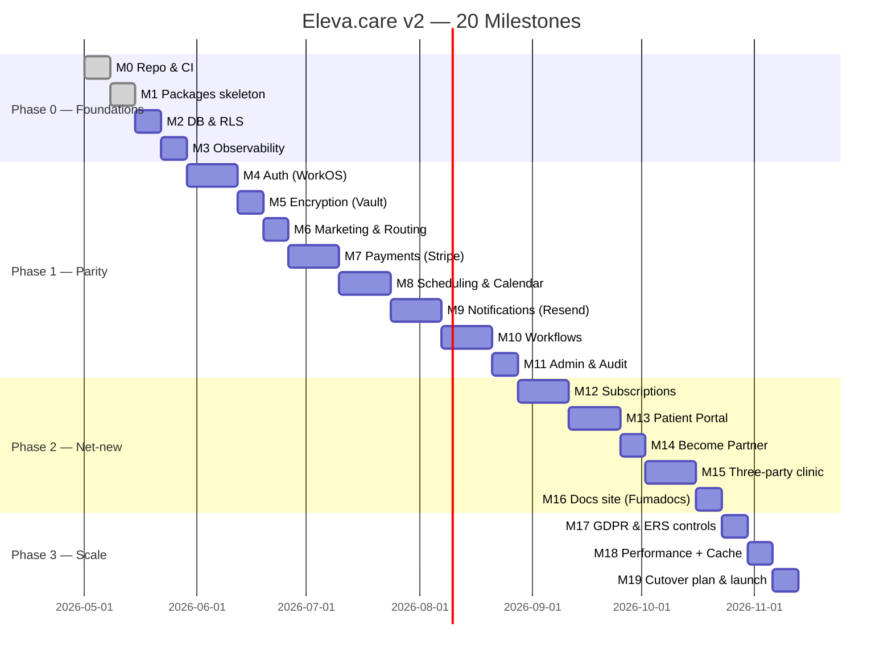

# 19 — Rebuild Roadmap

> Twenty ordered milestones to take Eleva.care v2 from an empty repo to production parity (and beyond) with the MVP. Each milestone has a clear definition of done, the chapters it pulls from, and the explicit `clerk-workos` branch artifacts to lift. Build the milestones in order; each one ends with green CI + a deployable preview.

## Conventions

- **Output**: every milestone produces shippable code on a feature branch + a Vercel preview + green CI.
- **Branch lifts**: where applicable, the milestone names the branch artifact and the v2 destination.
- **Tests**: each milestone defines the smallest test set that proves it's done.
- **Owner**: a single engineer per milestone, even if work is parallel within.
- **Time box**: each milestone is sized so the median completion is **2–10 working days**.

Phases:

- **Phase 0 (M0–M3)**: Foundations. No user-visible behavior; sets up the repo to scale.
- **Phase 1 (M4–M11)**: MVP feature parity. End of Phase 1 = soft launch with a small cohort of experts.
- **Phase 2 (M12–M16)**: Net-new capabilities (Patient Portal, three-party revenue, lecturer add-on).
- **Phase 3 (M17–M19)**: Scale, compliance, and operational maturity.

Quick map:

---

## Phase 0 — Foundations

### M0 — Repo, tooling, CI

- Initialize `eleva-care/` with pnpm workspaces + Turborepo.
- `apps/web` Next.js 16, `apps/docs` placeholder, `tooling/{eslint-config,tsconfig,scripts}`.
- Pin Node 24, Bun (dev), pnpm.
- ESLint + Prettier or Biome (decide and pin); commit hooks via Husky/lint-staged (with `--no-verify` allowance per `AGENTS.md`).
- GitHub Actions: install + lint + typecheck + build + Vitest in parallel; remote Turbo cache via Vercel.
- Done when: PR to a placeholder change goes green in <5 min.
- Source chapters: [14-v2-target-monorepo.md](14-v2-target-monorepo.md).

### M1 — Empty packages skeleton & lint boundaries

- Create empty `packages/{auth,db,payments,scheduling,calendar,email,workflows,encryption,i18n,audit,cache,observability,ui,content,config,types}` with only an `index.ts` exporting `{}`.
- Add `eslint-plugin-import` `no-restricted-paths` rules for the boundaries described in [14-v2-target-monorepo.md](14-v2-target-monorepo.md#dependency-graph-allowed-direction).
- Add CI rule: no `import 'stripe'` outside `packages/payments`, no `import { WorkOS }` outside `packages/auth`/`encryption`, no `process.env.ENCRYPTION_KEY` anywhere.
- Done when: trying to import across an illegal boundary fails CI.
- Source chapters: [14-v2-target-monorepo.md](14-v2-target-monorepo.md).

### M2 — Database + Drizzle + Neon RLS scaffolding

- Stand up two Neon projects: `eleva_v2_main`, `eleva_v2_audit`.
- `packages/db`: pooled `@neondatabase/serverless` client; `withOrgContext()` helper.
- Initial migrations: `users`, `organizations`, `memberships`, plus minimal `events`, `meetings`, `appointments` shells.
- RLS enabled on every tenant table with policy templates from [18-rbac-and-permissions.md](18-rbac-and-permissions.md).
- Vitest + neon-branch CI: insert as orgA, select as orgB → 0 rows.
- Done when: `pnpm db:migrate` succeeds and an integration test proves RLS isolation.
- Source chapters: [03-data-model.md](03-data-model.md), [18-rbac-and-permissions.md](18-rbac-and-permissions.md).
- Lift from branch: `_docs/_WorkOS RABAC implemenation/WORKOS-RBAC-NEON-RLS-REVIEW.md`, `_docs/04-development/standards/01-database-conventions.md`.

### M3 — Observability + correlation IDs

- `packages/observability`: Sentry init, correlation-ID `AsyncLocalStorage` propagation, BetterStack heartbeat helper, BotID guard.
- Inject `x-correlation-id` in `src/proxy.ts` (placeholder); ensure it flows into Sentry tags and (later) audit rows + Resend metadata.
- Add `/api/health` returning JSON `{ ok, build, env }`; wire one BetterStack heartbeat against it.
- Done when: a forced error in a test page appears in Sentry with the correct correlation ID.
- Source chapters: [10-infrastructure-and-observability.md](10-infrastructure-and-observability.md), [11-admin-audit-ops.md](11-admin-audit-ops.md).

---

## Phase 1 — MVP parity

### M4 — Auth (WorkOS AuthKit, org-per-user)

- `packages/auth`: AuthKit middleware, `requirePermission`, `withPermission`, `usePermission`, `PermissionGate`.
- WorkOS dashboard: roles + permissions seeded from `infra/workos/rbac-config.json` (lifted from branch `generated/`).
- Org-per-user provisioning on first sign-in (non-blocking sync architecture).
- Sidebar gating driven by JWT permissions.
- Sign-in / sign-up routes under `app/(auth)/[locale]/`.
- Done when: a new user lands in a freshly-provisioned org with `user` role; switching role in WorkOS reflects in JWT after refresh.
- Source chapters: [05-identity-auth-rbac.md](05-identity-auth-rbac.md), [18-rbac-and-permissions.md](18-rbac-and-permissions.md).
- Lift from branch: `_docs/02-core-systems/workos-sync-architecture.md`, `_docs/04-development/org-per-user-model.md`, all `_docs/_WorkOS RABAC implemenation/` (active folder), `RBAC-SIDEBAR-IMPLEMENTATION.md`, `WORKOS-DASHBOARD-QUICK-SETUP.md`.

### M5 — Encryption (WorkOS Vault)

- `packages/encryption`: `vaultPut`, `vaultGet`, domain helpers (`encryptRecord`, `decryptRecord`, `encryptOAuthToken`).
- DB schema: replace any encrypted columns with `vault_*` references.
- Lint: ban `process.env.ENCRYPTION_KEY` and direct `crypto.createCipheriv('aes-256-gcm', …)`.
- Done when: round-trip Vitest passes; cross-org `vaultGet` rejects.
- Source chapters: [17-encryption-and-vault.md](17-encryption-and-vault.md).
- Lift from branch: `_docs/_WorkOS Vault implemenation/SIMPLIFIED-SUMMARY.md`, `IMPLEMENTATION-COMPLETE.md`, `MIGRATION-COMPLETE.md`, `QUICK-START.md`, `WORKOS-SSO-VS-CALENDAR-OAUTH.md`, `GOOGLE-OAUTH-SCOPES.md`, `CAL-COM-CALENDAR-SELECTION.md`.

### M6 — Marketing site, locales, routing

- Public marketing pages under `app/[locale]/(public)/`: `/`, `/about`, `/legal/*`, `/blog/*`, expert profile pages.
- `packages/i18n`: next-intl loader, ELEVA_LOCALE cookie, country detection (PT → pt, BR → br, ES → es, default en).
- `packages/ui` shadcn/ui + tokens from branch `ELEVA-COLOR-SYSTEM-UPDATE.md`.
- `packages/content` for MDX blog + categories.
- Compose `src/proxy.ts` from modular handlers (under 50 LOC); enforce by lint.
- Done when: navigating to `/`, `/pt`, `/br`, `/es` resolves with correct locale; switching locale persists.
- Source chapters: [04-routing-and-app-structure.md](04-routing-and-app-structure.md), [12-internationalization.md](12-internationalization.md).
- Lift from branch: `_docs/04-development/PROXY-MIDDLEWARE.md`, `ROUTE-CONSTANTS.md`, `MDX-LOCALE-FIX.md`, `MDX-METADATA-MIGRATION.md`, `ELEVA-COLOR-SYSTEM-UPDATE.md`, `USERNAME_RESERVED_ROUTES.md`.

### M7 — Payments (Stripe Connect, single webhook)

- `packages/payments`: Stripe SDK wrapper (API version pinned in code), Connect Express onboarding, Identity verification, Multibanco capability.
- One webhook route `/api/stripe/webhook` with `processStripeEvent` idempotency wrapper.
- `calculateApplicationFee` flat 15% (subscription tiers added in M12).
- Stripe Tax configured per `AGENTS.md` (PT NIF, no billing address required).
- Stripe local in dev script; Vitest webhook tests + idempotency tests.
- Done when: end-to-end booking checkout + webhook → meeting row + payout schedule. Identity verification flow works for Connect onboarding.
- Source chapters: [06-payments-stripe-connect.md](06-payments-stripe-connect.md).
- Lift from branch: `_docs/02-core-systems/payments/{01-payment-flow-analysis.md, 02-stripe-integration.md, 04-payment-restrictions.md, 05-race-condition-fixes.md, 06-multibanco-integration.md, 10-consolidation-summary.md, 11-calendar-creation-idempotency.md}`, `_docs/04-development/integrations/{01-stripe-identity.md, 02-stripe-payouts.md, 05-identity-verification-fix.md}`.

### M8 — Scheduling & Google Calendar

- `packages/scheduling`: availability model, `getValidTimesFromSchedule`, atomic `reserveSlot` (Redis SET NX + DB transaction).
- `packages/calendar`: Google OAuth (tokens to Vault from M5), idempotent `events.insert` with client-supplied ID + 409 fallback, calendar selection UI.
- Booking funnel pages under `app/[locale]/(public)/[username]/[event]/...`.
- Pubsub watch for external calendar changes (best-effort cache invalidation).
- Done when: 100 concurrent reservation attempts produce one winner; webhook retries don't create duplicate calendar events; expired tokens self-heal.
- Source chapters: [07-scheduling-booking-calendar.md](07-scheduling-booking-calendar.md).
- Lift from branch: `_docs/02-core-systems/scheduling/{01-scheduling-engine.md, 02-booking-layout.md}`, `_docs/02-core-systems/payments/11-calendar-creation-idempotency.md`, `_docs/_WorkOS Vault implemenation/CAL-COM-CALENDAR-SELECTION.md`, `_rethink folder and menu structure/AVAILABILITY-SCHEDULES-SPECIFICATION.md`.

### M9 — Notifications (Resend transactional + i18n templates)

- `packages/email`: Resend client, `sendTransactional` with idempotency keys, locale + render.
- React Email templates under `packages/email/templates/`: booking confirmation, multibanco voucher, multibanco reminders, payout confirmations, dispute, refund, expert calendar disconnected, welcome, etc.
- Template list lifted from branch's `_docs/04-development/integrations/04-email-templates.md` and `_docs/02-core-systems/notifications/05-email-templates.md`.
- Replace **all** Novu trigger sites with direct `sendTransactional` calls.
- Done when: a booking → confirmation email arrives in correct locale; idempotency key prevents duplicate on webhook retry.
- Source chapters: [08-notifications-email-resend-crm.md](08-notifications-email-resend-crm.md).

### M10 — Workflows (Vercel Workflows SDK)

- `packages/workflows`: `bookingConfirmation`, `multibancoReminders` (D3, D6, expiry), `payoutEligibility` (per region delay), `expertSubscriptionLifecycle` placeholder, `expertCalendarDisconnected`, `bookingReleaseAfterMissedPayment`.
- Each workflow has a step graph with explicit idempotency keys + Sentry tags + BetterStack heartbeats.
- Replace QStash + every cron route with workflow triggers; only true periodic jobs (e.g., `rbacDriftCheck`, nightly digest) live in `vercel.ts` cron config.
- Done when: a Stripe `payment_intent.processing` for a Multibanco booking starts the reminder workflow; a `succeeded` event cancels it.
- Source chapters: [09-workflows-and-async-jobs.md](09-workflows-and-async-jobs.md).
- Lift from branch: `_docs/02-core-systems/payments/{03-enhanced-payout-processing.md, 06-multibanco-integration.md, 07-multibanco-reminder-system.md, 08-policy-v3-customer-first-100-refund.md, 09-multibanco-refund-flow-audit.md}` (translate cron → workflow patterns).

### M11 — Admin surfaces + audit log

- `packages/audit`: `withAudit` decorator writing to `eleva_v2_audit`.
- Admin pages: `/admin/users`, `/admin/orgs`, `/admin/payments`, `/admin/categories`, gated by permissions (`users:view_all`, `payments:view_all`, etc.).
- Audit row carries `actor_user_id`, `actor_org_id`, `target_org_id`, `action`, `entity`, `correlation_id`, `source`.
- `/admin/audit` viewer with filters.
- Done when: every mutating action has an audit row; admin can filter by correlation ID.
- Source chapters: [11-admin-audit-ops.md](11-admin-audit-ops.md).

#### Phase 1 exit criteria (soft launch)

- An expert can: complete WorkOS sign-in → Connect onboarding → Identity verification → publish event types → set availability → connect Google Calendar.
- A patient can: discover an expert → book a slot → pay (card or Multibanco) → receive confirmation in their locale → see the booking in Google Calendar with Meet link.
- An admin can: view users, orgs, payments, categories; resolve a refund; see audit rows.
- All four enforcement layers are active. RLS isolation tests pass. CI gates: lint, typecheck, Vitest, Playwright smoke, i18n parity, RBAC drift dry-run.

---

## Phase 2 — Net-new capabilities

### M12 — Expert subscriptions (lookup keys + tiered fees)

- `packages/payments/lookup-keys.ts`; seeder `infra/stripe/scripts/seed-lookup-keys.ts`.
- `subscriptions` table; webhook handlers for `customer.subscription.*`, `invoice.payment_*`.
- `calculateApplicationFee` reads tier + subscription; `app_fee_*` columns on `meetings`.
- Pricing page UI (`apps/web/src/app/[locale]/(public)/pricing/`).
- Admin: `/admin/subscriptions`.
- Done when: subscribing as Top Expert reduces commission to 8% on next booking; commission persisted.
- Source chapters: [16-subscriptions-and-three-party-revenue.md](16-subscriptions-and-three-party-revenue.md).
- Lift from branch: `_docs/02-core-systems/STRIPE-SUBSCRIPTION-SETUP.md`, `SUBSCRIPTION-IMPLEMENTATION-STATUS.md`, `_docs/STRIPE-LOOKUP-KEYS-DATABASE-ARCHITECTURE.md`, `LOOKUP-KEYS-*.md`, `PRICING-*.md`, `COMMIT-PRICING-TABLES.md`, `COMMIT-LOOKUP-KEYS.md`, `COMMIT-ADMIN-SUBSCRIPTIONS.md`, `_docs/_WorkOS-Stripe/*`.

### M13 — Patient Portal

- New `app/(private)/patient/` segment (gated by `dashboard:view_patient`): upcoming/past appointments, session notes, profile, payment history, document downloads, reminders preferences.
- `packages/scheduling` patient-side UI components.
- Permissions: `appointments:view_own`, `sessions:view_own`, `patients:view_own`, `billing:view_own`.
- Done when: a patient has a usable home dashboard; reminders preference flows into Resend Automation.
- Source chapters: [01-product-vision-and-intent.md](01-product-vision-and-intent.md), [04-routing-and-app-structure.md](04-routing-and-app-structure.md).
- Lift from branch: `_docs/_rethink folder and menu structure/PATIENT-PORTAL-SPECIFICATION.md`.

### M14 — Become Partner application + admin queue

- Public form `app/[locale]/(public)/become-partner/` with file uploads to Vercel Blob.
- `become_partner_applications` table; admin queue at `/admin/become-partner` with permissions `experts:view_applications`, `experts:approve`, `experts:reject`, `experts:verify`.
- Approval flow promotes user role + sends Resend Automation onboarding sequence.
- Done when: an applicant submits → admin sees in queue → approval triggers role change + onboarding emails.
- Source chapters: [11-admin-audit-ops.md](11-admin-audit-ops.md).
- Lift from branch: `_docs/BECOME-PARTNER-IMPLEMENTATION.md`.

### M15 — Three-party clinic revenue

- Behind `FF_THREE_PARTY_REVENUE` flag.
- `clinic_memberships` table; admin UI to invite an expert org into a clinic with marketing-fee bps.
- `calculateThreePartyFee`; second `Transfer` to clinic Connect account in `payoutEligibility` workflow.
- New custom role `clinic` (drops the redundant `_admin` suffix; seniority within a clinic org uses WorkOS's built-in `admin`/`member` distinction); `/admin/orgs/[orgId]/clinic-membership` UI.
- Done when: a clinic with one expert at 15% marketing fee + 8% platform fee correctly transfers $77 / $15 / $8 from a $100 booking; reconciliation report ties out.
- Source chapters: [16-subscriptions-and-three-party-revenue.md](16-subscriptions-and-three-party-revenue.md), [18-rbac-and-permissions.md](18-rbac-and-permissions.md).
- Lift from branch: `_docs/02-core-systems/THREE-PARTY-CLINIC-REVENUE-MODEL.md`.

### M16 — Docs site (Fumadocs `apps/docs`)

- Spin up Fumadocs at `docs.eleva.care` (or `/docs` rewrite).
- Migrate adopted/lifted docs into `apps/docs/content/` per the matrix in [15-clerk-workos-branch-learnings.md](15-clerk-workos-branch-learnings.md).
- Auto-generated nav: architecture, operations, specs, conventions.
- Done when: `apps/docs` builds and is reachable from a Vercel preview.
- Source chapters: [10-infrastructure-and-observability.md](10-infrastructure-and-observability.md), [15-clerk-workos-branch-learnings.md](15-clerk-workos-branch-learnings.md).

---

## Phase 3 — Scale, compliance, launch

### M17 — GDPR & ERS compliance hardening

- Soft-delete + 30-day retention scrubber as a workflow.
- Data subject access request (DSAR) export — admin script + UI.
- ERS Portugal alignments per branch's `_docs/ERS_portugal/`: documentation pages in `apps/docs/compliance/portugal/`, signed audit-trail exports, scheduled reports.
- Vault crypto-shredding flow for org deletion; verified by integration test.
- Cookie / consent banner aligned to GDPR.
- Done when: an admin can produce a complete DSAR for a user in <10 minutes; ERS-required logs export on demand.
- Source chapters: [11-admin-audit-ops.md](11-admin-audit-ops.md), [17-encryption-and-vault.md](17-encryption-and-vault.md).
- Lift from branch: `_docs/ERS_portugal/*`.

### M18 — Performance + caching

- Adopt branch's Web Vitals optimization checklist (`_docs/04-development/standards/{04,05,06}.md`).
- Reassess `cacheComponents` in Next.js 16 once next-intl supports it ([12-internationalization.md](12-internationalization.md)); add `'use cache'` per server-component data hot paths.
- Redis caching: `clerk-user-cache` → `workos-user-cache`, Stripe customer cache, `withLock` everywhere appropriate.
- Bundle analyzer baseline; budget enforcement in CI.
- Done when: home/booking pages hit p75 LCP < 2.5 s; INP < 200 ms; CLS < 0.1 on Vercel speed insights.
- Source chapters: [10-infrastructure-and-observability.md](10-infrastructure-and-observability.md), [12-internationalization.md](12-internationalization.md).

### M19 — Cutover plan & launch

- Run cutover per [17-encryption-and-vault.md](17-encryption-and-vault.md): MVP → tarball → v2 Vault import; verify SHA-256.
- DNS swap (`eleva.care`) with rolling-release strategy on Vercel.
- Force re-OAuth for every expert (Google Calendar reconnect).
- Post-cutover: 30-day MVP read-only verification window; then decommission MVP.
- BetterStack: status page enabled; on-call rotation set.
- Done when: production traffic served by v2; MVP DB locked; status page green; first 7-day SLO report shows ≥99.9% availability.
- Source chapters: [17-encryption-and-vault.md](17-encryption-and-vault.md), [10-infrastructure-and-observability.md](10-infrastructure-and-observability.md).

---

## Cross-cutting checklists

These run inside every milestone:

- [ ] CI green on branch (lint, typecheck, Vitest, Playwright smoke, i18n parity).
- [ ] Vercel preview deployed and manually verified.
- [ ] Audit log entries appear for any mutating server action introduced.
- [ ] All new permissions added to `infra/workos/rbac-config.json`; `pnpm rbac:generate` regenerated.
- [ ] No new vendor SDK imports outside owning package.
- [ ] No new `process.env.ENCRYPTION_KEY` or polling cron handlers.
- [ ] Sentry tags include `correlation_id`, `org_id`, `user_id` where applicable.
- [ ] Updated `apps/docs/changelog.mdx`.
- [ ] If a branch document was lifted, mark it in [15-clerk-workos-branch-learnings.md](15-clerk-workos-branch-learnings.md) status (Adopted / Adapted).

## Sequencing rationale

- **Auth (M4) before Encryption (M5)**: Vault calls require an `org_id`; org-per-user provisioning must exist first.
- **Payments (M7) before Scheduling (M8)**: booking flow needs Stripe slot reservation handshake.
- **Notifications (M9) before Workflows (M10)**: workflows mostly send notifications; having `sendTransactional` ready first means workflows can be tested end-to-end.
- **Admin & Audit (M11)** sits at the end of Phase 1 because it observes the systems built in M4–M10; building it earlier produces a hollow page.
- **Subscriptions (M12)** before **Three-party (M15)**: three-party shares the `app_fee_*` schema and lookup-key infrastructure.
- **Patient Portal (M13)** unlocks engagement metrics that inform M18 caching decisions.
- **Cutover (M19)** is intentionally last — any earlier and v2 isn't ready; any later and the MVP debt accrues interest.

## What this roadmap explicitly does NOT do

- It does not promise feature-for-feature MVP parity. Decommissioned: PostHog page-view tracking, Dub URL shortener, Novu workflows, three Stripe webhook routes.
- It does not block on building the FGA-based authorization model — RBAC + RLS is sufficient through Phase 3 (revisit in Phase 4 only if clinic hierarchies grow complex).
- It does not include native mobile apps, EHR integrations, or marketplace search beyond the MVP's keyword + category. Those go on the post-Phase-3 roadmap.

## When the roadmap changes

The blueprint is the source of truth for v2 architecture; the roadmap is **expected to evolve** as discoveries happen. Rules:

1. Re-order milestones freely — the sequencing is a strong default, not a constraint.
2. Splitting a milestone is fine; merging is not (each milestone is a deployable unit).
3. New milestones must reference back to a chapter; don't add work that has no architectural anchor.
4. Removing a milestone requires a written rationale in this document and a corresponding Lessons Learned entry if a previous decision is being walked back.

## Closing

End state of M19: a production v2 that solves every "what didn't work" row in [13-lessons-learned.md](13-lessons-learned.md), runs on the v2 stack ([10-infrastructure-and-observability.md](10-infrastructure-and-observability.md)), and is documented end-to-end in `apps/docs`. The MVP repo can then be archived with a single README pointing to v2.
