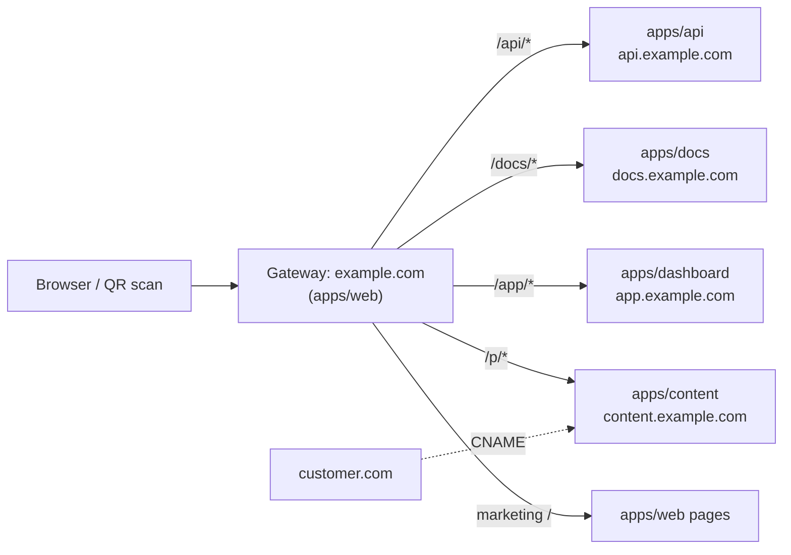
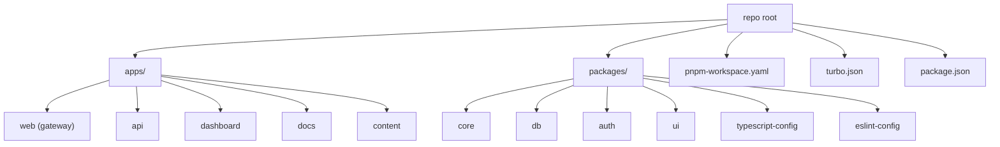
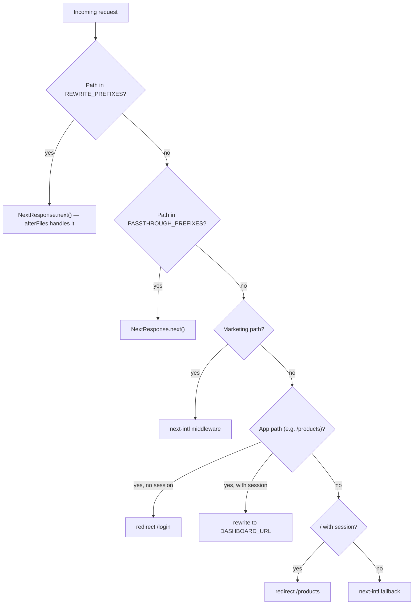
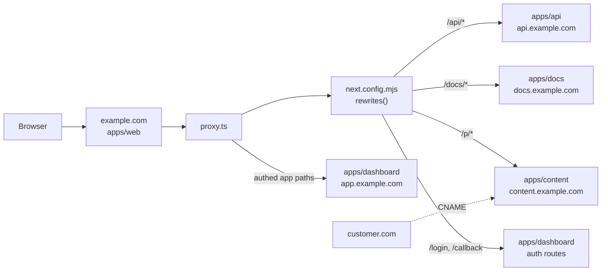

# Multi-Zone Monorepo Blueprint

A portable architecture pattern for shipping a multi-app product as **one root domain backed by many independently deployable Next.js apps**, wired together with pnpm workspaces, Turborepo, and Vercel multi-zone rewrites.

This document is a self-contained blueprint. An engineer (or coding agent) should be able to read it end-to-end and replicate the architecture in a new repository. Concrete code is shown in generic form using `example.com` and placeholder app names. The EUlabel implementation that this pattern was extracted from is included only as a worked example at the end.

---

## TL;DR

- One Git monorepo: `apps/*` are independently deployable Next.js projects, `packages/*` are shared libraries consumed via `workspace:*`.
- One **gateway app** (`apps/web`) owns the root domain (`example.com`). Every other app lives on an internal Vercel project domain (`app.example.com`, `docs.example.com`, etc.) and is exposed under a path prefix on the root domain via Vercel **multi-zone rewrites**.
- A single `proxy.ts` (Next.js 16 proxy / middleware) on the gateway handles auth, i18n, and routing decisions in a fixed priority order before any rewrite runs.
- Internal subdomains either 301-redirect to the canonical root URL or are blocked from indexing with `robots.txt` + `X-Robots-Tag: noindex`. Only the root domain (and a public `api.example.com`) appears in Google.
- Customers can attach their own custom domain to any sub-app via the Vercel Domains API, enabling white-label deployments without forking code.
- Turborepo handles build orchestration, caching, and task dependencies. Shared env vars are managed at the Vercel team level.



---

## When to Use This Pattern

Use this pattern when **two or more** of the following are true:

- You ship multiple distinct surfaces (marketing site, dashboard, public API, docs, content/landing pages) and want them under one brand domain.
- The surfaces have different scaling profiles (high-traffic content vs. auth-gated dashboard) and you want to deploy them independently.
- Different surfaces have different SEO needs (canonical, indexed marketing pages vs. noindexed app shell).
- You want to support **white-label custom domains** for customers.
- Multiple apps share types, schemas, or UI primitives that you would otherwise duplicate.
- You expect different teams or release cadences per app.

**Do not** use this pattern when:

- You only ship a single Next.js app. A single project with route groups is simpler.
- Your apps share so much state that they should really be one app. Multi-zone rewrites do **not** share React state across zones.
- You need true microservices in different runtimes. Multi-zone is a Next.js / Vercel pattern.

---

## Repository Layout

```text
.
├── apps/
│   ├── web/                # Gateway: owns example.com, marketing, proxy/rewrites
│   ├── api/                # Public REST API on api.example.com
│   ├── dashboard/          # Auth-gated app on app.example.com, served under /
│   ├── docs/               # Documentation on docs.example.com, served under /docs
│   └── content/            # Public content pages on content.example.com, served under /p
├── packages/
│   ├── core/               # Domain types, business logic, shared config
│   ├── db/                 # ORM schema, migrations, query helpers
│   ├── auth/               # Session/cookie helpers, permission checks
│   ├── ui/                 # Shared component library (shadcn/Tailwind)
│   ├── eslint-config/      # Shared ESLint config
│   └── typescript-config/  # Shared tsconfig presets
├── pnpm-workspace.yaml
├── turbo.json
└── package.json
```

### `pnpm-workspace.yaml`

```yaml
packages:
  - "apps/*"
  - "packages/*"
```

### Naming conventions

- App folder name == Vercel project name where possible (`apps/web` → Vercel project `web`).
- Shared packages are scoped under one workspace prefix (`@workspace/*` or `@your-org/*`) and depend on each other via `"@workspace/core": "workspace:*"`.
- Two URL conventions for env vars (covered below):
  - `*_BASE_URL` — public canonical URL (used by shared config and emitted to consumers).
  - `*_URL` — internal Vercel project domain used as a rewrite destination.

---

## The Gateway App

One app — by convention `apps/web` — owns the root domain. It has three jobs:

1. Serve its own pages (marketing, legal, locale roots, etc.).
2. **Rewrite** path prefixes to upstream Vercel projects (multi-zone).
3. Run a **proxy** (`proxy.ts`) that decides per-request whether to pass through, redirect, rewrite to a sub-app, or apply i18n routing.

Everything else flows through it. Sub-apps almost never set rewrites of their own; they only see the slice of paths the gateway sends them.

### Why a single gateway

- One place to enforce auth, geo, and locale decisions.
- One place for security headers, HSTS, `Permissions-Policy`, etc.
- The browser URL stays on the canonical root domain — no flicker, no cross-origin cookie problems for the user-visible flow.
- Sub-apps stay focused on their own content. They do not need to know about each other.

---

## Multi-Zone Rewrites

A Vercel multi-zone rewrite is a transparent edge proxy. The browser URL stays at `example.com/docs/foo` while Vercel routes the request to the upstream Vercel project that serves the docs app.

Rewrites live in the **gateway's** `next.config.mjs`. Destinations are environment-driven so each Vercel environment (preview, production) points at the correct upstream project.

```js
// apps/web/next.config.mjs
const apiUrl = process.env.API_URL || "http://localhost:3002";
const dashUrl = process.env.DASHBOARD_URL || "http://localhost:3003";
const docsUrl = process.env.DOCS_URL || "http://localhost:3004";
const contentUrl = process.env.CONTENT_URL || "http://localhost:3005";

/** @type {import('next').NextConfig} */
const nextConfig = {
  transpilePackages: ["@workspace/ui", "@workspace/core"],

  async rewrites() {
    return {
      // beforeFiles: run before file-based routes; use for content negotiation
      // and other "rewrite based on headers" cases.
      beforeFiles: [
        {
          source: "/",
          has: [{ type: "header", key: "accept", value: "(.*)text/markdown(.*)" }],
          destination: "/md",
        },
      ],

      // afterFiles: standard prefix proxies to upstream Vercel projects.
      afterFiles: [
        { source: "/api/:path*",      destination: `${apiUrl}/api/:path*` },
        { source: "/docs",            destination: `${docsUrl}/docs` },
        { source: "/docs/:path*",     destination: `${docsUrl}/docs/:path*` },
        { source: "/p/:path*",        destination: `${contentUrl}/p/:path*` },
        { source: "/login",           destination: `${dashUrl}/login` },
        { source: "/signup",          destination: `${dashUrl}/signup` },
        { source: "/callback",        destination: `${dashUrl}/callback` },
        { source: "/logout",          destination: `${dashUrl}/logout` },
      ],
    };
  },
};

export default nextConfig;
```

### Rewrite vs. redirect — the rule of thumb

| Goal | Use |
| --- | --- |
| Serve another app's content under a path of the gateway, browser URL stays on the gateway | **Rewrite** |
| Force a permanent canonical URL change (e.g. internal subdomain → root) | **Redirect (301)** at the platform level (Vercel domain redirect), not in app code |
| Conditional routing based on cookies, geo, or auth state | **Proxy / middleware**, not rewrite (rewrites are static) |

### `beforeFiles` vs. `afterFiles`

- `beforeFiles` runs **before** file-system routes resolve. Use it for content negotiation by header (e.g., serve markdown when `Accept: text/markdown`).
- `afterFiles` runs **after** local files are checked. Use it for "if no local route matched, send this prefix to another zone." This is where multi-zone rewrites belong.

> **Pitfall.** `afterFiles` rewrites are evaluated at build time and are static. They cannot read cookies. Anything cookie-conditional must happen in the proxy.

---

## Auth-Aware Proxy (`proxy.ts`)

The proxy runs on every request that matches its `config.matcher`. Use a **strict priority ladder**: the first rule that matches wins. This avoids the most common multi-zone bug (loops caused by one rule undoing another's decision).

```ts
// apps/web/proxy.ts
import createMiddleware from "next-intl/middleware";
import { NextResponse, type NextRequest } from "next/server";
import { SESSION_COOKIE_NAME } from "@workspace/auth/session";
import { routing } from "./i18n/routing";

const DASHBOARD_URL = process.env.DASHBOARD_URL || "http://localhost:3003";

/** Paths handled by `afterFiles` rewrites — proxy must not touch them. */
const REWRITE_PREFIXES = ["/api/", "/docs", "/p/"];

/** Auth routes forwarded to the dashboard without i18n processing. */
const PASSTHROUGH_PREFIXES = ["/login", "/signup", "/callback", "/logout"];

/** Public marketing pages that need next-intl. */
const MARKETING_PATHS = ["/home", "/privacy", "/terms"];

/** Authenticated app routes living under the gateway URL. */
const APP_PATHS = ["/products", "/settings"];

const handleI18nRouting = createMiddleware(routing);

const startsWith = (path: string, prefix: string) =>
  path === prefix || path.startsWith(prefix + "/");

export default function proxy(request: NextRequest) {
  const { pathname } = request.nextUrl;

  // 1. Multi-zone — let afterFiles rewrites handle these.
  if (REWRITE_PREFIXES.some((p) => pathname.startsWith(p))) {
    return NextResponse.next();
  }

  // 2. Auth routes — pass through to dashboard auth handlers.
  if (PASSTHROUGH_PREFIXES.some((p) => startsWith(pathname, p))) {
    return NextResponse.next();
  }

  // 3. Marketing — i18n locale detection and prefixing.
  if (MARKETING_PATHS.some((p) => startsWith(pathname, p))) {
    return handleI18nRouting(request);
  }

  const hasSession = request.cookies.has(SESSION_COOKIE_NAME);

  // 4. Authenticated app paths — rewrite to the dashboard app.
  if (APP_PATHS.some((p) => startsWith(pathname, p))) {
    if (!hasSession) {
      return NextResponse.redirect(new URL("/login", request.url));
    }
    return NextResponse.rewrite(new URL(pathname, DASHBOARD_URL));
  }

  // 5. / with session — send users to their app home.
  if (hasSession && pathname === "/") {
    return NextResponse.redirect(new URL("/products", request.url));
  }

  // 6. Fallback — i18n for the marketing locale roots.
  return handleI18nRouting(request);
}

export const config = {
  // Skip Next/Vercel internals and static assets.
  matcher: "/((?!api|_next|_vercel|.*\\..*).*)",
};
```

### Key rules

- **Rewrite paths come first.** Anything destined for another zone must short-circuit before any auth, i18n, or redirect logic, otherwise the proxy can intercept its own rewrite and loop.
- **Auth checks are scoped** to the specific path prefixes that need them. Do not run an auth check on every request — you will create redirect loops with i18n on locale roots.
- **`/` with a session redirects** rather than rewrites. Static rewrites cannot be cookie-conditional, and the gateway's own `app/page.tsx` may not exist if all root content is locale-prefixed.
- **Redirects use `request.url`** (not the rewrite destination) so the browser stays on the canonical host.

---

## Sub-App Conventions

Each sub-app is a normal Next.js project with these adaptations:

### 1. Set `basePath` if served under a path prefix

If the gateway exposes the docs app under `/docs`, the docs app must set `basePath: "/docs"` so its internal links, asset URLs, and `redirect()` calls resolve correctly when accessed through the gateway.

```js
// apps/docs/next.config.mjs
const nextConfig = {
  basePath: "/docs",
  async redirects() {
    return [
      // basePath: false escapes the auto-prefix when needed.
      { source: "/", destination: "/docs", permanent: false, basePath: false },
    ];
  },
};
```

### 2. Keep routes flat — avoid double-nesting

`basePath` auto-prefixes **every** route. If you also nest your routes under a folder of the same name, you double up.

| App folder path | basePath | Served at | Result |
| --- | --- | --- | --- |
| `app/[[...slug]]/page.tsx` | `/docs` | `/docs/[slug]` | Correct |
| `app/docs/[[...slug]]/page.tsx` | `/docs` | `/docs/docs/[slug]` | Wrong — loops |

Keep app routes at the project root; let `basePath` provide the single prefix.

### 3. Subdomain root returns 404 by design

With `basePath: "/docs"`, `docs.example.com/` has no route. That is correct. Either:

- Add a `redirect()` from `/` to `/docs` with `basePath: false`, **or**
- Configure the subdomain as a Vercel domain redirect to `example.com/docs/...` (preferred — see SEO section).

### 4. Sub-apps do not duplicate gateway logic

Sub-apps should not implement i18n routing, auth gates, or rewrites that overlap with the gateway. They run inside a slice of the URL space; the gateway already decided this request belongs to them.

---

## Two URL Conventions

The codebase uses two parallel sets of URL environment variables. Keep them straight:

| Naming | Audience | Example | Where it points |
| --- | --- | --- | --- |
| `*_BASE_URL` | **Public**, consumer-facing. Used by shared config (e.g. `packages/core/config/domains.ts`) to build links, QR codes, OAuth redirect URIs, OG image URLs. | `WEB_BASE_URL=https://example.com` | The canonical root domain. |
| `*_URL` | **Internal**. Used by `apps/web/next.config.mjs` rewrites and `proxy.ts` to forward traffic to upstream Vercel projects. | `DOCS_URL=https://docs.example.com` | The internal Vercel project domain. |

This split matters because:

- The user must always see and share root-domain links (`example.com/docs/quickstart`), so anything that emits a link uses `*_BASE_URL`.
- The gateway must know the **actual** Vercel project to forward to, which lives at a different domain (`docs.example.com`), so rewrite destinations use `*_URL`.

If you collapse them into one variable, you eventually leak internal subdomains into emails, sitemaps, or QR codes.

---

## Vercel Project Topology

| Concern | Setup |
| --- | --- |
| Vercel projects | One per `apps/*` folder. `vercel link` from inside each app directory. |
| Root domain | Attached to the gateway project only. |
| Sub-app domains | Each gets an internal subdomain (`app.example.com`, `docs.example.com`, ...). |
| Public API subdomain | `api.example.com` is the one sub-app that is intentionally consumer-facing. APIs are fine on subdomains; SEO does not apply. |
| Env vars per project | Project-specific values (e.g. `WORKOS_REDIRECT_URI` only on dashboard). |
| Shared env vars | Defined once in **Vercel Team Settings → Environment Variables** and linked to each project that needs them. Examples: `DATABASE_URL`, `SESSION_SECRET`, `WORKOS_API_KEY`. |
| Local development | `vercel env pull .env.local` from each app directory after `vercel link`. |

### Why one Vercel project per app

- Independent deploys, independent rollbacks, independent build caches.
- Per-project environment variables and access control.
- Each project gets its own preview URL per branch (`app-git-feature-x.vercel.app`), useful for cross-app preview testing.
- Vercel's "Project Production URL" can be passed back into the gateway as the rewrite destination, so previews compose cleanly.

### Linking previews across zones

When the gateway has a preview build pointing at `DOCS_URL=https://docs.example.com`, a docs preview deploy will not be reachable through the gateway preview unless you wire `DOCS_URL` per branch. In practice, most teams accept that **preview testing of a sub-app happens on its own preview URL**, while gateway previews use production sub-app URLs as rewrite destinations.

---

## SEO Protection of Internal Subdomains

Internal subdomains are not user-facing. They must not appear in Google. There are two strategies; pick per sub-app.

| Strategy | Use when | How |
| --- | --- | --- |
| **301 redirect to canonical root URL** | The sub-app serves HTML content that has an equivalent root-domain URL. Google follows the 301, transfers ranking signals, and removes the old URL. | Configure the subdomain as a **redirect domain** in the Vercel dashboard for that project. |
| **`robots.txt` Disallow + `X-Robots-Tag: noindex`** | The sub-app is auth-gated, returns API responses, or has nothing meaningful at a canonical equivalent. | Add `app/robots.ts` returning `Disallow: /`, plus a `headers()` entry returning `X-Robots-Tag: noindex` on every response. |

### Why **not** redirect from `proxy.ts`

A code-based 301 inside the sub-app's proxy creates an infinite loop with multi-zone rewrites:

```text
example.com/docs/foo
  → (gateway rewrite)        → docs.example.com/docs/foo
  → (sub-app proxy 301)      → example.com/docs/foo
  → loop
```

The sub-app cannot reliably distinguish a direct visit from a rewritten request. Vercel sets `x-forwarded-host` to the destination host (the sub-app's own domain) for both, per a [known Next.js issue](https://github.com/vercel/next.js/issues/67469).

The fix is to **let Vercel handle the redirect at the edge, before the request reaches the app**. Multi-zone rewrites bypass domain-level redirects because they target the project directly.

| Request origin | What happens |
| --- | --- |
| Direct visit `docs.example.com/quickstart` | Vercel edge 301 → `example.com/docs/quickstart` |
| Rewrite from `example.com/docs/quickstart` | Bypasses domain redirect, sub-app serves content |

Also set `metadataBase` in the sub-app's root `layout.tsx` to the canonical URL (`https://example.com/docs`) so `<link rel="canonical">` and OG URLs are correct.

---

## White-Label Custom Domains

The Vercel Domains API lets customers attach their own domain to any of your sub-apps, enabling white-label deployments without a separate codebase.

### Setup flow

1. Customer registers their domain in your dashboard.
2. Your API calls the Vercel Domains API to add the domain to the relevant Vercel project (e.g. the content sub-app).
3. Customer adds a `CNAME` from their domain to the Vercel target (`cname.vercel-dns.com`).
4. Vercel verifies ownership and provisions a TLS certificate automatically.
5. Requests to `customer.com/...` are served directly by the sub-app's Vercel project.

### Identifier-based routing

Design your URLs so the **identifier**, not the domain, carries meaning. For example, a content URL of the form `/p/{productId}` works on `example.com/p/abc`, `customer.com/p/abc`, and `label.customer.com/p/abc` — all three resolve to the same content because the sub-app reads the path, not the host.

This decouples physical artifacts (printed QR codes, links in emails, partner integrations) from your domain choices. It also lets a customer change their domain without invalidating any previously issued URLs.

### Bypassing canonical redirects for white-label domains

If `content.example.com` is configured as a redirect domain (SEO strategy 1), make sure the redirect rule applies only to that one host, not to all attached domains. Custom customer domains must serve content directly.

---

## Cookie and Session Sharing

When the gateway authenticates a user, the session cookie must also be readable on the sub-app's own domain (for direct access, debugging, and the OAuth callback round trip).

| Property | Value |
| --- | --- |
| Cookie name | `your_app_session` (one name across all apps) |
| Encryption | iron-session, JWE, or equivalent encrypted + signed cookie |
| Domain | `.example.com` (leading dot) in production, unset in local dev |
| `Secure` | `true` in production |
| `HttpOnly` | `true` |
| `SameSite` | `lax` |
| Max age | 7 days, refreshed on each request |

The leading dot (`.example.com`) makes the cookie readable on the apex (`example.com`, where the gateway runs) **and** every subdomain (`app.example.com`, `api.example.com`). Locally, leave the domain unset so it scopes to `localhost`.

The cookie is set by **whichever app handles the OAuth callback**. The callback should redirect the user back to the canonical root (`example.com`), not to its own subdomain, so the user lands where the gateway can read the cookie.

---

## Turborepo Wiring

```json
// turbo.json
{
  "$schema": "https://turbo.build/schema.json",
  "ui": "tui",
  "globalEnv": [
    "DATABASE_URL",
    "SESSION_SECRET",
    "API_URL",
    "DASHBOARD_URL",
    "DOCS_URL",
    "CONTENT_URL",
    "WEB_BASE_URL",
    "API_BASE_URL",
    "DOCS_BASE_URL"
  ],
  "tasks": {
    "build":     { "dependsOn": ["^build"], "inputs": ["$TURBO_DEFAULT$", ".env*"], "outputs": [".next/**", "!.next/cache/**"] },
    "lint":      { "dependsOn": ["^lint"] },
    "format":    { "dependsOn": ["^format"] },
    "typecheck": { "dependsOn": ["^typecheck"] },
    "test":      { "dependsOn": ["^build"] },
    "dev":       { "cache": false, "persistent": true },
    "db:generate": { "cache": false },
    "db:migrate":  { "cache": false },
    "db:push":     { "cache": false },
    "db:studio":   { "cache": false, "persistent": true }
  }
}
```

### `globalEnv` is critical for rewrite URLs

Rewrite destinations (`API_URL`, `DOCS_URL`, etc.) are read at **build time** by `next.config.mjs` and baked into the build output. If you change one in Vercel without listing it in `globalEnv`, Turbo's remote cache will serve the old build with the old URL.

Listing them in `globalEnv` makes Turbo invalidate the cache when any of them change. If you ever change a rewrite destination and the old URL still appears in production responses, the fix is **Vercel → Deployments → Redeploy → check "Clear Cache"**.

### `transpilePackages`

Each app's `next.config.mjs` must transpile any workspace package it imports:

```js
const nextConfig = {
  transpilePackages: ["@workspace/ui", "@workspace/core", "@workspace/auth"],
};
```

Without this, Next.js tries to import compiled output from `node_modules` and fails because workspace packages ship as TypeScript source.

---

## Shared `packages/*`

A minimal recommended set:

| Package | Purpose | Notes |
| --- | --- | --- |
| `@workspace/core` | Domain types, business logic, shared config (`config/domains.ts`, `config/env.ts`). | Pure TS, no React. Consumed by every app. |
| `@workspace/db` | ORM schema, migrations, query helpers. | Owns the database. Apps import query functions, not raw SQL. |
| `@workspace/auth` | Cookie/session helpers, permission checks, current-user resolution. | Wraps your auth provider (WorkOS, Clerk, NextAuth, etc.) so apps share one session shape. |
| `@workspace/ui` | Shared component library — shadcn/ui primitives, Tailwind theme, app-agnostic components. | Re-exports from `@workspace/ui/components/*`. |
| `@workspace/eslint-config` | Shared ESLint flat config. | Apps and packages extend it. |
| `@workspace/typescript-config` | Shared `tsconfig.json` presets (base, next, react-library). | |

### Apps depend via `workspace:*`

```json
// apps/web/package.json
{
  "dependencies": {
    "@workspace/auth": "workspace:*",
    "@workspace/core": "workspace:*",
    "@workspace/ui":   "workspace:*"
  }
}
```

pnpm symlinks the workspace package into `node_modules`. Edits to `packages/*` are picked up immediately by every app in `pnpm dev`.

### Adding shadcn components into `packages/ui`

```bash
pnpm dlx shadcn@latest add button -c apps/web
```

The CLI is run from one app for context, but components are placed in `packages/ui/src/components` and imported anywhere via `@workspace/ui/components/button`.

---

## Local Development

### Port allocation

Pick a stable port per app and bake it into local defaults so the gateway's rewrites work out of the box without env files.

| App | Port |
| --- | --- |
| `apps/web` (gateway) | 3000 |
| `apps/api` | 3001 (or 3002 if you prefer aligning with Vercel's defaults) |
| `apps/dashboard` | 3003 |
| `apps/docs` | 3004 |
| `apps/content` | 3005 |

Defaults in the gateway's `next.config.mjs`:

```js
const docsUrl = process.env.DOCS_URL || "http://localhost:3004";
```

### Run one or all apps

```bash
pnpm install                       # install everything
pnpm dev                           # all apps in parallel via Turborepo
pnpm dev --filter web              # just the gateway
pnpm dev --filter docs             # just the docs sub-app
pnpm build --filter dashboard...   # build dashboard and its workspace deps
```

### Per-app env files

Each app has its own `.env.example` documenting what it needs. After `vercel link` per app:

```bash
cd apps/web && vercel env pull .env.local
cd ../docs && vercel env pull .env.local
```

`.env.local` is gitignored; `.env.example` is committed.

---

## Common Failure Modes

| Symptom | Cause | Fix |
| --- | --- | --- |
| `DNS_HOSTNAME_RESOLVED_PRIVATE` on a rewritten path | Rewrite URL env var unset, defaulting to `localhost` in production. | Set `DOCS_URL` (etc.) on the gateway Vercel project and redeploy with **Clear Cache**. |
| `ERR_TOO_MANY_REDIRECTS` on a sub-app path (e.g. `/docs`) | Either the sub-app's `proxy.ts` is 301-ing rewritten requests, or routes are double-nested under `app/<basePath>/...`. | Move the redirect to a **Vercel domain redirect**; flatten routes to `app/[[...slug]]/`. |
| `ERR_TOO_MANY_REDIRECTS` on an authed gateway path | Unauthenticated request fell through to i18n middleware, which prefix-redirected back into the same path. | In the proxy, redirect unauthenticated users to `/login` **before** running i18n. |
| 404 on `/` for authenticated users | Proxy passed through with `NextResponse.next()` but the gateway has no `app/page.tsx` (all pages live under `app/[locale]/`). | Redirect authenticated `/` to a real route (`/products`) instead of passing through. |
| 404 on a sub-app's subdomain root (e.g. `docs.example.com/`) | With `basePath: "/docs"`, the app root is at `/docs`, not `/`. | Expected. Configure a Vercel domain redirect from the subdomain to `example.com/docs`. |
| Stale rewrite destinations after env var change | Turbo remote cache served an old build with the old baked-in URL. | Add the var to `turbo.json` `globalEnv`; redeploy with **Clear Cache**. |
| Cookie set on dashboard not visible on gateway | Cookie domain not set, or set to a host instead of `.example.com`. | Set `Domain=.example.com` in production; leave unset in local dev. |
| Internal subdomain showing up in Google | Neither SEO strategy applied, or `proxy.ts` 301 created a loop and gave up. | Configure the subdomain as a Vercel **redirect domain**, or add `robots.txt` + `X-Robots-Tag: noindex`. |

---

## Adoption Checklist

Apply this pattern to a new repo in roughly this order:

1. **Bootstrap the workspace.** `pnpm init`, add `pnpm-workspace.yaml`, create `apps/` and `packages/` folders, install Turborepo, write `turbo.json` with the standard pipeline.
2. **Create shared config packages.** `packages/typescript-config`, `packages/eslint-config`. Get a clean `pnpm typecheck` and `pnpm lint` on an empty workspace.
3. **Scaffold the gateway.** `apps/web` with Next.js, `transpilePackages`, the security headers, an empty `proxy.ts`, and one `rewrites()` block.
4. **Add a second app.** `apps/docs` (or whichever is least entangled with auth). Set its `basePath` if served under a path prefix. Wire one rewrite from gateway → docs.
5. **Create `packages/core`.** Move shared types, the URL config (`*_BASE_URL` getters), and constants here. Import from both apps.
6. **Add the database and auth packages.** `packages/db` (ORM + migrations), `packages/auth` (session helpers). Run a dev migration locally.
7. **Stand up the auth-gated app.** `apps/dashboard`. Implement the auth callback route. Decide which app owns `/login`, `/signup`, `/callback`, `/logout` (usually the dashboard) and add passthrough rewrites on the gateway.
8. **Implement `proxy.ts`.** Encode the priority ladder. Test each branch with explicit unit tests if possible.
9. **Create Vercel projects.** One per app. `vercel link` from each app dir. Attach the root domain to the gateway and an internal subdomain to each sub-app.
10. **Set Shared Environment Variables.** `DATABASE_URL`, `SESSION_SECRET`, auth provider keys at the team level, linked to every project that needs them.
11. **Set rewrite-destination env vars on the gateway.** `API_URL`, `DOCS_URL`, etc., pointing at the sub-app Vercel project domains. List all of them in `turbo.json` `globalEnv`.
12. **Apply SEO protection to internal subdomains.** Vercel domain redirect for content sub-apps; `robots.txt` + `X-Robots-Tag: noindex` for auth-gated and API-only sub-apps.
13. **Configure cookie domain.** `.example.com` in production, unset locally. Verify the session round-trips between gateway and dashboard.
14. **Optional: enable white-label.** Wire up the Vercel Domains API for customer-attached domains. Make sure URLs in the white-labeled app are identifier-based, not domain-based.

When the checklist is complete, `pnpm dev` should bring up all apps, requests to `localhost:3000/...` should reach every sub-app via rewrites, and Vercel preview deploys should compose the same way using preview env vars.

---

## Worked Example: EUlabel

This blueprint was extracted from the EUlabel codebase. Below is the mapping from generic placeholders to the concrete EUlabel apps and domains. See the linked existing pages for deeper, EUlabel-specific detail.

| Generic | EUlabel | Notes |
| --- | --- | --- |
| `example.com` | `eulabel.eu` | Root domain owned by `apps/web`. |
| `apps/web` (gateway) | [`apps/web`](apps/web) | Marketing + multi-zone gateway + i18n + auth proxy. |
| `apps/api` | [`apps/api`](apps/api) | Public REST API on `api.eulabel.eu`. |
| `apps/dashboard` | [`apps/dashboard`](apps/dashboard) | Brand dashboard on `app.eulabel.eu`, served under `/{orgSlug}/...`. |
| `apps/docs` | [`apps/docs`](apps/docs) | FumaDocs site on `docs.eulabel.eu`, served under `/docs`. |
| `apps/content` | [`apps/passport`](apps/passport) | Consumer-facing Digital Product Passport pages on `passport.eulabel.eu`, served under `/p/{productId}`. |
| (extra) | [`apps/resolver`](apps/resolver) | GS1-conformant Digital Link resolver on `id.eulabel.eu`, served under `/01/{gtin}`. EUlabel-specific. |
| `customer.com` | `label.brand.com` | White-label resolver and passport via Vercel Domains API. |

EUlabel-specific concerns covered in the existing architecture pages:

- Full domain map, multi-zone rewrites, SEO strategy, cookie config, white-label flow, Turbo cache pitfalls, basePath nesting bug — [`_docs/70_engineering_architecture/domain-routing.md`](_docs/70_engineering_architecture/domain-routing.md).
- Apps and packages list with status, design decisions, dev scripts — [`_docs/70_engineering_architecture/monorepo-structure.md`](_docs/70_engineering_architecture/monorepo-structure.md).
- GS1 Digital Link resolver semantics — [`_docs/70_engineering_architecture/resolver-system.md`](_docs/70_engineering_architecture/resolver-system.md).
- Stack-wide technology choices and rationale — [`_docs/70_engineering_architecture/stack-decisions.md`](_docs/70_engineering_architecture/stack-decisions.md).

The proxy ladder shown in this blueprint is a simplified version of the EUlabel proxy. The real one in [`apps/web/proxy.ts`](apps/web/proxy.ts) also handles org-slug routing, country-based locale hints, and legacy redirect compatibility.

---

## Visual Reference

### Repository layout



### Proxy priority ladder



### Request flow across zones



---

## Sources

| Source | File |
| --- | --- |
| Apps and packages inventory, scripts, design decisions | [`_docs/70_engineering_architecture/monorepo-structure.md`](_docs/70_engineering_architecture/monorepo-structure.md) |
| Multi-zone rewrites, SEO strategy, cookie/session, white-label, basePath and Turbo cache pitfalls | [`_docs/70_engineering_architecture/domain-routing.md`](_docs/70_engineering_architecture/domain-routing.md) |
| Stack rationale (Next.js as single framework, Vercel for multitenancy) | [`_docs/70_engineering_architecture/stack-decisions.md`](_docs/70_engineering_architecture/stack-decisions.md) |
| Concrete `rewrites()` implementation | [`apps/web/next.config.mjs`](apps/web/next.config.mjs) |
| Concrete proxy with priority ladder | [`apps/web/proxy.ts`](apps/web/proxy.ts) |
| `basePath` example | [`apps/docs/next.config.mjs`](apps/docs/next.config.mjs) |
| Workspace and pipeline configuration | [`pnpm-workspace.yaml`](pnpm-workspace.yaml), [`turbo.json`](turbo.json), [`package.json`](package.json) |
| Documentation conventions this page follows | [`.cursor/rules/documentation-writing.mdc`](.cursor/rules/documentation-writing.mdc) |
