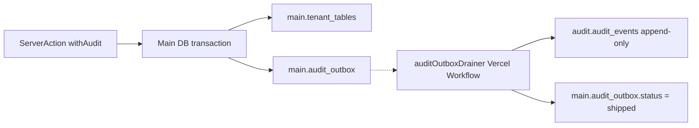

# ADR-003: Tenancy Isolation — Neon RLS with `withOrgContext()`

## Status

Accepted

## Date

2026-04-22

## Context

Eleva is a multi-tenant marketplace with strict isolation needs between organizations (clinics, solo-expert orgs, patient orgs). A cross-tenant data leak in a health context is catastrophic — ERS, GDPR, and trust consequences.

We need tenancy isolation that is defense-in-depth: RBAC at the app layer plus physical row-level isolation at the DB layer.

## Decision

- **Neon Postgres** with Row-Level Security (RLS) on every tenant-scoped table.
- Enforcement via **`withOrgContext()`** helper in `packages/db`. Every query runs inside `withOrgContext(orgId, fn)`, which opens a transaction, runs `SET LOCAL eleva.org_id = '...'`, then executes `fn`.
- RLS policies on tenant-scoped tables check `current_setting('eleva.org_id', true) = org_id::text`.
- **Two Neon projects**:
  - `eleva_v3_main` — application data
  - `eleva_v3_audit` — immutable audit stream (append-only, separate policies)

## Alternatives Considered

### Option A — App-layer tenancy only (pass `orgId` everywhere)

- Pros: simpler DB model
- Cons: one missing `where org_id = ?` = cross-tenant leak. Unacceptable for health data.

### Option B — Database-per-tenant

- Pros: maximum isolation
- Cons: operationally prohibitive at marketplace scale; migrations multiply; cost explodes

### Option C — Neon RLS + withOrgContext (chosen)

- Pros: defense-in-depth, policy-enforced, auditable, scales linearly
- Cons: more query-discipline overhead; requires integration test that asserts isolation

## Audit Write Pipeline — Outbox Pattern

Two Neon projects give physical separation for compliance, but they cannot participate in a cross-DB transaction. To preserve transactional integrity between domain mutations and their audit events, we use a **transactional outbox** inside `eleva_v3_main` with an asynchronous drainer to `eleva_v3_audit`.

### Shape

### Rules

- Every mutating server action is wrapped in `withAudit(action, entity, fn)` from `@eleva/audit`. The wrapper executes `fn` inside a main-DB transaction that writes **both** the domain rows and an `audit_outbox` row carrying the audit event's UUID + payload.
- Domain changes and audit intents commit atomically. If the transaction rolls back, neither is visible.
- `auditOutboxDrainer` is a Vercel Workflow (see [ADR-007](./ADR-007-durable-workflows.md)) that reads new outbox rows, writes to `eleva_v3_audit.audit_events` with at-least-once delivery (idempotent on the pre-generated `audit_id` UUID), and marks the outbox row `shipped`.
- Shipped rows are kept for 90 days for reconciliation, then purged by `softDeleteScrubber`.
- Audit rows are never updated or deleted by any runtime role. `UPDATE` / `DELETE` on `eleva_v3_audit.audit_events` is not granted. Neon-level DBA access to alter is itself an auditable event.

### RLS on `eleva_v3_audit`

- `INSERT`: allowed by the drainer's credentials, with `org_id` set explicitly.
- `SELECT`: `USING (current_setting('eleva.org_id', true) = org_id::text OR has_capability('audit:view_all'))` so tenants see only their own events and Eleva operators see all.
- `UPDATE` / `DELETE`: revoked at the role level; no user-facing mutation path.

### Hash chain (optional, Sprint 7 hardening)

Each audit row may carry `prev_hash` (hash of the previous row within the same `org_id`) and `row_hash` (hash of the current row's canonical fields + `prev_hash`). An offline verifier can re-compute the chain to detect tampering. Not a launch requirement; sets up ISO 27001 / SOC 2 integrity-control evidence when auditors ask.

### Compliance-control mapping

| Framework | Control | How this design satisfies it |
| --------- | ------- | ---------------------------- |
| GDPR | Art. 30 (records of processing) | append-only, tenant-scoped audit trail with DSAR-ready queries |
| HIPAA (future US) | 164.312(b) (audit controls) | separate DB + drainer + append-only policies; BAA signed with Neon at production plan |
| ISO 27001 | A.12.4 (logging + monitoring) | hash-chain optional; separate credential scope |
| SOC 2 | CC7.3 (monitoring) | BetterStack heartbeats on drainer; Sentry on exceptions; correlation-ID to every audit row |

## Consequences

- Every `db.select(...)` etc. must pass through `withOrgContext`. Lint + code review enforces.
- Integration test inserts as org A, selects as org B, must return zero rows.
- Cross-org admin queries use a separate `withPlatformAdminContext()` with explicit auditing.
- Every mutating action must go through `withAudit` — CI boundary check rejects server actions that write to domain tables without the wrapper.
- Audit drainer downtime buffers in `main.audit_outbox`; domain writes are never blocked by audit DB unavailability.
- No runtime role can delete or mutate audit rows; DB-level grants make this impossible without DBA action.
- Hash chain is additive; can be turned on in Sprint 7 without migration pain.
- Performance: RLS adds a small overhead; indexes on `(org_id, …)` are mandatory on tenant tables; `audit_outbox` is append-only and read-then-purge, kept small.
- Future HIPAA expansion: architecture unchanged. Sign BAA with Neon at production plan level before onboarding any US-hosted care entity.
