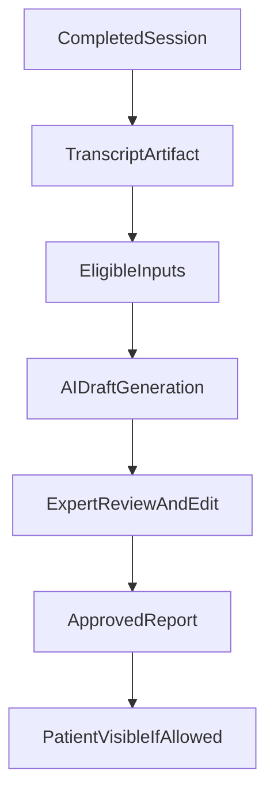

# Eleva.care v3 AI And Reporting Spec

Status: Living

## Purpose

This document defines how AI-assisted workflows and reporting should work in Eleva.care v3.

It should guide:

- transcript handling
- AI-assisted report generation
- prompt and review architecture
- expert workflow design
- consent and audit boundaries

## Product Goals

AI in Eleva should help experts save time and improve workflow quality.

It should not:

- replace expert judgment
- silently publish clinical or customer-facing reports without review
- bypass privacy and consent boundaries

The main AI use cases are:

- transcript summarization
- draft report generation
- structured note extraction
- follow-up suggestion drafting
- customer-facing summary drafting where explicitly allowed

## AI Principles

- Human-in-the-loop by default.
- AI output is a draft until an expert or authorized operator approves it.
- Prompt and model usage should be observable and auditable.
- Sensitive data handling must be explicit.
- AI should be tied to clear product jobs, not added as vague magic.

## Primary Inputs

AI-assisted reporting may use:

- session transcripts
- expert notes
- booking/session metadata
- shared diary data where consent allows
- structured templates and report schemas

## Core AI Outputs

### Draft session report

Represents a report draft generated from approved inputs.

### Draft summary for patient/customer

Represents a customer-facing summary that still requires review if policy demands it.

### Draft follow-up suggestions

Examples:

- likely follow-up topics
- suggested reminder timing
- suggested next appointment

### Structured extraction

Examples:

- action items
- themes
- tracked symptoms or improvement notes

## Workflow Model

Recommended pipeline:

1. session happens
2. transcript becomes available
3. eligible inputs are assembled
4. AI draft is generated
5. expert reviews and edits
6. approved report becomes visible to patient/customer where appropriate

## Role Of Daily

Daily should be treated as the video and transcript source, not the final home of Eleva reporting logic.

Eleva should own:

- report lifecycle
- transcript intake pipeline
- prompt contracts
- output storage rules
- review/approval workflow

## Role Of Vercel AI Gateway

Vercel AI Gateway should be the planned abstraction for:

- model routing
- provider management
- observability and future flexibility

Eleva should define stable internal prompt/output contracts rather than scattering ad hoc calls through the codebase.

## Prompt Contracts

The system should define prompt classes for:

- session-summary draft
- patient-facing summary draft
- expert follow-up suggestion draft
- structured extraction

Each prompt class should have:

- allowed inputs
- output schema
- visibility policy
- reviewer expectations

## Output Review Model

Default rule:

- AI output is not final until reviewed when it affects expert or patient records

This should be especially strict for:

- patient-visible reports
- clinically meaningful summaries
- sensitive structured extraction

## Visibility And Consent

The AI system must respect:

- transcript consent
- diary-data sharing consent
- patient visibility rules
- organization context
- expert permissions

If an input is not authorized for a given context, it must not be included in the generation pipeline.

## Audit Requirements

The system should log:

- which generation type ran
- what authorized inputs were used at a metadata level
- who triggered it
- who reviewed it
- whether the output became patient-visible

Do not log raw sensitive content unnecessarily in general-purpose logs.

## Storage Model

The system should distinguish between:

- transcript artifact
- AI draft
- reviewed/approved report
- final patient-visible report

These are different states and should not be collapsed into one generic text blob.

## Initial Scope

The first build should support:

- transcript ingestion
- one or two high-value draft generation flows
- expert review/edit
- approved report visibility

## Deferred Scope

Later phases may add:

- richer template libraries
- multiple report types per session
- more advanced extraction pipelines
- organization-level reporting analytics

## Open Questions

- which exact report types launch first
- whether customer-facing summaries are launch-critical
- whether transcript storage needs additional retention variants
- whether some session types should disable AI by default

## Related Docs

- [`mobile-integration-spec.md`](./mobile-integration-spec.md)
- [`crm-spec.md`](./crm-spec.md)
- [`compliance-data-governance.md`](./compliance-data-governance.md)
- [`ops-observability-spec.md`](./ops-observability-spec.md)
