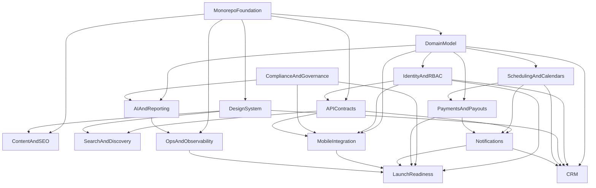

# Eleva.care v3 Dependency Map

Status: Living

## Purpose

This document shows the major dependency structure across the Eleva v3 workstreams.

It is intentionally high-level. It should help the team plan sequencing, staffing, and risk.

## Core Dependency Logic

Some parts of the platform can move in parallel, but several must be established first:

- monorepo and package boundaries
- identity and tenancy
- domain model and schema direction
- booking and payment state model

## Major Dependency Graph

## Dependency Notes

### Foundation dependencies

Everything depends on:

- repo structure
- workspace/package setup
- config and environment model

### Identity dependencies

Many features depend on:

- organizations
- memberships
- role/capability model
- secure session handling

### Scheduling and billing coupling

Scheduling and billing are separate domains, but product correctness depends on both being aligned.

Examples:

- slot reservation and payment sequencing
- refunds and cancellations
- pack/subscription entitlement rules

### Mobile dependencies

Mobile depends on:

- shared auth
- API contracts
- diary visibility model
- notification model

Mobile should not start by bypassing those dependencies.

## Good Parallel Work

Can often proceed in parallel:

- docs/content work and design-system work
- observability baseline and API contract design
- marketplace discovery UX and public content architecture

## High Coordination Areas

Require strong coordination:

- domain model changes
- schema changes
- auth/RBAC changes
- booking/payment state changes
- transcript/AI visibility changes

## Related Docs

- [`roadmap-and-milestones.md`](./roadmap-and-milestones.md)
- [`master-architecture.md`](./master-architecture.md)
- [`workflow-orchestration-spec.md`](./workflow-orchestration-spec.md)
