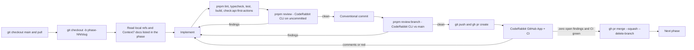

# Eleva.care v3 — End-to-End Execution Plan

Status: Authoritative (supersedes `roadmap-and-milestones.md` and `implementation-sprints.md` for sequencing)

This folder is the **single source of truth for how Eleva v3 gets built and shipped**. It turns the
architecture handbook in `docs/eleva-v3/` into an ordered list of phases. Every phase is one
branch, one pull request, one CodeRabbit review loop, one merge. Every phase ships with a
**copy-paste prompt** that a human or an AI agent can run without any other context.

- Markdown is the SSOT. `index.html` is generated from these files with
  `pnpm docs:execution-plan:html` (do not edit the HTML by hand).
- Each phase lives in `phases/NN-slug.md` and ends with a `## Copy-paste prompt` section.
- The prompts for Phases 1–16 assume the repo is checked out at the monorepo root and that the
  tooling in Phase 0 is merged (`pnpm review`, `pnpm review:branch`, CodeRabbit CLI
  authenticated). Phase 0 bootstraps that tooling, so on a fresh checkout its prompt runs the
  CodeRabbit CLI directly until its own scripts exist: install it from the official
  installation docs (https://docs.coderabbit.ai/cli) — download the installer to a file, read
  it, verify it against the checksum published with the release and only then run it; never
  pipe an unpinned remote script to `sh` — or use a CLI already present on the machine; confirm
  with `coderabbit --version` (>= 0.7) and `coderabbit doctor`, authenticate with
  `coderabbit auth login`, then use `coderabbit review --uncommitted --include-untracked` where
  later phases say `pnpm review` and `coderabbit review --committed --base main` where they say
  `pnpm review:branch` — the Phase 0 prompt states this explicitly.

## 1. What we are building

Eleva.care is an EU-first, Portugal-first digital health marketplace and community. Experts
(clinicians, educators) sell sessions to **members**; clinics (**Teams**) run several experts under
one organization on a per-seat SaaS plan; **Academy** is the education surface. Everything is
multilingual (`pt`, `en`, `es` at launch; `pt-BR` is **retired** as a locale — D-01: `/pt-BR/*`
301s to `/pt/*`, Brazil returns as a content + payments discovery item in Phase 16.2), API-first
and agentic-first, and built to
HIPAA/GDPR/ERS-Portugal standards.

End state of this plan (production, `eleva.care` DNS switched from the MVP):

| Surface                                | App            | Audience                     | Must work end to end                                                                           |
| -------------------------------------- | -------------- | ---------------------------- | ---------------------------------------------------------------------------------------------- |
| Marketing + discovery + booking funnel | `apps/web`     | Public                       | Explore experts, view profile, pick slot, pay, receive confirmation                            |
| Member product                         | `apps/app`     | Members                      | Sessions, join video, receipts, reports, preferences, DSAR                                     |
| Expert product                         | `apps/expert`  | Solo experts, clinic experts | Onboarding, Stripe Connect, availability, event types, calendars, sessions, finance, invoicing |
| Clinic product                         | `apps/team`    | Clinic admins                | Members/seats, SaaS billing, clinic page, attribution                                          |
| Academy                                | `apps/academy` | Learners                     | Landing + org type only at launch                                                              |
| Account hub                            | `apps/account` | Everyone                     | Sign in/up, 2FA, passkeys, sessions, org switcher, workspace creation                          |
| Admin console                          | `apps/admin`   | Eleva staff                  | Users, Become-Partner queue, payouts, subscriptions, accounting, webhooks, DLQ, audit          |
| API                                    | `apps/api`     | All apps + agents            | Better Auth, REST + OpenAPI, Stripe/Daily webhooks, QStash workflows                           |
| Docs                                   | `apps/docs`    | Developers, compliance       | API reference + guides + ERS/compliance pages                                                  |

Money must flow correctly: Stripe Connect Express payouts to experts, platform fee retained by
Eleva, **a TOConline invoice issued by Eleva to the expert for the platform fee on every paid
booking (Tier 1)**, and the expert's own invoice to the member issued through their connected
fiscal software (Tier 2: TOConline, Moloni, or manual export).

## 2. Locked decisions (frozen for this plan)

These are recorded as ADRs in Phase 1. Do not re-open them inside a phase prompt; open a
`decision-log.md` entry and a new ADR instead.

| #           | Decision                                                                                                                                                                                                                                                                                                                                                                                                                                                                          | Replaces                                               |
| ----------- | --------------------------------------------------------------------------------------------------------------------------------------------------------------------------------------------------------------------------------------------------------------------------------------------------------------------------------------------------------------------------------------------------------------------------------------------------------------------------------- | ------------------------------------------------------ |
| ADR-017     | **Identity = self-hosted Better Auth** in `apps/api` at `api.eleva.care/auth/*`, Drizzle adapter, `auth` schema on the main Neon project. Plugins: `organization`, `admin`, `twoFactor`, `passkey`, `magicLink`, `bearer`, `jwt`, `apiKey`, `openAPI`, `nextCookies`. Neon _managed_ Better Auth rejected (Beta, partial org plugin, no MFA/hooks).                                                                                                                               | WorkOS AuthKit + RBAC + Widgets                        |
| ADR-018     | **Video = Daily.co only** (HIPAA-enabled domain `elevacare.daily.co`, branded `sessions.eleva.care`). Google/Microsoft calendars remain for busy-time + destination sync only.                                                                                                                                                                                                                                                                                                    | Google Meet links                                      |
| ADR-019     | **MVP data migration + DNS cutover**: import users/orgs/experts/bookings/payout ledger/records from the MVP Neon DB; same Stripe platform account so Connect accounts and customers carry over.                                                                                                                                                                                                                                                                                   | Greenfield relaunch                                    |
| ADR-020     | **Envelope encryption without a vault**: `@eleva/encryption` = AES-256-GCM, per-org DEK wrapped by a versioned KEK from env, `org_data_keys` table, crypto-shred = delete DEK. OAuth tokens encrypted by Better Auth (`account.encryptOAuthTokens`).                                                                                                                                                                                                                              | WorkOS Vault + Pipes                                   |
| ADR-021     | **RBAC SSOT in code**: `packages/auth/src/permissions.ts` (`createAccessControl` statements + roles). Product label = `(organization.type, member.role)`.                                                                                                                                                                                                                                                                                                                         | `infra/workos/rbac-config.json`, `widgets-config.json` |
| ADR-022     | **UI primitives = Adobe React Aria Components** (shadcn `aria-luma` style) in `@eleva/ui`; Radix is not a dependency outside the two documented exceptions (WorkOS Widgets peer until Phase 3; Plate UI inside `packages/editor`, ADR-023).                                                                                                                                                                                                                                       | Radix-based shadcn primitives                          |
| ADR-023     | **Rich text = Plate** in a single `@eleva/editor` package (Plate JSON in `jsonb` + server-derived sanitized HTML + plain text; `platejs`/`@platejs/*`/`slate*`/`@radix-ui/*` importable only there); AI writing help (improve, shorten, translate) through `@eleva/ai` over the Vercel AI Gateway; consumers: event-type descriptions and bios (4B), clinical notes, reports and the template library (10), clinic pages (11). Written in Phase 1, first implemented in Phase 4B. | Ad-hoc textareas / Markdown editors per app            |
| Offer model | **Event type = service; delivery modes carry how/where/language/price/schedule** (`event_type_modes`, `expert_practice_locations`, named `schedules`, `booking_links`, expert practice scope) — `scheduling-booking-spec.md` is the SSOT; enforced in `@eleva/scheduling`, authored in Phase 4B, bookable from Phase 4.                                                                                                                                                           | Single `session_mode`/`worldwide_mode` per event type  |
| Unchanged   | Neon x2 (main + audit) + RLS + audit outbox; Stripe hybrid monetization (15% -> 8% Top Expert 29 EUR/mo; clinics 99+39/seat, 199+29/seat, 0% commission); TOConline Tier 1/2; two-lane notifications (Resend + Twilio EU + in-app; Novu retired); Vercel Flags; Vercel AI Gateway; Fumadocs; `eleva.care` gateway rewrites; pnpm + Turborepo.                                                                                                                                     | —                                                      |

## 3. Current state (why phases are ordered this way)

The monorepo is roughly 40% built and WorkOS-locked. Keep: `apps/api` (~35 routes, OpenAPI,
Stripe webhook state machine, rate limit, BotID), `packages/db` (22 main migrations, RLS via
`eleva.org_id`, `withOrgContext`), `@eleva/audit`, `@eleva/billing`, `@eleva/scheduling`
(`reserveSlot`), `@eleva/calendar`, `@eleva/accounting` registry, `@eleva/flags`, `@eleva/storage`,
`@eleva/observability`, `apps/expert`, `apps/account`. Thin or stub: `apps/app`, `apps/team`,
`apps/academy`, `apps/admin`, `apps/docs`, `apps/email`, packages `ai`, `crm`, `notifications`,
`compliance`, `academy`. Missing: Daily code, PostHog code, Playwright, public booking funnel,
audit DB migrations folder.

WorkOS blast radius that Phases 2-3 remove: `packages/auth/*`, `packages/encryption` (Vault),
`packages/calendar/src/credential-manager.ts` (Pipes), `packages/billing/src/server/provisioning.ts`
(seat meter), `packages/workflows/.../calendar-event-sync.ts`, `packages/dashboard/workos-widgets-*`
and `switch-org-action.ts`, `apps/account/src/app/(auth)/*`, `apps/api/src/app/workos/sync`,
`infra/workos/*`, DB columns `users.workos_user_id`, `organizations.workos_org_id`,
`memberships.workos_role`, `billing_customers.workos_org_id`, `expert_integrations.workos_user_id`,
bearer bridge headers `x-eleva-workos-*`, `.cursor/rules/workos-*.mdc`, `.cursor/skills/workos-rbac-widgets`,
`docs/eleva-v3/identity-rbac-spec.md`, `workos-multi-app.md`, ADR-004, ADR-015.

v3 is **not live** until Phase 15. `main` may be temporarily inconsistent between Phase 2 and
Phase 3 (Better Auth landed, WorkOS not yet deleted) — this is accepted because no production
traffic depends on v3 before cutover.

## 4. The phase loop (applies to every phase)



Rules of the loop:

1. **Branch name** is `phase-NN/<slug>` from an up-to-date `main`. One phase = one PR. If a phase
   would exceed the CodeRabbit 100-reviewable-file cap, split before file 101 into `phase-NN.1/...`,
   `phase-NN.2/...` in the order given by the phase file, each with the full loop. **Prefer small
   PRs**: target <= 400 changed lines and <= 30 files per PR; a PR above 800 lines or 60 files
   must be split (the phase files already mark the split points as `PR NN.1`, `PR NN.2`). Small
   PRs converge in fewer review rounds and are the main lever against the caps in rules 4 and 6.
2. **Read before you write**: every phase lists "Local references" (files in this repo) and
   "External docs" (Context7 library IDs). Pull the Context7 docs at the start; SDK APIs move.
3. **Commits** follow Conventional Commits (commitlint enforces): `feat(auth): ...`,
   `fix(billing): ...`, `docs(plan): ...`, `chore(ci): ...`.
4. **Local review before pushing, with a cap**: `pnpm review` (uncommitted changes) and
   `pnpm review:branch` (all commits vs `main`). Fix every finding or write down why it is not
   actionable in the PR body. Never suppress a finding by weakening a rule. The loop is bounded
   because every fix exposes neighbouring text to a fresh review and large diffs never reach a
   literal zero:
   - `pnpm review`: **max 3 rounds**. `pnpm review:branch`: **max 2 rounds**. A round = one CLI
     run + fixing its findings.
   - **Exit early** when a round returns zero findings, or when every remaining finding is
     Minor/Trivial and the round produced fewer than 3 of them (diminishing returns).
   - **Exit at the cap only if zero Critical/Major remain.** Critical/Major findings are never
     deferred: fix them, and if the cap is hit with one still open, the PR is too big — split it
     (rule 1) and restart the loop on the smaller slice.
   - Remaining Minor/Trivial findings go into the PR body "Deferred findings" table (section 8)
     with a one-line reason and, when real work, a Phase 16 backlog row.
   - The cap is per PR slice (`phase-NN.1`, `phase-NN.2`), not per phase. It is not dynamic by
     effort: the same numbers apply to code and docs-only PRs; docs-only PRs hit the
     diminishing-returns exit more often because wording findings are generative.
   - **Allowance**: CLI rounds and GitHub App reviews draw from the same per-developer hourly
     allowance — Advanced trial active until 21 Sep 2026: 10 reviews/dev/hour; Team: 8;
     Essentials: 5 (the plan after the trial is the owner's call; the loop caps above do not
     change with the plan). A "Review limit reached" comment is not a failure — wait for the window the
     comment states, then comment `@coderabbitai review` on the PR. Do not burn rounds on
     trivial re-runs; batch fixes, then review once.
5. **PR**: `gh pr create --base main --fill` plus a body that contains: phase number and link
   to the phase file, summary, checklist of acceptance criteria, list of CodeRabbit CLI findings
   addressed or declined with reasons, and test evidence.
6. **Review loop**: wait for the CodeRabbit GitHub App review and CI. For every comment: fix +
   commit + push, or reply "Not actionable because ..." on the thread. Re-run
   `pnpm review:branch` after each fix batch. Loop until there are **zero unresolved
   CodeRabbit comments and every CI check is green**. Use `gh pr view --comments` and
   `gh api repos/{owner}/{repo}/pulls/{n}/comments` to enumerate threads. Cap: **2 App rounds**
   (a round = one App review + one fix-and-push batch). Leftover threads after round 2 are
   summarised in one PR comment for the human reviewer (rule 7) who resolves each thread as
   "fix now", "defer to Phase 16" or "won't fix"; the agent does not keep pushing fix batches
   on its own. Critical/Major App comments follow rule 4: never deferred.
7. **Human approval**: branch protection requires one human approval. Request it from the repo
   owner (`@rodrigobarona`). Never bypass protection or force-push to `main`.
8. **Merge**: `gh pr merge --squash --delete-branch`, then `git checkout main && git pull`.
9. **Definition of done** for every phase, in addition to its own exit criteria:
   OpenAPI + `@eleva/api-client` updated for new/changed endpoints; `withAudit()` on every
   mutation; `org_id` + RLS + isolation test on every new tenant table; no vendor SDK imported
   outside its owning package; Zod validation on all request bodies and Server Actions; rate limit
   and explicit auth model on every non-internal route; i18n keys added for `pt`, `en`, `es`;
   docs updated (`decision-log.md` entry if a decision changed); no dead code, legacy files, or
   empty folders left behind. **No external API call inside a database transaction** (Stripe,
   Daily, TOConline, Resend, Twilio, Google): commit the intent (a state row, attempt marker or
   outbox event) first, call the vendor outside any `tx`, then record the result in a second
   short transaction with compare-and-set on the row version, and let a reconciler repair lost
   responses — the pattern Phase 4 uses for PaymentIntents and Phase 9 for Daily rooms.
10. **Design quality bar (every phase that touches UI)**. Eleva competes on experience; a
    screen that "works" but looks or reads like an admin table is not done. Before the PR:
    - Build from `@eleva/ui` primitives and `design-system-spec.md` tokens only (no ad-hoc
      colours, radii or shadows); follow `brand-book/README.md` and `brand-book/art-direction.md`; respect the Phosphor icon set.
    - Every screen has designed empty, loading, error and success states; every form has inline
      validation copy; destructive actions confirm; mobile-first at 360px and desktop at 1280px;
      light and dark; keyboard path and focus order verified.
    - **UX writing**: sentence case, plain language, second person, members not "patients",
      Spaces not "Workspaces", no developer jargon or raw enum values in copy, error messages
      say what happened and what to do next. Source strings are written in `en`, then `pt`
      (pt-PT) and `es` are drafted with the Vercel AI SDK through `@eleva/ai`
      (`translateMessages` helper, Phase 4B) and **reviewed by a human before merge** — AI
      drafts never ship unreviewed.
    - Reference the interaction patterns in `_context/Onboarding-exxamples/airbnb.com/*/readme.md` and the
      Cal.com-style event/availability flows in `_context/clone-repo/cal.diy` when designing
      wizards; copy patterns, never code.
    - Attach the "Design pass" block of the PR body template (section 8) with screenshots.
    - Palette or type-scale changes are a decision, not a drive-by: propose in
      `decision-log.md` + `design-system-spec.md` (see Phase 16 item 16.18), never inside a
      feature PR.
11. **Spike PRs** (`phase-NN.0/spike-<slug>`): when a phase depends on a vendor behaviour the
    plan asserts but has not proven (Stripe separate charges + reversals, TOConline hostnames and
    OAuth, Daily HIPAA account state), the phase opens with a spike PR whose deliverable is
    **evidence**, not code: a report under `docs/eleva-v3/spikes/NN-<slug>.md` (what was tested,
    in which test account, what the API returned, what the plan must change), any throwaway code
    deleted before the next PR, and the decision-log entry the spike unblocks. Spikes run in test
    mode only, follow the same loop (rules 1-8) and are capped at 2 days; the phase's next PR
    cannot open until the spike is merged. Current spikes: 02.0, 06.0, 07.0, 09.0.
12. **Approval gates** are decisions people outside engineering must sign before a PR opens
    (finance, legal/DPO, security owner, founder). Each is a `D-NN` row in
    `docs/eleva-v3/decision-log.md` with owner, date and evidence link; the phase file names
    which PR is blocked. The agent does **not** wait on a gate silently: it implements every PR
    that does not depend on it, then stops at the gated PR and reports the missing entry.

    | Gate | Decision                                                         | Owner             | Blocks                  |
    | ---- | ---------------------------------------------------------------- | ----------------- | ----------------------- |
    | D-01 | `pt-BR` retired, 301 to `pt`; no `fr` now                        | product           | PR 04.2                 |
    | D-02 | EUR-only launch (`CHECK (currency = 'EUR')`)                     | founder + finance | PR 04.2                 |
    | D-03 | Commission VAT basis (VAT-inclusive, expert nets the headline)   | finance           | PR 06.1                 |
    | D-04 | Processing-fee bearer (Eleva marketplace; clinic on 0% bookings) | finance           | PR 06.1                 |
    | D-05 | Connect capability = `transfers` only; Identity behind flag      | finance + legal   | PR 06.1                 |
    | D-06 | Refund, dispute and no-show policy                               | finance + product | PR 06.2                 |
    | D-07 | Daily HIPAA domain + BAA/DPA, EU processing position             | founder + DPO     | Phase 9                 |
    | D-08 | Recording storage (S3 EU landing zone -> private Blob)           | DPO + founder     | 16.8                    |
    | D-09 | Historical MVP invoices: `legacy` / `legacy_missing`, no reissue | accountant        | PR 07.1                 |
    | D-10 | Public-site parity dispositions (quiz, help, community, legal)   | product           | PR 04.2                 |
    | D-11 | Clinical access model (author; clinic opt-in; staff never)       | DPO + product     | PR 10.1                 |
    | D-12 | Deletion vs legal retention of clinical records                  | DPO + legal       | Phase 5 (deletion flow) |
    | D-13 | Cookie / CSRF / subdomain threat model                           | security owner    | PR 04.2                 |
    | D-14 | Launch payment-method set (card, wallets, Link, MB WAY)          | finance + product | PR 04.2                 |

13. **Environment mutation rules** (staging from Phase 1, production from Phase 15). Any command
    that changes external state — Neon migrations, Stripe/WorkOS/Daily/TOConline/Resend/Twilio
    configuration scripts, Vercel env or DNS, Upstash — must: name the target environment
    explicitly (`--env staging|production` or the equivalent env var; never infer it from
    whichever `.env` happens to be loaded); dry-run by default and mutate only with `--apply`;
    fail closed when the environment identity is missing or the credentials do not match the
    named target (scripts assert the account/project id they are about to touch); require an
    interactive confirmation for destructive operations (drop, delete, reset, reissue) and
    `MIGRATION_CONFIRM_PRODUCTION=<today>` for production; and record ids and evidence (before /
    after, dashboard links) in the PR body or the cutover runbook. The agent never mutates
    production on its own — production commands are run by the operator from the Phase 15
    runbook, one step at a time. CodeRabbit is a code-quality gate and does not substitute for
    the domain, finance, privacy, security or operator approvals the D-gates and runbooks name.

## 5. Phase index

| Phase | Title                                                                                                                 | Branch                                    | Effort               | Depends on                             | File                                                                                           |
| ----- | --------------------------------------------------------------------------------------------------------------------- | ----------------------------------------- | -------------------- | -------------------------------------- | ---------------------------------------------------------------------------------------------- |
| 0     | Execution plan + CodeRabbit CLI review loop                                                                           | `phase-00/execution-plan-and-review-loop` | 1-2 days             | —                                      | [`phases/00-execution-plan-and-review-loop.md`](./phases/00-execution-plan-and-review-loop.md) |
| 1     | Re-baseline: ADR-017..021 + ADR-023, handbook, rules, CI foundations                                                  | `phase-01/rebaseline-adrs-ci`             | 1 week               | 0                                      | [`phases/01-rebaseline-adrs-ci.md`](./phases/01-rebaseline-adrs-ci.md)                         |
| 2     | Better Auth foundation (server, schema, client, account UI)                                                           | `phase-02/better-auth-foundation`         | 2 weeks              | 1 (02.0 spike first)                   | [`phases/02-better-auth-foundation.md`](./phases/02-better-auth-foundation.md)                 |
| 3     | WorkOS removal: envelope encryption, calendar credentials, billing seats, dashboard, infra                            | `phase-03/remove-workos`                  | 1.5 weeks            | 2                                      | [`phases/03-remove-workos.md`](./phases/03-remove-workos.md)                                   |
| 4     | Public marketplace + booking funnel (`apps/web` + API)                                                                | `phase-04/public-marketplace-booking`     | 2 weeks              | 3                                      | [`phases/04-public-marketplace-booking.md`](./phases/04-public-marketplace-booking.md)         |
| 4B    | Expert offer builder: practice scope, locations, schedules, delivery modes, private links, calendars, `@eleva/editor` | `phase-04b/expert-offer-builder`          | 2 weeks              | 3, PR 04.1                             | [`phases/04b-expert-offer-builder.md`](./phases/04b-expert-offer-builder.md)                   |
| 5     | Member app (`apps/app`)                                                                                               | `phase-05/member-app`                     | 1.5 weeks            | PR 04.1 (04.2 for booking views)       | [`phases/05-member-app.md`](./phases/05-member-app.md)                                         |
| 6     | Payments: Stripe Connect hardening, payout engine, refunds, schedules                                                 | `phase-06/payments-payouts`               | 2 weeks              | 4, 4B (06.0 spike after 04.2)          | [`phases/06-payments-payouts.md`](./phases/06-payments-payouts.md)                             |
| 7     | Invoicing: TOConline Tier 1 platform-fee invoices + Tier 2 expert invoices                                            | `phase-07/invoicing-toconline`            | 1.5 weeks            | 6 (07.0 spike with 06.1)               | [`phases/07-invoicing-toconline.md`](./phases/07-invoicing-toconline.md)                       |
| 8     | Notifications Lane 1 + reminder workflows                                                                             | `phase-08/notifications-lane1`            | 1.5 weeks            | 5, 6, 7                                | [`phases/08-notifications-lane1.md`](./phases/08-notifications-lane1.md)                       |
| 9     | Video with Daily.co (`@eleva/video`, join pages, webhooks)                                                            | `phase-09/video-daily`                    | 1.5 weeks            | 5, 8 (09.0 pre-check any time after 4) | [`phases/09-video-daily.md`](./phases/09-video-daily.md)                                       |
| 10    | Records/PHI, CRM, AI reports beta                                                                                     | `phase-10/records-crm-ai`                 | 2 weeks              | 9                                      | [`phases/10-records-crm-ai.md`](./phases/10-records-crm-ai.md)                                 |
| 11    | Clinics: `apps/team` SaaS                                                                                             | `phase-11/team-clinics`                   | 2 weeks              | 6, 7, 10 (D-11 toggle)                 | [`phases/11-team-clinics.md`](./phases/11-team-clinics.md)                                     |
| 12    | Admin console (`apps/admin`)                                                                                          | `phase-12/admin-console`                  | 2 weeks              | 7, 10, 11                              | [`phases/12-admin-console.md`](./phases/12-admin-console.md)                                   |
| 13    | Hardening, observability, i18n parity, performance, full E2E                                                          | `phase-13/hardening-observability`        | 1.5 weeks            | 12                                     | [`phases/13-hardening-observability.md`](./phases/13-hardening-observability.md)               |
| 14    | MVP data migration scripts + rehearsals                                                                               | `phase-14/mvp-migration`                  | 2 weeks              | 13                                     | [`phases/14-mvp-migration.md`](./phases/14-mvp-migration.md)                                   |
| 15    | PT launch gate + production cutover                                                                                   | `phase-15/launch-cutover`                 | 1 week + 7-day watch | 14                                     | [`phases/15-launch-cutover.md`](./phases/15-launch-cutover.md)                                 |
| 16    | Post-launch backlog (not a PR phase)                                                                                  | —                                         | —                    | 15                                     | [`phases/16-post-launch-backlog.md`](./phases/16-post-launch-backlog.md)                       |

Parallelism allowed (PR-level, not phase-level — the dependency edges are between PRs): 4B
starts after **PR 04.1** (tables, `public_handles`, public reads) and needs 3; 5 after PR 04.1
as well (its consents/DSAR work extends 04.1 tables; its booking views need 04.2); 6 after 4
**and** 4B (its onboarding steps plug into the 4B wizard registry) — PR 06.0 (spike) may start as
soon as 04.2 is merged; 7 after 6 — PR 07.0 (spike) may start with 06.1; 8 after 5, 6 **and** 7
(it consumes Phase 7 invoice events and Phase 5 member surfaces); 11 after 7 and 10 (D-11 toggle
only); 9 after 5 **and** 8 — PR 09.0 (pre-check) may start any time after 4. The "Depends on"
column of the table above is the SSOT — this paragraph only names which PRs may run
concurrently. Everything else is sequential. Never open a PR whose dependency PRs are not merged
or whose approval gate (section 4 rule 12) has no decision-log entry.

## 6. Target architecture (reference for all prompts)

```mermaid
flowchart LR
  subgraph edge [eleva.care gateway - apps/web proxy.ts]
    Gateway[rewrites to zones]
  end
  subgraph zones [Frontend zones]
    Web[apps/web]
    AppMember[apps/app]
    Expert[apps/expert]
    Team[apps/team]
    Academy[apps/academy]
    Account[apps/account]
    Admin[apps/admin - admin.eleva.care]
    Docs[apps/docs]
  end
  subgraph api [api.eleva.care - apps/api]
    BA[Better Auth /auth/*]
    REST[REST + OpenAPI]
    Hooks[/webhooks/stripe /webhooks/daily]
    WF[/workflows/* via QStash]
  end
  subgraph pkgs [Domain packages]
    Auth[@eleva/auth]
    DB[@eleva/db + RLS]
    Billing[@eleva/billing]
    Accounting[@eleva/accounting]
    Sched[@eleva/scheduling]
    Video[@eleva/video]
    Notif[@eleva/notifications]
    Enc[@eleva/encryption]
    Editor[@eleva/editor - Plate]
    AI[@eleva/ai - AI Gateway]
    Audit[@eleva/audit]
  end
  subgraph infra [EU infra]
    NeonMain[(Neon main + auth schema)]
    NeonAudit[(Neon audit)]
    Redis[(Upstash Redis + QStash)]
    Stripe[Stripe Connect]
    TOC[TOConline]
    Daily[Daily.co]
    Resend[Resend + Twilio EU]
  end
  Gateway --> zones
  zones -->|cookie .eleva.care credentials include| BA
  zones --> REST
  api --> pkgs
  pkgs --> NeonMain
  Audit --> NeonAudit
  Sched --> Redis
  Billing --> Stripe
  Accounting --> TOC
  Video --> Daily
  Notif --> Resend
```

Key contracts every prompt must respect:

- **Only `packages/auth` imports `better-auth`**; only `packages/video` imports `@daily-co/*`;
  only `packages/billing` imports `stripe`/`@stripe/*`; only `packages/accounting` calls
  TOConline/Moloni; only `packages/notifications` imports Resend/Twilio; only `packages/storage`
  imports `@vercel/blob` — this is the same rule as the repository guideline "never import
  `@vercel/blob` directly, all blob access goes through `@eleva/storage`": the guideline speaks to
  consumers, and `packages/eslint-config/boundaries.js` enforces it by banning the SDK in every
  consumer config while the owning package uses its own local ESLint config without
  `boundariesConfig`; only `packages/ai` calls the AI Gateway.
- Frontend apps never instantiate the Better Auth server. They use `@eleva/auth/client`
  (`createAuthClient` pointed at `API_URL/auth`), `@eleva/auth/server` (`getSession()` =
  `React.cache`'d fetch to `/auth/get-session` forwarding cookies) and `@eleva/auth/proxy`
  (`getSessionCookie` for optimistic redirects in `proxy.ts`).
- All HTTP route handlers live in `apps/api`. Server Actions in apps are thin, Zod-validated
  proxies calling `@eleva/api-client` or domain packages.
- Tenant data is only reachable through `withOrgContext(orgId, tx => ...)`; every mutation is
  wrapped in `withAudit()`.
- Cookies: `ELEVA_LOCALE`, `ELEVA_THEME`, Better Auth session cookie on `.eleva.care`.

## 7. Universal prompt preamble

Every phase prompt starts with this block, specialised per phase: the branch name is filled in,
the rules/skills list names the ones relevant to the files that phase touches, and "this phase
file" is spelled out as a path. The steps, order and hard constraints must stay identical. Two
exceptions by design: Phase 15 adds a "stop and ask before each production mutation" clause, and
Phase 16 (backlog promotion template) additionally reads README sections 5, 7 and 8 because it
authors a new phase file, and prepends a planning commit before implementation. When you change
this block, update every `phases/*.md` prompt in the same PR.

```text
You are a senior engineer working in the Eleva.care v3 monorepo at the repository root
(the directory containing pnpm-workspace.yaml). Work autonomously and finish the phase end to end.

Before writing code:
1. Read AGENTS.md, .cursor/rules/*.mdc and the skills under .cursor/skills/ that match the files
   you will touch (api-first-agentic, audit-wiring, stripe-webhooks, eleva-icons, coderabbit-review).
2. Read docs/eleva-v3/execution-plan/README.md sections 2, 4, 6 and this phase file in full.
3. Read every file under "Local references" of this phase. Pull every library under
   "External docs" through Context7 (resolve-library-id then query-docs) and prefer those docs
   over memory for Next.js 16, Better Auth, Drizzle, Stripe, Daily, Resend, Twilio, next-intl,
   Vercel Flags/Workflows, Playwright, CodeRabbit.

Workflow (mandatory) — this is the outer loop; the "PHASE <N> TASK" section further down is
what you implement at the "Implement the deliverables" step. Read the whole prompt before the
first command; run the checks and both review loops only AFTER the task work exists:
- git checkout main && git pull --ff-only && git checkout -b <branch from this phase>
- Implement the deliverables in the order listed. Keep the PR at <= 30 files / 400 lines where possible; split above 60 files / 800 lines and always before 100 reviewable files (the review cap); split into phase-NN.1 / phase-NN.2 branches if needed.
- Run: pnpm lint && pnpm typecheck && pnpm test && pnpm check:api-first-actions && pnpm build
- Run: pnpm review  (CodeRabbit CLI on uncommitted changes) -> fix all findings -> repeat until clean
  or the review cap is reached (README section 4 rule 4: max 3 rounds, zero Critical/Major left,
  remaining Minor/Trivial listed in the PR body "Deferred findings" table with a reason each).
- Commit with Conventional Commits. Run: pnpm review:branch -> fix -> repeat until clean or
  the cap (max 2 rounds, same exit rule).
- git push -u origin HEAD && gh pr create --base main with the PR body template from
  docs/eleva-v3/execution-plan/README.md section 8.
- Loop: wait for CodeRabbit GitHub App review + CI; for each comment fix+push or reply
  "Not actionable because ..."; re-run pnpm review:branch; continue until zero unresolved
  comments and all checks green, or after 2 App rounds escalate the leftovers to the reviewer
  (README section 4 rule 6). Request human approval from @rodrigobarona.
- gh pr merge --squash --delete-branch; git checkout main && git pull.

Hard constraints: API-first (all route handlers in apps/api), agentic-first (Bearer/API key auth,
JSON, OpenAPI registered), secure by default (explicit auth model, Zod, rate limit, BotID on public
POSTs), withAudit on every write, RLS on every tenant table, vendor SDKs only inside their owning
package, no dead code left behind, members not "patients" in customer-facing copy, Spaces not
"Workspaces" for personal orgs, i18n keys for every app's required locales (pt/en/es; apps/admin
pt/en only — decision-log staff-only exception), cataloged dependency versions
(pnpm-workspace.yaml catalog), Phosphor icons via @eleva/icons only.
```

## 8. PR body template

```markdown
## Phase NN — <title>

Plan: docs/eleva-v3/execution-plan/phases/NN-<slug>.md

### Summary

<3-6 bullets>

### Acceptance criteria

- [ ] <copied from the phase file, ticked when verified>

### CodeRabbit CLI

- `pnpm review` rounds: <n of max 3>; `pnpm review:branch` rounds: <n of max 2>; last run at
  <commit sha>: <N> findings, <M> addressed.
- Declined findings (with reasons): <none | list>

### Deferred findings (Minor/Trivial left after the cap — section 4 rule 4)

| Finding (file:line, one-line summary) | Severity | Why deferred | Follow-up (Phase 16 item or "none") |
| ------------------------------------- | -------- | ------------ | ----------------------------------- |
| <none>                                |          |              |                                     |

### Tests / evidence

- vitest: <summary>
- playwright: <summary or n/a>
- manual: <what was clicked, screenshots if UI>

### Design pass (only when the PR touches UI — section 4 rule 10)

- Screenshots (light + dark, `pt` + `en`, mobile + desktop) of every new or changed screen.
- Checklist ticked: design-system tokens only, empty/loading/error states, keyboard path,
  UX-writing review (members wording, plain language, no dev jargon).

### Docs updated

- <files>
```

## 9. Risks carried across phases

| Risk                                                                       | Mitigation                                                                                                                                       | Phase     |
| -------------------------------------------------------------------------- | ------------------------------------------------------------------------------------------------------------------------------------------------ | --------- |
| Auth swap breaks every app at once                                         | Phases 2-3 while v3 has no traffic; Playwright auth spec before Phase 3 merge; WorkOS deletable in one PR                                        | 2-3       |
| Cross-subdomain cookies on preview deployments                             | Previews point at staging API; documented in `environment-matrix.md`                                                                             | 1, 2      |
| WorkOS Vault records must be decrypted before WorkOS is cancelled          | Export + checksum in Phase 14 before any WorkOS account closure                                                                                  | 14        |
| Better Auth plugin package churn                                           | Pin in catalog; verify via Context7 at Phase 2 start                                                                                             | 2         |
| Daily HIPAA mode disables features (custom room names, live streaming)     | Random room names + meeting tokens from day one                                                                                                  | 9         |
| Commission SSOT vs grandfathered MVP plans                                 | Mapping table reviewed with finance before Phase 14                                                                                              | 6, 14     |
| IVA/TOConline matrix needs accountant sign-off                             | Sign-off is an entry gate of Phase 7, not Phase 15                                                                                               | 7         |
| Vendor behaviour asserted, not proven (Stripe reversals, TOConline, Daily) | Spike PRs 06.0 / 07.0 / 09.0 produce evidence before implementation (rule 11)                                                                    | 6, 7, 9   |
| Approval gates decided late block PRs mid-phase                            | Gate table (rule 12) names owner + blocked PR; agent finishes ungated PRs and stops at the gate with a report                                    | all       |
| Rollback claimed beyond what money movement allows                         | Acceptance point T+48 h / first payout run; after it, fix-forward only (Phases 14-15)                                                            | 14, 15    |
| Recording pipeline dragging Phase 10 into an S3/BAA dependency             | Recording lives only in 16.8, gated on D-07/D-08; Phase 10 = notes, documents, CRM, AI from typed notes                                          | 9, 10, 16 |
| CodeRabbit 100-file cap skips review                                       | Split PRs (target <= 30 files); `path_filters` keep generated files out                                                                          | all       |
| CodeRabbit hourly review allowance exhausted ("Review limit reached")      | Advanced trial (10 reviews/dev/h) until 21 Sep 2026, then Team 8 / Essentials 5; space CLI rounds; `@coderabbitai review` when the window resets | all       |

## 10. Related documents

- `docs/eleva-v3/README.md` (handbook index) — the phase files link into the specs there.
- `docs/eleva-v3/contribution-workflow.md` — PR policy; Phase 0 adds the CLI loop to it.
- `docs/eleva-v3/decision-log.md`, `docs/eleva-v3/adrs/` — where decisions are recorded.
- `.cursor/skills/coderabbit-review/SKILL.md` — how agents run the review loop.
- `reviews/` — external reviews of this plan kept verbatim, each with a response document that
  records the disposition of every finding (adopted / already resolved / declined) and where in
  the plan it landed. First entry: `2026-09-07-review-response.md`.
