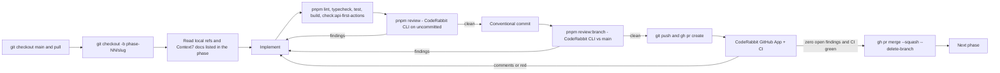

# Eleva.care v3 — End-to-End Execution Plan

Status: Authoritative (supersedes `roadmap-and-milestones.md` and `implementation-sprints.md` for sequencing)

This folder is the **single source of truth for how Eleva v3 gets built and shipped**. It turns the
architecture handbook in `docs/eleva-v3/` into an ordered list of phases. Every phase is one
branch, one pull request, one CodeRabbit review loop, one merge. Every phase ships with a
**copy-paste prompt** that a human or an AI agent can run without any other context.

- Markdown is the SSOT. `index.html` is generated from these files with
  `pnpm docs:execution-plan:html` (do not edit the HTML by hand).
- Each phase lives in `phases/NN-slug.md` and ends with a `## Copy-paste prompt` section.
- The prompts assume the repo is checked out at the monorepo root and that the tooling in
  Phase 0 is merged (`pnpm review`, `pnpm review:branch`, CodeRabbit CLI authenticated).

## 1. What we are building

Eleva.care is an EU-first, Portugal-first digital health marketplace and community. Experts
(clinicians, educators) sell sessions to **members**; clinics (**Teams**) run several experts under
one organization on a per-seat SaaS plan; **Academy** is the education surface. Everything is
multilingual (`pt`, `en`, `es`, `pt-BR` at launch), API-first and agentic-first, and built to
HIPAA/GDPR/ERS-Portugal standards.

End state of this plan (production, `eleva.care` DNS switched from the MVP):

| Surface                                | App            | Audience                     | Must work end to end                                                                           |
| -------------------------------------- | -------------- | ---------------------------- | ---------------------------------------------------------------------------------------------- |
| Marketing + discovery + booking funnel | `apps/web`     | Public                       | Explore experts, view profile, pick slot, pay, receive confirmation                            |
| Member product                         | `apps/app`     | Members                      | Sessions, join video, receipts, reports, preferences, DSAR                                     |
| Expert product                         | `apps/expert`  | Solo experts, clinic experts | Onboarding, Stripe Connect, availability, event types, calendars, sessions, finance, invoicing |
| Clinic product                         | `apps/team`    | Clinic admins                | Members/seats, SaaS billing, clinic page, attribution                                          |
| Academy                                | `apps/academy` | Learners                     | Landing + org type only at launch                                                              |
| Account hub                            | `apps/account` | Everyone                     | Sign in/up, 2FA, passkeys, sessions, org switcher, workspace creation                          |
| Admin console                          | `apps/admin`   | Eleva staff                  | Users, Become-Partner queue, payouts, subscriptions, accounting, webhooks, DLQ, audit          |
| API                                    | `apps/api`     | All apps + agents            | Better Auth, REST + OpenAPI, Stripe/Daily webhooks, QStash workflows                           |
| Docs                                   | `apps/docs`    | Developers, compliance       | API reference + guides + ERS/compliance pages                                                  |

Money must flow correctly: Stripe Connect Express payouts to experts, platform fee retained by
Eleva, **a TOConline invoice issued by Eleva to the expert for the platform fee on every paid
booking (Tier 1)**, and the expert's own invoice to the member issued through their connected
fiscal software (Tier 2: TOConline, Moloni, or manual export).

## 2. Locked decisions (frozen for this plan)

These are recorded as ADRs in Phase 1. Do not re-open them inside a phase prompt; open a
`decision-log.md` entry and a new ADR instead.

| #         | Decision                                                                                                                                                                                                                                                                                                                                            | Replaces                                               |
| --------- | --------------------------------------------------------------------------------------------------------------------------------------------------------------------------------------------------------------------------------------------------------------------------------------------------------------------------------------------------- | ------------------------------------------------------ |
| ADR-017   | **Identity = self-hosted Better Auth** in `apps/api` at `api.eleva.care/auth/*`, Drizzle adapter, `auth` schema on the main Neon project. Plugins: `organization`, `admin`, `twoFactor`, `passkey`, `magicLink`, `bearer`, `jwt`, `apiKey`, `openAPI`, `nextCookies`. Neon _managed_ Better Auth rejected (Beta, partial org plugin, no MFA/hooks). | WorkOS AuthKit + RBAC + Widgets                        |
| ADR-018   | **Video = Daily.co only** (HIPAA-enabled domain `elevacare.daily.co`, branded `sessions.eleva.care`). Google/Microsoft calendars remain for busy-time + destination sync only.                                                                                                                                                                      | Google Meet links                                      |
| ADR-019   | **MVP data migration + DNS cutover**: import users/orgs/experts/bookings/payout ledger/records from the MVP Neon DB; same Stripe platform account so Connect accounts and customers carry over.                                                                                                                                                     | Greenfield relaunch                                    |
| ADR-020   | **Envelope encryption without a vault**: `@eleva/encryption` = AES-256-GCM, per-org DEK wrapped by a versioned KEK from env, `org_data_keys` table, crypto-shred = delete DEK. OAuth tokens encrypted by Better Auth (`account.encryptOAuthTokens`).                                                                                                | WorkOS Vault + Pipes                                   |
| ADR-021   | **RBAC SSOT in code**: `packages/auth/src/permissions.ts` (`createAccessControl` statements + roles). Product label = `(organization.type, member.role)`.                                                                                                                                                                                           | `infra/workos/rbac-config.json`, `widgets-config.json` |
| Unchanged | Neon x2 (main + audit) + RLS + audit outbox; Stripe hybrid monetization (15% -> 8% Top Expert 29 EUR/mo; clinics 99+39/seat, 199+29/seat, 0% commission); TOConline Tier 1/2; two-lane notifications (Resend + Twilio EU + in-app; Novu retired); Vercel Flags; Vercel AI Gateway; Fumadocs; `eleva.care` gateway rewrites; pnpm + Turborepo.       | —                                                      |

## 3. Current state (why phases are ordered this way)

The monorepo is roughly 40% built and WorkOS-locked. Keep: `apps/api` (~35 routes, OpenAPI,
Stripe webhook state machine, rate limit, BotID), `packages/db` (22 main migrations, RLS via
`eleva.org_id`, `withOrgContext`), `@eleva/audit`, `@eleva/billing`, `@eleva/scheduling`
(`reserveSlot`), `@eleva/calendar`, `@eleva/accounting` registry, `@eleva/flags`, `@eleva/storage`,
`@eleva/observability`, `apps/expert`, `apps/account`. Thin or stub: `apps/app`, `apps/team`,
`apps/academy`, `apps/admin`, `apps/docs`, `apps/email`, packages `ai`, `crm`, `notifications`,
`compliance`, `academy`. Missing: Daily code, PostHog code, Playwright, public booking funnel,
audit DB migrations folder.

WorkOS blast radius that Phases 2-3 remove: `packages/auth/*`, `packages/encryption` (Vault),
`packages/calendar/src/credential-manager.ts` (Pipes), `packages/billing/src/server/provisioning.ts`
(seat meter), `packages/workflows/.../calendar-event-sync.ts`, `packages/dashboard/workos-widgets-*`
and `switch-org-action.ts`, `apps/account/src/app/(auth)/*`, `apps/api/src/app/workos/sync`,
`infra/workos/*`, DB columns `users.workos_user_id`, `organizations.workos_org_id`,
`memberships.workos_role`, `billing_customers.workos_org_id`, `expert_integrations.workos_user_id`,
bearer bridge headers `x-eleva-workos-*`, `.cursor/rules/workos-*.mdc`, `.cursor/skills/workos-rbac-widgets`,
`docs/eleva-v3/identity-rbac-spec.md`, `workos-multi-app.md`, ADR-004, ADR-015.

v3 is **not live** until Phase 15. `main` may be temporarily inconsistent between Phase 2 and
Phase 3 (Better Auth landed, WorkOS not yet deleted) — this is accepted because no production
traffic depends on v3 before cutover.

## 4. The phase loop (applies to every phase)



Rules of the loop:

1. **Branch name** is `phase-NN/<slug>` from an up-to-date `main`. One phase = one PR. If a phase
   would exceed the CodeRabbit 150-reviewable-file cap, split into `phase-NN.1/...`,
   `phase-NN.2/...` in the order given by the phase file, each with the full loop.
2. **Read before you write**: every phase lists "Local references" (files in this repo) and
   "External docs" (Context7 library IDs). Pull the Context7 docs at the start; SDK APIs move.
3. **Commits** follow Conventional Commits (commitlint enforces): `feat(auth): ...`,
   `fix(billing): ...`, `docs(plan): ...`, `chore(ci): ...`.
4. **Local review before pushing**: `pnpm review` (uncommitted changes) and `pnpm review:branch`
   (all commits vs `main`). Fix every finding or write down why it is not actionable in the PR
   body. Never suppress a finding by weakening a rule.
5. **PR**: `gh pr create --base main --fill` plus a body that contains: phase number and link
   to the phase file, summary, checklist of acceptance criteria, list of CodeRabbit CLI findings
   addressed or declined with reasons, and test evidence.
6. **Review loop**: wait for the CodeRabbit GitHub App review and CI. For every comment: fix +
   commit + push, or reply "Not actionable because ..." on the thread. Re-run
   `pnpm review:branch` after each fix batch. Loop until there are **zero unresolved
   CodeRabbit comments and every CI check is green**. Use `gh pr view --comments` and
   `gh api repos/{owner}/{repo}/pulls/{n}/comments` to enumerate threads.
7. **Human approval**: branch protection requires one human approval. Request it from the repo
   owner (`@rodrigobarona`). Never bypass protection or force-push to `main`.
8. **Merge**: `gh pr merge --squash --delete-branch`, then `git checkout main && git pull`.
9. **Definition of done** for every phase, in addition to its own exit criteria:
   OpenAPI + `@eleva/api-client` updated for new/changed endpoints; `withAudit()` on every
   mutation; `org_id` + RLS + isolation test on every new tenant table; no vendor SDK imported
   outside its owning package; Zod validation on all request bodies and Server Actions; rate limit
   and explicit auth model on every non-internal route; i18n keys added for `pt`, `en`, `es`;
   docs updated (`decision-log.md` entry if a decision changed); no dead code, legacy files, or
   empty folders left behind.

## 5. Phase index

| Phase | Title                                                                 | Branch                                    | Effort               | Depends on | File                                                                                           |
| ----- | --------------------------------------------------------------------- | ----------------------------------------- | -------------------- | ---------- | ---------------------------------------------------------------------------------------------- |
| 0     | Execution plan + CodeRabbit CLI review loop                           | `phase-00/execution-plan-and-review-loop` | 1-2 days             | —          | [`phases/00-execution-plan-and-review-loop.md`](./phases/00-execution-plan-and-review-loop.md) |
| 1     | Re-baseline: ADR-017..021, handbook, rules, CI foundations            | `phase-01/rebaseline-adrs-ci`             | 1 week               | 0          | [`phases/01-rebaseline-adrs-ci.md`](./phases/01-rebaseline-adrs-ci.md)                         |
| 2     | Better Auth foundation (server, schema, client, account UI)           | `phase-02/better-auth-foundation`         | 2 weeks              | 1          | [`phases/02-better-auth-foundation.md`](./phases/02-better-auth-foundation.md)                 |
| 3     | WorkOS removal: encryption, calendar, billing seats, dashboard, infra | `phase-03/remove-workos`                  | 1.5 weeks            | 2          | [`phases/03-remove-workos.md`](./phases/03-remove-workos.md)                                   |
| 4     | Public marketplace + booking funnel (`apps/web` + API)                | `phase-04/public-marketplace-booking`     | 2 weeks              | 3          | [`phases/04-public-marketplace-booking.md`](./phases/04-public-marketplace-booking.md)         |
| 5     | Member app (`apps/app`)                                               | `phase-05/member-app`                     | 1.5 weeks            | 4          | [`phases/05-member-app.md`](./phases/05-member-app.md)                                         |
| 6     | Payments: Stripe Connect hardening, payout engine, refunds, schedules | `phase-06/payments-payouts`               | 2 weeks              | 4          | [`phases/06-payments-payouts.md`](./phases/06-payments-payouts.md)                             |
| 7     | Invoicing: TOConline Tier 1 fee invoices + Tier 2 expert invoices     | `phase-07/invoicing-toconline`            | 1.5 weeks            | 6          | [`phases/07-invoicing-toconline.md`](./phases/07-invoicing-toconline.md)                       |
| 8     | Notifications Lane 1 + reminder workflows                             | `phase-08/notifications-lane1`            | 1.5 weeks            | 5, 6       | [`phases/08-notifications-lane1.md`](./phases/08-notifications-lane1.md)                       |
| 9     | Video with Daily.co (`@eleva/video`, join pages, webhooks)            | `phase-09/video-daily`                    | 1.5 weeks            | 5, 8       | [`phases/09-video-daily.md`](./phases/09-video-daily.md)                                       |
| 10    | Records/PHI, CRM, AI reports beta                                     | `phase-10/records-crm-ai`                 | 2 weeks              | 9          | [`phases/10-records-crm-ai.md`](./phases/10-records-crm-ai.md)                                 |
| 11    | Clinics: `apps/team` SaaS                                             | `phase-11/team-clinics`                   | 2 weeks              | 6, 7       | [`phases/11-team-clinics.md`](./phases/11-team-clinics.md)                                     |
| 12    | Admin console (`apps/admin`)                                          | `phase-12/admin-console`                  | 2 weeks              | 7, 10, 11  | [`phases/12-admin-console.md`](./phases/12-admin-console.md)                                   |
| 13    | Hardening, observability, i18n parity, performance, full E2E          | `phase-13/hardening-observability`        | 1.5 weeks            | 12         | [`phases/13-hardening-observability.md`](./phases/13-hardening-observability.md)               |
| 14    | MVP data migration scripts + rehearsals                               | `phase-14/mvp-migration`                  | 2 weeks              | 13         | [`phases/14-mvp-migration.md`](./phases/14-mvp-migration.md)                                   |
| 15    | PT launch gate + production cutover                                   | `phase-15/launch-cutover`                 | 1 week + 7-day watch | 14         | [`phases/15-launch-cutover.md`](./phases/15-launch-cutover.md)                                 |
| 16    | Post-launch backlog (not a PR phase)                                  | —                                         | —                    | 15         | [`phases/16-post-launch-backlog.md`](./phases/16-post-launch-backlog.md)                       |

Parallelism allowed: 5 and 6 after 4; 7 and 8 after 6; 11 after 7; 9 after 8. Everything else is
sequential. Never start a phase whose dependencies are not merged.

## 6. Target architecture (reference for all prompts)

```mermaid
flowchart LR
  subgraph edge [eleva.care gateway - apps/web proxy.ts]
    Gateway[rewrites to zones]
  end
  subgraph zones [Frontend zones]
    Web[apps/web]
    AppMember[apps/app]
    Expert[apps/expert]
    Team[apps/team]
    Academy[apps/academy]
    Account[apps/account]
    Admin[apps/admin - admin.eleva.care]
    Docs[apps/docs]
  end
  subgraph api [api.eleva.care - apps/api]
    BA[Better Auth /auth/*]
    REST[REST + OpenAPI]
    Hooks[/webhooks/stripe /webhooks/daily]
    WF[/workflows/* via QStash]
  end
  subgraph pkgs [Domain packages]
    Auth[@eleva/auth]
    DB[@eleva/db + RLS]
    Billing[@eleva/billing]
    Accounting[@eleva/accounting]
    Sched[@eleva/scheduling]
    Video[@eleva/video]
    Notif[@eleva/notifications]
    Enc[@eleva/encryption]
    Audit[@eleva/audit]
  end
  subgraph infra [EU infra]
    NeonMain[(Neon main + auth schema)]
    NeonAudit[(Neon audit)]
    Redis[(Upstash Redis + QStash)]
    Stripe[Stripe Connect]
    TOC[TOConline]
    Daily[Daily.co]
    Resend[Resend + Twilio EU]
  end
  Gateway --> zones
  zones -->|cookie .eleva.care credentials include| BA
  zones --> REST
  api --> pkgs
  pkgs --> NeonMain
  Audit --> NeonAudit
  Sched --> Redis
  Billing --> Stripe
  Accounting --> TOC
  Video --> Daily
  Notif --> Resend
```

Key contracts every prompt must respect:

- **Only `packages/auth` imports `better-auth`**; only `packages/video` imports `@daily-co/*`;
  only `packages/billing` imports `stripe`/`@stripe/*`; only `packages/accounting` calls
  TOConline/Moloni; only `packages/notifications` imports Resend/Twilio; only `packages/storage`
  imports `@vercel/blob`; only `packages/ai` calls the AI Gateway.
- Frontend apps never instantiate the Better Auth server. They use `@eleva/auth/client`
  (`createAuthClient` pointed at `API_URL/auth`), `@eleva/auth/server` (`getSession()` =
  `React.cache`'d fetch to `/auth/get-session` forwarding cookies) and `@eleva/auth/proxy`
  (`getSessionCookie` for optimistic redirects in `proxy.ts`).
- All HTTP route handlers live in `apps/api`. Server Actions in apps are thin, Zod-validated
  proxies calling `@eleva/api-client` or domain packages.
- Tenant data is only reachable through `withOrgContext(orgId, tx => ...)`; every mutation is
  wrapped in `withAudit()`.
- Cookies: `ELEVA_LOCALE`, `ELEVA_THEME`, Better Auth session cookie on `.eleva.care`.

## 7. Universal prompt preamble

Every phase prompt starts with this block, specialised per phase: the branch name is filled in,
the rules/skills list names the ones relevant to the files that phase touches, and "this phase
file" is spelled out as a path. The steps, order and hard constraints must stay identical. One
exception by design: Phase 15 adds a "stop and ask before each production mutation" clause.
Phase 16 (backlog) keeps the preamble and adds a planning commit before implementation. When you
change this block, update every `phases/*.md` prompt in the same PR.

```text
You are a senior engineer working in the Eleva.care v3 monorepo at the repository root
(/Users/<you>/…/elevacare-monorepo). Work autonomously and finish the phase end to end.

Before writing code:
1. Read AGENTS.md, .cursor/rules/*.mdc and the skills under .cursor/skills/ that match the files
   you will touch (api-first-agentic, audit-wiring, stripe-webhooks, eleva-icons, coderabbit-review).
2. Read docs/eleva-v3/execution-plan/README.md sections 2, 4, 6 and this phase file in full.
3. Read every file under "Local references" of this phase. Pull every library under
   "External docs" through Context7 (resolve-library-id then query-docs) and prefer those docs
   over memory for Next.js 16, Better Auth, Drizzle, Stripe, Daily, Resend, Twilio, next-intl,
   Vercel Flags/Workflows, Playwright, CodeRabbit.

Workflow (mandatory):
- git checkout main && git pull --ff-only && git checkout -b <branch from this phase>
- Implement the deliverables in the order listed. Keep the PR under 150 reviewable files; split
  into phase-NN.1 / phase-NN.2 branches if needed.
- Run: pnpm lint && pnpm typecheck && pnpm test && pnpm check:api-first-actions && pnpm build
- Run: pnpm review  (CodeRabbit CLI on uncommitted changes) -> fix all findings -> repeat until clean
- Commit with Conventional Commits. Run: pnpm review:branch -> fix -> repeat until clean.
- git push -u origin <branch> && gh pr create --base main with the PR body template from
  docs/eleva-v3/execution-plan/README.md section 8.
- Loop: wait for CodeRabbit GitHub App review + CI; for each comment fix+push or reply
  "Not actionable because ..."; re-run pnpm review:branch; continue until zero unresolved
  comments and all checks green. Request human approval from @rodrigobarona.
- gh pr merge --squash --delete-branch; git checkout main && git pull.

Hard constraints: API-first (all route handlers in apps/api), agentic-first (Bearer/API key auth,
JSON, OpenAPI registered), secure by default (explicit auth model, Zod, rate limit, BotID on public
POSTs), withAudit on every write, RLS on every tenant table, vendor SDKs only inside their owning
package, no dead code left behind, members not "patients" in customer-facing copy, Spaces not
"Workspaces" for personal orgs, i18n keys for pt/en/es, cataloged dependency versions
(pnpm-workspace.yaml catalog), Phosphor icons via @eleva/icons only.
```

## 8. PR body template

```markdown
## Phase NN — <title>

Plan: docs/eleva-v3/execution-plan/phases/NN-<slug>.md

### Summary

<3-6 bullets>

### Acceptance criteria

- [ ] <copied from the phase file, ticked when verified>

### CodeRabbit CLI

- `pnpm review` / `pnpm review:branch` run at <commit sha>: <N> findings, all addressed.
- Declined findings (with reasons): <none | list>

### Tests / evidence

- vitest: <summary>
- playwright: <summary or n/a>
- manual: <what was clicked, screenshots if UI>

### Docs updated

- <files>
```

## 9. Risks carried across phases

| Risk                                                                   | Mitigation                                                                                                | Phase |
| ---------------------------------------------------------------------- | --------------------------------------------------------------------------------------------------------- | ----- |
| Auth swap breaks every app at once                                     | Phases 2-3 while v3 has no traffic; Playwright auth spec before Phase 3 merge; WorkOS deletable in one PR | 2-3   |
| Cross-subdomain cookies on preview deployments                         | Previews point at staging API; documented in `environment-matrix.md`                                      | 1, 2  |
| WorkOS Vault records must be decrypted before WorkOS is cancelled      | Export + checksum in Phase 14 before any WorkOS account closure                                           | 14    |
| Better Auth plugin package churn                                       | Pin in catalog; verify via Context7 at Phase 2 start                                                      | 2     |
| Daily HIPAA mode disables features (custom room names, live streaming) | Random room names + meeting tokens from day one                                                           | 9     |
| Commission SSOT vs grandfathered MVP plans                             | Mapping table reviewed with finance before Phase 14                                                       | 6, 14 |
| IVA/TOConline matrix needs accountant sign-off                         | Sign-off is an entry gate of Phase 7, not Phase 15                                                        | 7     |
| CodeRabbit 150-file cap skips review                                   | Split PRs; `path_filters` keep generated files out                                                        | all   |

## 10. Related documents

- `docs/eleva-v3/README.md` (handbook index) — the phase files link into the specs there.
- `docs/eleva-v3/contribution-workflow.md` — PR policy; Phase 0 adds the CLI loop to it.
- `docs/eleva-v3/decision-log.md`, `docs/eleva-v3/adrs/` — where decisions are recorded.
- `.cursor/skills/coderabbit-review/SKILL.md` — how agents run the review loop.
