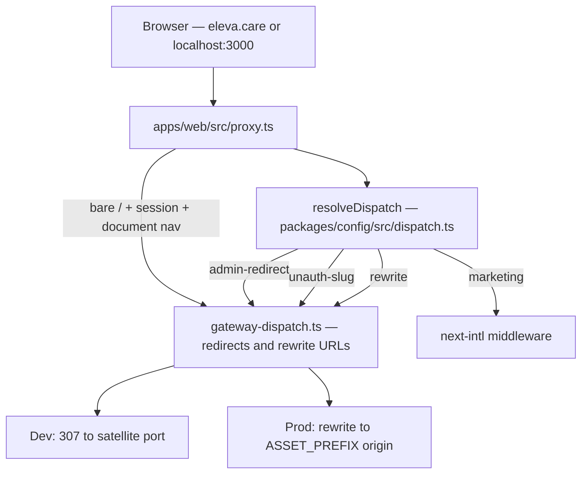

# Gateway audit — Eleva multi-zone routing

**Date:** 2026-05-22  
**Scope:** `apps/web` gateway proxy, `@eleva/config` dispatch, satellite `proxy.ts` files, dev asset rewrites, Vercel/Next.js 16 alignment.

---

## Executive summary

The gateway follows a sound multi-zone pattern: **pure path dispatch in `@eleva/config`**, **Next.js 16 `proxy.ts` for dynamic context**, and **dev-only static asset rewrites** in `next.config.mjs`. Auth, security headers, and locale propagation are centralized in `@eleva/auth` and `@eleva/observability`.

This audit identified two **critical routing gaps** (now fixed):

1. **`/docs/*`** was not dispatched — requests fell through to marketing and 404'd.
2. **`/admin/*`** incorrectly rewrote to the member app — platform admin lives on `admin.eleva.care` (`apps/admin`).

Additional fixes: RSC-safe root redirect tests, docs dev `assetPrefix` via `/_docs`, and gateway helper unit tests.

---

## Architecture

### Request flow



### SSOT layers

| Layer                 | File                                                                                 | Responsibility                                              |
| --------------------- | ------------------------------------------------------------------------------------ | ----------------------------------------------------------- |
| Path constants        | [`packages/config/src/routing.ts`](../../packages/config/src/routing.ts)             | Reserved slugs, marketing paths, org-scoped segments        |
| Pure dispatch         | [`packages/config/src/dispatch.ts`](../../packages/config/src/dispatch.ts)           | Path + session → decision (unit-tested)                     |
| Response builders     | [`apps/web/src/lib/gateway-dispatch.ts`](../../apps/web/src/lib/gateway-dispatch.ts) | Rewrite URLs, login/root/admin redirects, RSC detection     |
| Gateway orchestration | [`apps/web/src/proxy.ts`](../../apps/web/src/proxy.ts)                               | Cookie session, dev redirect vs prod rewrite, intl fallback |
| Dev static assets     | [`packages/config/src/next-dev.mjs`](../../packages/config/src/next-dev.mjs)         | `/_app`, `/_account`, `/_docs`, … → sibling ports           |
| Auth proxy factory    | [`packages/auth/src/proxy.ts`](../../packages/auth/src/proxy.ts)                     | WorkOS AuthKit, gateway login bounce, locale                |
| Security wrapper      | [`packages/observability/src/proxy.ts`](../../packages/observability/src/proxy.ts)   | CSP, HSTS, correlation ID                                   |

### Dispatch priority (current)

1. Locale roots (`/pt`, `/es`, `/en`) → marketing
2. Marketing segments (`/about`, `/pricing`, …) → marketing
3. **`/docs/*`** → docs zone
4. **`/admin/*`** → redirect to admin subdomain
5. Account fixed (`/onboarding`, `/account/*`) → account zone
6. Account standalone (`/login`, `/dashboard`, …) → account zone
7. Org-scoped second segment (`/:slug/expert|team|academy|settings`) → respective zone
8. Bare/deeper `/:slug` with valid shape → member app (session) or login redirect (no session)
9. Everything else → marketing

---

## Proxy file map

| App                     | File                                                             | Pattern                                                                     |
| ----------------------- | ---------------------------------------------------------------- | --------------------------------------------------------------------------- |
| Gateway                 | [`apps/web/src/proxy.ts`](../../apps/web/src/proxy.ts)           | Custom dispatch + intl; extended matcher (excludes `trpc`, metadata routes) |
| Member                  | [`apps/app/src/proxy.ts`](../../apps/app/src/proxy.ts)           | `createAuthProxy` + last-org cookie tracking                                |
| Account                 | [`apps/account/src/proxy.ts`](../../apps/account/src/proxy.ts)   | Auth-flow short-circuit (`/login`, `/callback`, …)                          |
| Expert / Team / Academy | `apps/*/src/proxy.ts`                                            | Gateway login redirect for unauthenticated users                            |
| Admin                   | [`apps/admin/src/proxy.ts`](../../apps/admin/src/proxy.ts)       | Subdomain-only; gateway login redirect                                      |
| Docs / Email / API      | `createPassthroughProxy()`                                       | No auth at edge                                                             |
| Auth factory            | [`packages/auth/src/proxy.ts`](../../packages/auth/src/proxy.ts) | Shared WorkOS + locale logic                                                |

---

## Use-case matrix

| Request                             | Expected                                | Status                                  |
| ----------------------------------- | --------------------------------------- | --------------------------------------- |
| `/`, `/pt`, `/about` (no session)   | Marketing on gateway                    | OK                                      |
| `/` (session, document navigation)  | Redirect → `/dashboard` or last org     | OK                                      |
| `/pt` (session, RSC fetch)          | Marketing 200 (no redirect)             | OK                                      |
| `/login`, `/dashboard`              | Account zone                            | OK                                      |
| `/docs`, `/docs/guides/*`           | Docs zone                               | **Fixed** — was 404 on marketing        |
| `/admin`, `/admin/*` on root domain | Redirect → `admin.eleva.care` / `:3007` | **Fixed** — was rewriting to member app |
| `admin.eleva.care`                  | Admin app directly                      | OK                                      |
| `/:orgSlug/expert/*`                | Expert zone                             | OK                                      |
| `/:orgSlug` (session)               | Member app                              | OK                                      |
| `/:orgSlug` (no session)            | `/login?returnTo=…`                     | OK                                      |

### Local dev verification (2026-05-22)

```
GET localhost:3000/docs        → 307 → localhost:3008/docs
GET localhost:3000/admin       → 307 → localhost:3007/
GET localhost:3000/admin/payments → 307 → localhost:3007/payments
GET localhost:3000/pt          → 200 (marketing)
GET localhost:3000/clinica-mota + session → 307 → localhost:3001/clinica-mota
GET localhost:3000/clinica-mota (no session) → 307 → /login?returnTo=…
```

---

## Vercel / Next.js 16 best-practices scorecard

| Practice                                         | Status   | Notes                                                       |
| ------------------------------------------------ | -------- | ----------------------------------------------------------- |
| Dynamic routing in `proxy.ts`                    | Pass     | Session, org slug, locale require runtime context           |
| Static asset rewrites in `next.config`           | Pass     | Dev-only `beforeFiles` for `/_zone/_next/*`                 |
| `skipTrailingSlashRedirect: true` across zones   | Pass     | Avoids 308 conflicts with cross-zone routing                |
| Dev redirect / prod rewrite split                | Pass     | Localhost ports for debugging; same-origin rewrite in prod  |
| Pure dispatch extracted + unit tested            | Pass     | `@eleva/config/dispatch`                                    |
| RSC-safe redirects                               | Pass     | `isDocumentNavigation()` + bare-`/` only for logged-in root |
| Centralized auth proxy factory                   | Pass     | `@eleva/auth/proxy`                                         |
| Security headers at edge                         | Pass     | `withHeaders()` from observability                          |
| `serverActions.allowedOrigins` on satellite apps | Pass     | Via `resolveServerActionAllowedOrigins()`                   |
| Matcher inlined per app (Next static analyzer)   | Pass     | Documented in observability package                         |
| Static `/docs` in `next.config` rewrites (prod)  | Optional | Could reduce proxy latency; low priority                    |
| Proxy integration tests                          | Partial  | Unit tests for dispatch + helpers; no full proxy e2e yet    |

---

## Fixes applied in this audit

### `/docs` routing

- Added `docs` to `GatewayOrigins` and early dispatch rule in `dispatch.ts`.
- Added `DOCS_ASSET_PREFIX` default (`http://localhost:3008`) in `gateway-dispatch.ts`.
- Added `/_docs` to `LOCAL_ZONE_ASSET_PREFIXES` and static rewrites in `next-dev.mjs`.
- Updated `apps/docs/next.config.mjs` to use `resolveZoneAssetPrefix("docs", …)`.
- Added `@eleva/config` dependency to `apps/docs`.

### `/admin` routing

- Removed `"admin"` from `APP_FIXED_SEGMENTS` (member app never owned admin routes).
- Added explicit `"admin"` and `"docs"` to `RESERVED_SLUGS`.
- Added `{ kind: "admin-redirect" }` dispatch + `buildAdminRedirect()` (strips `/admin` prefix, targets `ADMIN_URL` / `:3007`).

### Tests

- Extended `packages/config/src/dispatch.test.ts` for docs + admin decisions.
- Added `apps/web/src/lib/gateway-dispatch.test.ts` (13 tests: RSC, document nav, root/admin redirects).
- Added `vitest` to `@eleva/web`.

---

## Documentation drift (backlog)

| Document                                                 | Issue                                                                                          | Priority |
| -------------------------------------------------------- | ---------------------------------------------------------------------------------------------- | -------- |
| [ADR-014](./adrs/ADR-014-multi-zone-rewrites.md)         | Still describes `/patient`, `/expert`, `/org` at root + `afterFiles` rewrites in `next.config` | P1       |
| [implementation-sprints.md](./implementation-sprints.md) | Same stale path model; references `/signin`                                                    | P1       |
| [ADR-015](./adrs/ADR-015-multi-app-split.md)             | Closer to live code but says `/signin` vs `/login`                                             | P2       |
| [AGENTS.md](../../AGENTS.md)                             | `/<org-slug>/~/settings` escape hatch not implemented                                          | P2       |
| [environment-matrix.md](./environment-matrix.md)         | Partially updated; staging bullets still mention `/patient` rewrites                           | P2       |

---

## Prioritized backlog (post-fix)

| Priority | Item                                                                               | Status            |
| -------- | ---------------------------------------------------------------------------------- | ----------------- |
| P1       | Update ADR-014 and implementation-sprints to org-slug + proxy-only dispatch model  | Done (2026-05-22) |
| P2       | Add proxy integration tests (mocked `NextRequest` through `apps/web/src/proxy.ts`) | Done (2026-05-22) |
| P2       | Implement or remove `~/settings` org escape hatch in dispatch                      | Open              |
| P3       | Consider prod `beforeFiles` rewrite for `/docs` (no cookie dependency)             | Open              |
| P3       | Align ADR-015 auth path names (`/login` not `/signin`)                             | Done (2026-05-22) |

---

## Test commands

```bash
pnpm --filter @eleva/config test
pnpm --filter @eleva/web test
```

---

## References

- [ADR-014 — Multi-zone rewrites](./adrs/ADR-014-multi-zone-rewrites.md)
- [ADR-015 — Multi-app split](./adrs/ADR-015-multi-app-split.md)
- [Environment matrix — port assignments](./environment-matrix.md)
- [Next.js proxy (middleware) docs](https://nextjs.org/docs/app/building-your-application/routing/middleware)
