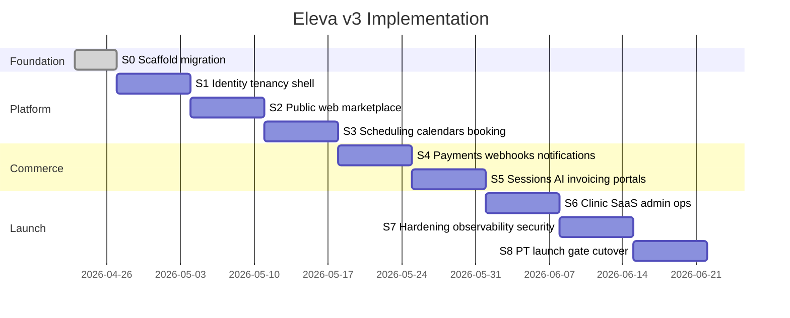

# Eleva.care v3 Implementation Sprints (8 Weeks)

Status: Authoritative

## Purpose

This document translates the v3 handbook into a concrete, tactical week-by-week build plan to take Eleva from the current shadcn scaffold to a production-ready beta in **8 weeks**.

Complements but does not replace [`roadmap-and-milestones.md`](./roadmap-and-milestones.md): the roadmap defines phase goals and exit criteria; this file defines the weekly sprints and their parallel tracks.

## Scope (Locked)

- Solo experts + clinic SaaS (Starter + Growth) + AI report drafting beta
- Locales: PT + EN + ES at launch
- PT-first market (ERS, MB WAY, NIF, TOConline)
- shadcn/ui v4 + Tailwind v4 (already in [packages/ui](../../packages/ui))
- Functionality and flow focus; brand assets dropped in from [brand-book/assets/palette/](./brand-book/assets/palette/) once

Deferred post-beta: Eleva Diary mobile (M7), Fumadocs full content site beyond PT compliance, Lane 2 marketing drip beyond welcome, three-party revenue, Phase-2 Tier 2 adapters, Clinic Enterprise custom tier.

## Environment and Tooling Context

- **Vercel CLI is linked**: [.vercel/repo.json](../../.vercel/repo.json) points `apps/web` at the `elevacare-marketing` project. Additional Vercel projects will be created for `apps/app`, `apps/api`, `apps/docs`, `apps/email` during Sprint 0.
- **Vercel Marketplace integrations** supply env vars automatically on link: Neon, Upstash (Redis + QStash), Resend, Sentry, and others. Use `vercel env pull .env.local` per app instead of hand-writing secrets.
- **Vercel MCP** available for fetching project info, deployments, env vars, and Edge Config reads during implementation.
- **Stripe MCP** used for product/price/webhook/customer seeding across staging + production accounts.
- **WorkOS CLI** used for org/role/permission provisioning from `infra/workos/rbac-config.json`.
- **Neon MCP** for project creation, branch-per-PR, migrations.
- **Context7** used throughout for up-to-date docs (Next 16, Stripe, WorkOS, Drizzle, Daily, Twilio, Vercel Workflows DevKit, next-intl, Vercel Flags SDK).

## Next.js 16 Naming Conventions (Platform-Wide)

Locked for every app in this repo:

- **`src/proxy.ts`** replaces the legacy `middleware.ts` (Next 16 rename). The entry file is `proxy.ts`; exports the default handler and optional `config`.
- **next-intl** still exports `createMiddleware(config)`; we invoke it inside `src/proxy.ts` and re-export. Example shape in [apps/web/src/proxy.ts](../../apps/web/src/proxy.ts) and [apps/app/src/proxy.ts](../../apps/app/src/proxy.ts):

```ts
import createIntl from 'next-intl/middleware';
import { i18nConfig } from '@eleva/config/i18n';
import { withAuth } from '@eleva/auth/proxy';
import { withHeaders } from '@eleva/observability/proxy';

const intl = createIntl(i18nConfig);

export default withHeaders(withAuth(intl));

export const config = {
  matcher: ['/((?!api|_next|_vercel|.*\\..*).*)'],
};
```

Composition rule: `src/proxy.ts` must stay under ~50 LOC. Every concern (intl, auth, CSP/secure-headers, correlation-ID) is a thin composable wrapper exported from its owning package. ESLint rule enforces.

## Global Rules Applied Every Sprint

- Branch per feature, PR into `main`.
- **CI green gates merge** (branch-protection required checks): lint, typecheck, Vitest, Playwright smoke, boundary lint (`no-restricted-paths`), i18n parity, RLS isolation test, **CodeRabbit AI review**.
- **Every PR requires at least one CodeRabbit review.** `.coderabbit.yaml` at repo root drives the default config; author must acknowledge or address each CodeRabbit comment (reply or fix) before merge. Bot's aggregate status check must be green.
- **Multi-zone discipline**: gateway (`apps/web`) owns `eleva.care`, carries rewrites and `src/proxy.ts`; sub-apps declare `basePath` (`/app`, `/api`, `/docs`) matching their zone prefix. No public subdomain additions without an ADR.
- **Single canonical URL rule**: every public URL, webhook, and OAuth callback lives under `eleva.care/...`. Internal Vercel project URLs serve `noindex` or 301-redirect to canonical. See [ADR-014](./adrs/ADR-014-multi-zone-rewrites.md).
- Every mutating server action wrapped in `withAudit(action, entity, fn)` from `@eleva/audit`.
- Every tenant query wrapped in `withOrgContext(orgId, fn)` from `@eleva/db`.
- **Audit outbox rule**: `withAudit` writes domain rows + `audit_outbox` row in the same main-DB transaction; `auditOutboxDrainer` Vercel Workflow ships to `eleva_v3_audit` (ADR-003 audit pipeline).
- Every flag read through `@eleva/flags`. Banned direct `@vercel/flags` / `posthog-js` flag calls.
- No direct `stripe` / `resend` / `twilio` / `@workos-inc/node` / `@daily-co/daily-js` / `toconline-sdk` imports outside the owning package. CI verifies.
- Every new permission added to `infra/workos/rbac-config.json`; `pnpm rbac:generate` regenerated.
- **Username + slug rule**: every route segment the gateway adds goes into [`@eleva/config/reserved-usernames.ts`](../../packages/config/src/reserved-usernames.ts) before the route ships. CI check compares route manifest against the reserved list and fails on drift.
- Every sprint ends with a Vercel preview URL + a recorded end-to-end test on staging with a pilot expert account.

## Parallelization With Two Tracks

| Sprint | Track A (backend-heavy)                       | Track B (frontend-heavy)                     |
| ------ | --------------------------------------------- | -------------------------------------------- |
| S0     | scaffold migration + CI                       | (shared)                                     |
| S1     | auth + db + RLS + Vault                       | app shell + i18n                             |
| S2     | Become-Partner + Stripe Connect               | public web + explorer + onboarding wizard    |
| S3     | scheduling + calendar OAuth                   | event-type CRUD + booking funnel             |
| S4     | webhooks + workflows + notifications          | Payment Element + inbox + receipts           |
| S5     | AI + transcript + consent                     | session detail + CRM + patient portal        |
| S6     | Tier 1 + Tier 2 invoicing + clinic lifecycle  | clinic workspace + admin                     |
| S7     | security + observability + rate limits        | i18n polish + perf                           |
| S8     | launch workflows (DSAR, crypto-shred)         | status page + cutover tooling                |

## Phase Map



---

## Sprint 0 — Foundation Migration (3-4 days)

**Goal**: pnpm + full package/app skeleton green on CI without shipping any product code.

Deliverables:

- Migrate `bun.lock` → `pnpm-lock.yaml`; pin `"packageManager": "pnpm@9.15.x"`. CI guard blocks `bun.lock` at root.
- Rename `@workspace/*` → `@eleva/*` across [package.json](../../package.json), [packages/ui/package.json](../../packages/ui/package.json), [packages/eslint-config](../../packages/eslint-config), [packages/typescript-config](../../packages/typescript-config), and all import sites.
- Scaffold new apps: `apps/app`, `apps/api`, `apps/docs`, `apps/email`. Each with `src/proxy.ts` placeholder composing intl + headers. `basePath` config:
  - `apps/app` → **no `basePath`** (runs at internal root; gateway rewrites `/patient`, `/expert`, `/org`, `/admin`, `/settings`, `/callback`, `/logout` to it)
  - `apps/api` → **no `basePath`** (served on `api.eleva.care` subdomain; not rewritten)
  - `apps/docs` → `basePath: '/docs'`
- **Multi-zone rewrites** in gateway [apps/web/next.config.mjs](../../apps/web/next.config.mjs) resolved `afterFiles`, destination URLs from env (`APP_URL`, `DOCS_URL`). API is **not** rewritten — lives on its own subdomain.
- Create corresponding Vercel projects: `elevacare-app`, `elevacare-api`, `elevacare-docs`, `elevacare-email`; update [.vercel/repo.json](../../.vercel/repo.json). Gateway stays `elevacare-marketing`.
- **Vercel DNS for `eleva.care`** per locked canonical mapping (ADR-014 + [environment-matrix.md](./environment-matrix.md)):
  - production: `eleva.care` gateway; `/patient`, `/expert`, `/org`, `/admin`, `/settings`, `/callback`, `/logout` rewritten to `apps/app`; `/docs/*` rewritten to `apps/docs`; `api.eleva.care` points at `elevacare-api` Vercel project; `email.eleva.care` (internal), `status.eleva.care` (BetterStack), `sessions.eleva.care` (Daily CNAME)
  - staging: `staging.eleva.care` gateway with same rewrite pattern; `api.staging.eleva.care` for staging API
  - internal Vercel project URLs (`elevacare-app.vercel.app`, etc.) serve `noindex` + `robots.txt` disallow OR 301 to canonical
  - wildcard SSL `*.eleva.care` via Vercel
  - per-PR previews on `*.preview.eleva.care` wildcard
- **CORS on `api.eleva.care`**: `Access-Control-Allow-Origin: https://eleva.care` (exact match), `Access-Control-Allow-Credentials: true`, preflight support for POST/PATCH/DELETE/OPTIONS, allowed headers include `authorization`, `content-type`, `x-correlation-id`.
- Link Vercel Marketplace integrations (staging + production environments): **Neon** (two projects: `eleva_v3_main`, `eleva_v3_audit`), **Upstash Redis**, **Upstash QStash**, **Resend**, **Sentry**, **BetterStack**. Confirm env vars populate via `vercel env pull` in each app.
- Scaffold new packages as empty skeletons exporting `{}`: `config`, `auth`, `db`, `compliance`, `scheduling`, `calendar`, `billing`, `accounting`, `crm`, `notifications`, `workflows`, `flags`, `audit`, `encryption`, `ai`.
- Drop Eleva CSS tokens into [packages/ui/src/styles/globals.css](../../packages/ui/src/styles/globals.css) from [brand-book/assets/palette/eleva-css-variables-snippet.css](./brand-book/assets/palette/eleva-css-variables-snippet.css). One file. No further design work.
- `eslint-plugin-import` `no-restricted-paths` boundary rules per handbook.
- Turborepo remote cache via Vercel.
- **GitHub Actions**: install + lint + typecheck + build + Vitest + Playwright smoke in parallel; remote Turbo cache via Vercel.
- **CodeRabbit AI integration**:
  - add `.coderabbit.yaml` at repo root with default review config
  - enable CodeRabbit GitHub app on the repo
  - configure GitHub branch protection on `main` to require the `coderabbit` status check + all CI checks above before merge
  - document the "author must acknowledge each CodeRabbit comment before merge" rule in [contribution-workflow.md](./contribution-workflow.md)
- Husky + lint-staged + commitlint.
- `.env.example` seeded with every planned secret placeholder.

Exit: empty-change PR goes green in <5 min; all four new Vercel projects deploy a placeholder page; `vercel env pull` succeeds in each app; `eleva.care/patient`, `/expert`, `/org`, `/admin` return placeholder pages via gateway rewrite to `apps/app`; `eleva.care/docs` returns Fumadocs placeholder via rewrite; `api.eleva.care/health` returns JSON healthcheck from `apps/api`; `eleva.care/home` returns marketing placeholder; `eleva.care/` without session returns marketing; `/` with test session 302s to `/patient`; internal Vercel URLs return 301 or `noindex`; CORS preflight from `eleva.care` to `api.eleva.care` succeeds; CodeRabbit posts a review on a dry-run PR.

MCPs: Vercel MCP (project creation + marketplace linking + DNS + Edge Config), Neon MCP (two projects).

---

## Sprint 1 — Identity, Tenancy, Compliance Core

**Goal**: a user can sign in, land in an org with a role, and data is RLS-isolated.

Governed by: [identity-rbac-spec.md](./identity-rbac-spec.md), [compliance-data-governance.md](./compliance-data-governance.md), [ADR-003](./adrs/ADR-003-tenancy-and-rls.md).

Backend (Track A):

- `@eleva/auth`: WorkOS AuthKit integration, session helpers, `requirePermission`, `withPermission`, `usePermission`, `PermissionGate`, `withAuth(handler)` proxy wrapper. Session cookie scoped to `.eleva.care` so every zone shares it.
- Org-per-user provisioning on first sign-in (non-blocking sync). Personal org for every patient; solo-expert org on Become-Partner approval; clinic admin `admin` vs clinic member `member` per [identity-rbac-spec.md](./identity-rbac-spec.md).
- `@eleva/db`: Neon pooled `@neondatabase/serverless` client, Drizzle schema skeleton, `withOrgContext()`. Initial tables: `users`, `organizations`, `memberships`, `roles`, `permissions`, `audit_outbox` (in main), `audit_events` (in audit project).
- RLS policies on every tenant table using `current_setting('eleva.org_id')`. Separate RLS policies on `eleva_v3_audit.audit_events` (INSERT via drainer credentials; SELECT filtered by org_id OR `audit:view_all`; UPDATE/DELETE revoked).
- Integration test: insert as orgA, select as orgB → zero rows.
- `@eleva/encryption`: `vaultPut`, `vaultGet`, `encryptOAuthToken`, `encryptRecord`.
- `@eleva/audit`: `withAudit(action, entity, fn)` decorator writes domain row + `audit_outbox` row in the same main-DB transaction.
- `@eleva/workflows`: scaffold `auditOutboxDrainer` Vercel Workflow (reads new outbox rows → writes to `eleva_v3_audit` with idempotent `audit_id` → marks outbox `shipped`). Heartbeat to BetterStack.
- `@eleva/observability`: Sentry init, correlation-ID `AsyncLocalStorage`, BetterStack heartbeat helper, `withHeaders(handler)` proxy wrapper composing CSP (allows Stripe + Daily + Resend + Twilio hosts) + HSTS + correlation-ID header.
- `@eleva/flags`: Vercel Flags SDK + Edge Config wiring, flag catalog seeded per [feature-flag-rollout-plan.md](./feature-flag-rollout-plan.md).
- `@eleva/config`: env validation with Zod; `i18nConfig` exported with `localePrefix: 'as-needed'` (EN default no prefix; `pt`/`es` prefixed); reserved usernames set in `reserved-usernames.ts`.
- Drizzle CHECK + unique constraint on `expert_profiles.username` and `clinic_profiles.slug` enforcing format rules and rejecting reserved slugs.

Frontend (Track B):

- `apps/app` shell with route groups `(expert)`, `(patient)`, `(org)`, `(admin)`, `(settings)`; `basePath: '/app'`.
- Gateway `apps/web/src/proxy.ts` composing `createMiddleware(i18nConfig)` → `withAuth` → `withHeaders`, plus the multi-zone passthrough priorities (let `/api/`, `/app/`, `/docs/` rewrites handle themselves).
- Sign-in / sign-up under `app/(auth)/[locale]/`; canonical URLs `eleva.care/signin`, `eleva.care/signup`, `eleva.care/callback` forwarded to app zone by the proxy.
- Sidebar nav gated by permissions.
- next-intl scaffold with `pt`, `en`, `es` locale files; ELEVA_LOCALE cookie; country detection (PT→pt, BR→pt, ES→es, default en); EN served at the root.
- `next-themes` dark mode (already installed in [apps/web](../../apps/web)).

Exit:

- new user lands in a freshly provisioned personal org as `admin` (WorkOS default); product label = patient
- role change in WorkOS reflects in JWT after refresh
- switching locale persists; EN shows no prefix, PT/ES prefixed
- RLS isolation test green (org A insert, org B select → zero rows)
- audit outbox drainer ships test events from `eleva_v3_main.audit_outbox` to `eleva_v3_audit.audit_events` at-least-once
- forced error shows up in Sentry with correct correlation ID
- `src/proxy.ts` remains under 50 LOC in `apps/web`; sub-app proxies are thin auth/header wrappers
- signup form rejects reserved usernames; DB rejects reserved slugs at the constraint level

MCPs: WorkOS CLI (create app, import `rbac-config.json`), Neon MCP (migration branches), Vercel MCP (verify env vars on both apps).

Context7 pulls: `/websites/workos`, `/vercel/next.js` (Next 16 proxy.ts conventions + cacheComponents), next-intl v4, Drizzle.

---

## Sprint 2 — Public Web + Marketplace + Expert Onboarding

**Goal**: expert can complete Become-Partner → Stripe Connect Express + Identity + TOConline → appears in marketplace.

Governed by: [search-and-discovery-spec.md](./search-and-discovery-spec.md), [payments-payouts-spec.md](./payments-payouts-spec.md), [ADR-005](./adrs/ADR-005-payments-and-monetization.md), [ADR-013](./adrs/ADR-013-accounting-integration.md).

Backend (Track A):

- Drizzle schema: `expert_profiles`, `expert_categories`, `expert_listings`, `become_partner_applications`, `expert_integration_credentials`.
- `@eleva/billing/stripe-embedded`: React wrappers for `@stripe/connect-js` + `<ConnectComponentsProvider>`; typed hooks per screen.
- `/api/stripe/account-session` minting short-lived AccountSession tokens with precise component permissions, RBAC-gated.
- `@eleva/accounting`: `ExpertInvoicingAdapter` interface; seed adapters `toconline/`, `moloni/`, `manual/`. OAuth install flows. Credential store in Neon + WorkOS Vault.
- Vercel Blob for expert application document uploads.

Frontend (Track B):

- `apps/web` marketing pages: `/`, `/about`, `/legal/*`, `/experts`, `/experts/[category]`.
- **Public profile route (cal.com style)**: `apps/web/app/[[...locale]]/[username]/page.tsx` resolves against both `expert_profiles.username` and `clinic_profiles.slug` (shared root namespace); returns 404 if name is reserved or not found.
- **Resolution order**: expert first, then clinic (or both; expert gets precedence on tie, audited if rename ever happens).
- Expert explorer search with filters: category, language, country, session mode (online/in-person/phone), price range, next availability. Intro.co-inspired card UI using shadcn `Card`, `Badge`, `Avatar`.
- Expert public profile: languages, practice countries, event types, ratings placeholder.
- Public `become-partner` application form (`apps/web/[locale]/become-partner`) with file uploads; username picker validates format + reserved list + availability against both entity tables.
- Clinic signup form mirrors the username picker; clinic slug competes in the same namespace.
- Admin `become-partner` queue at `/app/admin/become-partner` (app zone) with approve/reject/verify; includes username rename tooling gated by `usernames:rename`.
- Expert onboarding wizard in `apps/app/(expert)/onboarding`:
  1. Profile + fiscal info (NIF, practice location, license scope, worldwide-mode flag)
  2. Stripe Connect Onboarding embedded
  3. Stripe Identity embedded modal
  4. **Invoicing setup step (forced choice)**: auto-connect TOConline/Moloni OR manual acknowledgment
  5. First event type + schedule (teaser)
- Expert workspace shell with `<ConnectNotificationBanner>` at the top; `<ConnectPayouts>`/`<ConnectBalances>`/`<ConnectAccountManagement>`/`<ConnectTaxSettings>` on `/app/expert/finance`.
- CSP updated via `@eleva/observability/withHeaders` for Stripe iframe hosts (`js.stripe.com`, `connect-js.stripe.com`, `*.stripe.com`).
- Appearance API mapped to Eleva design tokens.

Exit:

- applicant submits Become-Partner with file uploads → admin sees in queue → approval promotes role + triggers onboarding
- expert finishes Connect + Identity inline (no redirects)
- expert connects TOConline OR acknowledges manual invoicing
- admin cannot activate expert without verified invoicing setup

MCPs: Stripe MCP (staging + production Connect platforms, products + prices for Top Expert €29/mo). WorkOS CLI (add permissions for expert roles). Vercel MCP (Blob token for uploads).

Context7 pulls: `/websites/stripe` (Connect Embedded Components, Identity, AccountSession), TOConline API.

---

## Sprint 3 — Scheduling, Calendars, Booking Funnel

**Goal**: patient can discover an expert, see available slots, reserve and book an online session.

Governed by: [scheduling-booking-spec.md](./scheduling-booking-spec.md), [calendar-integration-spec.md](./calendar-integration-spec.md), [ADR-004](./adrs/ADR-004-scheduling-and-calendar-oauth.md).

Backend (Track A):

- Drizzle schema: `event_types` (with `slug` field, case-insensitive unique per expert), `schedules`, `availability_rules`, `date_overrides`, `connected_calendars`, `calendar_busy_sources`, `calendar_destination`, `slot_reservations`, `bookings`, `sessions`, `event_locations` (in-person), `expert_practice_location`.
- `@eleva/scheduling`: `getValidTimesFromSchedule`, atomic `reserveSlot` (Upstash Redis SET NX + DB tx), booking rules (buffers, notice, booking window), per-event language + country-license validation, `worldwide_mode_flag` bypass for non-clinical sessions.
- `@eleva/calendar`: Google + Microsoft OAuth flows, token refresh, idempotent `events.insert` with client-supplied ID + 409 fallback. Tokens in WorkOS Vault via `@eleva/encryption`. Pub/Sub watch for external changes.
- `@eleva/workflows`: `slotReservationExpiry`, `calendarEventCreate`/`Update`/`Delete`, `calendarTokenRefresh`, `calendarSyncReconciliation`.

Frontend (Track B):

- Expert: event-type CRUD with `slug` field UI (lowercase `[a-z0-9-]`, 3–50 chars, unique-per-expert validator) including title, description, duration, price, language, session mode + location, booking window, notice, buffers, cancellation rules, active/published; localized per locale.
- Expert: schedule CRUD with weekly availability rules + date overrides.
- Expert: connected calendars UI (connect Google/MS, pick busy sources, pick destination calendar — cal.com pattern).
- Patient: **booking funnel on gateway at `eleva.care/[username]/[event-slug]`** (cal.com pattern). Route `apps/web/app/[[...locale]]/[username]/[event]/page.tsx` resolves the event type against the expert's/clinic's published slugs. Slot picker with timezone-aware display → reservation (5-minute TTL lock) → payment placeholder (filled Sprint 4).
- In-person event-location display with localized address.

Exit:

- 100 concurrent reservation attempts produce exactly one winner (load test)
- webhook retries don't create duplicate calendar events
- expired tokens self-heal or surface `calendar_disconnected` notification
- expert creates 3 event types in pt/en/es and publishes them; they appear on public profile

MCPs: Neon MCP (migration branches), Upstash dashboard (Redis connection check).

Context7 pulls: Google Calendar API, Microsoft Graph Calendar, cal.diy scheduling as reference.

---

## Sprint 4 — Payments + Webhooks + Notifications

**Goal**: booking → Payment Element with Dynamic Payment Methods → `payment_intent.succeeded` via single webhook → booking finalized → Lane 1 notifications fire.

Governed by: [payments-payouts-spec.md](./payments-payouts-spec.md), [notifications-spec.md](./notifications-spec.md), [workflow-orchestration-spec.md](./workflow-orchestration-spec.md), [ADR-005](./adrs/ADR-005-payments-and-monetization.md), [ADR-006](./adrs/ADR-006-notifications-two-lane.md), [ADR-007](./adrs/ADR-007-durable-workflows.md).

Backend (Track A):

- Stripe staging + production accounts with API version pinned ≥ 2023-08-16. Dashboard enables PT methods (card, MB WAY, Apple/Google Pay, Link) for staging + prod separately. Webhook endpoints set to canonical `eleva.care/api/stripe/webhook` and `staging.eleva.care/api/stripe/webhook` (multi-zone rewritten to the api zone).
- Drizzle schema: `stripe_event_log`, `booking_payments`, `payout_states`, `commission_rule`, `application_fee_breakdown`.
- `@eleva/billing/webhook`: single `/api/stripe/webhook` in `apps/api` (zone `/api`). Verifies signature → writes `stripe_event_log` for idempotency → dispatches by `event.type` to the right Vercel Workflow. Subscribed events locked per handbook.
- **Stripe AccountSession endpoint** lives in the app zone at `eleva.care/app/api/stripe/account-session` (session-aware; needs WorkOS session cookie on `.eleva.care` scope).
- `@eleva/workflows`:
  - `paymentSucceeded` → `bookingConfirmation` → entitlement write → Lane 1 fan-out
  - `paymentFailed` → release slot → notify
  - `preAppointmentReminders` (24h + 1h reminder step graph with user TZ + quiet hours)
  - `refundIssued`, `disputeCreated`
- `@eleva/notifications`:
  - Lane 1 `sendNotification({ kind, userId, ctx, idempotencyKey })` — email (Resend) + SMS (Twilio EU) + in-app (Neon `notifications` table)
  - Lane 2 `triggerAutomation({ event, userId, marketingPayload })` stub (seed only `welcome.patient` + `welcome.expert`)
  - `notification_preferences` table; quiet hours per user TZ
  - React Email templates in `apps/email`: `BookingConfirmation`, `Reminder24h`, `Reminder1h`, `Cancellation`, `PaymentFailed`, `ReceiptEmail`
  - Neon → Resend contact sync on `marketing_consent = true`
- **Email deliverability DNS** (via Vercel DNS on `eleva.care`):
  - `TXT @` → SPF record from Resend
  - `TXT resend._domainkey` → Resend DKIM
  - `TXT _dmarc` → DMARC `p=quarantine; rua=mailto:dmarc-reports@eleva.care` (harden to `p=reject` post-launch)
  - `TXT _bimi` → BIMI record pointing at [brand-book/assets/social/eleva-care-bimi-logo.svg](./brand-book/assets/social/eleva-care-bimi-logo.svg); VMC (Verified Mark Certificate) acquisition tracked for post-beta brand-display in Gmail/Apple Mail
- CI guard: no `stripe` / `resend` / `twilio` imports outside owning packages.

Frontend (Track B):

- Patient checkout: Payment Element embedded in booking funnel page. No redirects.
- Patient booking confirmation page + receipt view.
- Patient account payment-method update (Payment Element save-card mode).
- Expert `/expert/bookings` list with filters.
- In-app notification center (`apps/app/_components/notifications-bell.tsx`) backed by Neon with realtime refresh.

Exit:

- booking → pay → confirm ends at a finalized booking + calendar event in expert's destination calendar
- 24h reminder fires email+SMS, 1h fires email (SMS opt-in)
- Stripe webhook retries do not double-fan-out
- `payment_intent.payment_failed` releases the slot within 60 seconds
- `ff.mbway_enabled` cohort toggle works
- single webhook handles card + MB WAY + SEPA without branching

MCPs: Stripe MCP (products, prices, webhook endpoints, test customers). Stripe CLI for local webhook forwarding. Neon MCP for migrations. Vercel MCP (confirm `STRIPE_WEBHOOK_SECRET_STAGING` + `STRIPE_WEBHOOK_SECRET_PRODUCTION` populated via Marketplace).

Context7 pulls: `/websites/stripe` (Dynamic Payment Methods, Payment Element, Webhooks), Vercel Workflows DevKit, Resend + Resend Automations, Twilio Messaging.

---

## Sprint 5 — Sessions + AI Reports + Patient Portal + CRM

**Goal**: Daily session → transcript → AI draft → expert review → published report → patient sees it.

Governed by: [ai-reporting-spec.md](./ai-reporting-spec.md), [crm-spec.md](./crm-spec.md), [ADR-009](./adrs/ADR-009-ai-and-transcripts.md).

Backend (Track A):

- Drizzle schema: `session_rooms`, `transcripts` (vault-ref columns), `reports (draft, published)`, `report_versions`, `expert_notes`, `session_documents`, `ai_report_contracts`.
- Daily.co EU rooms created on booking confirmation (workflow step); join links in notifications.
- Transcript webhook from Daily → `transcriptReady` workflow → store encrypted Eleva record.
- `@eleva/ai`: Vercel AI Gateway client; prompt contracts versioned (`session-summary-v1`, `patient-summary-v1`, `followup-suggestions-v1`, `structured-extraction-v1`); output schemas typed with Zod.
- `aiReportDraft` workflow → call gateway → persist draft → notify expert (`report_available_for_review` Lane 1 event).
- `aiReportPublication` workflow on expert approval → `report.status = 'published'` → `report_available` Lane 1 event.
- Consent gate: patient consent captured at booking or session start; workflow aborts without it.
- Retention defaults: transcripts 2 years, unpublished drafts 90 days.
- `@eleva/crm`: contact records, lifecycle state, expert notes, segmentation helpers; `suggested_follow_up_created` event.

Frontend (Track B):

- Expert `/expert/sessions/[id]`: session details + join link + document upload + expert notes + AI draft panel with diff-based editor + "Publish to patient" CTA with confirmation.
- Expert `/expert/crm`: contact list, last-session context, suggested follow-ups, reminder scheduler ("book again in 2 months" expert-defined reminder).
- Patient `/patient` dashboard: upcoming sessions, past sessions with published reports, documents, payment history, reminder preferences.
- Patient `/patient/sessions/[id]`: join link, published report (signed URL), documents, reschedule/cancel.
- Guest-to-activated patient flow: guest user created on first booking, activation email, once activated all past bookings attach by email.

Exit:

- pilot expert completes a test session → transcript lands → AI draft generated → expert reviews and publishes → patient email with secure link opens the report
- `ff.ai_reports_beta` gates the flow end-to-end
- guest activation works end-to-end
- no PHI appears in Sentry or BetterStack payloads

MCPs: Vercel MCP (AI Gateway config confirmation), Neon MCP (migrations), Daily dashboard (room templates + transcript webhook URL).

Context7 pulls: Vercel AI Gateway, `ai` SDK, Daily.co SDK + transcripts API, React Email.

---

## Sprint 6 — Clinic SaaS + Admin Operations + Tier 1/2 Invoicing End-to-End

**Goal**: a clinic signs up, pays per-seat SaaS, adds experts; Tier 1 invoices fire on booking + monthly; Tier 2 fires per booking for connected experts.

Governed by: [organization-and-clinic-model.md](./organization-and-clinic-model.md), [ADR-013](./adrs/ADR-013-accounting-integration.md), [ADR-005](./adrs/ADR-005-payments-and-monetization.md).

Backend (Track A):

- Drizzle schema: `clinic_subscription (id, org_id, tier, seat_count, active_expert_ids, stripe_subscription_id, status, current_period_end)`, `platform_fee_invoices`, `clinic_saas_invoices`, `expert_invoice_retries`.
- Stripe products/prices seeded via MCP for: Top Expert €29/mo, Clinic Starter (€99/mo + €39/seat), Clinic Growth (€199/mo + €29/seat). Enterprise deferred to custom per-deal.
- `clinicSubscriptionLifecycle` workflow: `customer.subscription.updated` → sync seat count → enforce tier cap (Starter ≤5, Growth ≤20) → grace period.
- `issuePlatformFeeInvoice` workflow step (series `ELEVA-FEE-{YYYY}`) in `payoutEligibility`.
- `issueClinicSaasInvoice` workflow step (series `ELEVA-SAAS-{YYYY}`) on `invoice.finalized`.
- `issueExpertServiceInvoice` workflow step dispatching to expert's selected Tier 2 adapter; `expertInvoiceRetry` DLQ.
- `stripeToConlineReconciliation` QStash monthly cron → `/admin/accounting` mismatch report.
- Admin APIs: payout approve, refunds, audit, webhook DLQ, workflow DLQ.

Frontend (Track B):

- `apps/app/(org)` workspace: clinic dashboard, member management (invite/remove expert → seat sync), billing page with Payment Element + current tier + seat count + upcoming invoice preview.
- Clinic signup flow in `apps/web/[locale]/clinics` (public landing → register org → pick tier → Connect onboarding → invoicing setup).
- Admin surfaces:
  - `/admin/experts` + Become-Partner queue (existing)
  - `/admin/orgs` + clinic list with tier + seat count
  - `/admin/payments` + payout approval
  - `/admin/subscriptions` + expert Top Expert + clinic SaaS
  - `/admin/accounting` + reconciliation report + Tier 1 + Tier 2 invoice list + retry actions
  - `/admin/webhooks` + `stripe_event_log` viewer
  - `/admin/workflows` + DLQ + manual retry
  - `/admin/audit` + correlation-ID filter
- CI guard that `ff.three_party_revenue = false` in staging + production.

Exit:

- pilot clinic registers → adds 3 experts → monthly SaaS invoice fires via TOConline
- per-booking Tier 1 `ELEVA-FEE` invoice fires for solo-expert bookings
- per-booking Tier 2 fires for experts on TOConline and Moloni; Manual/SAF-T export generates CSV
- seat count auto-syncs on expert add/remove
- `ff.clinic_subscription_tiers = on`, `ff.three_party_revenue = off` enforced

MCPs: Stripe MCP (subscription products + prices seeding). TOConline sandbox for invoicing rehearsal.

Context7 pulls: Stripe Subscriptions, Stripe Tax, TOConline Sales + Company + Auxiliary APIs.

---

## Sprint 7 — Hardening: Security, Rate Limiting, Observability, i18n, Performance

**Goal**: close every "not launch-ready" gap.

Governed by: [security-hardening-checklist.md](./security-hardening-checklist.md), [ops-observability-spec.md](./ops-observability-spec.md), [ADR-011](./adrs/ADR-011-observability.md), [ADR-008](./adrs/ADR-008-feature-flags.md).

Security:

- Vercel BotID on booking, signup, webhook, become-partner form, AI report endpoints.
- Upstash Redis rate limits on auth (5/min/IP), booking reservation (30/min/user), AI report draft (10/day/expert), invoice retry (3/hour).
- Secure headers composed in every app's `src/proxy.ts` via `withHeaders`: strict CSP (Stripe + Daily + Resend + Twilio + Vercel hosts), HSTS, Permissions-Policy, X-Frame-Options, Referrer-Policy.
- Stripe webhook signature verification strict + replay window.
- WorkOS JWT verification centralized in `@eleva/auth`.

Observability:

- Sentry EU project with correlation-ID tag propagation + redaction rules (never emit session notes, transcripts, AI prompts, card numbers, patient NIF except minimum-necessary IDs).
- BetterStack EU log drain + uptime heartbeats for every durable workflow + status page subdomain live.
- `/admin/audit` + `/admin/workflows` correlation-ID filter working across Sentry / BetterStack / audit stream.

i18n:

- All UI strings extracted to `apps/web/messages/{pt,en,es}.json` + `apps/app/messages/{pt,en,es}.json`.
- next-intl ICU parity check in CI.
- Legal/trust pages translated in `apps/web/[locale]/legal/*`.
- Email templates rendered per locale via React Email.

Performance:

- `cacheComponents` evaluated per Next 16 guidance; `'use cache'` on hot server components (homepage, expert explorer, expert profile).
- Bundle analyzer baseline; budget enforcement in CI.
- Expert/patient dashboard p75 LCP < 2.5s, INP < 200ms, CLS < 0.1.

Consent + privacy:

- Consent banner wired to GA4 (web only), PostHog (app only), Resend marketing consent. Default EU-strict.

Testing:

- Playwright E2E: expert onboarding, clinic signup, public→book→pay→session→report.
- RLS isolation tests on every new table.
- Workflow idempotency tests (booking, webhook, invoicing).

Exit:

- security checklist signed off per handbook
- Sentry + BetterStack dashboards live; paging rules set
- i18n parity green
- Core Web Vitals budgets green on staging

MCPs: Vercel MCP (BotID + Edge Config kill-switches), Upstash dashboard, Sentry + BetterStack dashboards.

Context7 pulls: Next.js 16 caching + cacheComponents, Vercel BotID, Sentry Next.js SDK, BetterStack.

---

## Sprint 8 — PT Launch Gate + Cutover

**Goal**: pass every gate in [ADR-012](./adrs/ADR-012-portugal-first-launch.md); go live.

Governed by: [ADR-012](./adrs/ADR-012-portugal-first-launch.md), [launch-readiness-checklist.md](./launch-readiness-checklist.md).

Deliverables:

- ERS PT documentation published at `apps/docs/compliance/portugal/` (minimal Fumadocs routed on docs subdomain or `/docs` rewrite). Signed audit-trail exports on-demand.
- `dsarExport` workflow: export all user data → Vercel Blob → signed URL → admin notification. 10-minute target. Playwright integration test.
- `vaultCryptoShredder` workflow: org deletion → shred Vault refs → verified by integration test.
- Consent banner live + GDPR/ERS alignment.
- Daily / Neon / Resend / WorkOS / Sentry / BetterStack / Upstash EU regions confirmed contractually; documented in [environment-matrix.md](./environment-matrix.md).
- IVA/VAT matrix sign-off from accountant recorded in-repo.
- Pilot expert + pilot clinic run a week of real bookings on staging with production Stripe/TOConline; monthly reconciliation green.
- Tier 2 invoicing green end-to-end for TOConline expert-side + Moloni + Manual SAF-T export.
- Status page (BetterStack) public and on-call rotation set.
- Load test: 100 concurrent reservations one winner; webhook retry storm; invoice issuance burst.
- Rollback plan documented; blue-green on Vercel; Edge Config kill-switches mapped per risk.
- 7-day SLO rehearsal on staging: availability ≥ 99.9%, no cross-tenant leak, no PHI in logs.

Launch day:

- DNS swap on `eleva.care`; rolling release on Vercel.
- Force re-OAuth for every expert's Google/MS calendar (fresh consent in production).
- Post-cutover: 7-day monitoring window; weekly reconciliation report; user activation metrics.

Exit:

- production traffic serving v3
- 7-day SLO report ≥ 99.9%
- zero cross-tenant leaks in audit stream
- pilot experts including Patricia Mota have run real patient sessions

MCPs: Vercel MCP (DNS cutover + Edge Config kill-switches), Vercel CLI (`vercel promote` for blue-green).

---

## Definition of Done (Per Sprint)

A sprint exits only when:

1. Feature branch merged to `main`
2. Vercel preview verified manually by one reviewer
3. Playwright smoke suite green for the new flows
4. Every new permission added to `infra/workos/rbac-config.json`, regenerated
5. Every new table has `org_id` (if tenant-scoped) + RLS policy + isolation test
6. Every mutating action has an audit row
7. No direct vendor SDK imports outside the owning package
8. No `payment_method_types` hardcoded; no `bun install`; no `process.env.ENCRYPTION_KEY`
9. Status update in [decision-log.md](./decision-log.md) when a decision changed
10. Changelog entry in `apps/docs/changelog.mdx`

## Risk Hotspots

- **IVA/VAT matrix blocking Sprint 6 invoice code.** Mitigation: schedule accountant review in Sprint 2 week 1 so sign-off lands before Sprint 6 starts.
- **Stripe Connect Embedded AccountSession permission drift** (wrong permission set → runtime errors). Mitigation: typed wrapper per component, CI smoke test that mounts each component in staging.
- **Daily transcript latency/variance** can stall AI flow in Sprint 5. Mitigation: `aiReportDraft` tolerates transcript-missing with fallback; transcript arrives async.
- **TOConline sandbox rate limits** during bulk invoice testing. Mitigation: mock TOConline adapter in integration tests; sandbox only for acceptance.
- **pnpm migration hidden coupling** in Sprint 0 (peer deps, patches, `onlyBuiltDependencies`). Mitigation: dry-run full test matrix before merge; keep `bun.lock` in a branch until pnpm CI green for 48h.
- **Clinic SaaS seat-sync race conditions** (expert added while Stripe webhook in flight). Mitigation: Redis lock on clinic subscription mutation; idempotent workflow step.
- **Next 16 `cacheComponents` + next-intl** edge cases. Mitigation: per-route review; revert to `'use cache'` only on server components proven safe.

## MCP and CLI Usage By Sprint

- S0: Vercel MCP (projects + marketplace linking), Neon MCP (two projects)
- S1: WorkOS CLI (app + roles), Neon MCP (branches), Vercel MCP (env verification)
- S2: Stripe MCP (Connect platforms, products, prices), WorkOS CLI (permissions), Vercel MCP (Blob)
- S3: Neon MCP, Upstash dashboard
- S4: Stripe MCP (webhook endpoints, test customers), Stripe CLI (local forwarding), Neon MCP, Vercel MCP (webhook secrets)
- S5: Vercel MCP (AI Gateway), Neon MCP, Daily dashboard
- S6: Stripe MCP (subscription products + prices), TOConline OAuth sandbox + production
- S7: Vercel MCP (BotID + Edge Config), Upstash, Sentry + BetterStack dashboards
- S8: Vercel MCP (DNS cutover + Edge Config kill-switches), Vercel CLI (`vercel promote`)

## Context7 Library IDs To Pull

- Next.js: `/vercel/next.js` (Next 16 proxy.ts conventions + cacheComponents + caching)
- Stripe: `/websites/stripe` (Embedded Components, Dynamic Payment Methods, Webhooks, Tax, Entitlements, Subscriptions)
- Stripe Node: `/stripe/stripe-node`
- Stripe.js: `/stripe/stripe-js`
- WorkOS: `/websites/workos`
- Neon: via Neon MCP skill
- Drizzle: resolve at Sprint 1 start
- Daily: resolve at Sprint 3 start
- Resend + React Email: resolve at Sprint 4 start
- Twilio: resolve at Sprint 4 start
- Vercel AI Gateway: resolve at Sprint 5 start
- Vercel Flags SDK + Edge Config: resolve at Sprint 1 start
- Vercel Workflows DevKit: resolve at Sprint 4 start
- next-intl v4: resolve at Sprint 1 start (confirm `createMiddleware` shape under Next 16)

## What Ships At End Of 8 Weeks

- Three-locale (PT/EN/ES) marketplace with expert discovery and public profiles
- Solo experts onboarded with Stripe Connect Express + Identity + TOConline/Moloni/Manual invoicing
- Clinics onboarded with per-seat SaaS (Starter + Growth); Enterprise deferred
- Full booking flow with Payment Element + Dynamic Payment Methods (MB WAY, card, wallets, SEPA)
- Video sessions via Daily EU with transcript pipeline
- AI report drafting beta behind feature flag with expert review and publish
- Patient portal + expert CRM + admin operations (payouts, subscriptions, accounting, webhooks, workflows, audit)
- Tier 1 platform-fee + clinic SaaS invoicing via TOConline; Tier 2 expert→patient via adapter registry
- Lane 1 transactional notifications (email + SMS + in-app); Lane 2 welcome automations only
- Security hardened (BotID, rate limits, CSP, HSTS); observability wired (Sentry + BetterStack)
- DSAR export + Vault crypto-shredding workflows operational
- Production on Vercel with Neon EU, Daily EU, Resend EU, Twilio EU, WorkOS EU, Sentry EU, BetterStack EU

## What Does Not Ship In Beta

- Eleva Diary mobile app (M7 post-beta per [ADR-010](./adrs/ADR-010-mobile-sync-model.md))
- Fumadocs full content site (beyond PT compliance docs required by ADR-012)
- Lane 2 marketing drip beyond welcome (pack-expiry, re-engagement, abandoned-checkout)
- Three-party revenue (flag off, no code path exercised in prod)
- Phase-2 Tier 2 adapters (InvoiceXpress, Vendus, Primavera, Holded, FacturaDirecta)
- Clinic Enterprise custom tier
- Multibanco vouchers (ADR-005 exclusion)
- Multi-host / round-robin / collective scheduling
- PostHog experimentation flag adapter (reserved)
- Academy surface

## Post-Beta Immediate Queue (Weeks 9+)

1. Pack-expiry and re-engagement Lane 2 automations (1 week)
2. Fumadocs public help/content site (1 week)
3. Additional Tier 2 adapters — InvoiceXpress, Vendus (1 week)
4. Clinic Enterprise deal tooling (1 week)
5. Mobile Diary M7 — Expo app in monorepo (4 weeks)

## Related Docs

- [`roadmap-and-milestones.md`](./roadmap-and-milestones.md)
- [`master-architecture.md`](./master-architecture.md)
- [`monorepo-structure.md`](./monorepo-structure.md)
- [`vendor-decision-matrix.md`](./vendor-decision-matrix.md)
- [`adrs/README.md`](./adrs/README.md)
- [`launch-readiness-checklist.md`](./launch-readiness-checklist.md)
