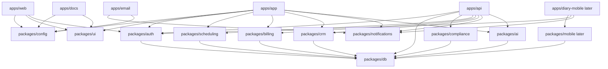

# Eleva.care v3 Master Architecture

Status: Living

## Purpose

This document is the top-level architecture reference for Eleva.care v3.

It answers:

- what Eleva v3 is
- which product surfaces it includes
- how the system should be structured
- which architectural decisions are already accepted
- how the team should sequence delivery

Read this before reading the more detailed specs in this folder.

## Product Framing

Eleva.care v3 should be built as an EU-first digital health platform with a marketplace and product architecture that can support:

- independent clinicians and experts
- future non-clinical experts such as tutors or professors
- solo experts and organizations
- public discovery and booking
- patient dashboards and longitudinal engagement
- expert CRM and workflow acceleration
- video sessions, transcripts, and AI-assisted reporting
- future Academy or learning surfaces

Eleva should remain framed as a digital health platform that enables experts to deliver services. It should not be modeled as the direct clinical provider.

## Product Surfaces

### Public surfaces

- marketing site
- trust, legal, and compliance pages
- expert marketplace and discovery
- expert public profiles
- public booking flows
- blog and docs/help content

### Authenticated surfaces

- expert workspace
- patient workspace
- organization/admin workspace
- Eleva internal operator/admin workspace

### Service and support surfaces

- API and webhooks
- email templates and lifecycle messaging
- background jobs and workflows
- future mobile patient companion app

## Architectural Position

### Start simple at the app level

The first authenticated product should be one web app with:

- route-group separation
- capability-based RBAC
- shared layouts and design system
- shared domain logic through packages

This is the right choice because Eleva still has heavily shared product objects:

- user
- organization
- membership
- expert
- patient
- booking
- session
- document
- report
- payment
- notification

Splitting into separate authenticated apps too early would add coordination, auth, routing, and deployment complexity before the true product boundaries are stable.

### Be explicit at the package level

Even though the first authenticated product is one app, the internal architecture should be modular from day one.

The system should be designed around strong package boundaries before strong app boundaries.

That approach gives Eleva:

- faster initial delivery
- less duplication
- easier future splitting
- better reuse across web, mobile, API, and jobs

## Recommended High-Level System

## Approved Core Decisions

### 1. Monorepo

Use `pnpm` workspaces with Turborepo.

Reason:

- shared contracts across apps
- shared CI and tooling
- easier package reuse
- future-ready for mobile and multiple apps

### 2. Public web and authenticated product are separate apps

Keep `apps/web` and `apps/app` separate from the start.

Reason:

- different concerns and release pressure
- cleaner SEO and marketing architecture
- simpler authenticated product shell

### 3. One authenticated product app first

Do not split into `expert`, `patient`, and `admin` web apps yet.

Reason:

- roles still share too much logic and data
- route groups and RBAC are enough for the first build
- splitting can happen later if justified

### 4. Mobile joins the monorepo later

Bring `Eleva Diary` into the monorepo once the shared auth, API, and validation layers are stable.

Reason:

- avoids backend and contract drift
- keeps initial foundation work focused
- still gets mobile into the shared architecture early

### 5. Multi-zone routing is progressive, not day-one

Use the multi-zone blueprint only when URL, SEO, or team boundaries truly justify it.

Reason:

- useful pattern, but too expensive if adopted before needed

## Core Workstreams

The project should be managed as parallel but coordinated workstreams:

### Platform foundation

- workspace setup
- shared config
- CI/CD
- design system
- package boundaries

### Identity and tenancy

- WorkOS auth
- organizations
- memberships
- RBAC
- guest activation

### Marketplace and discovery

- expert explorer
- profile pages
- category and search model
- trust and conversion

### Scheduling and booking

- calendar connections
- availability
- event types
- booking lifecycle
- reminders and follow-up

### Billing and payouts

- single sessions
- packs
- subscriptions
- payouts
- seat sync

### Patient experience

- dashboard
- documents
- reports
- session history
- mobile-connected flows

### Expert operations

- onboarding
- CRM
- notes
- reports
- reminders
- payout visibility

### Video and AI

- Daily sessions
- transcripts
- report drafting
- review/approval controls

### Admin and compliance

- expert approval
- audit views
- support tooling
- exports
- policy enforcement

### Mobile

- diary capture
- sync/share model
- patient engagement
- expert recommendation flow

## Delivery Phases

### Phase 0: Architecture and contracts

Deliver:

- ADR set v1
- domain model v1
- vendor decision matrix
- compliance assumptions
- workstream dependency map

### Phase 1: Foundation

Deliver:

- monorepo scaffold
- core packages
- public web scaffold
- product app scaffold
- API scaffold
- docs scaffold
- email scaffold

### Phase 2: Identity and compliance core

Deliver:

- WorkOS integration
- organization model
- RBAC
- audit logging
- consent and sensitive-data boundaries

### Phase 3: Marketplace and content

Deliver:

- public site
- marketplace discovery
- expert profiles
- SEO and docs foundation

### Phase 4: Scheduling and commerce

Deliver:

- scheduling engine
- booking flow
- reservation handling
- Stripe flows
- payouts visibility

### Phase 5: Patient, CRM, and AI

Deliver:

- patient portal
- expert CRM
- Daily sessions
- transcript pipeline
- AI report pipeline
- mobile integration start

### Phase 6: Hardening and scale

Deliver:

- admin/operator tooling
- performance work
- observability maturity
- security hardening
- possible routing/app-split decisions

## Things We Are Deliberately Not Doing First

- splitting all authenticated roles into separate apps
- building the most advanced clinic scheduling model immediately
- forcing Academy into a dedicated app before the domain is proven
- treating mobile as a separate backend
- over-building multi-zone routing before the need is real

## Required Companion Docs

This document depends on:

- [`monorepo-structure.md`](./monorepo-structure.md)
- [`domain-model.md`](./domain-model.md)
- [`scheduling-booking-spec.md`](./scheduling-booking-spec.md)
- [`payments-payouts-spec.md`](./payments-payouts-spec.md)
- [`mobile-integration-spec.md`](./mobile-integration-spec.md)
- [`adrs/README.md`](./adrs/README.md)

## Change Control

If the team wants to change any of these:

- app topology
- auth strategy
- scheduling model
- payments/payouts model
- transcript/AI data handling
- mobile sync model

then the team should update the relevant spec and record an ADR.
