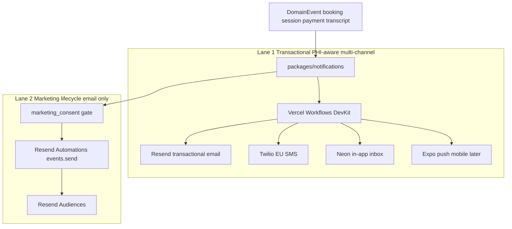

# Eleva.care v3 Notifications Spec

Status: Authoritative

## Purpose

This document defines the notification architecture for Eleva.care v3.

It should guide:

- email, SMS, in-app, and push messaging
- event-triggered lifecycle communication
- reminders and operational notifications
- marketing and CRM messaging
- preferences, consent, and channel ownership

## Notification Principles

- Notification intent must be modeled separately from channel delivery.
- Transactional (state-coupled, PHI-aware) and marketing (lifecycle, PHI-free) must be different lanes with different orchestration and different rules.
- All sends go through `packages/notifications` so vendor swaps are a single-file change.
- Sensitive data must never leak into vendor payloads that aren't strictly required for the send.
- Customer-facing and expert-facing notifications share a consistent event model.

## Two-Lane Architecture


```mermaid
flowchart TD
    domainEvent[DomainEvent booking session payment transcript] --> router[packages/notifications]

    subgraph lane1 [Lane 1 Transactional PHI-aware multi-channel]
      router --> vwf[Vercel Workflows DevKit]
      vwf --> resendTx[Resend transactional email]
      vwf --> twilio[Twilio EU SMS]
      vwf --> inbox[Neon in-app inbox]
      vwf --> expoPush[Expo push mobile later]
    end

    subgraph lane2 [Lane 2 Marketing lifecycle email only]
      router --> consent[marketing_consent gate]
      consent --> resendAuto[Resend Automations events.send]
      resendAuto --> resendAudience[Resend Audiences]
    end
```

### Lane 1 — Transactional (code-driven, multi-channel)

Orchestrated by Vercel Workflows DevKit. Sends through Resend email + Twilio EU SMS + Neon-backed in-app inbox + Expo push (mobile later).

**Entrypoint**:

```ts
sendNotification({
  kind,                 // Kind — closed union derived from NOTIFICATION_KINDS
  recipient,            // { userId } | { email, locale? } (email mode: email channel only)
  orgId?,               // REQUIRED when NOTIFICATION_KINDS[kind].scope === "org" (overload +
                        // Zod refine -> ORG_CONTEXT_REQUIRED before any write); absent for user kinds
  ctx,                  // typed per-kind context
  idempotencyKey,       // e.g. `booking_confirmed:${booking_id}`
  channelsOverride?     // may only narrow NOTIFICATION_KINDS[kind].channels
})
```

Urgency is a property of the kind (`NOTIFICATION_KINDS[kind].urgency`), never a call argument.
Delivery guarantees: e-mail = idempotent provider submission (Resend `Idempotency-Key` =
delivery row id, deduplicated by Resend for 24 h — not a recipient-delivery guarantee); SMS =
at-least-once (Twilio status callback + per-delivery `Ref` body fingerprint reconciliation
before any re-send) — see execution-plan Phase 8.

Responsibilities (`{ userId }` mode):

- resolve user preferences (`notification_preferences` unique on `(user_id, channel, category)`; see Preference Model)
- resolve locale + timezone
- render React Email template per channel
- fan out to channels whose `(user_id, channel, category).enabled` flag is true, in order: in-app, email, SMS, push. Required `payment` / `system` categories ignore a disabled flag at send time.

`{ email, locale? }` mode (recipient without an account — invitations to unknown addresses, guest
booking confirmations before activation) is the explicit exception: no preferences lookup, no
quiet hours, no in-app row, no SMS/push; the e-mail channel only, with the suppression list still
applied and `notification_deliveries.recipient_email` as the delivery key.

- write inbox row in Neon
- propagate correlation ID to Sentry + audit log + Resend/Twilio metadata
- enforce idempotency: same `idempotencyKey` must not fan out twice

Workflow semantics:

- retries with exponential backoff
- dead-letter queue surfaced in `/admin/notifications`
- heartbeat to BetterStack for long-running reminder graphs

PHI rules (Lane 1):

- email/SMS bodies contain only minimum necessary context; session notes, transcripts, AI report bodies never appear
- links use session-aware signed URLs for sensitive resources
- templates reviewed for PHI exposure before shipping

### Lane 2 — Marketing lifecycle (Resend Automations, email-only)

Orchestrated inside Resend (dashboard or `resend.automations.create`); triggered by `resend.events.send({ event, contactId | email, payload })` from the app.

**Entrypoint**:

```ts
triggerAutomation({
  event, // e.g. 'welcome.expert', 'pack.expiring'
  userId, // Eleva user
  marketingPayload, // PHI-free: first_name, locale, plan_tier, generic_booking_count
})
```

Responsibilities:

- verify `marketing_consent = true` in Neon before calling Resend
- strip any PHI from the payload (schema-validated; strict whitelist)
- resolve Resend contact ID (upsert if needed via one-way sync)
- call `resend.events.send`
- log the trigger in audit stream

PHI rules (Lane 2):

- payload is **restricted to marketing-safe fields only**: first name, locale, product tier, generic booking count
- no patient data, no session data, no transcript content, no report content
- CI-enforced schema check on every `triggerAutomation` call

Managed Automations (seeded in Resend):

- `welcome.expert`
- `welcome.patient`
- `partner.approved`
- `pack.expiring` (14 days before pack expiry)
- `reengagement.90d` (no booking in 90 days)
- `abandoned_checkout`
- `newsletter.*` (broadcasts)

### Neon → Resend contact sync

One-way, consent-gated:

- trigger: `marketing_consent` toggles to `true` in Eleva
- action: upsert contact in Resend Audiences with marketing-safe fields
- no reverse sync — Neon is the source of truth
- on `marketing_consent = false`: delete contact from Resend and log the action

## Channel Strategy

### Email (Resend)

Lane 1:

- account activation
- booking confirmation + receipt
- reschedule/cancel confirmations
- reminders (24h, 1h)
- session completed + report available
- payment succeeded/failed
- payout eligible/approved/transferred
- calendar disconnected
- expert-side operational alerts

Lane 2:

- welcome series (expert, patient)
- Become-Partner onboarding sequence
- pack-expiry nurture
- re-engagement (90-day dormant)
- abandoned-checkout recovery
- newsletter/broadcast

### SMS (Twilio EU)

Lane 1 only, opt-in, quiet-hours respected:

- booking confirmation
- 24h pre-appointment reminder
- 1h pre-appointment reminder (optional per user)
- day-of session prompt
- cancellation
- payment failed (urgent)

Preference model requires explicit SMS consent per category (`(user_id, channel, category)`).

### In-app (Neon-backed inbox)

Lane 1 fans out here when `in_app.enabled` is true for that category (required `payment` / `system` categories still send):

- all dashboard alerts
- expert follow-up tasks
- suggested appointments
- diary share notifications
- payout state changes
- admin action-required items

Schema: `notifications(id, user_id, org_id, kind, payload, link, read_at, created_at)`. Realtime via `pg_listen/notify` or short-poll.

### Push (Expo, mobile later)

Lane 1, when the Diary mobile app ships:

- appointment reminders
- diary completion reminders
- expert recommendation prompts
- report available

## Event Catalog (Lane 1)

Initial build supports at minimum:

- `account_activated`
- `booking_confirmed`
- `booking_payment_failed`
- `booking_rescheduled`
- `booking_cancelled`
- `reminder_24h`
- `reminder_1h`
- `session_completed`
- `report_available`
- `payout_eligible`
- `payout_approved`
- `payout_transferred`
- `payout_failed`
- `suggested_follow_up_created`
- `diary_share_visible_to_expert`
- `calendar_disconnected`
- `expert_kyc_required`
- `stripe_account_capability_changed`
- `clinic_seat_added`
- `clinic_seat_removed`
- `clinic_subscription_payment_failed`

**Not in Lane 1**: anything Multibanco-voucher-related (feature excluded).

## Preference Model

Shipped in Phase 5 (`notification_preferences`). Phase 8 sending consumes this table; this phase only stores it.

Table: unique `(user_id, channel, category)`.

| Column                                  | Values                                                                              |
| --------------------------------------- | ----------------------------------------------------------------------------------- |
| `channel`                               | `email` \| `sms` \| `in_app` (Expo `push` is a later channel, not in this enum yet) |
| `category`                              | `booking` \| `reminder` \| `payment` \| `marketing` \| `system`                     |
| `enabled`                               | boolean                                                                             |
| `quiet_hours_start` / `quiet_hours_end` | `HH:MM` (Postgres `time`) or null                                                   |
| `timezone`                              | IANA tz, copied from the member profile when saving                                 |

API: `GET /me` returns the rows; `PUT /me/notification-preferences` upserts the matrix. Both require session/bearer and `RATE_LIMITS.authenticated`.

Rules:

- Member-facing product copy uses **members** and personal **Spaces**, not patients or workspaces.
- SMS is explicit opt-in; UI default is off.
- Marketing is explicit opt-in; UI default is off. Lane 2 still also requires `marketing` consent (`PUT /me/consents`); withdrawing marketing consent is immediate.
- Transactional categories that are operationally required (`payment` / `system` equivalents of payment_failed, `stripe_account_capability_changed`) cannot be turned off at send time in Phase 8 — the matrix still stores the member's choice. This applies to every channel, including `in_app.enabled`. Booking, reminder, and marketing use the stored `enabled` flag at send time, including in-app.
- Quiet hours are stored in the member's timezone. Phase 8 evaluates them in that TZ. Quiet hours apply to SMS (and later push); email and in-app still deliver immediately when the category is enabled (or required).
- Guest booking confirmation before activation is the explicit exception: no preferences lookup (see Lane 1 `{ email }` mode).

`apps/app` `/[orgSlug]/settings` is the member editor for this matrix. Playwright `e2e/member.spec.ts` persists one cell (email × marketing) and asserts `GET /me`.

## Package Boundaries

Everything in `packages/notifications`. CI enforces:

- no direct `resend` imports outside this package
- no direct `twilio` imports outside this package
- no direct `expo-server-sdk` imports outside this package
- every call from the app goes through `sendNotification` or `triggerAutomation`

Testing:

- `packages/notifications/testing` exposes `mockSend`, `mockTrigger`, and recorded inbox helpers for integration tests
- Playwright tests assert inbox rows + Resend/Twilio mock calls match expectations

## Security And Compliance

- notifications never expose transcript content, session note bodies, AI report bodies, or uploaded documents by value — always by secure link
- links are signed, session-aware, expire on use or age
- logs redact body payloads where sensitive fields are present
- every send creates an audit row in `eleva_v3_audit` (actor, kind, channel, status)
- marketing sends logged separately with consent snapshot at send time

## Rollout And Feature Flags

- `ff.sms_enabled` — gate SMS channel globally (launch = on for PT)
- `ff.mbway_enabled` — payment-method cohort toggle (informs checkout copy, not notifications)
- `ff.ai_reports_beta` — gates `report_available` notifications for draft AI reports
- `ff.diary_share` — gates `diary_share_visible_to_expert`

## Open Questions

- whether experts can create custom reminder templates (likely phase 2 with moderation)
- Lane 2 broadcast cadence and segmentation — product call per launch campaign

## Related Docs

- [`payments-payouts-spec.md`](./payments-payouts-spec.md)
- [`crm-spec.md`](./crm-spec.md)
- [`mobile-integration-spec.md`](./mobile-integration-spec.md)
- [`ops-observability-spec.md`](./ops-observability-spec.md)
- [`workflow-orchestration-spec.md`](./workflow-orchestration-spec.md)
- [`vendor-decision-matrix.md`](./vendor-decision-matrix.md)
- [`adrs/README.md`](./adrs/README.md) (ADR-006 Notifications Two-Lane)
