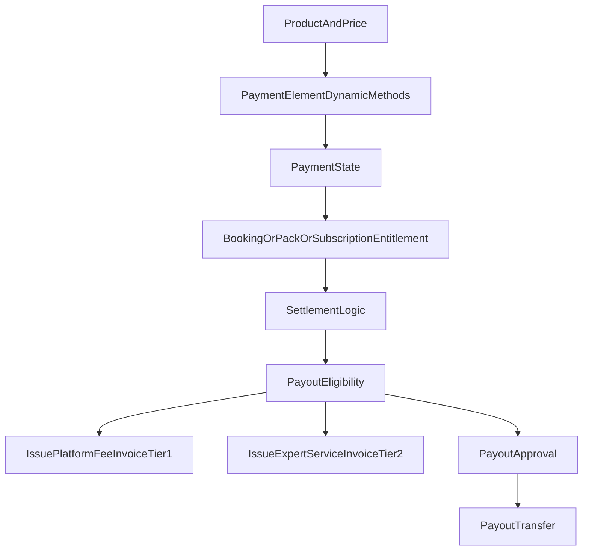
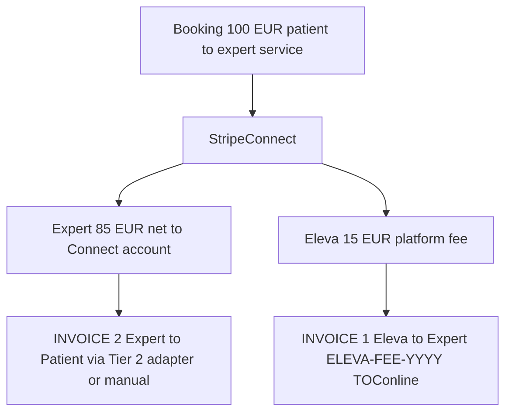

# Eleva.care v3 Payments, Subscriptions, Payouts, And Invoicing Spec

Status: Authoritative

## Purpose

This document defines the commercial model for Eleva.care v3.

It should guide:

- Stripe integration design (Connect, Subscriptions, Entitlements, Dynamic Payment Methods, Embedded Components)
- booking/payment states
- packs and subscriptions
- marketplace monetization (segment-differentiated hybrid)
- payouts and approval operations
- two-tier invoicing (Eleva → Expert/Clinic, Expert → Patient)
- reconciliation and admin tooling

## Business Model Context

Eleva is a two-sided marketplace platform. The commercial model is **segment-differentiated**, grounded in established EU health-marketplace precedent:

- [Doctolib business model](https://businessmodelcanvastemplate.com/blogs/how-it-works/doctolib-how-it-works) — €139/user/mo, ~85% subscription revenue, 340K+ practitioners, no-commission stance.
- [MarketplaceBeat — Marketplace Monetization Models](https://marketplacebeat.com/articles/marketplace-monetization-models) — subscription as workflow-monetization layer for workflow-heavy categories.
- [Monetizely — Clinic SaaS pricing research](https://www.getmonetizely.com/articles/which-pricing-metric-fits-clinics-saas-best-per-seat-per-transaction-or-per-outcome) — 3+ tiers → 26% higher ARPA.

## Payments Principles

- Separate commercial state from scheduling state.
- Keep booking/payment transitions explicit and observable.
- Make payout approval auditable.
- Prefer clear financial records over implicit calculations.
- Support Portugal/EU realities in billing, tax, and documentation.
- Never hardcode payment methods — let Stripe Dynamic Payment Methods pick per customer.

## Core Commercial Objects

- **Product** — single consultation, pack, subscription
- **Price** — one-time, recurring monthly, recurring annual
- **Purchase** — commercial transaction attempt
- **Booking Payment** — payment tied to an individual bookable session
- **Pack** — prepaid entitlement bundle (e.g., 10 sessions)
- **Subscription** — recurring relationship (expert Top Expert, clinic SaaS tiers, patient plans)
- **Clinic Subscription** — specialized subscription for org-level SaaS tiers
- **Commission Rule** — fee computation for solo-expert bookings
- **Application Fee Breakdown** — computed split per booking
- **Payout** — money moving to expert or clinic Connect account
- **Payout Approval** — policy gate before transfer
- **Platform Fee Invoice** — Eleva → Expert per-booking commission invoice (Tier 1)
- **Clinic SaaS Invoice** — Eleva → Clinic monthly subscription invoice (Tier 1)
- **Expert Service Invoice** — Expert → Patient via adapter (Tier 2)

## Marketplace Monetization — Hybrid (Locked)

### Solo experts — commission

- default **15%** platform fee per booking
- reduced to **8%** on paid **Top Expert** subscription tier (€29/mo) via Stripe Entitlements
- zero-cost entry; no forced subscription
- commission persists on the booking record (`application_fee_breakdown.platform_fee_bps`) so historical rules are preserved across future rule changes

### Clinics / Organizations — per-seat SaaS, no booking commission

Three tiers:

| Tier | Base | Per-seat | Seat range | Notes |
|---|---|---|---|---|
| **Clinic Starter** | €99/mo | €39/mo | 1–5 | small independent practices |
| **Clinic Growth** | €199/mo | €29/mo | 6–20 | mid clinics |
| **Clinic Enterprise** | custom | custom | 20+ | multi-location, SLA, CSM |

Rules:

- clinic's Stripe Connect account receives **100%** of member bookings
- internal clinic ↔ expert distribution is the clinic's own bookkeeping
- seat count auto-syncs as experts are added/removed from the clinic (via `customer.subscription.updated` on Stripe)
- overage handling per tier: Starter hard-caps at 5 active seats; Growth at 20 active seats; Enterprise unlimited
- `clinic_subscription(id, org_id, tier, seat_count, active_expert_ids, stripe_subscription_id, status, current_period_end)` is the primary commercial entity

Add-ons (drive ARPA):

- AI report credit bundles
- premium Daily video minutes
- extra CRM seats
- SAF-T export automation

### Three-party revenue — phase-2 opt-in

- gated behind `ff.three_party_revenue` (default **off**)
- shipped only when a specific clinic negotiates a commission overlay on top of SaaS
- entities `clinic_memberships`, `commission_rule`, `application_fee_breakdown` exist only for this flag path
- default clinic path is subscription-only

## Supported Commercial Models

### 1. Single session purchase

Customer pays for one session.

Use cases:

- initial consultation
- follow-up appointment
- ad hoc coaching / tutoring session

### 2. Session pack

Customer buys a bundle of sessions or credits.

Eleva v3 uses an **explicit entitlement model** (not generic credits): pack purchases create `pack_entitlement(customer_id, event_type_ids, total, remaining, expires_at)`. Booking a session decrements `remaining`.

### 3. Subscription (patient)

Customer or organization pays on a recurring basis.

- ongoing access plan (e.g., unlimited chat messages with an expert)
- patient plan offered by a clinic (Phase 2)

### 4. Subscription (expert Top Expert tier)

€29/mo via Stripe Subscriptions + Entitlements → unlocks:

- reduced commission (8% instead of 15%)
- priority search ranking
- advanced CRM features
- more AI report credits
- priority support

### 5. Subscription (clinic SaaS tiers)

Starter / Growth / Enterprise per the tier table above.

## Stripe Integration

### API + environment

- pin Stripe API version **≥ 2023-08-16** (Dynamic Payment Methods on by default)
- two accounts: `staging` + `production`, each with its own Connect platform, webhook, Dashboard, and seed scripts
- Stripe CLI used in local dev to forward webhooks

### Dynamic Payment Methods

- **never hardcode `payment_method_types`** on PaymentIntents or Checkout Sessions
- Stripe picks based on customer country/currency/device/amount
- enabled methods managed in Stripe Dashboard per environment
- expected per-country method set:
  - **PT** → card + **MB WAY** + Apple Pay + Google Pay + Link
  - **ES** → card + SEPA Direct Debit + wallets
  - **DE / NL / BE** → card + iDEAL / Bancontact + SEPA + wallets
  - **UK / US / other** → card + local wallets

### MB WAY wallet

- Stripe-native, instant, no voucher/reminder machinery
- appears automatically for PT customers via Dynamic Payment Methods
- cohort-gated via `ff.mbway_enabled` for safe rollout (toggle, not code)

### Excluded payment methods

- **Multibanco reference vouchers** — 7-day settlement delay + voucher + D3/D6/expiry reminder workflow is complexity without upside given MB WAY covers PT instant payments. Revisiting requires a new ADR.

### Single webhook endpoint

- **one `/api/stripe/webhook`** per environment handles every event type (Payment + Subscriptions + Connect + Identity)
- `packages/billing/webhook` exports the single handler:
  - verifies signature
  - writes `stripe_event_log(id PK, type, livemode, received_at, processed_at)` for idempotency
  - dispatches by `event.type` to the right Vercel Workflow
- locked subscribed event types:
  - **Payment**: `payment_intent.succeeded`, `payment_intent.payment_failed`, `payment_intent.processing`, `charge.refunded`, `charge.dispute.*`
  - **Subscriptions**: `customer.subscription.*`, `invoice.*`
  - **Connect**: `account.updated`, `capability.updated`, `person.updated`, `identity.verification_session.*`, `transfer.*`, `payout.*`, `application_fee.created`, `application_fee.refunded`
- Stripe retries handled natively (24h exponential); dead-letter path = Vercel Workflows DLQ + `/admin/webhooks`

### Embedded Components UX — fully embedded, no redirects

All Stripe surfaces render inline in Eleva's app. No popups, no Stripe-hosted pages in user flows.

| Surface | Component | Location |
|---|---|---|
| Patient checkout | Payment Element | booking page |
| Expert Connect onboarding | `<ConnectAccountOnboarding>` | expert onboarding wizard |
| Expert KYC / Identity | Stripe Identity embedded modal | inline from Connect onboarding |
| Expert payouts + balances | `<ConnectPayouts>`, `<ConnectBalances>` | `/expert/finance` |
| Expert account management | `<ConnectAccountManagement>`, `<ConnectDocuments>` | `/expert/finance/account` |
| Expert tax | `<ConnectTaxSettings>`, `<ConnectTaxRegistrations>`, `<ConnectTaxThresholdMonitoring>` | `/expert/finance/tax` |
| Platform action-needed | `<ConnectNotificationBanner>` | top of expert/clinic workspace |
| Expert SaaS subscription management | custom Eleva UI + Payment Element + Billing API | `/expert/billing` |
| Clinic SaaS subscription + seat management | custom Eleva UI + Payment Element + Billing API | `/org/billing` |
| Patient payment-method update | Payment Element in save-card mode | patient account |

Architecture:

- `packages/billing/stripe-embedded` exports React wrappers for `@stripe/connect-js` (`<ConnectComponentsProvider>`, hooks per screen)
- `/api/stripe/account-session` mints short-lived `AccountSession` tokens with precise component permissions; RBAC-gated
- `appearance` API maps Eleva design tokens (brand colors, radius, fonts) → Stripe widget theme; dark-mode supported
- `locale` prop wired to next-intl (`pt` / `en` / `es`)
- CSP allows `js.stripe.com`, `connect-js.stripe.com`, `*.stripe.com` in `script-src` and `frame-src`
- error UX: components wrapped in Eleva error boundary; `onExit` / `onLoadError` handled with consistent retry CTA

Account type locked: **Stripe Connect Express + Embedded Components** (not Custom). Express supports all embedded components we need without Custom's extra compliance and fee load.

### Stripe Entitlements

Plan → entitlement → feature gate wiring:

- expert "Top Expert" subscription → entitlement `expert:top_expert_perks` → `packages/flags` reads entitlement to gate lower-commission booking path + ranking boost + advanced CRM
- clinic Starter/Growth/Enterprise → entitlements per feature bundle → same pattern
- entitlements are **the source of truth**; `packages/flags` bridges them into the app

### Stripe Tax (PT + NIF)

- configured per PT rules in Dashboard
- NIF collected on checkout (customer-side) and expert profile (for invoicing)
- no billing-address requirement per PT/EU configuration
- Tax IDs validated via Stripe (VIES-backed for EU tax IDs)

## Suggested Financial Lifecycle

## Booking Payment States

- `draft`
- `payment_pending`
- `paid`
- `payment_failed`
- `refunded`
- `partially_refunded`
- `settled`

Not collapsed into booking status.

## Payout States

- `not_eligible`
- `eligible`
- `awaiting_approval`
- `approved`
- `transferred`
- `failed`
- `reversed` (if needed later)

## Refunds

- policy-based refunds (cancellation window rules)
- linked to cancellation state
- operational/admin review for edge cases
- auditable reason tracking
- on refund: reconcile Tier 1 invoice via credit note in TOConline (future improvement — may be manual at launch)

## Two-Tier Invoicing Model (Crystal Clear)

Two invoices, two different accounting systems, two different legal parties.

### Tier 1 — Eleva → Expert / Clinic (automated)

**Eleva is the vendor. Expert or clinic is the B2B customer. Issued automatically on Eleva's own TOConline account.**

Two variants:

#### 1a. Per-booking solo-expert commission invoice

- Series: `ELEVA-FEE-{YYYY}`
- Trigger: `issuePlatformFeeInvoice` step in `payoutEligibility` workflow when booking reaches `settled`
- Recipient: expert (NIF + name + address from expert profile + `expert_practice_location`)
- Line item: `"Platform service fee — booking #XYZ"` with `application_fee_breakdown.platform_fee`
- Idempotency: Neon `platform_fee_invoices(booking_id PK, toconline_invoice_id, issued_at, status)`
- PDF auto-sent via TOConline

#### 1b. Monthly clinic SaaS invoice

- Series: `ELEVA-SAAS-{YYYY}`
- Trigger: `issueClinicSaasInvoice` step at Stripe subscription period boundary (`invoice.finalized` event)
- Recipient: clinic (org NIF + billing address)
- Line items: tier base + (seat count × per-seat) + add-ons
- Idempotency: Neon `clinic_saas_invoices(subscription_period PK, toconline_invoice_id, issued_at, status)`
- PDF auto-sent

#### IVA / VAT matrix (requires accountant sign-off before Tier 1 coding)

| Recipient location | NIF status | IVA treatment |
|---|---|---|
| Portugal | valid NIF, B2B | 23% IVA charged |
| EU (intra-EU) | valid VIES NIF | reverse charge (0% IVA, note on invoice) |
| EU (intra-EU) | no valid VIES NIF | 23% IVA (or OSS depending on volume) |
| Non-EU | — | zero-rated, outside scope |

VIES validation:

- live check on NIF entry in expert/clinic profile
- result cached 24h
- invoicing path chosen server-side at issuance time based on current VIES status

#### Reconciliation

- **monthly QStash cron** `stripeToConlineReconciliation`: aggregates Stripe application fees per expert/clinic vs TOConline invoice totals
- flags mismatches to `/admin/accounting`
- alerts BetterStack if mismatch > 0.1% of monthly volume

#### Rollout

- behind `ff.toconline_invoicing_enabled` staged (staging → 1 pilot expert/clinic → all PT → default on for PT)
- OAuth tokens stored in WorkOS Vault via `packages/encryption`

### Tier 2 — Expert → Patient (expert's legal obligation, optionally automated)

**Legal clarity**: the expert is the vendor; the patient is the customer; the expert must issue the invoice using their own certified software under their own NIF. Eleva does not issue this invoice on Eleva's fiscal software. Eleva can *automate the issuance on the expert's own fiscal software* if the expert connects it.

#### Adapter registry

`packages/accounting/expert-apps/adapters/` (cal.com-inspired pattern):

- shared interface `ExpertInvoicingAdapter` with `connect / issueInvoice / status / disconnect`
- per-expert credentials in Neon `expert_integration_credentials(id, expert_id, slug, vault_ref, status, installed_at)`
- secrets in WorkOS Vault

#### Seed adapter priority

| Adapter | Market | Priority |
|---|---|---|
| **TOConline** (expert-side) | PT | **P1** |
| **Moloni** | PT | **P1** |
| **Manual / SAF-T** | any | **P1** (mandatory fallback) |
| InvoiceXpress | PT | P2 |
| Vendus | PT | P2 |
| Primavera Cloud | PT enterprise | P3 |
| Holded, FacturaDirecta | ES | Phase 2 |

#### Expert onboarding forces a choice

In the Become-Partner flow, before the expert can accept bookings:

1. **Auto mode** — connect one of the supported providers via OAuth/API key → Eleva auto-issues patient invoices on the expert's fiscal software in the expert's name
2. **Manual mode** — acknowledge legal obligation to invoice externally; Eleva provides:
   - booking + patient fiscal data (NIF on optional patient profile field, service descriptor, date, amount) on every session page
   - monthly SAF-T / CSV export

#### Admin verification

Become-Partner review confirms the expert has a working OAuth connection **or** explicit manual-mode acknowledgment before activation.

#### Per-booking issuance

- trigger: booking `payment_succeeded` → `issueExpertServiceInvoice` workflow step
- dispatches to the expert's selected adapter
- idempotent per `booking_id + expert_id`
- failure handling: `expertInvoiceRetry` DLQ; expert dashboard surfaces the failure with retry + manual-issuance fallback

#### Feature flags

- `ff.expert_invoicing_apps_enabled` — global on/off for the registry
- `ff.invoicing.{provider}` per adapter for staged per-provider rollout

### Clinic → Expert third-leg invoice — out of scope

When `ff.three_party_revenue` is active, clinics may owe experts a commission / rebate (or vice versa) per their private contract. This is the **clinic's own bookkeeping**, not Eleva's to automate.

Eleva exposes:

- booking + fee split data via monthly exports
- admin views of clinic payouts and their expert-level breakdown

Clinics issue the clinic ↔ expert invoice on their own systems.

Revisiting this scope requires a new ADR.

## Organization Seat Sync

For clinic SaaS:

- billable seats = active experts with at least one `event_type` published in the last 30 days
- `customer.subscription.updated` webhook fires on quantity change
- grace period: 7 days to downgrade seats before proration kicks in
- hard-caps enforced per tier (Starter ≤ 5, Growth ≤ 20, Enterprise unlimited)

## Admin Operations

Admin / operator tooling supports:

- view payment / payout state
- approve payouts
- refund or investigate payment issues
- inspect commission calculations and fee breakdown
- inspect billing history (per expert, per clinic)
- reconcile Stripe vs TOConline discrepancies
- review DLQ items (webhook, notification, invoice)
- cancel/retry workflows

Surface: `/admin/payments`, `/admin/payouts`, `/admin/subscriptions`, `/admin/accounting`, `/admin/webhooks`, `/admin/workflows`.

## Compliance And Audit Requirements

Every mutating action creates an audit row in `eleva_v3_audit` (actor, action, entity, correlation_id, source):

- payment creation + success + failure
- refund actions
- payout eligibility + approval + transfer attempts
- fee rule changes
- subscription tier changes (entitlement toggles)
- seat count changes
- invoice issuance (Tier 1 both variants + Tier 2)
- invoice retry DLQ resolution

Sensitive payment data (card numbers, CVV) is never stored in Eleva — Stripe remains the system of record for payment method details.

## Open Questions

- final refund approval policy (auto vs admin review threshold)
- Clinic Enterprise tier per-deal pricing framework
- final per-adapter onboarding copy + disclaimer wording
- whether Phase-2 expert→patient adapters (InvoiceXpress, Vendus, Primavera) ship in v3 M8 or deferred

## Related Docs

- [`domain-model.md`](./domain-model.md)
- [`scheduling-booking-spec.md`](./scheduling-booking-spec.md)
- [`organization-and-clinic-model.md`](./organization-and-clinic-model.md)
- [`workflow-orchestration-spec.md`](./workflow-orchestration-spec.md)
- [`feature-flag-rollout-plan.md`](./feature-flag-rollout-plan.md)
- [`vendor-decision-matrix.md`](./vendor-decision-matrix.md)
- [`compliance-data-governance.md`](./compliance-data-governance.md)
- [`adrs/README.md`](./adrs/README.md) (ADR-005 Payments & Monetization, ADR-013 Accounting Integration)
