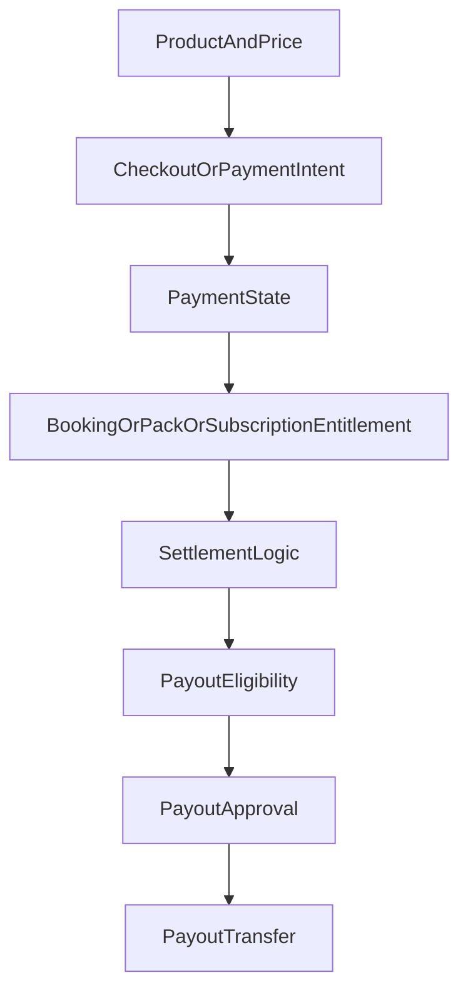

# Eleva.care v3 Payments, Subscriptions, And Payouts Spec

Status: Living

## Purpose

This document defines the commercial model for Eleva.care v3.

It should guide:

- Stripe integration design
- booking/payment states
- packs and subscriptions
- marketplace commissions
- payouts and approval operations

## Business Model Context

Eleva is a marketplace/platform business.

That means the system must support:

- customer payments
- platform fees
- expert and organization payouts
- future organization seat-based billing
- one-off sessions, packs, and subscriptions

The model must remain flexible enough to support:

- solo experts
- clinic or organization accounts
- future Academy offerings
- different fee structures by plan or product type

## Payments Principles

- Separate commercial state from scheduling state.
- Keep booking/payment transitions explicit.
- Make payout approval auditable.
- Prefer clear financial records over implicit calculations.
- Support Portugal/EU realities in billing and documentation.

## Core Commercial Objects

### Product

Represents the thing being sold.

Examples:

- single consultation
- 10-session pack
- monthly subscription

### Price

Represents the amount and billing cadence.

Examples:

- one-time price
- recurring monthly price
- annual price

### Purchase

Represents the commercial transaction attempt.

### Booking Payment

Represents payment tied to an individual bookable session.

### Pack

Represents a prepaid set of entitlements or session credits.

### Subscription

Represents a recurring relationship for a customer or organization.

### Commission Rule

Represents how Eleva takes its fee.

### Payout

Represents money moving to an expert or organization.

### Payout Approval

Represents the manual or policy-controlled approval gate before transfer.

## Supported Commercial Models

### 1. Single session purchase

Customer pays for one session.

Use cases:

- initial consultation
- follow-up appointment
- ad hoc coaching or tutoring session

### 2. Session pack

Customer buys a bundle of sessions or credits.

Use cases:

- 5-session plan
- 10-session package

The system should decide explicitly whether packs are:

- session-specific
- expert-specific
- category-specific
- or flexible credit balances

### 3. Subscription

Customer or organization pays on a recurring basis.

Use cases:

- ongoing access plan
- organization membership
- premium expert tooling

### 4. Expert/organization subscription plans

Eleva may also need expert-facing plans that affect:

- fee percentage
- CRM tooling
- advanced features
- organization seat limits

## Recommended Initial Scope

The first build should support:

- single session payments
- packs
- subscriptions
- platform commissions
- expert payouts with approval
- invoices/receipts
- organization seat synchronization groundwork

## Stripe Responsibilities

Stripe should be responsible for:

- checkout/payment collection
- recurring billing
- payment events
- payout rails where appropriate
- customer payment methods
- invoice generation where used

Eleva should be responsible for:

- domain rules
- booking linkage
- entitlement logic
- commission logic
- payout approval policy
- audit logs

## Suggested Financial Lifecycle

## Booking Payment States

Suggested states:

- `draft`
- `payment_pending`
- `paid`
- `payment_failed`
- `refunded`
- `partially_refunded`
- `settled`

These should not be collapsed into booking status.

## Payout States

Suggested states:

- `not_eligible`
- `eligible`
- `awaiting_approval`
- `approved`
- `transferred`
- `failed`
- `reversed` later if needed

## Commission Model

The system should support a commission rule that can evolve.

Initial examples:

- flat platform fee per booking
- subscription-tier-dependent fee
- organization-specific commercial terms

Do not hardcode the fee only in Stripe or only in UI assumptions.
It must exist in Eleva's domain model for reporting, audit, and migration safety.

## Refunds

The system should support:

- policy-based refunds
- link to cancellation state
- operational/admin review when needed
- auditable reason tracking

## Packs And Entitlements

The team should make one explicit decision early:

Is a pack modeled as:

- a balance of remaining sessions
- a balance of credits
- or a reusable set of booking rights for defined event types

Recommendation:

Start with a simple explicit entitlement model and avoid overly generic credit systems unless required.

## Subscriptions

The system should support recurring subscriptions for:

- patients/customers
- organizations
- experts if expert-facing plans are part of the commercial strategy

The subscription model should capture:

- owner
- billing cadence
- status
- renewal/cancel timing
- linked benefits or fee rules

## Organization Seat Sync

The plan should support future seat synchronization for organization billing.

That means the model should be ready to capture:

- billable seats
- active seats
- seat changes over time
- mapping to Stripe quantity or entitlements

## Invoices And Receipts

The system must support customer-facing financial artifacts that work for Portugal/EU billing expectations.

The final implementation should explicitly define:

- invoice ownership
- receipt generation flow
- tax treatment
- required customer/business data capture

## Expert And Organization Payouts

The system should support:

- solo expert payout
- future organization payout
- manual review/approval before transfer when policy requires it
- payout visibility in the expert workspace

## Admin Operations

Admin/operator tooling should support:

- view payment state
- view payout state
- approve payout
- refund or investigate payment issues
- inspect commission calculations
- inspect billing history

## Compliance And Audit Requirements

The system must log:

- payment creation
- payment success/failure
- refund actions
- payout eligibility
- payout approval
- payout transfer attempts
- fee rule changes

Sensitive payment data should not be stored casually in Eleva when Stripe should remain the system of record for card/payment method details.

## Open Questions

- exact pack entitlement model
- exact expert-facing subscription plans
- which billing and tax artifacts are mandatory at launch
- final refund approval policy
- whether organization seat sync is launch-critical or phase 2

## Related Docs

- [`domain-model.md`](./domain-model.md)
- [`scheduling-booking-spec.md`](./scheduling-booking-spec.md)
- [`master-architecture.md`](./master-architecture.md)
