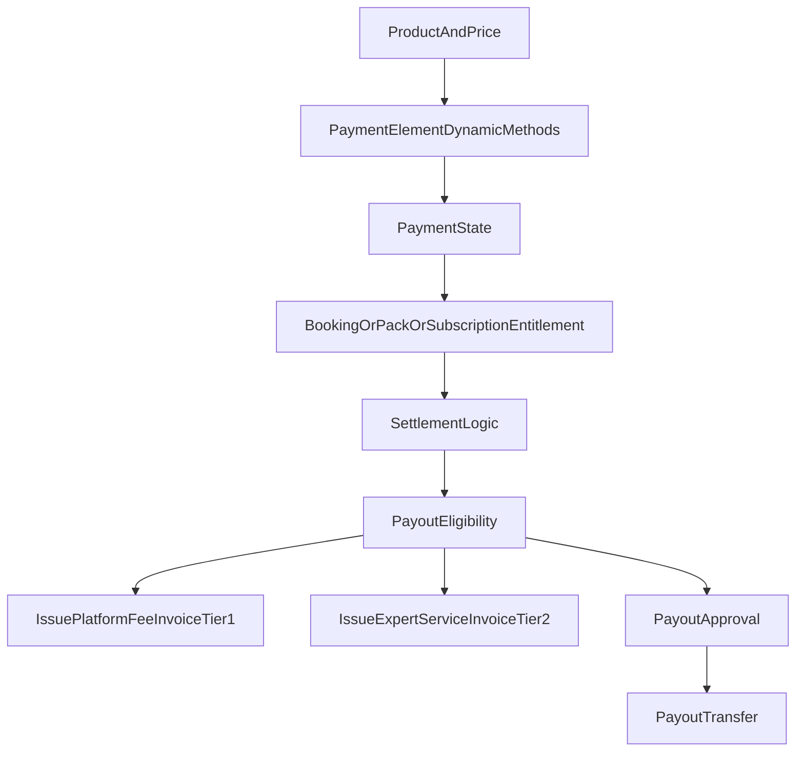
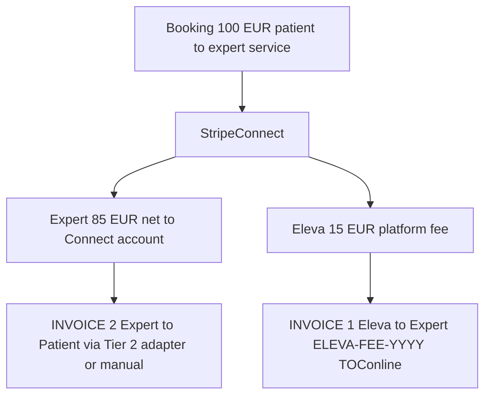

# Eleva.care v3 Payments, Subscriptions, Payouts, And Invoicing Spec

Status: Authoritative

## Purpose

This document defines the commercial model for Eleva.care v3.

It should guide:

- Stripe integration design (Connect, Subscriptions, Entitlements, Dynamic Payment Methods, Embedded Components)
- booking/payment states
- packs and subscriptions
- marketplace monetization (segment-differentiated hybrid)
- payouts and approval operations
- two-tier invoicing (Eleva → Expert/Clinic, Expert → Patient)
- reconciliation and admin tooling

## Business Model Context

Eleva is a two-sided marketplace platform. The commercial model is **segment-differentiated**, grounded in established EU health-marketplace precedent:

- [Doctolib business model](https://businessmodelcanvastemplate.com/blogs/how-it-works/doctolib-how-it-works) — €139/user/mo, ~85% subscription revenue, 340K+ practitioners, no-commission stance.
- [MarketplaceBeat — Marketplace Monetization Models](https://marketplacebeat.com/articles/marketplace-monetization-models) — subscription as workflow-monetization layer for workflow-heavy categories.
- [Monetizely — Clinic SaaS pricing research](https://www.getmonetizely.com/articles/which-pricing-metric-fits-clinics-saas-best-per-seat-per-transaction-or-per-outcome) — 3+ tiers → 26% higher ARPA.

## Phase 04 implementation (2026-09-10)

Booking checkout on `main` (PRs 04.2c–04.2f):

- **EUR-only (D-02):** offer and reservation amounts are `EUR`. Stripe reads the reservation snapshot, never a currency literal.
- **Fee at charge time:** `computeCommissionRate` in `@eleva/billing` is the SSOT. The platform fee is stored on `booking_payments.application_fee_cents` + `applied_commission_bps`. The PaymentIntent is separate charges and transfers: no `transfer_data`, no `application_fee_amount`. Phase 6 transfers `amount - fee`.
- **Payment-method policy (D-14):** booking intents use `payment_method_configuration = STRIPE_PMC_BOOKING` (`infra/stripe/setup-payment-methods.ts`). Classes live in `packages/billing/src/server/payment-method-policy.ts`. Do not hardcode `payment_method_types` on booking intents.
- **Hold:** 5 minutes; MB WAY `async_short` extends to 10 minutes while `processing`. Sweep must not cancel a processing MB WAY reservation inside that window.

## Payments Principles

- Separate commercial state from scheduling state.
- Keep booking/payment transitions explicit and observable.
- Make payout approval auditable.
- Prefer clear financial records over implicit calculations.
- Support Portugal/EU realities in billing, tax, and documentation.
- Never hardcode payment methods — let Stripe Dynamic Payment Methods pick per customer.

## Core Commercial Objects

- **Product** — single consultation, pack, subscription
- **Price** — one-time, recurring monthly, recurring annual
- **Purchase** — commercial transaction attempt
- **Booking Payment** — payment tied to an individual bookable session
- **Pack** — prepaid entitlement bundle (e.g., 10 sessions)
- **Subscription** — recurring relationship (expert Top Expert, clinic SaaS tiers, patient plans)
- **Clinic Subscription** — specialized subscription for org-level SaaS tiers
- **Commission Rule** — fee computation for solo-expert bookings
- **Application Fee Breakdown** — computed split per booking
- **Payout** — money moving to expert or clinic Connect account
- **Payout Approval** — policy gate before transfer
- **Platform Fee Invoice** — Eleva → Expert per-booking commission invoice (Tier 1)
- **Clinic SaaS Invoice** — Eleva → Clinic monthly subscription invoice (Tier 1)
- **Expert Service Invoice** — Expert → Patient via adapter (Tier 2)

## Marketplace Monetization — Hybrid (Locked)

### Solo experts — commission

- default **15%** platform fee per booking
- reduced to **8%** on paid **Top Expert** subscription tier (€29/mo) via Stripe Entitlements
- zero-cost entry; no forced subscription
- commission persists on the booking record (`application_fee_breakdown.platform_fee_bps`) so historical rules are preserved across future rule changes

### Clinics / Organizations — per-seat SaaS, no booking commission

Three tiers:

| Tier                  | Base    | Per-seat | Seat range | Notes                       |
| --------------------- | ------- | -------- | ---------- | --------------------------- |
| **Clinic Starter**    | €99/mo  | €39/mo   | 1–5        | small independent practices |
| **Clinic Growth**     | €199/mo | €29/mo   | 6–20       | mid clinics                 |
| **Clinic Enterprise** | custom  | custom   | 20+        | multi-location, SLA, CSM    |

Rules:

- clinic's Stripe Connect account receives **100%** of member bookings
- internal clinic ↔ expert distribution is the clinic's own bookkeeping
- seat count auto-syncs as experts are added/removed from the clinic (via `customer.subscription.updated` on Stripe)
- overage handling per tier: Starter hard-caps at 5 active seats; Growth at 20 active seats; Enterprise unlimited
- `clinic_subscription(id, org_id, tier, seat_count, active_expert_ids, stripe_subscription_id, status, current_period_end)` is the primary commercial entity

Add-ons (drive ARPA):

- AI report credit bundles
- premium Daily video minutes
- extra CRM seats
- SAF-T export automation

### Three-party revenue — phase-2 opt-in

- gated behind `ff.three_party_revenue` (default **off**)
- shipped only when a specific clinic negotiates a commission overlay on top of SaaS
- entities `clinic_memberships`, `commission_rule`, `application_fee_breakdown` exist only for this flag path
- default clinic path is subscription-only

## Supported Commercial Models

### 1. Single session purchase

Customer pays for one session.

Use cases:

- initial consultation
- follow-up appointment
- ad hoc coaching / tutoring session

### 2. Session pack

Customer buys a bundle of sessions or credits.

Eleva v3 uses an **explicit entitlement model** (not generic credits): pack purchases create `pack_entitlement(customer_id, event_type_ids, total, remaining, expires_at)`. Booking a session decrements `remaining`.

### 3. Subscription (patient)

Customer or organization pays on a recurring basis.

- ongoing access plan (e.g., unlimited chat messages with an expert)
- patient plan offered by a clinic (Phase 2)

### 4. Subscription (expert Top Expert tier)

€29/mo via Stripe Subscriptions + Entitlements → unlocks:

- reduced commission (8% instead of 15%)
- priority search ranking
- advanced CRM features
- more AI report credits
- priority support

### 5. Subscription (clinic SaaS tiers)

Starter / Growth / Enterprise per the tier table above.

## Stripe Integration

### API + environment

- pin Stripe API version **≥ 2023-08-16** (Dynamic Payment Methods on by default)
- two accounts: `staging` + `production`, each with its own Connect platform, webhook, Dashboard, and seed scripts
- Stripe CLI used in local dev to forward webhooks

### Dynamic Payment Methods

- **never hardcode `payment_method_types`** on PaymentIntents or booking Checkout Sessions — Dynamic Payment Methods auto-show the right set per country
- **ADR-016 carve-out**: SaaS subscription Checkout Sessions (`mode: "subscription"`) MUST pin `payment_method_types: ["card", "sepa_debit"]` because MB WAY and Multibanco are one-time-only and cannot recur. This is the only place `payment_method_types` may be hardcoded — see [ADR-016](./adrs/ADR-016-subscription-ux-direction.md) and [ADR-005](./adrs/ADR-005-payments-and-monetization.md).
- Stripe picks based on customer country/currency/device/amount (booking checkout)
- enabled methods are **not** left to the Dashboard default: booking PaymentIntents pass
  `payment_method_configuration = STRIPE_PMC_BOOKING`, a Payment Method Configuration owned by
  `infra/stripe/setup-payment-methods.ts` (D-14). Launch set: `card` (incl. Apple Pay / Google
  Pay), `link`, `mb_way`. Reservation-hold policy per method class lives in
  `packages/billing/src/server/payment-method-policy.ts`: `synchronous` (card, wallets, Link),
  `async_short` (MB WAY — hold extended to 10 min while the intent is `processing`; the expiry
  sweep never cancels a reservation with a `processing` intent **inside** that window; the
  window is bounded: at hold + 10 min the sweep calls `paymentIntents.retrieve` — `succeeded`
  -> confirm normally (late webhook), `requires_payment_method`/`canceled` -> release, still
  `processing` -> release the slot anyway and mark the reservation `released_while_processing`;
  if that intent later succeeds (`payment_intent.succeeded` after release) the handler tries to
  re-reserve the same window and confirms when it is still free, otherwise refunds in full
  automatically (`refund reason = slot_lost`) and notifies the member — tested with a recorded
  late-success event; a `processing` intent older than 24 h is cancelled by the reconciler), `excluded`
- expected per-country method set at launch (EUR-only, D-02):
  - **PT** → card + **MB WAY** + Apple Pay + Google Pay + Link
  - **everyone else** → card + wallets + Link (SEPA Direct Debit, iDEAL, Bancontact arrive with
    the ES/EU expansion decision in Phase 16.1, each with its own hold policy)

### MB WAY wallet

- Stripe-native, instant, no voucher/reminder machinery
- appears automatically for PT customers via Dynamic Payment Methods
- cohort-gated via `ff.mbway_enabled` for safe rollout (toggle, not code)

### Excluded payment methods

- **Multibanco reference vouchers** — 7-day settlement delay + voucher + D3/D6/expiry reminder workflow is complexity without upside given MB WAY covers PT instant payments. Revisiting requires a new ADR.
- **SEPA Direct Debit, Klarna and every other delayed-notification method** for one-time bookings — a 5-minute slot reservation cannot outlive a payment that settles in days (D-14). SEPA DD stays allowed for SaaS subscriptions per the ADR-016 carve-out.

### Webhook endpoints (platform + Connect)

- **two endpoints per environment** since the 2026-09 plan amendment: `/webhooks/stripe` (platform account events, `STRIPE_WEBHOOK_SECRET`) and `/webhooks/stripe/connect` (`connect: true` endpoint for connected-account events, `STRIPE_CONNECT_WEBHOOK_SECRET`); both are thin routes in `apps/api` and both dispatch through the same `processStripeEvent` in `@eleva/billing/server`; `infra/stripe/setup-webhooks.ts` manages both (two-file contract, see `.cursor/rules/stripe-webhooks.mdc`)
- both route handlers (`apps/api/src/app/webhooks/stripe/route.ts` and `apps/api/src/app/webhooks/stripe/connect/route.ts`) are intentionally thin and **each verifies its own signature**: read the raw request body and the `stripe-signature` header, call `stripe().webhooks.constructEventAsync(rawBody, signature, secret)` with the route-specific secret (`STRIPE_WEBHOOK_SECRET` for `/webhooks/stripe`, `STRIPE_CONNECT_WEBHOOK_SECRET` for `/webhooks/stripe/connect`), return 400 on failure without touching the database, and only then forward the verified `Stripe.Event` (plus `source: "platform" | "connect"`) to `processStripeEvent`; a Connect event delivered to the platform route (or vice versa) fails verification because the secrets differ — that cross-delivery is a test fixture on both routes. All business logic lives in `@eleva/billing/server`
- `processStripeEvent` is the canonical idempotency + dispatch flow (signature verification is the route's responsibility — see `.cursor/rules/stripe-webhooks.mdc`):
  - persists every `event.id` in `stripe_webhook_events` (Neon, platform-level table) for idempotency — `INSERT ... ON CONFLICT DO NOTHING` short-circuits duplicate deliveries; status transitions are `received → processing → processed | failed | failed_terminal | ignored`
  - dispatches by `event.type` to the right Vercel Workflow under `withAudit({ orgId, actorUserId: null })` so every mirror write is auditable
- locked subscribed event types:
  - **Payment**: `payment_intent.succeeded`, `payment_intent.payment_failed`, `payment_intent.processing`, `charge.refunded`, `charge.dispute.*`
  - **Subscriptions**: `customer.subscription.*`, `invoice.*`
  - **Platform endpoint (transfers)**: `transfer.created`, `transfer.updated`, `transfer.reversed` — the platform owns the transfer and performs the reversal, so its events arrive on `/webhooks/stripe`, not on the Connect endpoint; `identity.verification_session.*` also platform-side
  - **Connect endpoint**: `account.updated`, `capability.updated`, `person.updated`, `payout.*` (connected-account payouts) — connected-account resources only. `application_fee.*` are **not** subscribed — the separate-charges-and-transfers funds flow has no application fee object (the platform fee is a ledger value, `booking_payments.application_fee_cents`)
- Stripe retries handled natively (24h exponential); dead-letter path = Vercel Workflows DLQ + `/admin/webhooks`

### Embedded Components UX — fully embedded, no redirects

All Stripe surfaces render inline in Eleva's app. No Stripe-hosted pages in user flows and no popups **opened by Eleva code** — with two documented exceptions. (1) **Connect embedded components' own authentication popups**: onboarding, account management, payouts and documents components open a Stripe-hosted popup for identity verification/authentication steps that Stripe does not allow inline; this is part of Connect.js (pinned version in `@eleva/billing`) and is permitted: the app must not set `Cross-Origin-Opener-Policy` (Stripe states cross-origin isolation is unsupported and it would sever the popup's opener channel), the components render inside an Eleva error boundary with `onLoadError`/`onExit` handlers that show a retry CTA and re-mint the `AccountSession` on `expired` errors, and a blocked-popup state shows an explicit "allow popups for eleva.care" message; browser tests (Playwright) cover Connect onboarding, payouts, Link and 3DS against the pinned Connect.js/Stripe.js versions. (2) **The Stripe Customer Portal for SaaS subscription management** (rows marked "Portal" below). Portal is hosted by Stripe by design (there is no embedded equivalent for plan change, cancellation, invoice history and payment-method update for subscriptions); the controls that make it acceptable are: the portal session is minted server-side (`POST /billing/portal-session`, RBAC-gated to the org owner/billing role, audited `billing.portal_session_created`) with a `return_url` fixed to `/expert/billing` or `/org/billing` on our own origin; the redirect is a full-page navigation, never an iframe (Stripe forbids framing the Portal), so `billing.stripe.com` appears in no CSP directive at all (a server-issued 302 to a top-level navigation is not governed by CSP; nothing is framed and no form posts to it); on return the page re-fetches subscription state from our DB (already updated by `customer.subscription.*` webhooks) and shows a pending state until the webhook has landed rather than trusting query parameters. Any future embedded Stripe component that covers the same surface replaces Portal and removes the exception.

| Surface                                    | Component                                                                                                       | Location                       |
| ------------------------------------------ | --------------------------------------------------------------------------------------------------------------- | ------------------------------ |
| Patient checkout                           | Payment Element                                                                                                 | booking page                   |
| Expert Connect onboarding                  | `<ConnectAccountOnboarding>`                                                                                    | expert onboarding wizard       |
| Expert KYC / Identity                      | Connect's own KYC (D-05); Stripe Identity embedded modal only behind `ff.expert_identity_verification`          | inline from Connect onboarding |
| Expert payouts + balances                  | `<ConnectPayouts>`, `<ConnectBalances>`                                                                         | `/expert/finance`              |
| Expert account management                  | `<ConnectAccountManagement>`, `<ConnectDocuments>`                                                              | `/expert/finance/account`      |
| Expert tax                                 | `<ConnectTaxSettings>`, `<ConnectTaxRegistrations>`, `<ConnectTaxThresholdMonitoring>`                          | `/expert/finance/tax`          |
| Platform action-needed                     | `<ConnectNotificationBanner>`                                                                                   | top of expert/clinic workspace |
| Expert SaaS subscription purchase          | Stripe Embedded Checkout (per ADR-016, `card + sepa_debit` only)                                                | `/expert/billing`              |
| Expert SaaS subscription management        | Stripe Customer Portal (per ADR-016, audited on session-mint)                                                   | `/expert/billing` → Portal     |
| Clinic SaaS subscription purchase          | Stripe Embedded Checkout (per ADR-016, `card + sepa_debit` only)                                                | `/org/billing`                 |
| Clinic SaaS subscription + seat management | Stripe Customer Portal (per ADR-016; seat quantity synced by `@eleva/billing` from active members, see Phase 3) | `/org/billing` → Portal        |
| Patient payment-method update              | Payment Element in save-card mode                                                                               | patient account                |

Architecture:

- `packages/billing/stripe-embedded` exports React wrappers for `@stripe/connect-js` (`<ConnectComponentsProvider>`, hooks per screen)
- `/api/stripe/account-session` mints short-lived `AccountSession` tokens with precise component permissions; RBAC-gated
- `appearance` API maps Eleva design tokens (brand colors, radius, fonts) → Stripe widget theme; dark-mode supported
- `locale` prop wired to next-intl (`pt` / `en` / `es`)
- the current `packages/config` `VENDORS.stripe.frameSrc` still carries `https://*.stripe.com` — Phase 4 PR 04.2 replaces it with the explicit list below (a CSP unit test pins the directive set) and Phase 6 re-verifies it against the pinned Connect.js version
- CSP is **exactly Stripe's published list for the products we enable** (Stripe.js/Elements + Link, 3DS, Connect embedded components), re-checked against the Stripe CSP docs in the Phase 6 spike and pinned in `@eleva/config` `stripeCsp`: `script-src https://js.stripe.com https://*.js.stripe.com https://connect-js.stripe.com https://maps.googleapis.com` (Address Element); `frame-src https://js.stripe.com https://*.js.stripe.com https://connect-js.stripe.com https://hooks.stripe.com` (3DS); `connect-src https://api.stripe.com https://maps.googleapis.com`; `img-src https://*.stripe.com`; `style-src` with the Connect.js inline-style hash Stripe documents plus its font origins; `billing.stripe.com` only in `form-action` (Customer Portal is a full-page navigation, never framed). The bare `*.stripe.com` never appears in `script-src`/`frame-src`/`connect-src`, and no `Cross-Origin-Opener-Policy`/`Cross-Origin-Embedder-Policy` header is set on any page hosting Stripe (unsupported by Stripe). The CSP test asserts this exact directive set; the browser tests above run in report-only mode first and any violation fails CI
- error UX: components wrapped in Eleva error boundary; `onExit` / `onLoadError` handled with consistent retry CTA

Account type locked: **Stripe Connect Express + Embedded Components** (not Custom). Express supports all embedded components we need without Custom's extra compliance and fee load.

### Stripe Entitlements

Plan → entitlement → feature gate wiring:

- expert "Top Expert" subscription → entitlement `expert:top_expert_perks` → `packages/flags` reads entitlement to gate lower-commission booking path + ranking boost + advanced CRM
- clinic Starter/Growth/Enterprise → entitlements per feature bundle → same pattern
- entitlements are **the source of truth**; `packages/flags` bridges them into the app

### Stripe Tax (PT + NIF)

- configured per PT rules in Dashboard
- NIF collected on checkout (customer-side) and expert profile (for invoicing)
- no billing-address requirement per PT/EU configuration
- Tax IDs validated via Stripe (VIES-backed for EU tax IDs)

## Suggested Financial Lifecycle

```mermaid
flowchart TD
    product[ProductAndPrice] --> checkout[PaymentElementDynamicMethods]
    checkout --> payment[PaymentState]
    payment --> entitlement[BookingOrPackOrSubscriptionEntitlement]
    entitlement --> settlement[SettlementLogic]
    settlement --> payoutEligible[PayoutEligibility]
    payoutEligible --> invoice1[IssuePlatformFeeInvoiceTier1]
    payoutEligible --> invoice2[IssueExpertServiceInvoiceTier2]
    payoutEligible --> payoutApproved[PayoutApproval]
    payoutApproved --> payoutTransfer[PayoutTransfer]
```

## Booking Payment States

- `draft`
- `payment_pending`
- `paid`
- `payment_failed`
- `refunded`
- `partially_refunded`
- `settled`

Not collapsed into booking status.

## Payout States

SSOT for `payout_states.status` (implemented in execution-plan Phase 6; the phase file and
this list must stay identical):

- `pending` — payment succeeded, `eligible_at` not yet reached
- `scheduled` — eligible and queued for the next transfer run
- `approval_required` — first payout or amount at or above the approval threshold (the only two
  reasons); leaves via admin approve (-> `scheduled`; refused with 409 while the payment has an
  open dispute) or hold (-> `held`)
- `transferred` — Stripe Transfer created (`stripe_transfer_id`)
- `paid_out` — Stripe Payout paid on the connected account
- `failed` — transfer or payout failed after retries; DLQ + admin flag
- `held` — `hold_reasons` set (`dispute`, `manual`; never `approval_required`);
  `held_from_status` records the status before the first reason; dispute won removes `dispute`,
  staff `release` removes `manual`, and the row returns to `held_from_status` only when the set
  is empty; dispute lost -> `reversed`
- `reversal_pending` — a refund succeeded but the matching `transfers.createReversal` failed
  (`balance_insufficient`, network); retried with alerting and reconciled by `transfer.reversed`
- `reversed` — refund before/after transfer or dispute lost (transfer reversed when one exists;
  `reversed_cents` accumulates partial reversals)

The union is therefore `pending|scheduled|approval_required|transferred|paid_out|failed|held|reversal_pending|reversed` — identical in Phase 6 (schema, API types, state machine, audit union `payout.*`) and here.

Holds compose: a payout leaves `held` only when every hold reason has been cleared; there is
no separate "released" state.

## Refunds

- policy-based refunds (cancellation window rules; the no-show and dispute policy is decision D-06 — **working pre-launch**, founder recorded 2026-09-12; finance and legal re-sign before production)
- linked to cancellation state
- operational/admin review for edge cases; refunds above `ADMIN_DUAL_CONTROL_REFUND_CENTS` need
  dual control (Phase 12)
- auditable reason tracking
- **funds-flow contract (separate charges and transfers — P0-1 of the 2026-09 review)**: a refund
  and a transfer reversal are two Stripe operations with two ledger states, never a single
  `reverse_transfer` flag (that option belongs to destination charges). (1) `refunds.create({
payment_intent, amount })` with idempotency key `refund:<bookingPaymentId>:<n>` -> `refunds`
  row; (2) when a transfer exists, `transfers.createReversal(transferId, { amount })` with its own
  idempotency key -> `transfer_reversals` row. Partial refunds reverse proportionally but the
  allocation is **cumulative, not per refund**: `reversalCents_n = round(refundedToDate / gross *
  transferred) - reversedToDate`, so independent rounding can neither leave residual cents nor
  exceed the transfer; the final refund that brings `refundedToDate = gross` reverses exactly
  `transferred - reversedToDate`. Sequence (README rule 9 — no vendor call inside a transaction):
  tx1 inserts the `refunds` row `pending` with its idempotency key and, when a transfer exists,
  the `transfer_reversals` row `pending` with the computed `reversed_cents`; **outside any
  transaction** `refunds.create` is called with its key; `transfers.createReversal` is called
  **only after the refund is confirmed `succeeded`** (from the response, or — when the response
  was lost — by **replaying the identical `refunds.create` with the same idempotency key**, which
  Stripe answers with the original result for 24 h, or by the `charge.refunded` /
  `refund.updated` webhook that carries the refund id; Stripe has no lookup-by-idempotency-key
  endpoint, so the refund id is persisted on the row the moment any of those paths returns it) — a failed or unknown refund never triggers a
  reversal, so the expert's transfer is never reduced without funds going back to the member;
  tx2 records each result by compare-and-set on the row status (`pending -> succeeded|failed`),
  updates `booking_payments.refunded_cents` and `payout_states.reversed_cents` and moves the
  payout to `reversal_pending` when the reversal call failed (a lost response is repaired by the
  reconciler the same way: replay the identical POST with the stored idempotency key inside the
  24 h window, or take the object id from the `charge.refunded` / `transfer.reversed` webhook;
  after 24 h with neither, the reconciler lists `refunds` by `payment_intent` and `transfers`
  reversals by the stored `transfer_id` and matches on `metadata.refund_row_id` /
  `metadata.reversal_row_id`, which every create call sets for exactly this purpose); the DB
  enforces `CHECK (reversed_cents <= amount_cents)`; Stripe rejects
  reversals above the unreversed remainder, so the ledger and Stripe agree by construction
  (tests: partial refunds 33.33 + 33.33 + 33.34 on 100.00 gross / 85.00 transferred ->
  reversals 28.33 + 28.33 + 28.34, cumulative 85.00; 3 x 33.33 alone -> 84.99, the residual
  cent is reversed only when the residual cent is refunded; refund after full reversal -> no
  reversal call). A successful
  refund with a failed reversal parks the payout in `reversal_pending` — the member never waits
  on the expert's balance
- on refund **succeeded** (never on request): Tier 1 credit note in TOConline from
  `computeSettlement.creditNoteAllocation`

### Settlement matrix (`computeSettlement`, D-03 / D-04 — working pre-launch, 2026-09-12)

`packages/billing/src/server/commission.ts` is the only place money is split. The rows below are
the **working pre-launch** matrix (founder recorded D-03 / D-04 on 2026-09-12). Finance still
re-signs before go-live. To keep the contract testable under either outcome, the fee bearer is an
**input**, not a constant: inputs
are `grossCents`, `commissionBps` (1500 default, 800 Top Expert, 0 clinic-attributed),
`vatRateBps` and `vatTreatment` (from the IVA matrix below), `processingFeeCents` (Stripe's
actual `balance_transaction.fee`) and `feeBearer: "platform" | "expert" | "clinic"` (resolved
from `@eleva/config` `SETTLEMENT_FEE_BEARER` per booking kind). Finance re-signs
D-04 before go-live; that re-sign is not an implementation gate. The unit
tests cover every bearer variant so a later finance outcome is a config change
with a green suite, not a code change.

| Output                                | Rule                                                                                                                                                                                                                                                                                          |
| ------------------------------------- | --------------------------------------------------------------------------------------------------------------------------------------------------------------------------------------------------------------------------------------------------------------------------------------------- |
| `platformFeeGross`                    | advertised commission, **VAT-inclusive** — the expert nets the headline (100 EUR -> 15.00 fee, 85.00 transfer)                                                                                                                                                                                |
| `platformFeeNet` / `vatOnPlatformFee` | PT B2B: 15.00 = 12.20 net + 2.80 IVA; intra-EU reverse charge: 15.00 net, 0 IVA                                                                                                                                                                                                               |
| `expertTransfer`                      | `feeBearer = platform` (marketplace working default): gross − fee gross, Eleva absorbs Stripe processing out of its fee; `feeBearer = clinic` (clinic 0% working default): gross − processing fee; `feeBearer = expert`: gross − fee gross − processing fee — D-04 picks one per booking kind |
| `creditNoteAllocation`                | proportional on partial refunds                                                                                                                                                                                                                                                               |
| rounding                              | half-up on cents, applied once, on the fee                                                                                                                                                                                                                                                    |
| `currency`                            | `EUR` (D-02; `CHECK (currency = 'EUR')` on offer tables at launch)                                                                                                                                                                                                                            |

Every ledger row, transfer, Tier 1 invoice and finance-UI number comes from this function;
`booking_payments` stores `applied_commission_bps`, `platform_fee_net_cents`,
`platform_fee_vat_cents`, `processing_fee_cents`.

### Historical MVP invoices (D-09)

Migrated MVP paid bookings are imported with `platform_fee_invoices.status = legacy` (+
`legacy_document_ref`) or `legacy_missing`; v3 never issues a Tier 1 document for a booking paid
before cutover; the accountant decides any backfill outside the system.

## Two-Tier Invoicing Model (Crystal Clear)

```mermaid
flowchart TD
    booking["Booking 100 EUR patient to expert service"] --> stripe[StripeConnect]
    stripe --> expertPayout[Expert 85 EUR net to Connect account]
    stripe --> elevaFee[Eleva 15 EUR platform fee]
    elevaFee --> invoice1[INVOICE 1 Eleva to Expert ELEVA-FEE-YYYY TOConline]
    expertPayout --> invoice2[INVOICE 2 Expert to Patient via Tier 2 adapter or manual]
```

Two invoices, two different accounting systems, two different legal parties.

### Tier 1 — Eleva → Expert / Clinic (automated)

**Eleva is the vendor. Expert or clinic is the B2B customer. Issued automatically on Eleva's own TOConline account.**

Two variants:

#### 1a. Per-booking solo-expert commission invoice

- Series: `ELEVA-FEE-{YYYY}`
- Trigger: `issuePlatformFeeInvoice` step in `payoutEligibility` workflow when booking reaches `settled`
- Recipient: expert (NIF + name + address from expert profile + `expert_practice_location`)
- Line item: `"Platform service fee — booking #XYZ"` with `application_fee_breakdown.platform_fee`
- Idempotency: Neon `platform_fee_invoices(booking_id PK, toconline_invoice_id, issued_at, status)`
- PDF auto-sent via TOConline

#### 1b. Monthly clinic SaaS invoice

- Series: `ELEVA-SAAS-{YYYY}`
- Trigger: `issueClinicSaasInvoice` step at Stripe subscription period boundary (`invoice.finalized` event)
- Recipient: clinic (org NIF + billing address)
- Line items: tier base + (seat count × per-seat) + add-ons
- Idempotency: Neon `clinic_saas_invoices(subscription_period PK, toconline_invoice_id, issued_at, status)`
- PDF auto-sent

#### IVA / VAT matrix (requires accountant sign-off before Tier 1 coding)

| Recipient location | NIF status        | IVA treatment                            |
| ------------------ | ----------------- | ---------------------------------------- |
| Portugal           | valid NIF, B2B    | 23% IVA charged                          |
| EU (intra-EU)      | valid VIES NIF    | reverse charge (0% IVA, note on invoice) |
| EU (intra-EU)      | no valid VIES NIF | 23% IVA (or OSS depending on volume)     |
| Non-EU             | —                 | zero-rated, outside scope                |

VIES validation:

- live check on NIF entry in expert/clinic profile
- result cached 24h
- invoicing path chosen server-side at issuance time based on current VIES status

#### Reconciliation

- **monthly QStash cron** `stripeToConlineReconciliation`: aggregates the settlement ledger — `booking_payments.application_fee_cents` (the `computeSettlement` output persisted per paid booking; there is no Stripe application-fee object in the separate-charges-and-transfers flow) — per expert/clinic vs `platform_fee_invoices` totals and the TOConline document totals for the same period; fixture: N paid bookings with known settlements reconcile to the cent against their invoices, one missing invoice and one amount drift are both flagged
- flags mismatches to `/admin/accounting`
- alerts BetterStack if mismatch > 0.1% of monthly volume

#### Rollout

- behind `ff.toconline_invoicing_enabled` staged (staging → 1 pilot expert/clinic → all PT → default on for PT)
- Integration OAuth tokens stored encrypted at rest via `packages/encryption` (envelope, ADR-020) in Neon. Calendar tokens use Better Auth `account.encryptOAuthTokens`.

### Tier 2 — Expert → Patient (expert's legal obligation, optionally automated)

**Legal clarity**: the expert is the vendor; the patient is the customer; the expert must issue the invoice using their own certified software under their own NIF. Eleva does not issue this invoice on Eleva's fiscal software. Eleva can _automate the issuance on the expert's own fiscal software_ if the expert connects it.

#### Adapter registry

`packages/accounting/expert-apps/adapters/` (cal.com-inspired pattern):

- shared interface `ExpertInvoicingAdapter` with `connect / issueInvoice / status / disconnect`
- per-expert credentials in Neon `expert_integration_credentials(id, expert_id, slug, vault_ref, status, installed_at)`
- secrets encrypted at rest via `packages/encryption` (envelope, ADR-020); `vault_ref` points at the encrypted row, never at a third-party vault

#### Seed adapter priority

| Adapter                     | Market        | Priority                    |
| --------------------------- | ------------- | --------------------------- |
| **TOConline** (expert-side) | PT            | **P1**                      |
| **Moloni**                  | PT            | **P1**                      |
| **Manual / SAF-T**          | any           | **P1** (mandatory fallback) |
| InvoiceXpress               | PT            | P2                          |
| Vendus                      | PT            | P2                          |
| Primavera Cloud             | PT enterprise | P3                          |
| Holded, FacturaDirecta      | ES            | Phase 2                     |

#### Expert onboarding forces a choice

In the Become-Partner flow, before the expert can accept bookings:

1. **Auto mode** — connect one of the supported providers via OAuth/API key → Eleva auto-issues patient invoices on the expert's fiscal software in the expert's name
2. **Manual mode** — acknowledge legal obligation to invoice externally; Eleva provides:
   - booking + patient fiscal data (NIF on optional patient profile field, service descriptor, date, amount) on every session page
   - monthly SAF-T / CSV export

#### Admin verification

Become-Partner review confirms the expert has a working OAuth connection **or** explicit manual-mode acknowledgment before activation.

#### Per-booking issuance

- trigger: booking `payment_succeeded` → `issueExpertServiceInvoice` workflow step
- dispatches to the expert's selected adapter
- idempotent per `booking_id + expert_id`
- failure handling: `expertInvoiceRetry` DLQ; expert dashboard surfaces the failure with retry + manual-issuance fallback

#### Feature flags

- `ff.expert_invoicing_apps_enabled` — global on/off for the registry
- `ff.invoicing.{provider}` per adapter for staged per-provider rollout

### Clinic → Expert third-leg invoice — out of scope

When `ff.three_party_revenue` is active, clinics may owe experts a commission / rebate (or vice versa) per their private contract. This is the **clinic's own bookkeeping**, not Eleva's to automate.

Eleva exposes:

- booking + fee split data via monthly exports
- admin views of clinic payouts and their expert-level breakdown

Clinics issue the clinic ↔ expert invoice on their own systems.

Revisiting this scope requires a new ADR.

## Organization Seat Sync

For clinic SaaS:

- billable seats = active experts with at least one `event_type` published in the last 30 days
- `customer.subscription.updated` webhook fires on quantity change
- grace period: 7 days to downgrade seats before proration kicks in
- hard-caps enforced per tier (Starter ≤ 5, Growth ≤ 20, Enterprise unlimited)

## Admin Operations

Admin / operator tooling supports:

- view payment / payout state
- approve payouts
- refund or investigate payment issues
- inspect commission calculations and fee breakdown
- inspect billing history (per expert, per clinic)
- reconcile Stripe vs TOConline discrepancies
- review DLQ items (webhook, notification, invoice)
- cancel/retry workflows

Surface: `/admin/payments`, `/admin/payouts`, `/admin/subscriptions`, `/admin/accounting`, `/admin/webhooks`, `/admin/workflows`.

## Compliance And Audit Requirements

Every mutating action creates an audit row in `eleva_v3_audit` (actor, action, entity, correlation_id, source):

- payment creation + success + failure
- refund actions
- payout eligibility + approval + transfer attempts
- fee rule changes
- subscription tier changes (entitlement toggles)
- seat count changes
- invoice issuance (Tier 1 both variants + Tier 2)
- invoice retry DLQ resolution

Sensitive payment data (card numbers, CVV) is never stored in Eleva — Stripe remains the system of record for payment method details.

## Open Questions

- final refund approval policy (auto vs admin review threshold)
- Clinic Enterprise tier per-deal pricing framework
- final per-adapter onboarding copy + disclaimer wording
- whether Phase-2 expert→patient adapters (InvoiceXpress, Vendus, Primavera) ship in v3 M8 or deferred

## Related Docs

- [`domain-model.md`](./domain-model.md)
- [`scheduling-booking-spec.md`](./scheduling-booking-spec.md)
- [`organization-and-clinic-model.md`](./organization-and-clinic-model.md)
- [`workflow-orchestration-spec.md`](./workflow-orchestration-spec.md)
- [`feature-flag-rollout-plan.md`](./feature-flag-rollout-plan.md)
- [`vendor-decision-matrix.md`](./vendor-decision-matrix.md)
- [`compliance-data-governance.md`](./compliance-data-governance.md)
- [`adrs/README.md`](./adrs/README.md) (ADR-005 Payments & Monetization, ADR-013 Accounting Integration)
