# Eleva.care v3 Scheduling And Booking Spec

Status: Authoritative

## Purpose

This document defines the target scheduling and booking model for Eleva.care v3.

It should guide:

- product design
- domain modeling
- booking engine implementation
- calendar integration decisions
- billing and reminder flows

The goal is to reuse the strongest scheduling ideas from the legacy Eleva product and `cal.diy` without importing all of that complexity on day one.

## Product Goals

Eleva scheduling must support:

- multiple calendar connections per expert
- multiple event types per expert
- different schedules for different event types
- online, in-person, and phone sessions
- localized event content
- expert and patient timezones
- reminders, rescheduling, and cancellations
- future support for organization/team scheduling

## Scheduling Principles

- Separate availability from bookings.
- Separate busy-time calendars from destination calendars.
- Treat booking concurrency as a first-class problem.
- Keep the initial model single-host first, but extensible for later team logic.
- Make rules explicit rather than burying them inside UI assumptions.

## Core Concepts

### Event Type

An event type is a bookable service definition.

Examples:

- first consultation
- follow-up session
- coaching call
- tutoring session

Fields include:

- `title` (localized per PT/EN/ES)
- `description` (localized)
- `slug` — URL segment, lowercase `[a-z0-9-]`, case-insensitive unique per expert (e.g., `first-consultation`, `coaching-call-30`)
- `duration`
- `price`
- `language_support`
- `session_mode` (`online` / `in_person` / `phone`)
- `event_location` (for in-person)
- `booking_window`
- `minimum_notice`
- `buffers` (before / after)
- `cancellation_rules`
- `reschedule_rules`
- `worldwide_mode` (for coaching / chat / non-clinical sessions)
- `active` / `published` state

### Public URL shape (multi-zone gateway — ADR-014)

- Expert profile: `eleva.care/[username]`
- Clinic profile: `eleva.care/[clinicslug]` (shared namespace with experts — see [identity-rbac-spec.md](./identity-rbac-spec.md))
- Event-specific booking: `eleva.care/[username]/[event-slug]`
- Locale prefix via next-intl `localePrefix: 'as-needed'`: EN at root, PT/ES prefixed (`eleva.care/pt/patimota/first-consultation`).

The gateway (`apps/web`) resolves `[username]` against the shared experts+clinics namespace, then `[event-slug]` against that entity's published event types. Reserved first-segment paths are blocked at signup (see reserved-slugs list in identity spec).

### Schedule

A schedule defines when an expert is generally available.

An expert may have:

- one default schedule
- multiple schedules for different contexts
- event-specific scheduling assignments later

### Availability Rules

Availability rules define repeating time windows.

Examples:

- Mondays 09:00-13:00
- Tuesdays 14:00-18:00

### Date Overrides

Date overrides change or block normal availability for specific dates.

Examples:

- holidays
- clinic closures
- personal time off
- temporary expanded availability

### Connected Calendar (Optional)

Represents an external calendar account. **Calendar connection is not required** — experts can operate fully without connecting any external calendar (see ADR-004 Calendar-Optional Mode and [`calendar-integration-spec.md`](./calendar-integration-spec.md)).

Supported providers at launch:

- Google Calendar
- Microsoft Outlook calendar

**OAuth credential management**: WorkOS Pipes manages connect flows, token storage, and refresh for Google Calendar and Microsoft Outlook Calendar (see ADR-004 amendment). `packages/calendar` owns the `CalendarAdapter` interface for direct API calls.

**No-calendar fallback**: When no destination calendar is configured, the system sends `.ics` email invites (with JSON-LD for Gmail rich cards) to the expert for each booking lifecycle event.

### Expert Practice Location

Each expert profile carries practice-location metadata that scopes which bookings are legally valid:

- `country` — country of licensed practice
- `license_scope` — clinic / coach / tutor / etc.
- `worldwide_mode_flag` — when set, non-clinical sessions (coaching, chat, tutoring) are bookable from any country regardless of clinical license scope

Clinical event types enforce `country` match between expert practice and patient location at booking time. Non-clinical event types with `worldwide_mode_flag` skip that check.

### Busy Calendars

These are the connected calendars that Eleva checks to avoid double booking.

### Destination Calendar

This is the calendar where Eleva writes confirmed events.

This may be one of the connected calendars, but it is a separate decision from busy-time detection.

### Slot Reservation

A short-lived reservation should lock a slot during booking/payment.

This is required to prevent race conditions and double booking.

### Booking

A booking is the customer-facing commercial commitment tied to a specific slot and event type.

### Session

A session is the scheduled operational meeting record.

The booking and session may be tightly linked, but the distinction is useful because:

- financial state may differ from session state
- session data grows after the booking is made
- transcripts, notes, and reports belong more naturally to the session

## Initial MVP Scheduling Scope

The first build should support:

- single-host bookings
- multiple event types per expert
- optional calendar connections (multiple per expert when connected)
- busy-time detection from selected calendars (when connected)
- one destination calendar per expert or per event type (when connected); `.ics` email fallback when not connected
- weekly availability rules
- date overrides/blocked dates
- online / in-person / phone location types
- booking windows
- minimum notice
- before/after buffers
- booking confirmation flow
- reschedule and cancellation rules

## Explicitly Deferred For Later

The first build should not require:

- full collective scheduling
- full round-robin scheduling
- host groups
- weighted host assignment
- recurring booking series
- seat-based group sessions
- advanced travel scheduling

These should be preserved as extension points, not MVP requirements.

## Event Modes

### Online

Uses Daily for video sessions.

Should support:

- room creation
- participant access controls
- transcript pipeline
- reminder and join links

### In Person

Must support explicit location modeling.

A location should support:

- name
- address
- instructions
- localization-ready display fields

### Phone

Must support:

- clear contact flow
- timezone-safe scheduling
- privacy-safe display of phone details

## Availability Calculation Model

Slot generation should be based on:

1. event type rules
2. assigned schedule
3. availability rules
4. date overrides
5. blocked dates
6. existing Eleva sessions
7. busy-time calendar signals
8. buffers
9. minimum notice
10. booking window constraints

## Recommended Slot Flow

```mermaid
flowchart TD
    eventType[EventTypeRules] --> schedule[AssignedSchedule]
    schedule --> availability[AvailabilityRules]
    availability --> overrides[DateOverridesAndBlockedDates]
    overrides --> busy[ExternalBusyTimesAndInternalSessions]
    busy --> rules[BuffersNoticeBookingWindow]
    rules --> slots[AvailableSlots]
    slots --> reserve[TemporarySlotReservation]
    reserve --> pay[PaymentOrConfirmation]
    pay --> booking[ConfirmedBooking]
    booking --> session[ScheduledSession]
```

## Booking Lifecycle

Suggested states:

- `draft`
- `slot_reserved`
- `awaiting_payment`
- `awaiting_confirmation`
- `confirmed`
- `rescheduled`
- `cancelled`
- `completed`
- `no_show` later if needed

## Reservation Rules

The system must:

- create a temporary slot reservation before payment completion
- expire the reservation automatically
- release the slot if payment or confirmation fails
- keep booking creation idempotent around webhook/retry behavior

## Reschedule Rules

The system should support:

- policy-based rescheduling windows
- patient-initiated reschedule if allowed
- expert-initiated suggestions
- preserving audit history of changes

Rescheduling should likely create a clear state transition history rather than silently mutating the original booking without traceability.

## Cancellation Rules

The system should support:

- policy-based cancellation windows
- optional cancellation reason capture
- payment/refund interaction
- reminders and follow-up workflow updates

## Reminder Model

The system supports reminders for:

- booking confirmation (immediate)
- 24h before session
- 1h before session (optional per user)
- day-of session prompt
- follow-up / rebooking prompts
- expert-defined future reminders (e.g., "book again in 2 months")

Channels (all via `sendNotification` Lane 1 — see [`notifications-spec.md`](./notifications-spec.md)):

- **email** (Resend)
- **SMS** (Twilio EU) — **launch-critical for PT**, gated by per-user consent and quiet hours
- **in-app** (Neon inbox, always fans out)
- **push** (Expo, when mobile ships — M7)

Reminder orchestration runs as a Vercel Workflow DevKit `preAppointmentReminders` step graph (ADR-007).

## Timezone Rules

The booking experience must:

- store canonical time values in a normalized backend format
- display time in user/expert local timezone
- avoid ambiguity in reminders and session links

For cross-border and worldwide sessions, timezone clarity is mandatory.

## Expert And Organization Scheduling

The initial model should support:

- solo experts
- experts working within an organization
- organization-level settings that may influence availability or event visibility

The data model should be ready for later:

- team routing
- clinic-managed event types
- organization-specific schedule rules

## Localization Requirements

Scheduling-related content should support:

- event title and description localization
- localized booking instructions
- localized in-person location descriptions
- language filters for discovery

## Compliance And Audit Considerations

The system should log:

- slot reservations
- booking creation
- reschedules
- cancellations
- expert suggestions
- visibility changes for related patient-shared data

Sensitive session-adjacent content should not leak through reminder payloads or analytics.

## Open Questions

- should some event types require manual expert confirmation by default (likely opt-in per event type)
- when should organization-owned schedules override expert-owned schedules (phase-2 collective scheduling)
- how should packs interact with scheduling priority and booking eligibility

## Closed Decisions

- **SMS is launch-critical** for PT (see ADR-012 + notifications-spec)
- **Calendar OAuth credential management = WorkOS Pipes** (see ADR-004 amendment 2026-05); Eleva retains full CalendarAdapter control
- **Calendar connection is optional** — experts can use Eleva-only scheduling with .ics email fallback (see ADR-004 Calendar-Optional Mode)
- **Final reminder defaults**: 24h email+SMS, 1h email (SMS opt-in)

## Related Docs

- [`domain-model.md`](./domain-model.md)
- [`payments-payouts-spec.md`](./payments-payouts-spec.md)
- [`mobile-integration-spec.md`](./mobile-integration-spec.md)
- [`notifications-spec.md`](./notifications-spec.md)
- [`workflow-orchestration-spec.md`](./workflow-orchestration-spec.md)
- [`adrs/README.md`](./adrs/README.md) (ADR-004 Scheduling & Calendar OAuth)
