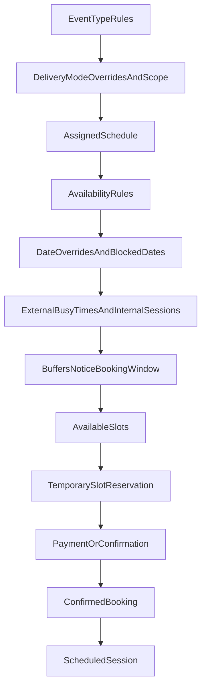

# Eleva.care v3 Scheduling And Booking Spec

Status: Authoritative

## Purpose

This document defines the target scheduling and booking model for Eleva.care v3.

It should guide:

- product design
- domain modeling
- booking engine implementation
- calendar integration decisions
- billing and reminder flows

The goal is to reuse the strongest scheduling ideas from the legacy Eleva product and `cal.diy` without importing all of that complexity on day one.

## Product Goals

Eleva scheduling must support:

- multiple calendar connections per expert
- multiple event types per expert
- different schedules for different event types
- online, in-person, and phone sessions
- localized event content
- expert and member timezones
- reminders, rescheduling, and cancellations
- future support for organization/team scheduling

## Scheduling Principles

- Separate availability from bookings.
- Separate busy-time calendars from destination calendars.
- Treat booking concurrency as a first-class problem.
- Keep the initial model single-host first, but extensible for later team logic.
- Make rules explicit rather than burying them inside UI assumptions.

## Core Concepts

### Event Type

An event type is a bookable service definition.

Examples:

- first consultation
- follow-up session
- coaching call
- tutoring session

An event type is the **service**; how, where, in which language and for whom it is delivered lives
in one or more **delivery modes** (next section). One event type always has at least one mode.

Fields include:

- `title` (localized per PT/EN/ES, rich text via `@eleva/editor` for `description`)
- `description` (localized)
- `slug` — URL segment, lowercase `[a-z0-9-]`, case-insensitive unique per expert (e.g., `first-consultation`, `coaching-call-30`)
- `kind` — `clinical` | `non_clinical`. Clinical services are bound by the expert's licence
  countries (see Expert Practice Scope); non-clinical services (coaching, chat, tutoring, courses)
  may be offered worldwide.
- `duration` (default; a mode may override)
- `price` (`price_cents` + `currency`, default; a mode may override)
- `booking_window`, `minimum_notice`, `buffers` (before / after)
- `cancellation_rules`, `reschedule_rules`
- `visibility` — `public` (listed on the profile and explorer) | `unlisted` (reachable by URL only) |
  `private` (reachable only through a private booking link)
- `intake_questions` (optional, structured; the Plate-based form builder is post-launch — Phase 16)
- `active` / `published` state

### Delivery Mode (`event_type_modes`)

A delivery mode is one concrete way to receive the service. It carries **its own schedule, price,
geographic scope and languages**. This is what makes the following real-world offers expressible:

- _Quick chat_: worldwide, four languages, **online** on schedule A; **by phone** on schedule B and
  only callable in European countries.
- _Physiotherapy_: _first visit_ **online** (worldwide within licence countries); _follow-up_
  **in person** at three clinics, each clinic with its own schedule and its own price.

Fields:

- `mode` — `online` | `phone` | `in_person`
- `location_id` — required when `mode = in_person` (see Location), forbidden otherwise
- `schedule_id` — the availability schedule this mode books against (required; defaults to the
  expert's default schedule when created)
- `price_cents`, `currency` — optional override of the event type default
- `duration_minutes` — optional override
- `country_scope` — `worldwide` **or** an explicit list of ISO 3166-1 alpha-2 codes. In-person
  modes are always the location's country. Phone modes list the countries the expert will call.
- `languages` — BCP-47 list, non-empty, subset of the expert's `languages`
- `label` (localized, optional) — shown when the member picks between modes ("Lisbon clinic",
  "Video call")
- `sort_order`, `active`

Invariants (enforced in `@eleva/scheduling`, tested):

1. `event_types.kind = clinical` => every mode's `country_scope` is a non-empty subset of the
   expert's `service_countries`; `worldwide` is rejected.
2. `event_types.kind = non_clinical` => an explicit `country_scope` list must be a non-empty subset
   of the expert's `service_countries` (same rule as clinical); `worldwide` is allowed only when
   the expert's `worldwide_remote` flag is set. An empty explicit list is rejected for every kind.
3. `mode = in_person` => `country_scope = [location.country]` and `location.country` is in
   `service_countries`.
4. Two modes of one event type may share a schedule; one expert is one human, so **busy time is
   shared across every mode and every event type** when slots are computed.
5. A booking snapshots `event_type_mode_id`, `mode`, `location_id`, `language`, `member_country`,
   `price_cents`, `currency`, `duration_minutes` (the mode override when set, else the event type
   duration), `timezone` at reservation time; later edits to the mode never change an existing
   booking, and every later read — confirmation e-mails, calendar events, the busy-time check for
   other slots, the Daily room window — uses the snapshot, never the current mode configuration.

The public funnel shows a "How do you want to meet?" step only when the event type has more than
one **bookable** mode for the member's declared country and chosen language; otherwise it is
skipped and the single mode is preselected.

### Private Booking Link (`booking_links`)

Experts must be able to invite one person to book even when their agenda is closed (event type
`private`, profile `accepting_bookings = false`, or no public slots in the requested window).

- `token_hash` (SHA-256 of a 32-byte random token; the token appears only in the URL
  `eleva.care/[locale]/book/[token]` and is shown once at creation), `event_type_id`, optional
  `event_type_mode_id` (pin one mode), optional `schedule_id` override (a private window that is
  not on the public schedule), optional `recipient_email` (lock the link to one address), optional
  `price_cents` override (discount or free), `expires_at`, `max_uses` (default 1), `use_count`,
  `note`, `created_by`, `revoked_at`.
- A link bypasses visibility and `accepting_bookings` but **never** the legal invariants above, the
  busy-time check or the reservation/payment flow.
- Authorization is **link-scoped, not anonymous**: the token is the credential. Every mutation in
  the private flow (reserve, payment intent, confirm) must present it; the API re-validates
  `token_hash`, `revoked_at`, `expires_at`, `max_uses` and the `recipient_email` lock on each call
  and the reservation stores `booking_link_id` so confirm cannot be replayed against a different
  link. A use is claimed atomically at reservation time
  (`UPDATE booking_links SET use_count = use_count + 1 WHERE ... AND use_count < max_uses
RETURNING id`; no row => 404) and released when the reservation expires or is cancelled before
  confirmation. Rate limiting (`publicMutation` class) and BotID stay on as defense in depth, like
  the rest of the funnel, not as the authorization mechanism.

### Location (`expert_locations`)

An in-person place owned by the expert (or, for clinics, by the clinic org):

- `name`, structured address (`line1`, `line2`, `postal_code`, `city`, `region`, `country`),
  optional geo point, `timezone`, `instructions` (localized), `active`
- Displayed on the booking step, the confirmation, the ICS event and reminders.

### Public URL shape (multi-zone gateway — ADR-014)

- Expert profile: `eleva.care/[username]`
- Clinic profile: `eleva.care/[clinicslug]` (shared namespace with experts — see [identity-rbac-spec.md](./identity-rbac-spec.md))
- Event-specific booking: `eleva.care/[username]/[event-slug]`
- Locale prefix via next-intl `localePrefix: 'as-needed'`: EN at root, PT/ES prefixed (`eleva.care/pt/patimota/first-consultation`).

The gateway (`apps/web`) resolves `[username]` against the shared experts+clinics namespace, then `[event-slug]` against that entity's published event types. Reserved first-segment paths are blocked at signup (see reserved-slugs list in identity spec).

### Schedule

A schedule defines when an expert is generally available.

An expert may have:

- one default schedule
- multiple schedules for different contexts
- event-specific scheduling assignments later

### Availability Rules

Availability rules define repeating time windows.

Examples:

- Mondays 09:00-13:00
- Tuesdays 14:00-18:00

### Date Overrides

Date overrides change or block normal availability for specific dates.

Examples:

- holidays
- clinic closures
- personal time off
- temporary expanded availability

### Connected Calendar (Optional)

Represents an external calendar account. **Calendar connection is not required** — experts can operate fully without connecting any external calendar (see ADR-004 Calendar-Optional Mode and [`calendar-integration-spec.md`](./calendar-integration-spec.md)).

Supported providers at launch:

- Google Calendar
- Microsoft Outlook calendar

**OAuth credential management**: Better Auth `linkSocial` (Google / Microsoft with calendar scopes)
stores and refreshes the tokens (ADR-017, ADR-020); `packages/calendar` owns the `CalendarAdapter`
interface and receives tokens through `getProviderAccessToken({ accountId })` injected from
`@eleva/auth`, which calls `auth.api.getAccessToken({ body: { accountId, userId } })` for that connection. A
provider-only lookup is forbidden when an expert has more than one account per provider.
Calendar OAuth tokens live on Better Auth `account` rows (ADR-017).

**Eleva calendar first**: the expert app has its own calendar (`/[orgSlug]/calendar`, week and month
views of every booking across all modes, blocked time, and date overrides). Experts who never connect
an external calendar lose nothing: they can subscribe any calendar app to a **read-only ICS feed**
(`GET /calendar/feed/[token].ics`, per-expert secret token, revocable) and receive `.ics` invites by
email (with JSON-LD for Gmail rich cards) for each booking lifecycle event.

**One or more external calendars**: an expert may connect several accounts (one Google, one Microsoft,
or many of each). Per connected calendar: `use_for_busy` (read free/busy) on/off. One **destination**
calendar per expert by default, overridable per event type and per delivery mode (e.g. clinic
bookings written to the clinic's shared calendar, online bookings to the personal one). Token
failures raise `calendar.reconnect_required` (Phase 8) and fall back to the ICS path until fixed.

### Expert Practice Scope

Collected in expert onboarding (Phase 4B) and stored on `expert_profiles`; it is the legal universe
every delivery mode must fit into:

- `practice_country` — country of licensed practice (ISO 3166-1 alpha-2, required)
- `service_countries` — countries the expert may serve (always contains `practice_country`; each
  extra country is a declaration the expert makes and is shown in the admin partner review)
- `languages` — BCP-47 list the expert works in (at least one)
- `license_scope` — clinic / coach / tutor / etc. (drives the default `event_types.kind`)
- `worldwide_remote` — when set, non-clinical modes may use `country_scope = worldwide`
- `accepting_bookings` — global "agenda open/closed" switch; private booking links bypass it

At booking time the member declares their country (pre-filled from the request geo header, always
editable) and picks a language; `@eleva/scheduling` `assertModeBookable(mode, memberCountry,
language)` rejects a mode whose `country_scope` or `languages` do not match with a typed error the
funnel renders as "This option is not available in <country> / in <language>", offering the other
modes instead.

### Busy Calendars

These are the connected calendars that Eleva checks to avoid double booking.

### Destination Calendar

This is the calendar where Eleva writes confirmed events.

This may be one of the connected calendars, but it is a separate decision from busy-time detection.

### Slot Reservation

A short-lived reservation should lock a slot during booking/payment.

This is required to prevent race conditions and double booking.

### Booking

A booking is the customer-facing commercial commitment tied to a specific slot and event type.

### Session

A session is the scheduled operational meeting record.

The booking and session may be tightly linked, but the distinction is useful because:

- financial state may differ from session state
- session data grows after the booking is made
- transcripts, notes, and reports belong more naturally to the session

## Initial MVP Scheduling Scope

The first build should support:

- single-host bookings
- multiple event types per expert
- optional calendar connections (multiple per expert when connected)
- busy-time detection from selected calendars (when connected)
- one destination calendar per expert, per event type or per delivery mode (when connected); `.ics` email fallback and read-only ICS feed when not connected
- weekly availability rules on named schedules (several per expert)
- date overrides/blocked dates
- online / in-person / phone delivery modes, each with its own schedule, price, country scope and languages
- expert practice scope (licence country, service countries, languages) enforced at booking time
- private booking links that bypass a closed agenda
- booking windows
- minimum notice
- before/after buffers
- booking confirmation flow
- reschedule and cancellation rules

## Explicitly Deferred For Later

The first build should not require:

- full collective scheduling
- full round-robin scheduling
- host groups
- weighted host assignment
- recurring booking series
- seat-based group sessions
- advanced travel scheduling

These should be preserved as extension points, not MVP requirements.

## Event Modes

### Online

Uses Daily for video sessions.

Should support:

- room creation
- participant access controls
- transcript pipeline
- reminder and join links

### In Person

Must support explicit location modeling.

A location should support:

- name
- address
- instructions
- localization-ready display fields

### Phone

Must support:

- clear contact flow
- timezone-safe scheduling
- privacy-safe display of phone details

## Availability Calculation Model

Slot generation is computed **per delivery mode**. The API layer first resolves the request into a
`ResolvedOffer` (`resolveOffer({ eventTypeModeId, linkToken? })` validates the link — hash,
revocation, expiry, uses, recipient lock — and returns `{ mode, scheduleId, priceCents,
durationMinutes, bookingLinkId? }` where `scheduleId` is the link's override when present, else
the mode's schedule). `getAvailableSlots(resolved, { from, to, timezone })` and `reserveSlot(resolved,
…)` both consume that same object, so slot generation and the reservation always run against
identical schedule, price and duration data (tested: private link with an override schedule shows
and books private-only windows; a link without an override behaves like the public mode). The
calculation is based on:

1. event type rules (duration, notice, window) with the mode's overrides applied
2. the resolved schedule (see above)
3. availability rules of that schedule
4. date overrides
5. blocked dates
6. existing Eleva bookings of the expert — **across every mode and event type** (one human)
7. busy-time calendar signals from every connected calendar with `use_for_busy`
8. before/after buffers (applied exactly once, here, around every busy interval from steps 6-7
   and around each candidate slot — never again in step 1)
9. minimum notice
10. booking window constraints

## Recommended Slot Flow

```mermaid
flowchart TD
    eventType[EventTypeRules] --> mode[DeliveryModeOverridesAndScope]
    mode --> schedule[AssignedSchedule]
    schedule --> availability[AvailabilityRules]
    availability --> overrides[DateOverridesAndBlockedDates]
    overrides --> busy[ExternalBusyTimesAndInternalSessions]
    busy --> rules[BuffersNoticeBookingWindow]
    rules --> slots[AvailableSlots]
    slots --> reserve[TemporarySlotReservation]
    reserve --> pay[PaymentOrConfirmation]
    pay --> booking[ConfirmedBooking]
    booking --> session[ScheduledSession]
```

## Booking Lifecycle

Suggested states:

- `draft`
- `slot_reserved`
- `awaiting_payment`
- `awaiting_confirmation`
- `confirmed`
- `rescheduled`
- `cancelled`
- `completed`
- `no_show` later if needed

## Reservation Rules

The system must:

- create a temporary slot reservation before payment completion
- expire the reservation automatically
- release the slot if payment or confirmation fails
- keep booking creation idempotent around webhook/retry behavior

## Reschedule Rules

The system should support:

- policy-based rescheduling windows
- patient-initiated reschedule if allowed
- expert-initiated suggestions
- preserving audit history of changes

Rescheduling should likely create a clear state transition history rather than silently mutating the original booking without traceability.

## Cancellation Rules

The system should support:

- policy-based cancellation windows
- optional cancellation reason capture
- payment/refund interaction
- reminders and follow-up workflow updates

## Reminder Model

The system supports reminders for:

- booking confirmation (immediate)
- 24h before session
- 1h before session (optional per user)
- day-of session prompt
- follow-up / rebooking prompts
- expert-defined future reminders (e.g., "book again in 2 months")

Channels (all via `sendNotification` Lane 1 — see [`notifications-spec.md`](./notifications-spec.md)):

- **email** (Resend)
- **SMS** (Twilio EU) — **launch-critical for PT**, gated by per-user consent and quiet hours
- **in-app** (Neon inbox, always fans out)
- **push** (Expo, when mobile ships — M7)

Reminder orchestration runs as a Vercel Workflow DevKit `preAppointmentReminders` step graph (ADR-007).

## Timezone Rules

The booking experience must:

- store canonical time values in a normalized backend format
- display time in user/expert local timezone
- avoid ambiguity in reminders and session links

For cross-border and worldwide sessions, timezone clarity is mandatory.

## Expert And Organization Scheduling

The initial model should support:

- solo experts
- experts working within an organization
- organization-level settings that may influence availability or event visibility

The data model should be ready for later:

- team routing
- clinic-managed event types
- organization-specific schedule rules

## Localization Requirements

Scheduling-related content should support:

- event title and description localization
- localized booking instructions
- localized in-person location descriptions
- language filters for discovery

## Compliance And Audit Considerations

The system should log:

- slot reservations
- booking creation
- reschedules
- cancellations
- expert suggestions
- visibility changes for related patient-shared data

Sensitive session-adjacent content should not leak through reminder payloads or analytics.

## Open Questions

- should some event types require manual expert confirmation by default (likely opt-in per event type)
- when should organization-owned schedules override expert-owned schedules (phase-2 collective scheduling)
- how should packs interact with scheduling priority and booking eligibility

## Phase 04 implementation (2026-09-10)

Shipped on `main` through PR 04.2f (`#42`) and earlier 04.1 / 04.2 slices:

- **Time model:** slot bounds are `timestamptz`. The reservation snapshots `timezone` (IANA) at reserve time. Display formatting uses that snapshot; do not mix `dateStyle`/`timeStyle` with `timeZoneName` in `Intl.DateTimeFormat`.
- **Consistency boundary:** `slot_reservations` has a `btree_gist` exclusion constraint on the expert + tstzrange. A `23P01` inside the reservation transaction is `409 SLOT_TAKEN`. Redis `reserveSlot` (5 min TTL) is the fast path, not the source of truth. HTTP 100-way proof is PR `#43` (open).
- **Reserve → pay → confirm:** `POST /bookings/reserve` requires current `CONSENT_DOCUMENTS` versions and returns `{ reservationId, reservationToken, expiresAt }` (token never logged). `POST /payments/intent` authorizes with the token; Stripe is never called inside a DB transaction. `POST /bookings/confirm` requires `reservationToken` in Zod (`400` without it). Webhook `payment_intent.succeeded` calls the same domain function. Guest activation is an outbox event, not inline.
- **Private links:** `GET /public/booking-links/{token}` and reserve `linkToken` support unpublished offers and schedule/price overrides. Seeded closed-agenda + exhausted `max_uses` evidence is PR `#47` (open).
- **Not this phase:** member/expert cancel and reschedule _execution_ (refunds are Phase 6). Policy text above still stands.

## Closed Decisions

- **SMS is launch-critical** for PT (see ADR-012 + notifications-spec)
- **Calendar OAuth credential management = Better Auth `account` rows** (ADR-017 amends ADR-004); Eleva retains full CalendarAdapter control.
- **Calendar connection is optional** — experts can use Eleva-only scheduling with .ics email fallback (see ADR-004 Calendar-Optional Mode)
- **Final reminder defaults**: 24h email+SMS, 1h email (SMS opt-in)

## Related Docs

- [`domain-model.md`](./domain-model.md)
- [`payments-payouts-spec.md`](./payments-payouts-spec.md)
- [`mobile-integration-spec.md`](./mobile-integration-spec.md)
- [`notifications-spec.md`](./notifications-spec.md)
- [`workflow-orchestration-spec.md`](./workflow-orchestration-spec.md)
- [`adrs/README.md`](./adrs/README.md) (ADR-004 Scheduling & Calendar OAuth)
