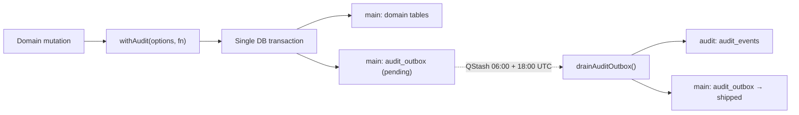

# @eleva/audit

Transactional audit logging for the Eleva platform. Every mutating operation
records an audit event atomically alongside domain data, ensuring a complete,
tamper-evident trail for GDPR, SOC 2, and HIPAA compliance.

## Architecture

Two Neon Postgres projects provide physical separation between application data
and the immutable audit stream:

```text
eleva_v3_main (neondb)          eleva_v3_audit
┌─────────────────────┐         ┌──────────────────────┐
│  tenant tables      │         │  audit_events        │
│  audit_outbox       │────────▶│  (append-only)       │
└─────────────────────┘         └──────────────────────┘
         ▲                               ▲
         │ atomic insert                 │ drainer (twice daily)
         │                               │
    withAudit()                  drainAuditOutbox()
```

### Data Flow



### Why a Transactional Outbox?

The main and audit databases are separate Neon projects — they cannot share a
transaction. The outbox pattern guarantees:

1. **Atomicity** — domain change + audit intent commit or roll back together.
2. **At-least-once delivery** — the drainer retries failed rows (idempotent on `audit_id`).
3. **Physical separation** — compromising the main DB does not expose the audit trail.

## API Reference

### `withAudit(options, fn)`

Wraps a domain mutation in a transaction that records an audit event.

```typescript
import { withAudit } from "@eleva/audit"
import { main } from "@eleva/db"

await withAudit(
  { orgId: "org-uuid", actorUserId: "user-uuid" },
  async (tx, ctx) => {
    const [row] = await tx
      .insert(main.eventTypes)
      .values({
        id: newId,
        orgId: ctx.orgId,
        name: "Consultation",
        duration: 60,
      })
      .returning()

    await ctx.emit({
      entity: "event_type",
      action: "created",
      entityId: row.id,
      payload: { name: "Consultation", duration: 60 },
    })

    return row
  }
)
```

#### Parameters

| Parameter             | Type                                    | Description                                           |
| --------------------- | --------------------------------------- | ----------------------------------------------------- |
| `options.orgId`       | `string`                                | Tenant ID — feeds `withOrgContext` for RLS            |
| `options.actorUserId` | `string \| null`                        | WorkOS user ID of the actor (null for system actions) |
| `fn`                  | `(tx: Tx, ctx: AuditCtx) => Promise<T>` | Transaction body                                      |

#### `AuditCtx` (passed to `fn`)

| Property        | Type                        | Description                                               |
| --------------- | --------------------------- | --------------------------------------------------------- |
| `auditId`       | `string`                    | Pre-generated UUID — idempotency key for the drainer      |
| `orgId`         | `string`                    | Echoed from options                                       |
| `actorUserId`   | `string \| null`            | Echoed from options                                       |
| `correlationId` | `string \| null`            | From `@eleva/observability` request context               |
| `emit(record)`  | `(record) => Promise<void>` | Records the audit event (required — throws if not called) |

#### `emit(record)` fields

| Field      | Type                      | Required | Description                                     |
| ---------- | ------------------------- | -------- | ----------------------------------------------- |
| `entity`   | `AuditEntity`             | Yes      | What was mutated (closed union in `types.ts`)   |
| `action`   | `AuditAction`             | Yes      | What happened (closed union in `types.ts`)      |
| `entityId` | `string \| null`          | Yes      | Primary key of the mutated resource (see below) |
| `payload`  | `Record<string, unknown>` | No       | Contextual data (key fields, before/after diff) |

> **Note on `entityId`:** Provide the UUID primary key of the target resource for
> all domain CRUD operations. Use `null` only for system-level or composite-key
> operations that don't target a single identifiable resource (e.g., membership
> upserts keyed by `(userId, orgId)`).
>
> ```typescript
> // CRUD — always set entityId to the resource PK
> entityId: row.id // "d3f8a1b2-..."
>
> // System/composite-key — null is acceptable
> entityId: null // membership (userId+orgId), global config
> ```

### `withPlatformAudit(options, fn)`

Same as `withAudit` but runs under platform-admin context for cross-tenant
operations. The `orgId` is still recorded on the audit row for filtering.

## Closed Unions — `AuditEntity` and `AuditAction`

Entity and action values are **closed TypeScript unions** in
`packages/audit/src/types.ts`. This means `tsc` catches typos at call sites.

**To add a new entity or action:**

1. Open `packages/audit/src/types.ts`
2. Add the new value to the `AuditEntity` or `AuditAction` union
3. TypeScript will now accept it at `ctx.emit()` call sites

Current entities:
`user`, `organization`, `membership`, `role`, `permission`,
`expert_profile`, `expert_integration_credential`

Current actions:
`created`, `updated`, `deleted`, `restored`, `role_changed`,
`status_changed`, `invited`, `accepted`, `removed`, `submitted`,
`approved`, `rejected`, `claimed`, `connected`, `disconnected`

## Usage Patterns

### Pattern A: Domain Package (preferred for reusable logic)

Place `withAudit` inside a domain function so every caller gets auditing:

```typescript
// packages/auth/src/provisioning.ts
export async function provisionOrganization(input) {
  const orgId = crypto.randomUUID()
  await withAudit({ orgId, actorUserId: input.userId }, async (tx, ctx) => {
    await tx.insert(main.organizations).values({ id: orgId, ... })
    await tx.insert(main.memberships).values({ userId: input.userId, orgId })
    await ctx.emit({
      entity: "organization",
      action: "created",
      entityId: orgId,
      payload: { type: "personal" },
    })
  })
  return { orgId }
}
```

### Pattern B: API Route (for orchestration-heavy routes)

When the route handler is the orchestration layer:

```typescript
// apps/api/src/app/experts/event-types/route.ts
export async function POST(request: Request) {
  // ... auth, rate limit, validate ...
  const newId = crypto.randomUUID()
  await withAudit(
    { orgId: session.orgId, actorUserId: session.user.id },
    async (tx, ctx) => {
      await tx.insert(main.eventTypes).values({ id: newId, ...body.data })
      await ctx.emit({
        entity: "event_type",
        action: "created",
        entityId: newId,
        payload: { name: body.data.name, duration: body.data.duration },
      })
    }
  )
  return secureJson({ id: newId }, { status: 201, headers })
}
```

## Correlation IDs

Every `audit_outbox` row captures the request's correlation ID from
`@eleva/observability`. This links audit events to Sentry errors, BetterStack
logs, and response headers — enabling full request tracing during incident
response.

The correlation ID is set automatically by `withAudit` via `getCorrelationId()`.

## Drainer

The drainer (`packages/workflows/src/drainers/audit-outbox-drainer.ts`) moves
pending outbox rows to the append-only `audit_events` table in the audit DB.

### Scheduling

A dedicated **QStash schedule** calls `POST /workflows/audit-outbox-drainer`
twice daily:

- **Cron:** `0 6,18 * * *` (06:00 and 18:00 UTC)
- **Auth:** `Authorization: Bearer ${WORKFLOWS_DRAIN_SECRET}`
- **Budget:** 2 calls/day from 500 QStash daily allowance

The drainer is a no-op when the outbox is empty (fast `SELECT ... WHERE
status='pending' LIMIT 100`). Max audit trail staleness: ~12 hours.

### Behavior

1. Selects pending rows (batch of 100)
2. For each row, inserts into `audit_events` with `ON CONFLICT DO NOTHING`
3. Marks successfully inserted rows as `shipped`
4. On failure, increments `attempts`; after 5 attempts marks `failed`
5. Fires a BetterStack heartbeat on every tick (even zero rows)

### Manual drain

```bash
curl -X POST https://<api-domain>/workflows/audit-outbox-drainer \
  -H "Authorization: Bearer $WORKFLOWS_DRAIN_SECRET"
```

## Compliance Mapping

| Framework         | Control               | How this design satisfies it                            |
| ----------------- | --------------------- | ------------------------------------------------------- |
| GDPR Art 5(2)     | Accountability        | Complete audit trail of all data processing             |
| GDPR Art 30       | Records of processing | Structured `entity.action` log with actor + timestamp   |
| SOC 2 CC6.1       | Logical access        | `membership.created/removed` events track access grants |
| SOC 2 CC7.2       | System monitoring     | Append-only stream, heartbeat monitoring                |
| SOC 2 CC8.1       | Change management     | Every mutation recorded with before/after payload       |
| HIPAA §164.312(b) | Audit controls        | Tamper-evident hash chain (Sprint 7), immutable store   |
| HIPAA §164.312(c) | Integrity             | Separate DB, no UPDATE/DELETE grants, hash chain        |

## Payload Guidelines

- **DO** include: entity IDs, key business fields, before/after values for updates
- **DO NOT** include: passwords, full email addresses, health data payloads, tokens
- **Prefer** structured diffs: `{ before: { name: "Old" }, after: { name: "New" } }`

## Troubleshooting

| Symptom                                   | Cause                                                   | Fix                                                     |
| ----------------------------------------- | ------------------------------------------------------- | ------------------------------------------------------- |
| `audit_outbox` rows stuck as `pending`    | Drainer not running or AUDIT_DATABASE_URL misconfigured | Check QStash schedule; verify env var; run manual drain |
| `withAudit: fn returned without emitting` | Forgot to call `ctx.emit()`                             | Add `ctx.emit(...)` before returning from fn            |
| `withAudit: audit event already emitted`  | Called `ctx.emit()` twice                               | Use one `withAudit` per logical operation               |
| Rows marked `failed`                      | Audit DB unreachable or schema mismatch                 | Check `last_error` column; verify audit DB connectivity |
| Duplicate `audit_events` rows             | Impossible — `ON CONFLICT DO NOTHING` on `audit_id`     | N/A                                                     |

## Key Files

| File                                                       | Purpose                                          |
| ---------------------------------------------------------- | ------------------------------------------------ |
| `packages/audit/src/with-audit.ts`                         | `withAudit` / `withPlatformAudit` implementation |
| `packages/audit/src/types.ts`                              | Closed `AuditEntity` / `AuditAction` unions      |
| `packages/db/src/schema/main/audit-outbox.ts`              | Outbox table schema (main DB)                    |
| `packages/db/src/schema/audit/audit-events.ts`             | Events table schema (audit DB)                   |
| `packages/workflows/src/drainers/audit-outbox-drainer.ts`  | Drainer implementation                           |
| `apps/api/src/app/workflows/audit-outbox-drainer/route.ts` | Drainer HTTP trigger                             |
| `docs/eleva-v3/adrs/ADR-003-tenancy-and-rls.md`            | Architecture decision record                     |
